# Rules-Emerging-Pattern: AI Guardrails and Consistency Framework

[](https://opensource.org/licenses/MIT)
[](https://www.python.org/)
[](https://www.typescriptlang.org/)
[](https://www.docker.com/)
[]()

A production-grade, modular rules engine providing strict guardrails, consistency enforcement, and safety boundaries for AI systems through a sophisticated tiered architecture with **15 modular subsystems**, **Python + TypeScript SDKs**, and full compliance support.

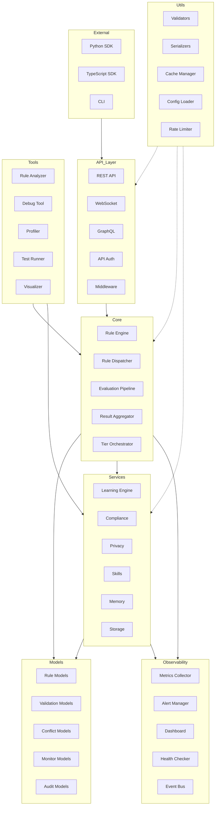

---

## Table of Contents

- [System Architecture](#system-architecture)
- [Module Overview](#module-overview)
- [Core Engine Flow](#core-engine-flow)
- [Quick Start](#quick-start)
- [SDKs](#sdks)
- [Project Structure](#project-structure)
- [API Reference](#api-reference)
- [Installation](#installation)
- [License](#license)

---

## System Architecture

### High-Level Component Interaction

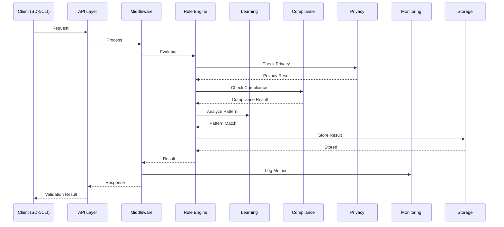

### Tiered Rule Evaluation

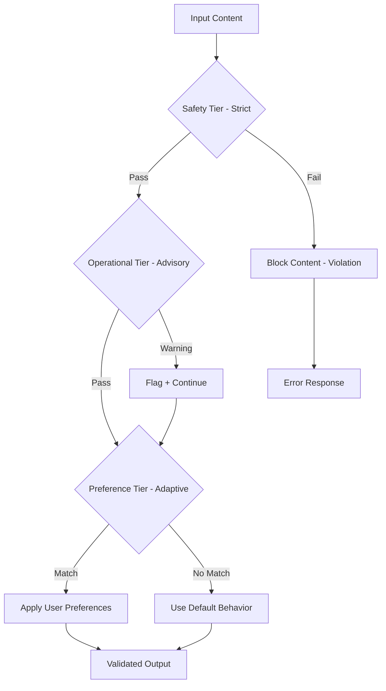

---

## Module Overview

### Core Engine (`src/core/`)

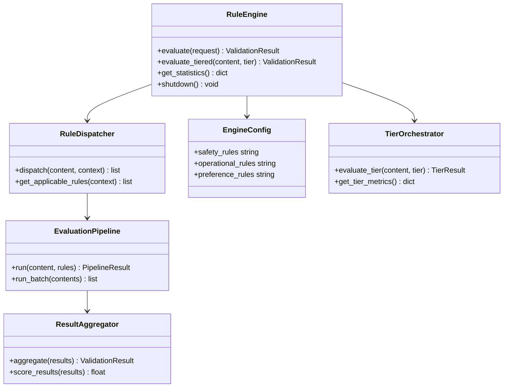

### Compliance (`src/compliance/`)

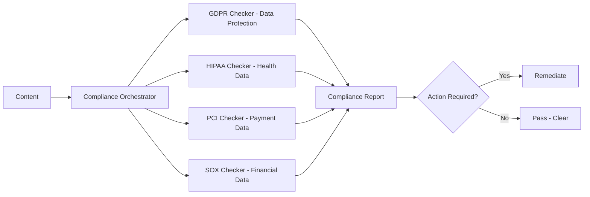

### Monitoring (`src/monitoring/`)

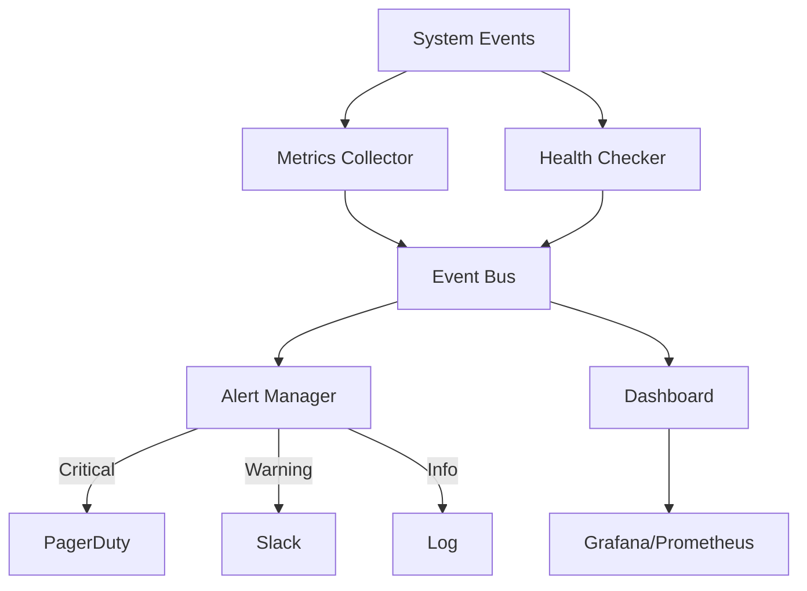

### Learning (`src/learning/`)

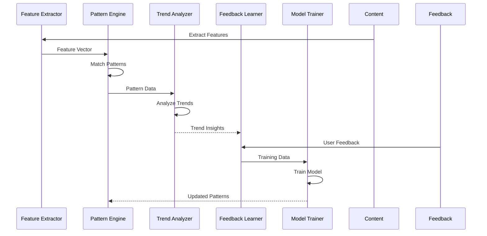

### Privacy (`src/privacy/`)

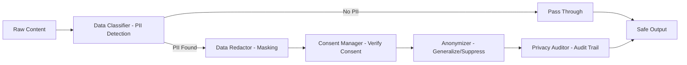

### Skills (`src/skills/`)

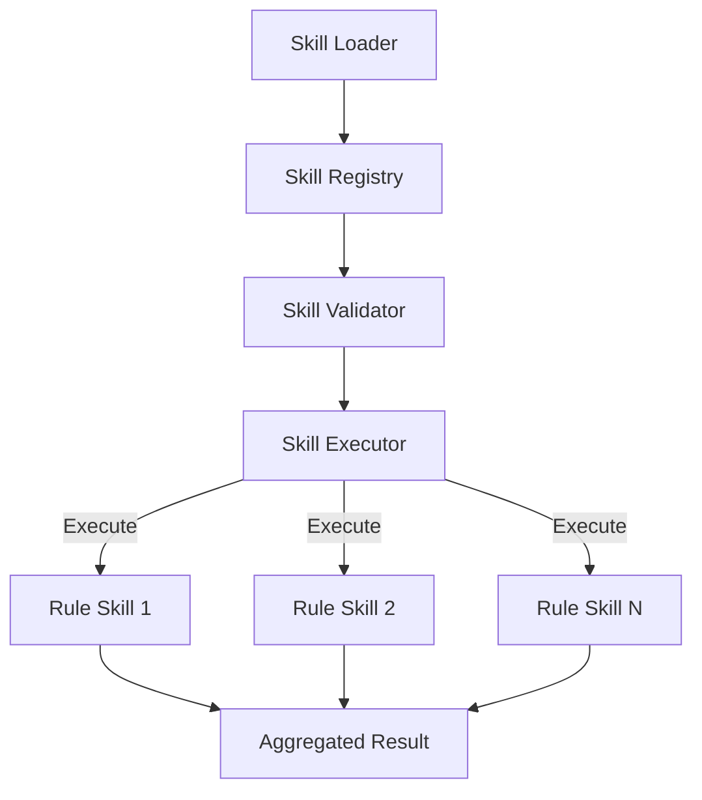

### Storage (`src/storage/`)

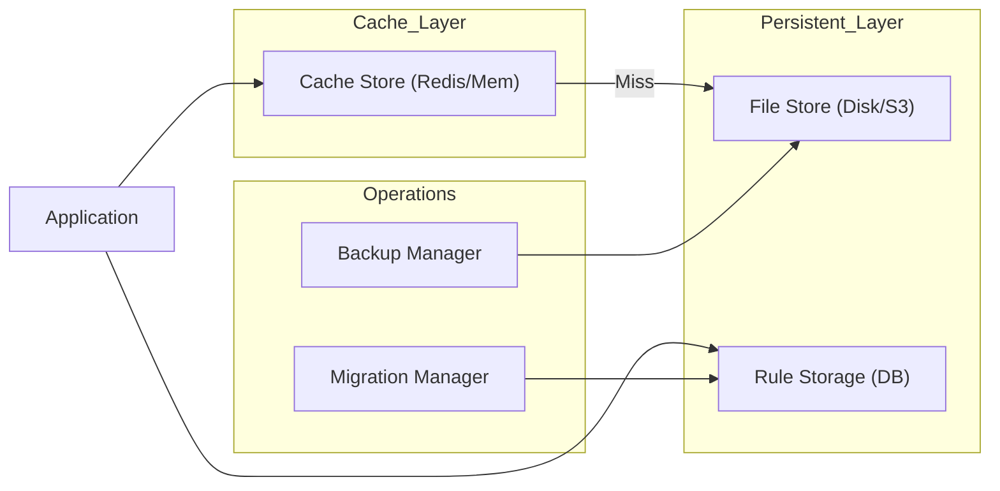

### API Layer (`src/api/`)

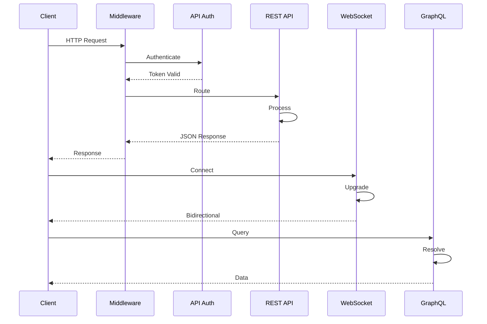

### CLI (`src/cli/`)

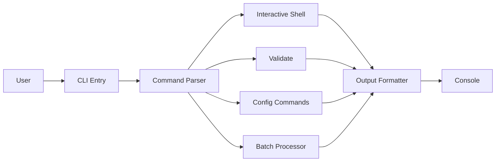

### Middleware (`src/middleware/`)

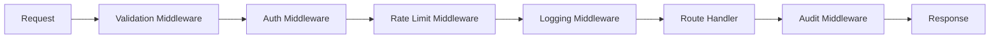

### Advanced Features (`src/advanced/`)

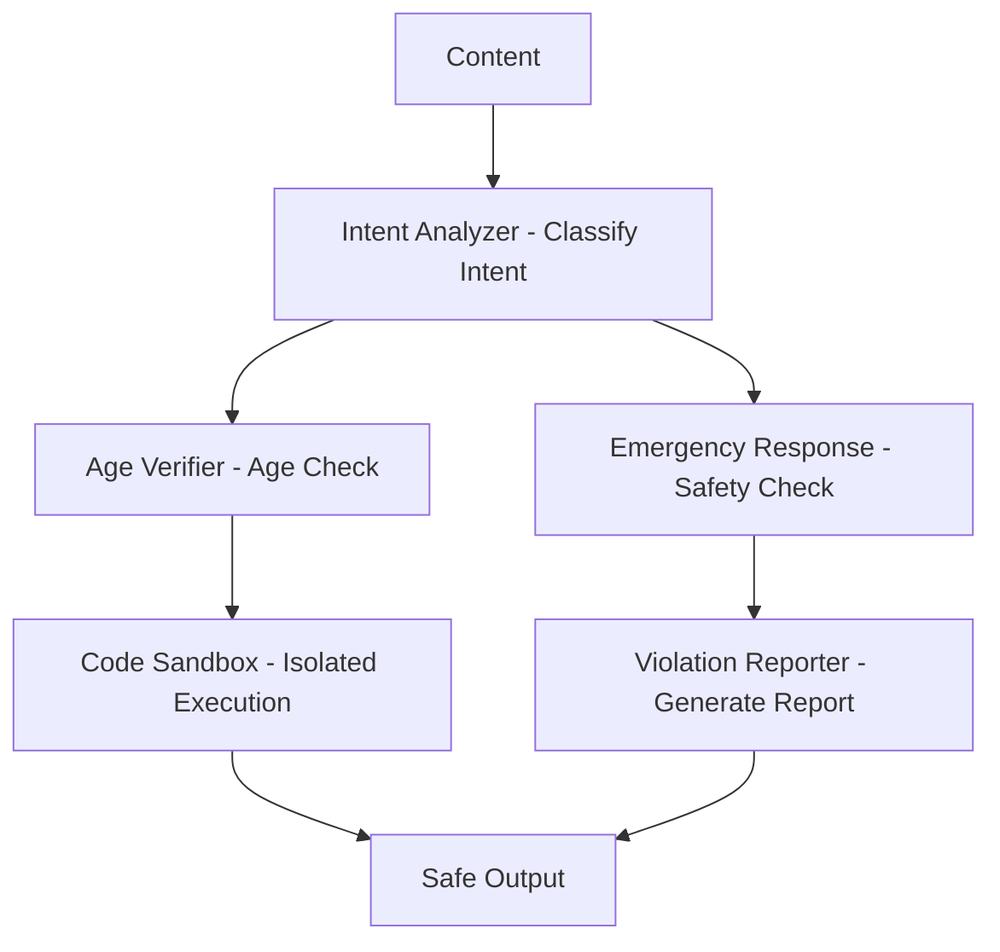

### Memory (`src/memory/`)

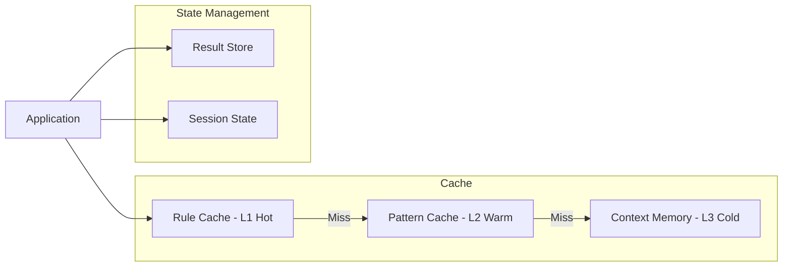

### Tools (`src/tools/`)

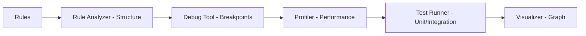

### Utilities (`src/utils/`)

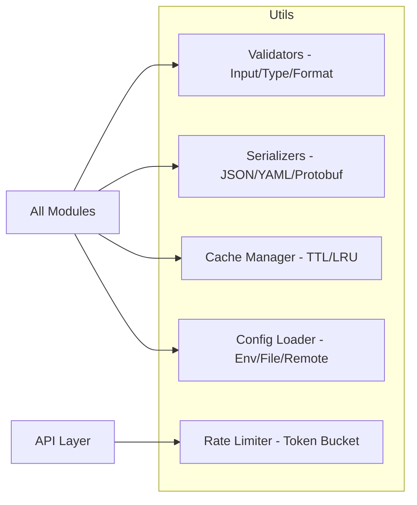

---

## Core Engine Flow

The complete end-to-end rule evaluation flow:

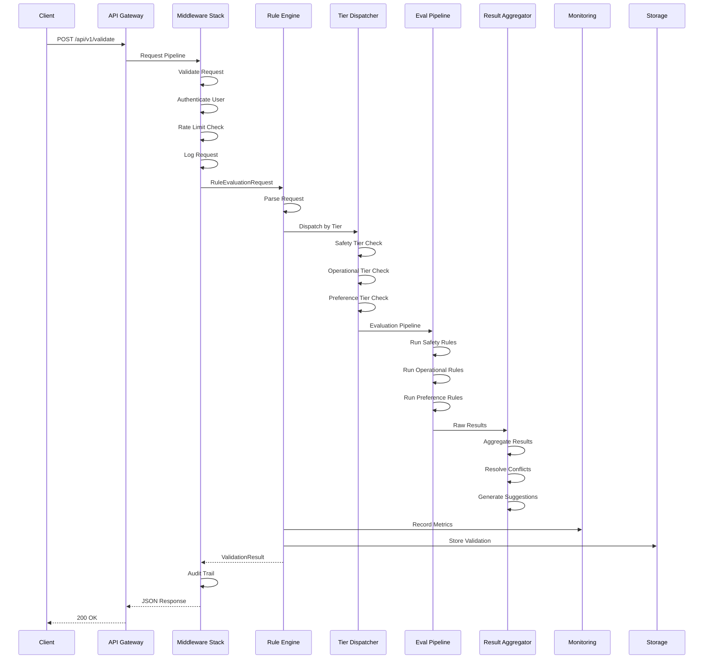

---

## Quick Start

### Python

```python
from src.core.rule_engine import RuleEngine
from src.models.rule import RuleEvaluationRequest

engine = RuleEngine()

request = RuleEvaluationRequest(
    content="Sample AI-generated content to validate",
    tier="safety",
    context={"domain": "general", "user_role": "end_user"},
    options={"strict_mode": True}
)

result = engine.evaluate(request)

print(f"Valid: {result.valid}")
print(f"Score: {result.score}")
for v in result.violations:
    print(f"  - {v.type}: {v.message}")
```

### Python SDK

```python
from sdk.python import Client

client = Client(api_key="your-key", base_url="http://localhost:8000")

# Single validation
result = client.validate("Check this content", tier="safety")

# Batch validation
results = client.validate_batch([
    "Content one",
    "Content two",
    "Content three",
])

# Get system metrics
metrics = client.get_metrics()
```

### TypeScript SDK

```typescript
import { Client } from './sdk/typescript';

const client = new Client({ apiKey: 'your-key', baseUrl: 'http://localhost:8000' });

// Single validation
const result = await client.validate('Check this content', { tier: 'safety' });

// Batch validation
const results = await client.validateBatch(['Content one', 'Content two']);

// Get metrics
const metrics = await client.getMetrics();
```

### CLI

```bash
# Validate content
python -m src.cli validate "Content to check" --tier safety

# List active rules
python -m src.cli rules list --tier operational

# Check compliance
python -m src.cli compliance check --regulations gdpr,hipaa

# Monitor system
python -m src.cli monitor metrics --interval 5
```

### API

```bash
# Health check
curl http://localhost:8000/health

# Validate content
curl -X POST http://localhost:8000/api/v1/validate \
  -H "Content-Type: application/json" \
  -d '{"content": "Test content", "tier": "safety"}'

# Get rules
curl http://localhost:8000/api/v1/rules?tier=operational

# Check compliance
curl -X POST http://localhost:8000/api/v1/compliance/check \
  -H "Content-Type: application/json" \
  -d '{"content": "Data to check", "regulations": ["gdpr", "hipaa"]}'

# Get metrics
curl http://localhost:8000/api/v1/metrics
```

---

## SDKs

### Python SDK (`sdk/python/`)

| File | Lines | Description |
|------|-------|-------------|
| `client.py` | 928 | Main SDK client — CRUD, validate, evaluate, metrics, alerts |
| `models.py` | 944 | All data models with serialization |
| `rule_client.py` | 721 | Rule evaluation client with caching and batching |
| `validation_client.py` | 917 | Content validation, compliance, safety, hallucination detection |
| `monitoring_client.py` | 717 | Metrics, alerts, health, Prometheus export |
| `exceptions.py` | 169 | Custom exception types |

### TypeScript SDK (`sdk/typescript/`)

| File | Lines | Description |
|------|-------|-------------|
| `client.ts` | 696 | Main SDK client — full API surface |
| `models.ts` | 1,416 | Complete type definitions and interfaces |
| `rule-client.ts` | 678 | Rule evaluation with caching |
| `validation-client.ts` | 747 | Content and compliance validation |
| `monitoring-client.ts` | 700 | Metrics and alerting client |

---

## Project Structure

```
Rules-Emerging-Pattern/
├── sdk/                           # SDK implementations
│   ├── python/                    #   Python SDK (4,775 lines)
│   └── typescript/                #   TypeScript SDK (4,385 lines)
├── src/                           # Main source (75+ production files)
│   ├── __init__.py                #   Package exports
│   ├── main.py                    #   FastAPI application (841 lines)
│   ├── advanced/                  #   Age verification, emergency, sandbox
│   ├── api/                       #   REST, WebSocket, GraphQL, auth
│   ├── cli/                       #   CLI, shell, batch processor
│   ├── compliance/                #   GDPR, HIPAA, PCI, SOX
│   ├── core/                      #   Rule engine, dispatcher, pipeline
│   │   └── tiered_rules/          #     Safety/Operational/Preference tiers
│   ├── learning/                  #   Pattern recognition, trends, ML
│   ├── memory/                    #   Cache, context, session state
│   ├── middleware/                 #   Validation, auth, rate-limit, audit
│   ├── models/                    #   Rule, validation, conflict, audit models
│   ├── monitoring/                #   Metrics, alerts, dashboards
│   ├── privacy/                   #   Redaction, anonymization, consent
│   ├── skills/                    #   Skill system, registry, executor
│   ├── storage/                   #   File, cache, backup, migration
│   ├── tools/                     #   Analyzer, debugger, profiler
│   └── utils/                     #   Validators, serializers, config
├── rule_engines/                  # Engine plugins and extensions
├── rule_learning/                 # Adaptive rule learning
├── rule_repositories/             # Predefined and custom rules
├── validation_systems/            # Content filtering, I/O validation
├── config/                        # Configuration files
├── tests/                         # Test suite
├── docs/                          # Documentation
├── Dockerfile                     # Docker build
├── docker-compose.yml             # Docker compose
├── pyproject.toml                 # Python project config
├── requirements.txt               # Python dependencies
└── README.md                      # This file
```

---

## API Reference

### Core Endpoints

| Method | Endpoint | Description |
|--------|----------|-------------|
| `GET` | `/health` | System health check |
| `POST` | `/api/v1/validate` | Validate content |
| `POST` | `/api/v1/tiered/evaluate` | Tiered evaluation |
| `GET` | `/api/v1/rules` | List rules |
| `GET` | `/api/v1/metrics` | Get system metrics |

### Monitoring Endpoints

| Method | Endpoint | Description |
|--------|----------|-------------|
| `GET` | `/api/v1/alerts` | List alerts |
| `POST` | `/api/v1/alerts` | Trigger alert |
| `PUT` | `/api/v1/alerts/{id}/resolve` | Resolve alert |
| `GET` | `/api/v1/dashboard` | Dashboard data |

### Compliance Endpoints

| Method | Endpoint | Description |
|--------|----------|-------------|
| `POST` | `/api/v1/compliance/check` | Full compliance check |
| `POST` | `/api/v1/compliance/gdpr` | GDPR check |
| `POST` | `/api/v1/compliance/hipaa` | HIPAA check |
| `POST` | `/api/v1/compliance/pci` | PCI check |
| `POST` | `/api/v1/compliance/sox` | SOX check |

### Privacy Endpoints

| Method | Endpoint | Description |
|--------|----------|-------------|
| `POST` | `/api/v1/privacy/redact` | Redact sensitive data |
| `POST` | `/api/v1/privacy/anonymize` | Anonymize data |
| `POST` | `/api/v1/privacy/classify` | Classify data sensitivity |
| `POST` | `/api/v1/privacy/consent/check` | Check consent |
| `GET` | `/api/v1/privacy/audit` | Privacy audit log |

### Learning Endpoints

| Method | Endpoint | Description |
|--------|----------|-------------|
| `POST` | `/api/v1/patterns/analyze` | Analyze patterns |
| `POST` | `/api/v1/trends/analyze` | Analyze trends |
| `POST` | `/api/v1/feedback` | Submit feedback |
| `GET` | `/api/v1/models` | List trained models |

### Advanced Endpoints

| Method | Endpoint | Description |
|--------|----------|-------------|
| `POST` | `/api/v1/advanced/age-verify` | Age verification |
| `POST` | `/api/v1/advanced/emergency` | Emergency response |
| `POST` | `/api/v1/advanced/intent` | Intent analysis |
| `POST` | `/api/v1/advanced/sandbox/execute` | Sandbox execution |

### Skills Endpoints

| Method | Endpoint | Description |
|--------|----------|-------------|
| `POST` | `/api/v1/skills/execute` | Execute skill |
| `GET` | `/api/v1/skills` | List skills |
| `POST` | `/api/v1/skills/validate` | Validate skill |

### Storage Endpoints

| Method | Endpoint | Description |
|--------|----------|-------------|
| `GET` | `/api/v1/storage/rules/{id}` | Get stored rule |
| `POST` | `/api/v1/storage/rules` | Store rules |
| `POST` | `/api/v1/storage/backup` | Trigger backup |
| `POST` | `/api/v1/storage/migrate` | Trigger migration |

### Tools Endpoints

| Method | Endpoint | Description |
|--------|----------|-------------|
| `POST` | `/api/v1/tools/analyze` | Analyze rules |
| `POST` | `/api/v1/tools/visualize` | Visualize patterns |
| `POST` | `/api/v1/tools/profile` | Profile performance |

---

## Installation

### Docker

```bash
git clone https://github.com/LifeJiggy/Rules-Emerging-Pattern.git
cd Rules-Emerging-Pattern
cp .env.example .env
docker-compose up -d
```

### Local

```bash
python -m venv venv
source venv/bin/activate  # Windows: venv\Scripts\activate
pip install -r requirements.txt
python -m uvicorn src.main:app --reload --host 0.0.0.0 --port 8000
```

---

## Documentation

Each module has dedicated Mermaid documentation in its subfolder:

| Module | Documentation |
|--------|---------------|
| Core Engine | [`src/core/README.md`](src/core/README.md) |
| Models | [`src/models/README.md`](src/models/README.md) |
| Monitoring | [`src/monitoring/README.md`](src/monitoring/README.md) |
| Learning | [`src/learning/README.md`](src/learning/README.md) |
| Memory | [`src/memory/README.md`](src/memory/README.md) |
| API | [`src/api/README.md`](src/api/README.md) |
| CLI | [`src/cli/README.md`](src/cli/README.md) |
| Compliance | [`src/compliance/README.md`](src/compliance/README.md) |
| Privacy | [`src/privacy/README.md`](src/privacy/README.md) |
| Middleware | [`src/middleware/README.md`](src/middleware/README.md) |
| Skills | [`src/skills/README.md`](src/skills/README.md) |
| Storage | [`src/storage/README.md`](src/storage/README.md) |
| Tools | [`src/tools/README.md`](src/tools/README.md) |
| Utilities | [`src/utils/README.md`](src/utils/README.md) |
| Advanced | [`src/advanced/README.md`](src/advanced/README.md) |
| Python SDK | [`sdk/python/README.md`](sdk/python/README.md) |
| TypeScript SDK | [`sdk/typescript/README.md`](sdk/typescript/README.md) |

---

## License

MIT License — see [LICENSE](LICENSE) for details.
