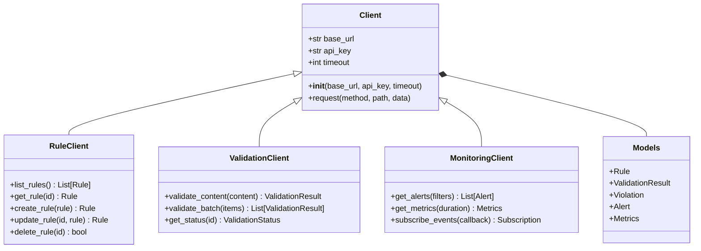
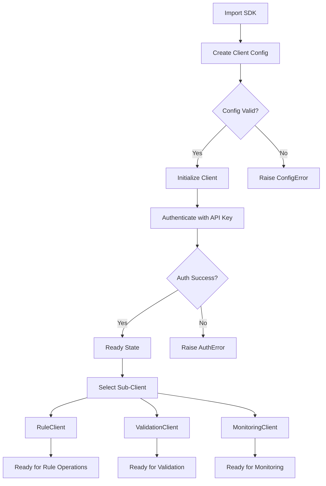

# Python SDK Architecture

## Class Hierarchy



## SDK Initialization Flow



## SDK to Core System Connection

```mermaid
componentDiagram
    component SDK_Python {
        component RuleClient
        component ValidationClient
        component MonitoringClient
    }
    component API_Gateway {
        component Auth_Middleware
        component Rate_Limiter
    }
    component Core_Engine {
        component Rule_Evaluator
        component Content_Validator
        component Alert_Manager
    }
    component Data_Layer {
        component Rule_Store
        component Result_Store
        component Metrics_Store
    }
    SDK_Python --> API_Gateway : HTTPS/REST
    API_Gateway --> Core_Engine : Internal RPC
    Core_Engine --> Data_Layer : Read/Write
```

## Component Descriptions

| Component | Responsibility |
|---|---|
| **Client** | Base class handling HTTP transport, auth, and request lifecycle |
| **RuleClient** | CRUD operations for rules — create, read, update, delete, list |
| **ValidationClient** | Content validation against rules, batch processing, status polling |
| **MonitoringClient** | Alert subscriptions, metric collection, real-time event streaming |
| **Models** | Type definitions for all domain objects (Rule, Violation, Result, etc.) |
| **API Gateway** | Entry point for all SDK requests — auth checks, rate limiting |
| **Core Engine** | Server-side rule evaluation, validation logic, alert dispatch |
| **Data Layer** | Persistent storage for rules, validation results, and telemetry |