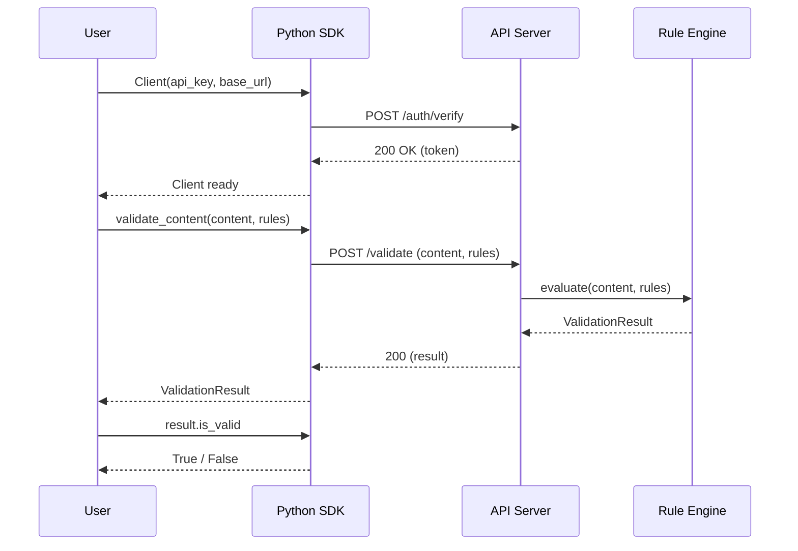
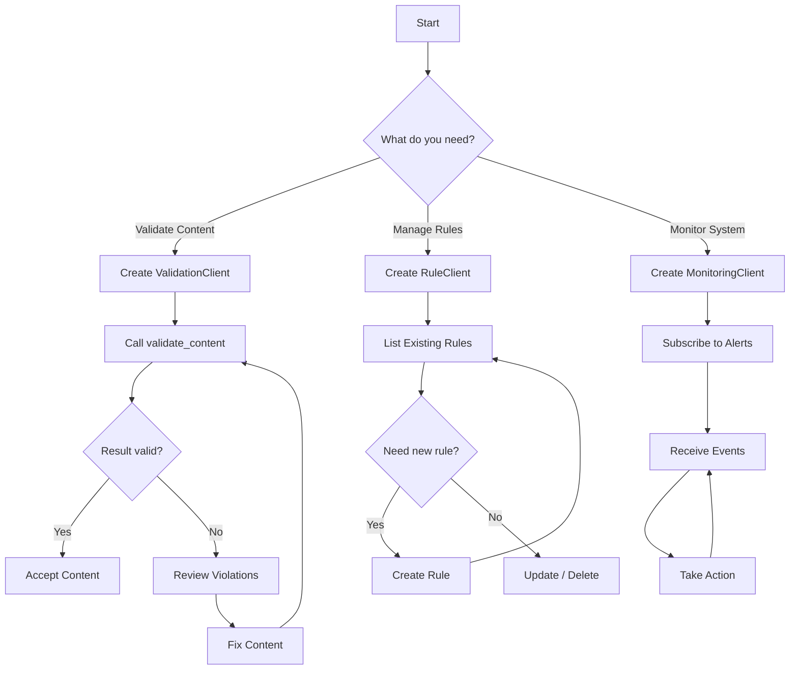

# Quickstart Guide

## Installation

```bash
pip install rules-emerging-pattern-sdk
```

Or from source:

```bash
git clone https://github.com/your-org/rules-emerging-pattern-sdk.git
cd rules-emerging-pattern-sdk
pip install -e .
```

## Basic Usage

```python
from rep_sdk import Client

# Initialize the client
client = Client(
    base_url="https://api.example.com",
    api_key="your-api-key-here",
    timeout=30
)

# Validate content
result = client.validation.validate_content(
    content="Sample text to validate",
    rules=["rule-1", "rule-2"]
)

# Print results
print(f"Valid: {result.is_valid}")
for violation in result.violations:
    print(f"  - {violation.rule_id}: {violation.message}")
```

## Validation Sequence



## Common Workflows

