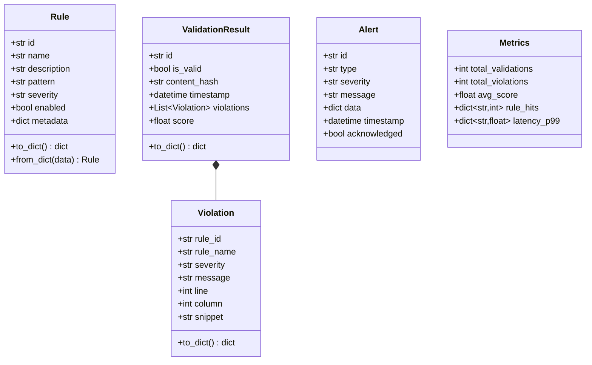
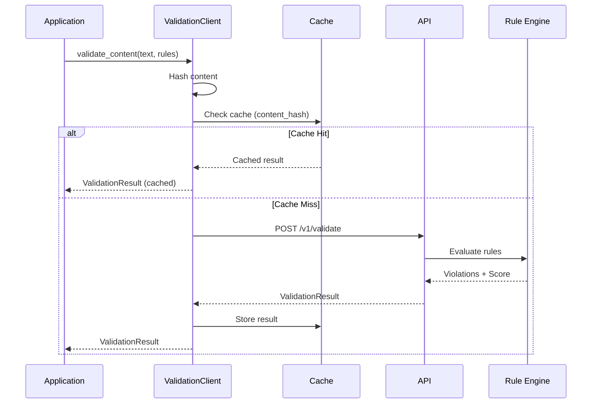

# API Reference

## Model Classes



## Validation Flow



## Method Reference

| Method | Description | Return Type |
|---|---|---|
| `Client.__init__` | Initialize SDK client with config | `None` |
| `RuleClient.list_rules` | List all rules with optional filters | `List[Rule]` |
| `RuleClient.get_rule` | Get a single rule by ID | `Rule` |
| `RuleClient.create_rule` | Create a new rule | `Rule` |
| `RuleClient.update_rule` | Update an existing rule | `Rule` |
| `RuleClient.delete_rule` | Delete a rule by ID | `bool` |
| `ValidationClient.validate_content` | Validate a single content string | `ValidationResult` |
| `ValidationClient.validate_batch` | Validate multiple items | `List[ValidationResult]` |
| `ValidationClient.get_status` | Get validation status by ID | `ValidationStatus` |
| `MonitoringClient.get_alerts` | Retrieve alerts with filters | `List[Alert]` |
| `MonitoringClient.get_metrics` | Get system metrics for a duration | `Metrics` |
| `MonitoringClient.subscribe_events` | Subscribe to real-time events | `Subscription` |

## Method Signatures

```python
class Client:
    def __init__(
        self,
        base_url: str,
        api_key: str,
        timeout: int = 30,
        retry_count: int = 3,
        retry_delay: float = 1.0
    ) -> None: ...

class RuleClient:
    def list_rules(
        self,
        page: int = 1,
        page_size: int = 20,
        severity: Optional[str] = None,
        enabled: Optional[bool] = None
    ) -> List[Rule]: ...

    def create_rule(
        self,
        name: str,
        pattern: str,
        severity: str = "medium",
        description: str = "",
        enabled: bool = True,
        metadata: Optional[dict] = None
    ) -> Rule: ...

class ValidationClient:
    def validate_content(
        self,
        content: str,
        rules: Optional[List[str]] = None,
        async_mode: bool = False
    ) -> ValidationResult: ...

    def validate_batch(
        self,
        items: List[dict],
        concurrency: int = 5
    ) -> List[ValidationResult]: ...

class MonitoringClient:
    def subscribe_events(
        self,
        event_types: List[str],
        callback: Callable[[Alert], None],
        polling_interval: float = 1.0
    ) -> Subscription: ...
```