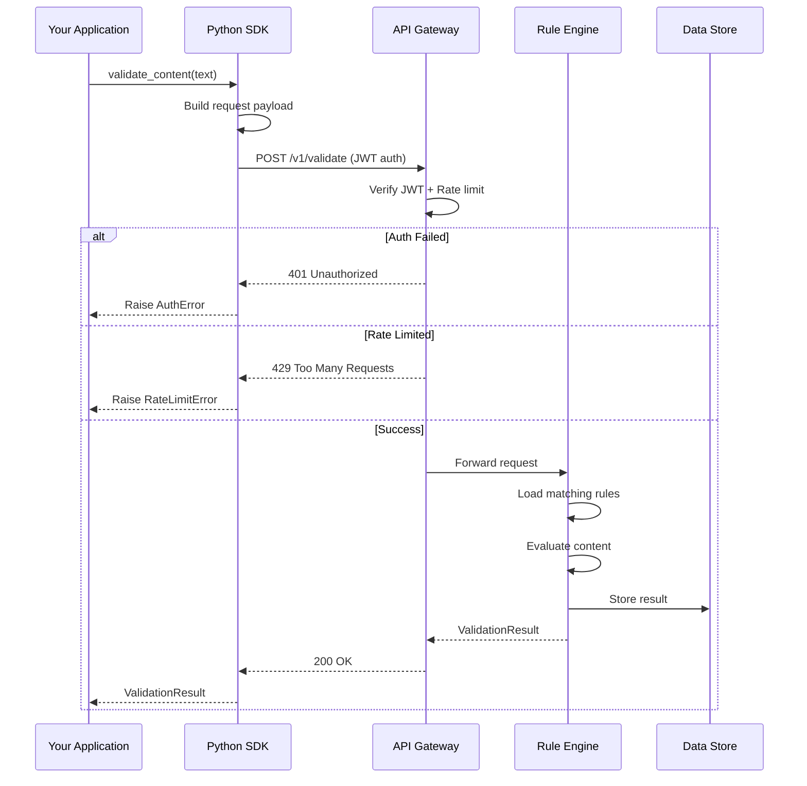
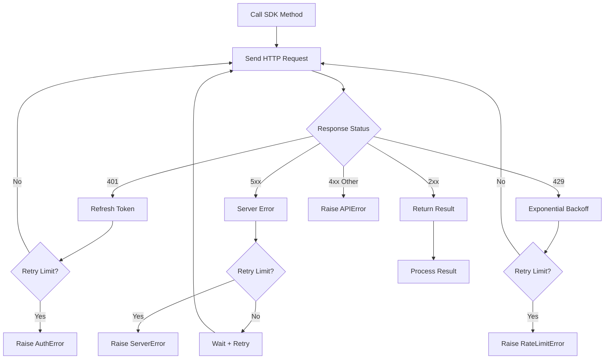

# Integration Guide

## End-to-End Validation Flow



## Error Handling & Retry Logic



## Configuration Options

```python
from rep_sdk import Client
from rep_sdk.config import LogConfig

client = Client(
    base_url="https://api.example.com",
    api_key="sk-...",
    timeout=30,             # Request timeout in seconds (default: 30)
    retry_count=3,          # Max retries on failure (default: 3)
    retry_delay=1.0,        # Base delay in seconds (default: 1.0)
    max_retry_delay=30.0,   # Maximum backoff cap (default: 30.0)
    log_config=LogConfig(   # Logging configuration
        level="INFO",
        format="json"
    )
)
```

## Error Handling Patterns

```python
from rep_sdk import Client
from rep_sdk.exceptions import (
    AuthError, RateLimitError, ServerError,
    ValidationError, TimeoutError
)

client = Client(base_url="...", api_key="...")

# Pattern 1: Try/Except per operation
try:
    result = client.validation.validate_content(text)
except AuthError:
    # Re-authenticate or rotate API key
    client.refresh_auth()
except RateLimitError:
    # Implement backoff
    import time
    time.sleep(10)
except ServerError as e:
    # Log and alert
    logger.error(f"Server error: {e.status_code}")
except TimeoutError:
    # Fallback to degraded mode
    result = fallback_validation(text)

# Pattern 2: Retry wrapper
from tenacity import retry, stop_after_attempt, wait_exponential

@retry(stop=stop_after_attempt(3), wait=wait_exponential(multiplier=1, min=1, max=10))
def safe_validate(text):
    return client.validation.validate_content(text)

# Pattern 3: Circuit breaker with fallback
def validate_with_fallback(text):
    try:
        return client.validation.validate_content(text)
    except (ServerError, TimeoutError):
        logger.warning("SDK unavailable, using local validation")
        return local_fallback(text)
```

## Best Practices

1. **Reuse client instances** — create once, reuse across the application lifecycle
2. **Set reasonable timeouts** — 30s for standard, 120s for batch operations
3. **Implement circuit breakers** — stop calling after repeated failures
4. **Cache results** — identical content doesn't need re-validation
5. **Use async mode** for non-blocking validation in web applications
6. **Monitor retry metrics** — excessive retries indicate systemic issues