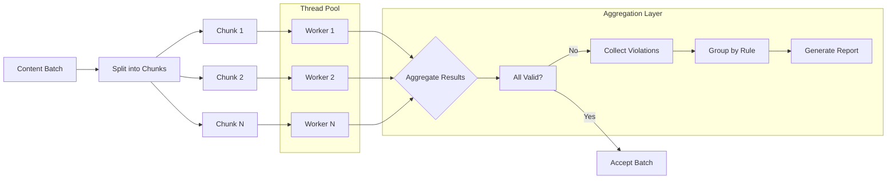
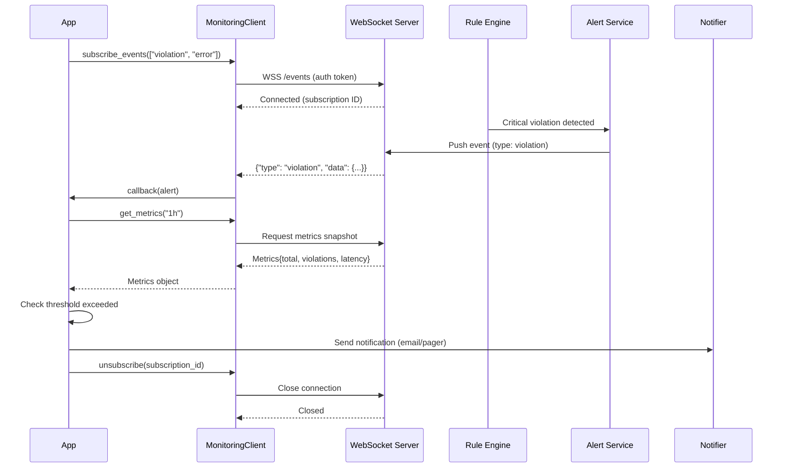
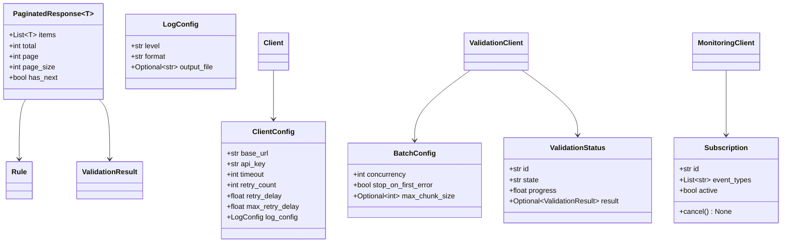

# Advanced Usage

## Batch Evaluation Pipeline



## Monitoring & Alerting Flow



## Full Type System



## Async Usage

```python
from rep_sdk import AsyncClient

async_client = AsyncClient(
    base_url="https://api.example.com",
    api_key="sk-..."
)

# Concurrent validations
import asyncio

async def validate_many(contents):
    tasks = [
        async_client.validation.validate_content(text)
        for text in contents
    ]
    results = await asyncio.gather(*tasks)
    return results

# Run with event loop
results = asyncio.run(validate_many(["text1", "text2", "text3"]))

# Async batch with streaming
async for result in async_client.validation.validate_stream(
    content_stream,
    concurrency=10
):
    print(f"Result: {result.is_valid}")
```

## Custom Configuration

```python
from rep_sdk import Client
from rep_sdk.config import BatchConfig, LogConfig, CacheConfig
import logging

# Full custom configuration
client = Client(
    base_url="https://api.example.com",
    api_key="sk-...",
    timeout=60,
    retry_count=5,
    retry_delay=0.5,
    max_retry_delay=60.0,
    log_config=LogConfig(
        level="DEBUG",
        format="json",
        output_file="/var/log/rep_sdk.log"
    ),
    cache_config=CacheConfig(
        enabled=True,
        ttl=300,
        max_size=1000
    ),
    batch_config=BatchConfig(
        concurrency=20,
        stop_on_first_error=False,
        max_chunk_size=50000
    )
)
```

## Performance Optimization Tips

| Technique | Impact | Complexity |
|---|---|---|
| **Connection pooling** — reuse HTTP sessions | High | Low |
| **Content caching** — avoid re-validation of identical content | High | Low |
| **Batch operations** — validate in bulk instead of single items | High | Medium |
| **Async I/O** — use `AsyncClient` for concurrent workloads | Medium | Medium |
| **Chunked processing** — split large batches into optimal chunks | Medium | Low |
| **Result pagination** — use page_size to control payload size | Low | Low |
| **Local fallback** — run simple rules locally to reduce API calls | Medium | High |

```python
# Optimized: Reuse client and HTTP session
client = Client(base_url="...", api_key="...")

# Optimized: Batch instead of loop
# BAD
for text in thousand_texts:
    client.validation.validate_content(text)

# GOOD
results = client.validation.validate_batch(
    [{"content": t} for t in thousand_texts],
    concurrency=20
)

# Optimized: Cache identical content
cache = {}
def validate_with_cache(text):
    h = hash(text)
    if h not in cache:
        cache[h] = client.validation.validate_content(text)
    return cache[h]
```