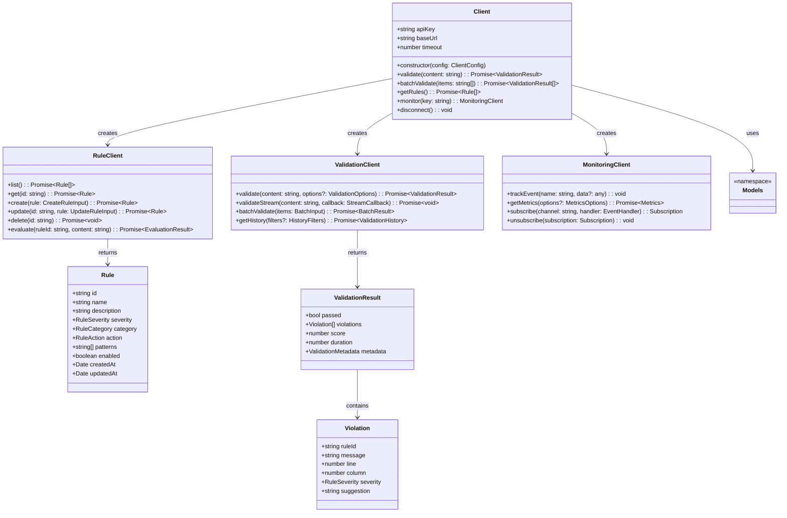
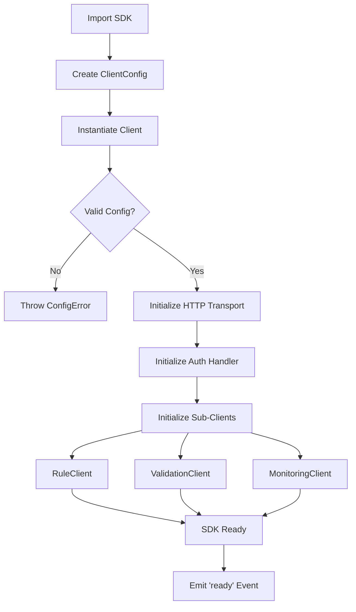
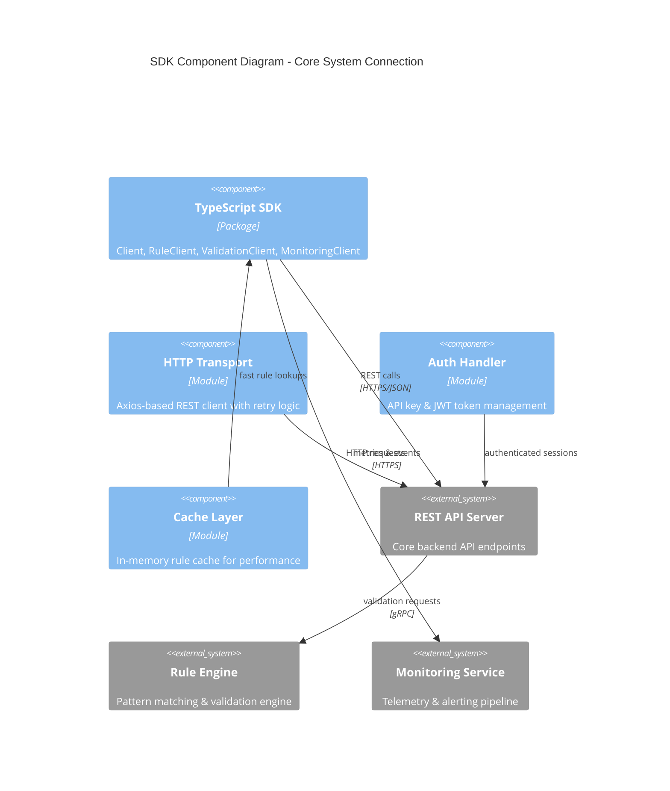

# TypeScript SDK Architecture

## Class Hierarchy

## SDK Initialization Flow

## System Components

## Component Descriptions

| Component | Description |
|-----------|-------------|
| **Client** | Main entry point. Accepts config, initializes sub-clients, manages lifecycle. |
| **RuleClient** | CRUD operations for validation rules. Supports listing, fetching, creating, updating, and deleting rules. |
| **ValidationClient** | Core validation logic. Supports single, batch, and streaming validation with configurable options. |
| **MonitoringClient** | Telemetry and event tracking. Subscribes to real-time channels and aggregates metrics. |
| **Models** | TypeScript types and interfaces for Rule, ValidationResult, Violation, and all supporting types. |
| **HTTP Transport** | Axios-based transport with retry, timeout, and error normalization. |
| **Auth Handler** | Manages API key header injection and optional JWT token refresh. |
| **Cache Layer** | In-memory LRU cache for rule definitions to reduce API calls. |
