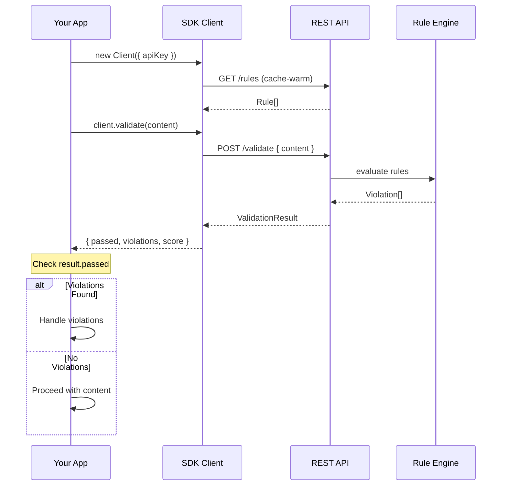
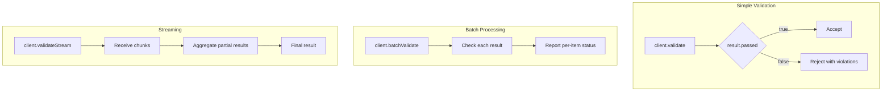

# Quickstart Guide

## Installation

```bash
npm install @rules-emerging/sdk
```

For Yarn or pnpm:

```bash
yarn add @rules-emerging/sdk
pnpm add @rules-emerging/sdk
```

## Basic Usage

### Validate Content



### Minimal Example

```typescript
import { Client } from '@rules-emerging/sdk';

const client = new Client({
  apiKey: 'your-api-key-here',
});

async function checkContent() {
  const result = await client.validate('Some content to validate');
  console.log(result);
}
```

### Full Workflow

```mermaid
flowchart LR
    A[Install SDK] --> B[Import Client]
    B --> C[Initialize with Config]
    C --> D[Ready]
    D --> E{Validation Type}
    E -->|Single| F[client.validate()]
    E -->|Batch| G[client.batchValidate()]
    E -->|Stream| H[client.validateStream()]
    F --> I{Passed?}
    G --> I
    H --> I
    I -->|Yes| J[Content Approved]
    I -->|No| K[Review Violations]
    K --> L[Fix Content]
    L --> F
```

### Common Workflows



### Error Handling

```typescript
import { Client, SdkError } from '@rules-emerging/sdk';

const client = new Client({ apiKey: 'sk-...' });

try {
  const result = await client.validate('Hello world');
  if (result.passed) {
    console.log('Content passed validation');
  } else {
    console.error('Violations:', result.violations);
  }
} catch (err) {
  if (err instanceof SdkError) {
    console.error('SDK error:', err.message);
  } else {
    console.error('Unexpected error:', err);
  }
}
```

### TypeScript Types

```typescript
import type {
  ClientConfig,
  ValidationResult,
  Violation,
  Rule,
} from '@rules-emerging/sdk';

const config: ClientConfig = {
  apiKey: process.env.API_KEY!,
  baseUrl: 'https://api.rules-emerging.dev',
  timeout: 10_000,
};
```

### Next Steps

- See [API Reference](./03-api-reference.md) for all available methods.
- See [Integration Guide](./04-integration-guide.md) for production setup.
- See [Advanced Usage](./05-advanced-usage.md) for batch and streaming patterns.
