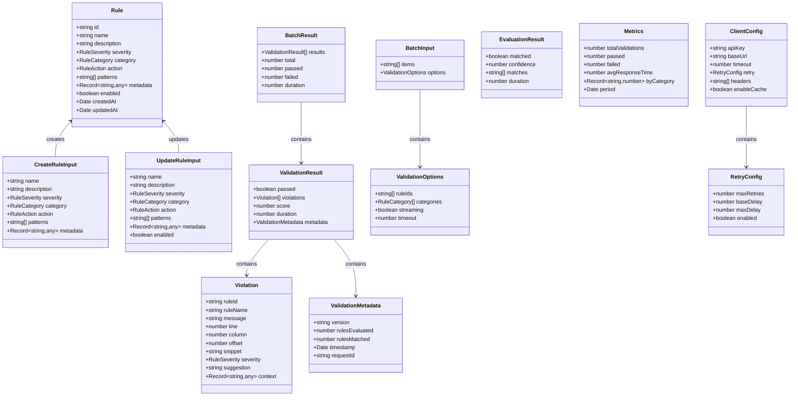
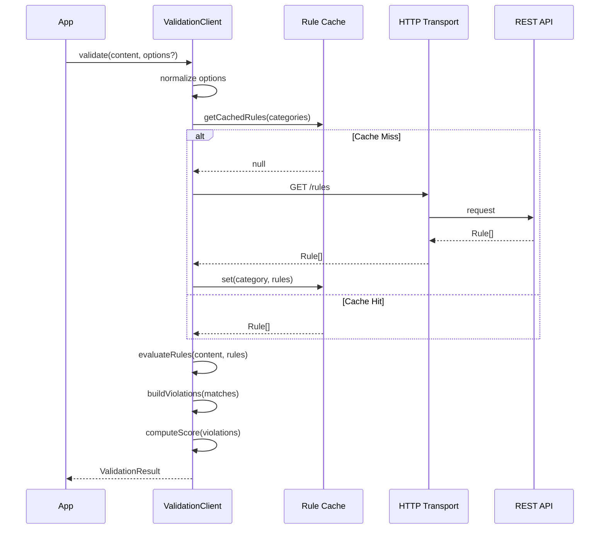

# API Reference

## Model Types



## Validation Flow



## Method Reference

| Method | Returns | Description |
|--------|---------|-------------|
| `validate(content, options?)` | `Promise<ValidationResult>` | Validate a single content string against active rules |
| `validateStream(content, callback)` | `Promise<void>` | Streaming validation with partial results via callback |
| `batchValidate(input)` | `Promise<BatchResult>` | Validate multiple content items in a single request |
| `getRules()` | `Promise<Rule[]>` | Get all active rules |
| `getRule(id)` | `Promise<Rule>` | Get a single rule by ID |
| `createRule(input)` | `Promise<Rule>` | Create a new validation rule |
| `updateRule(id, input)` | `Promise<Rule>` | Update an existing rule |
| `deleteRule(id)` | `Promise<void>` | Delete a rule by ID |
| `evaluateRule(ruleId, content)` | `Promise<EvaluationResult>` | Evaluate content against a specific rule |
| `getHistory(filters?)` | `Promise<ValidationHistory>` | Get validation history with optional filters |
| `trackEvent(name, data?)` | `void` | Track a custom monitoring event |
| `getMetrics(options?)` | `Promise<Metrics>` | Get aggregated validation metrics |
| `subscribe(channel, handler)` | `Subscription` | Subscribe to a real-time event channel |
| `unsubscribe(sub)` | `void` | Unsubscribe from a channel |

## Method Signatures

```typescript
class ValidationClient {
  validate(
    content: string,
    options?: ValidationOptions,
  ): Promise<ValidationResult>;

  validateStream(
    content: string,
    callback: (chunk: StreamChunk, done: boolean) => void,
  ): Promise<void>;

  batchValidate(input: BatchInput): Promise<BatchResult>;
}

class RuleClient {
  list(filters?: RuleFilters): Promise<Rule[]>;
  get(id: string): Promise<Rule>;
  create(input: CreateRuleInput): Promise<Rule>;
  update(id: string, input: UpdateRuleInput): Promise<Rule>;
  remove(id: string): Promise<void>;
  evaluate(ruleId: string, content: string): Promise<EvaluationResult>;
}

class MonitoringClient {
  trackEvent(name: string, data?: Record<string, any>): void;
  getMetrics(options?: MetricsOptions): Promise<Metrics>;
  subscribe(
    channel: string,
    handler: (event: MonitorEvent) => void,
  ): Subscription;
  unsubscribe(subscription: Subscription): void;
}
```

## Enums

```typescript
enum RuleSeverity {
  Info = 'info',
  Low = 'low',
  Medium = 'medium',
  High = 'high',
  Critical = 'critical',
}

enum RuleCategory {
  Security = 'security',
  Compliance = 'compliance',
  Style = 'style',
  Performance = 'performance',
  BestPractice = 'best_practice',
}

enum RuleAction {
  Allow = 'allow',
  Warn = 'warn',
  Block = 'block',
}
```
