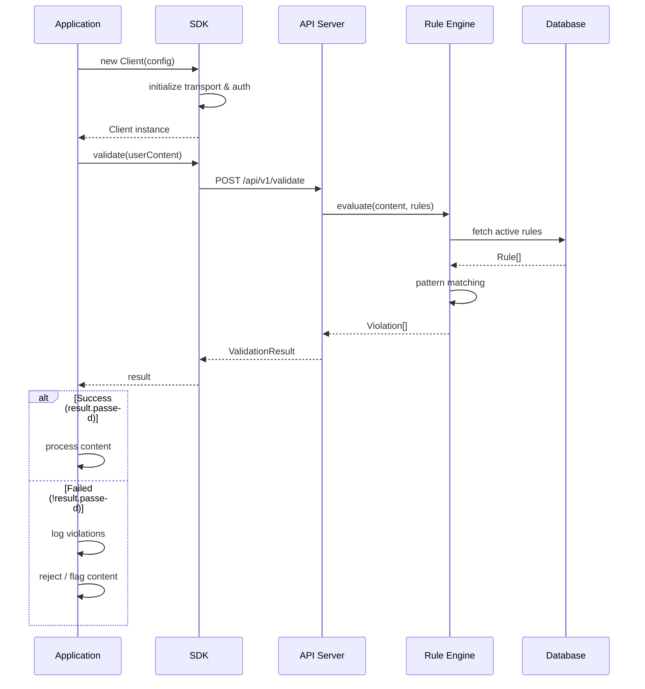
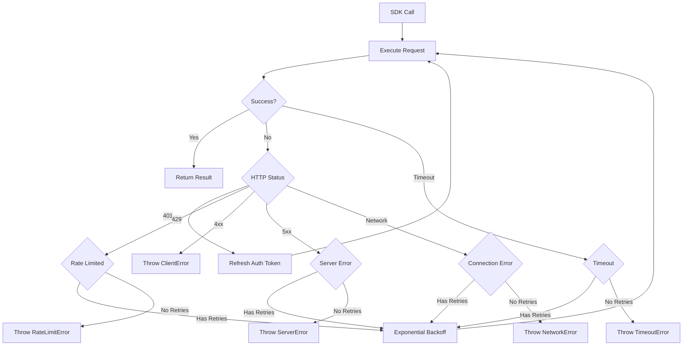

# Integration Guide

## End-to-End Flow



## Error Handling & Retry Logic



## Configuration Options

```typescript
interface ClientConfig {
  // Required
  apiKey: string;

  // Optional - defaults shown
  baseUrl?: string;          // 'https://api.rules-emerging.dev'
  timeout?: number;          // 10_000 (ms)
  enableCache?: boolean;     // true

  retry?: {
    enabled?: boolean;       // true
    maxRetries?: number;     // 3
    baseDelay?: number;      // 200 (ms)
    maxDelay?: number;       // 5_000 (ms)
  };

  headers?: Record<string, string>;
  environment?: 'production' | 'staging' | 'development';
}
```

## Usage Patterns

### Node.js

```typescript
import { Client } from '@rules-emerging/sdk';

const client = new Client({
  apiKey: process.env.RULES_API_KEY!,
  baseUrl: process.env.RULES_API_URL,
  timeout: 15_000,
  retry: { maxRetries: 3 },
});

// Express middleware example
function validationMiddleware(req: Request, res: Response, next: NextFunction) {
  client
    .validate(req.body.content)
    .then((result) => {
      if (result.passed) {
        next();
      } else {
        res.status(422).json({ violations: result.violations });
      }
    })
    .catch(next);
}
```

### Browser

```typescript
import { Client } from '@rules-emerging/sdk/browser';

const client = new Client({
  apiKey: process.env.NEXT_PUBLIC_RULES_API_KEY!,
  timeout: 8_000,
});

// React component example
async function handleSubmit(content: string) {
  try {
    const result = await client.validate(content);
    setValidationResult(result);
  } catch (err) {
    setError('Validation service unavailable');
  }
}
```

## Error Handling Patterns

```typescript
import {
  Client,
  ValidationError,
  AuthError,
  RateLimitError,
  NetworkError,
  TimeoutError,
} from '@rules-emerging/sdk';

async function safeValidate(content: string) {
  try {
    return await client.validate(content);
  } catch (err) {
    if (err instanceof AuthError) {
      // Rotate API key or re-authenticate
      await refreshApiKey();
      return client.validate(content); // retry
    }
    if (err instanceof RateLimitError) {
      // Back off and queue
      await delay(err.retryAfter);
      return safeValidate(content);
    }
    if (err instanceof TimeoutError || err instanceof NetworkError) {
      // Fallback
      return { passed: true, violations: [], score: 1, metadata: {} };
    }
    throw err;
  }
}
```

## Best Practices

| Practice | Recommendation |
|----------|---------------|
| **API Key Storage** | Use environment variables, never hardcode. For browser, use backend proxy. |
| **Timeouts** | Set 10-15s for server, 5-8s for browser. |
| **Retries** | Enable with exponential backoff. Max 3 retries. |
| **Caching** | Enable rule cache to reduce API calls. |
| **Error Handling** | Always wrap calls in try/catch. Have a fallback strategy. |
| **Connection Pool** | Reuse single Client instance across requests. |
| **Logging** | Log validation failures with violation details. |
