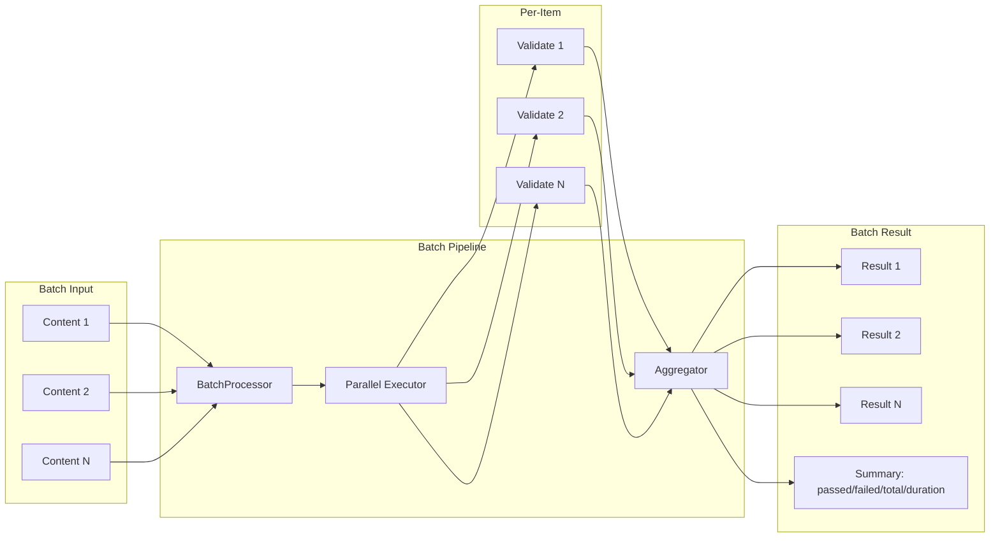
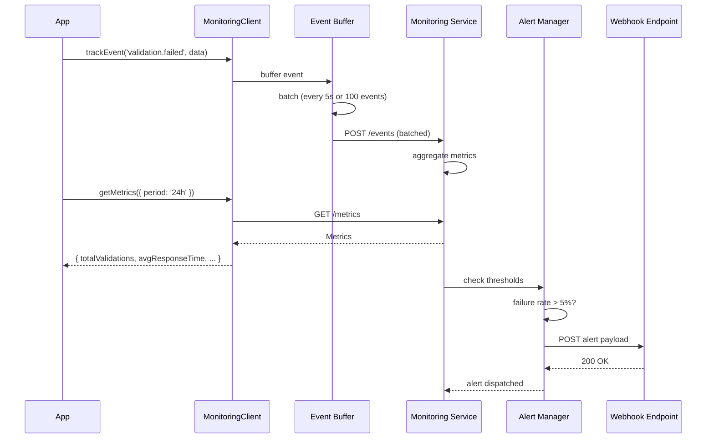
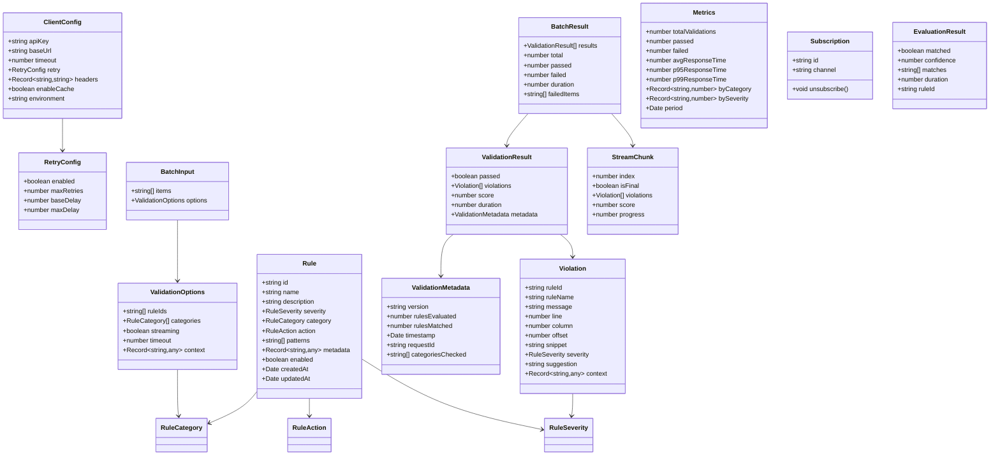

# Advanced Usage

## Batch Evaluation Pipeline



## Monitoring & Alerting Flow



## Full Type System



## Async/Await Patterns

```typescript
import { Client } from '@rules-emerging/sdk';

const client = new Client({ apiKey: process.env.API_KEY! });

// Parallel validation
async function validateAll(contents: string[]) {
  const results = await Promise.allSettled(
    contents.map((c) => client.validate(c)),
  );
  return results.map((r, i) => ({
    index: i,
    status: r.status,
    result: r.status === 'fulfilled' ? r.value : null,
    error: r.status === 'rejected' ? r.reason : null,
  }));
}

// Streaming with progress
async function streamValidate(content: string) {
  const violations: Violation[] = [];
  await client.validateStream(content, (chunk, done) => {
    violations.push(...chunk.violations);
    console.log(`Progress: ${chunk.progress}%`);
    if (done) {
      console.log(`Total violations: ${violations.length}`);
    }
  });
}

// Batch with concurrency control
async function batchWithConcurrency(
  items: string[],
  concurrency = 5,
) {
  const results: ValidationResult[] = [];
  for (let i = 0; i < items.length; i += concurrency) {
    const batch = items.slice(i, i + concurrency);
    const batchResults = await Promise.all(
      batch.map((item) => client.validate(item)),
    );
    results.push(...batchResults);
  }
  return results;
}
```

## Custom Configuration

```typescript
import { Client } from '@rules-emerging/sdk';

const client = new Client({
  apiKey: process.env.API_KEY!,
  baseUrl: 'https://api.rules-emerging.dev/v2',
  timeout: 30_000,
  enableCache: true,
  retry: {
    enabled: true,
    maxRetries: 5,
    baseDelay: 500,
    maxDelay: 10_000,
  },
  headers: {
    'X-Custom-Header': 'custom-value',
    'X-Trace-Id': crypto.randomUUID(),
  },
  environment: 'production',
});

// Custom rule scope
const result = await client.validate(content, {
  ruleIds: ['rule-security-001', 'rule-compliance-002'],
  categories: [RuleCategory.Security, RuleCategory.Compliance],
  context: { userId: 'usr_123', source: 'onboarding' },
});
```

## Performance Optimization

| Technique | Description |
|-----------|-------------|
| **Reuse Client** | Create one `Client` instance and reuse it across requests. Avoid per-request instantiation. |
| **Enable Cache** | Rule cache avoids re-fetching rules on every validation. Cache TTL is 5 minutes by default. |
| **Batch Requests** | Use `batchValidate` instead of multiple `validate` calls to reduce HTTP overhead. |
| **Streaming** | For large content, use `validateStream` to get partial results while processing continues. |
| **Concurrency Control** | Limit concurrent validation calls to avoid overwhelming the API (5-10 concurrent max). |
| **Connection Keep-Alive** | SDK uses HTTP keep-alive by default. Ensure your Node.js version supports it. |
| **Tree-Shaking** | For browser builds, import only the modules you need to reduce bundle size. |

```typescript
// Tree-shakeable imports (browser)
import { ValidationClient } from '@rules-emerging/sdk/validation';
import type { ValidationResult } from '@rules-emerging/sdk/types';

// Pre-warm cache
const client = new Client({ apiKey: process.env.API_KEY! });
await client.getRules(); // pre-warm

// Measure performance
console.time('validation');
const result = await client.validate(largeContent);
console.timeEnd('validation');
```
