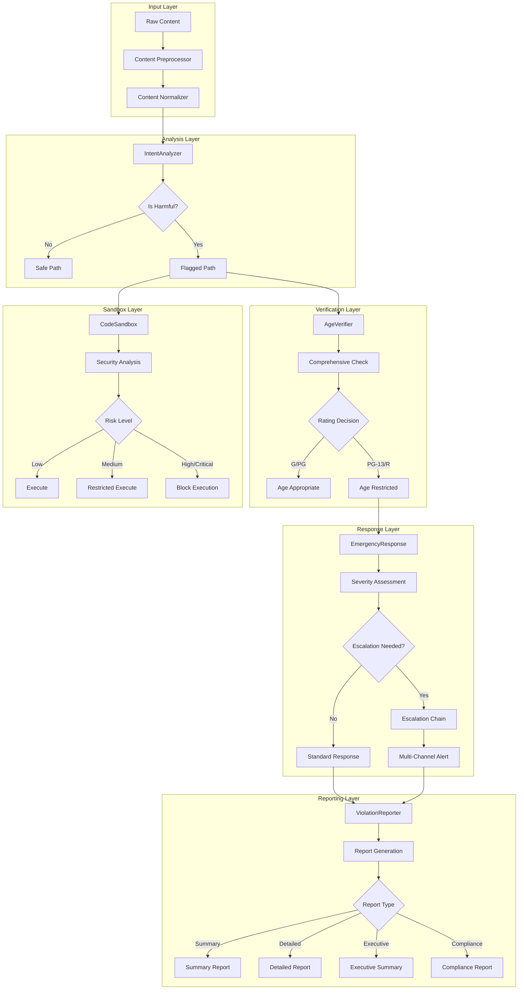
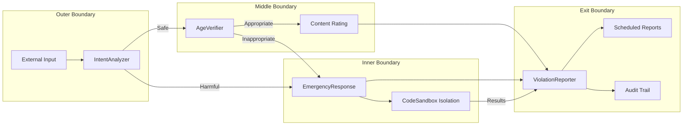

# Advanced Features Architecture

## Component Architecture

The advanced module follows a layered architecture where content flows through a pipeline of analysis, verification, response, and reporting components. Each component is independently configurable and can be enabled or disabled based on operational requirements.

## Class Architecture

```mermaid
classDiagram
    class IntentAnalyzer {
        -IntentConfig config
        -List[str] harmful_intents
        -Dict[str, List[str]] intent_patterns
        -Dict[str, Pattern] regex_intent_patterns
        -Dict[str, Pattern] language_indicators
        -List[IntentHistoryEntry] context_history
        -int analysis_count
        +comprehensive_analysis(content) IntentAnalysis
        +detect_harmful_intent(content) bool
        +analyze_intent(content) Dict[str, float]
        +batch_analyze(contents) List[IntentAnalysis]
        +analyze_sentiment(content) Dict[str, float]
        +get_full_analysis(content) Dict[str, Any]
        +get_intent_heatmap(contents) Dict[str, int]
        +track_intent_sequence(contents) List[Dict]
        +detect_intent_shift(prev, curr) Dict
        +score_content_safety(content) float
        +_apply_regex_scores(content, scores) void
        +_detect_language(content) List[str]
        +_apply_confidence_decay(content, intent_type, base) float
        +_compute_context_scores(content) Dict[str, float]
    }
    class IntentAnalysis {
        +string primary_intent
        +float confidence
        +Dict[str, float] secondary_intents
        +bool is_harmful
        +List[str] matched_patterns
        +float decayed_confidence
        +Dict[str, float] context_scores
        +List[str] language_hints
        +string analysis_version
    }
    class IntentConfig {
        +bool enable_regex
        +bool enable_confidence_decay
        +bool enable_multi_language
        +bool enable_context_history
        +float min_confidence_threshold
        +float harmful_threshold
        +float confidence_decay_rate
        +int max_history_size
        +int history_ttl_hours
    }
    class IntentHistoryEntry {
        +string content_hash
        +string primary_intent
        +float confidence
        +bool is_harmful
        +datetime timestamp
        +float duration_seconds
    }

    class AgeVerifier {
        -AgeVerificationConfig config
        -Dict[AgeGroup, List[str]] age_restricted_keywords
        -Dict[str, List[str]] content_indicators
        -Dict[str, Pattern] regex_patterns
        -Pattern educational_contexts
        -Pattern scientific_contexts
        -Dict statistics
        -Dict cache
        +comprehensive_check(content, target_age) ContentRating
        +verify_content_age_appropriateness(content, age_group) bool
        +get_content_rating(content) str
        +batch_verify(contents) List[ContentRating]
        +get_content_rating_statistics() Dict
        +get_rating_for_age_group(rating, target_age) bool
        +get_recommended_age_group(content) str
        +check_multiple_age_groups(content) Dict[str, bool]
        +find_inappropriate_keywords(content) Dict
        +get_safe_content_score(content, target_age) float
        +verify_content_safe(content) Tuple[bool, List[str]]
        +generate_report(include_history) Dict
        +_categorize_flagged_content(content) Dict
        +_check_context_exemption(content) Tuple[bool, str]
    }
    class ContentRating {
        +string rating
        +string age_group
        +List[str] warnings
        +bool is_appropriate
        +List[str] matched_patterns
        +float confidence_score
        +Dict[str, List[str]] categories_flagged
    }
    class AgeVerificationConfig {
        +bool enable_regex_matching
        +bool enable_context_awareness
        +bool enable_batch_verification
        +float min_confidence_threshold
        +int max_warnings_before_block
        +bool educational_exemption_enabled
        +bool scientific_exemption_enabled
        +bool cache_results
        +int cache_ttl_seconds
    }
    class AgeGroup {
        <<enumeration>>
        PRESCHOOL
        CHILD
        YOUNG_CHILD
        OLDER_CHILD
        TEEN
        YOUNG_ADULT
        ADULT
        SENIOR
        ALL_AGES
    }

    class EmergencyResponse {
        -EmergencyConfig config
        -Dict[str, EmergencyIncident] active_incidents
        -Dict[EmergencyLevel, List] response_handlers
        -Dict[IncidentCategory, List] category_handlers
        -List[EmergencyIncident] incident_history
        -List[str] emergency_contacts
        -Dict[str, List[str]] contact_channels
        -Dict[str, Thread] escalation_threads
        +trigger_emergency(incident_id, level, description) EmergencyIncident
        +resolve_emergency(incident_id, notes, resolved_by) bool
        +register_handler(level, handler) void
        +register_category_handler(category, handler) void
        +register_escalation_chain(level, steps) void
        +acknowledge_incident(incident_id, acknowledged_by) bool
        +add_auto_remediation_action(incident_id, action_type, handler) bool
        +get_active_incidents(level, category) List
        +get_incident_stats() Dict
        +get_incident_report(incident_id) Dict
        +add_emergency_contact(contact, channels) void
        +_calculate_severity_score(level, systems) float
        +_send_notifications(incident, force) void
        +_trigger_escalation(incident) void
        +_start_sla_checker() void
    }
    class EmergencyIncident {
        +string incident_id
        +EmergencyLevel level
        +string description
        +datetime timestamp
        +List[str] affected_systems
        +List[str] actions_taken
        +bool resolved
        +IncidentCategory category
        +string source
        +datetime sla_deadline
        +bool sla_breached
        +float severity_score
        +bool acknowledged
        +float resolution_time_seconds
        +List[IncidentAction] detailed_actions
        +List[IncidentTimelineEntry] timeline
    }
    class EmergencyLevel {
        <<enumeration>>
        INFO
        LOW
        MEDIUM
        HIGH
        CRITICAL
        WARNING
        ERROR
        FATAL
    }
    class IncidentCategory {
        <<enumeration>>
        SECURITY
        PERFORMANCE
        DATA_INTEGRITY
        AVAILABILITY
        COMPLIANCE
        SAFETY
        NETWORK
        APPLICATION
        SYSTEM_FAILURE
        EXTERNAL_THREAT
    }
    class EscalationChain {
        +string chain_id
        +List[EscalationStep] steps
        +int current_step
        +bool resolved
    }
    class NotificationChannel {
        +string channel_type
        +bool enabled
        +Dict config
    }

    class ViolationReporter {
        -ReportingConfig config
        -Dict[str, ViolationReport] reports
        -Dict[str, int] aggregated_stats
        -Dict[str, ScheduledReport] scheduled_reports
        -List[TrendData] trend_history
        -int report_counter
        +report_violation(violation_id, rule_id, severity) ViolationReport
        +get_report(violation_id) ViolationReport
        +aggregate_reports() Dict
        +get_reports_by_severity(severity) List
        +get_reports_by_rule(rule_id) List
        +get_reports_by_source(source) List
        +generate_report_json(template, filters) Dict
        +generate_csv_report(template, filters) str
        +generate_html_report(template, filters) str
        +generate_text_report(template, filters) str
        +compute_trend_analysis() Dict
        +get_dashboard_data() Dict
        +resolve_violation(violation_id, action) bool
        +create_scheduled_report(freq, template, format, recipients) str
        +prune_old_reports(days) int
    }
    class ViolationReport {
        +string violation_id
        +string rule_id
        +string severity
        +datetime timestamp
        +Dict details
        +string source
        +string action_taken
        +bool resolved
        +List[str] tags
    }
    class ReportTemplate {
        <<enumeration>>
        SUMMARY
        DETAILED
        EXECUTIVE
        COMPLIANCE
        TREND
        DASHBOARD
        AUDIT
    }
    class ReportFormat {
        <<enumeration>>
        JSON
        CSV
        HTML
        TEXT
    }

    class CodeSandbox {
        -SandboxConfig config
        -string sandbox_dir
        -string sandbox_id
        -int execution_count
        -List[ExecutionRecord] execution_history
        -Dict[str, SandboxPoolEntry] pool
        -Dict[str, List] risk_patterns
        +execute_code(code, language) SandboxResult
        +execute_code_safe(code, language) SandboxResult
        +analyze_security(code, language) Dict
        +create_isolated_env() string
        +get_execution_history(limit) List
        +get_execution_statistics() Dict
        +get_pool_status() Dict
        +get_sandbox_info() Dict
        +set_resource_limits(timeout, memory_mb) void
        +add_risk_pattern(language, pattern, risk_type, severity) void
        +cleanup() void
        +cleanup_all_pool_entries() int
        +shutdown() void
    }
    class SandboxResult {
        +bool success
        +string output
        +List[str] errors
        +float execution_time
        +datetime timestamp
        +int exit_code
        +Dict resource_usage
        +string execution_id
        +string language
        +string risk_level
        +int risks_found
    }
    class SandboxConfig {
        +int default_timeout
        +int default_memory_mb
        +bool enable_pooling
        +int pool_size
        +bool enable_audit_trail
        +bool enable_resource_limits
        +List[str] allowed_languages
        +List[str] blocked_modules
        +List[str] restricted_paths
    }
    class ExecutionRecord {
        +string execution_id
        +string language
        +string code_hash
        +bool success
        +float execution_time
        +datetime timestamp
        +string risk_level
        +int risks_found
        +string sandbox_id
    }
    class ResourceLimits {
        +int cpu_timeout
        +int memory_mb
        +int disk_mb
        +bool network_enabled
        +int max_processes
    }

    IntentAnalyzer --> IntentAnalysis
    IntentAnalyzer --> IntentConfig
    IntentAnalyzer --> IntentHistoryEntry
    AgeVerifier --> ContentRating
    AgeVerifier --> AgeVerificationConfig
    AgeVerifier --> AgeGroup
    EmergencyResponse --> EmergencyIncident
    EmergencyResponse --> EmergencyLevel
    EmergencyResponse --> IncidentCategory
    EmergencyResponse --> EscalationChain
    EmergencyResponse --> NotificationChannel
    ViolationReporter --> ViolationReport
    ViolationReporter --> ReportTemplate
    ViolationReporter --> ReportFormat
    CodeSandbox --> SandboxResult
    CodeSandbox --> SandboxConfig
    CodeSandbox --> ExecutionRecord
    CodeSandbox --> ResourceLimits
```

## Safety Boundary Enforcement

The safety boundary architecture ensures that potentially harmful content is detected, verified, and contained before it can affect the system or end users.

## Component Interaction Matrix

| Source Component | Target Component | Interaction Type | Data Exchanged |
|-----------------|------------------|-----------------|----------------|
| IntentAnalyzer | AgeVerifier | Sequential call | Content + intent score |
| IntentAnalyzer | EmergencyResponse | Conditional trigger | Harmful intent alert |
| AgeVerifier | EmergencyResponse | Conditional trigger | Age violation details |
| AgeVerifier | ViolationReporter | Event publishing | Content rating result |
| EmergencyResponse | ViolationReporter | Event publishing | Incident report |
| EmergencyResponse | CodeSandbox | Isolation request | Suspicious code |
| CodeSandbox | ViolationReporter | Audit record | Execution results |
| ViolationReporter | EmergencyResponse | Alert trigger | Critical violation count |
