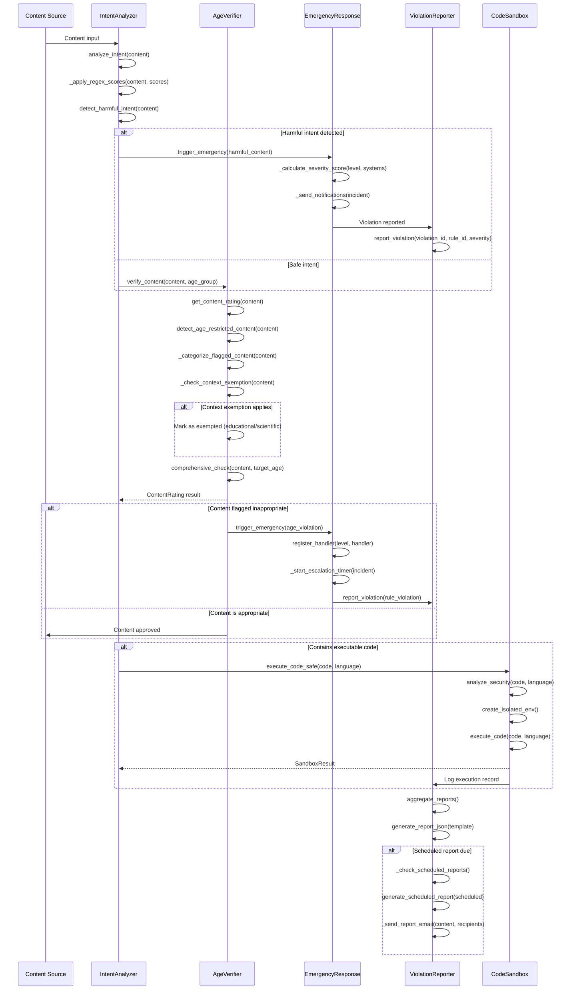
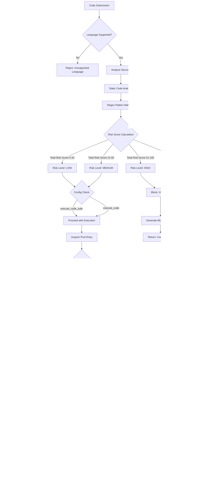
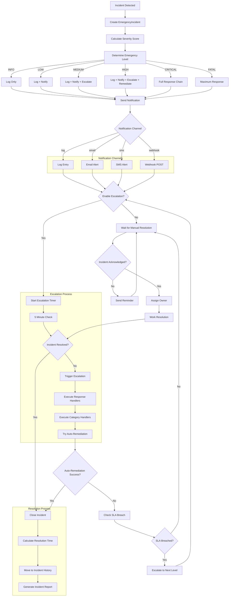

# Advanced Features Data Flow

## Content Analysis Sequence

The following sequence diagram illustrates the complete data flow for content analysis through the advanced features pipeline, from initial ingestion through final reporting.



## Sandbox Execution Lifecycle

The code sandbox follows a strict lifecycle for executing untrusted code, with security analysis at every stage.



## Emergency Response Escalation Flow

The emergency response system uses a multi-stage escalation process with configurable severity levels and notification channels.



## Statistical Data Flow

The advanced module maintains comprehensive statistics across all components for monitoring and analysis.

```mermaid
flowchart LR
    subgraph AgeVerifierStats["AgeVerifier Statistics"]
        AVS1[total_checks]
        AVS2[total_appropriate]
        AVS3[total_inappropriate]
        AVS4[by_rating]
        AVS5[by_age_group]
        AVS6[by_category]
        AVS7[average_confidence]
        AVS8[exemptions_granted]
    end

    subgraph EmergencyResponseStats["EmergencyResponse Statistics"]
        ERS1[active_incidents]
        ERS2[total_incidents]
        ERS3[resolved_count]
        ERS4[by_level]
        ERS5[by_category]
        ERS6[sla_breaches]
        ERS7[average_resolution_time]
        ERS8[severity_distribution]
    end

    subgraph IntentAnalyzerStats["IntentAnalyzer Statistics"]
        IAS1[total_analyses]
        IAS2[intent_distribution]
        IAS3[harmful_count]
        IAS4[average_confidence]
        IAS5[most_common_intent]
    end

    subgraph ViolationReporterStats["ViolationReporter Statistics"]
        VRS1[total_violations]
        VRS2[severity_distribution]
        VRS3[top_rules]
        VRS4[sources]
        VRS5[trend_direction]
        VRS6[percent_change]
    end

    subgraph CodeSandboxStats["CodeSandbox Statistics"]
        CSS1[total_executions]
        CSS2[success_rate]
        CSS3[average_execution_time]
        CSS4[risk_distribution]
        CSS5[language_distribution]
        CSS6[pool_size]
    end

    AgeVerifierStats --> VR[ViolationReporter]
    EmergencyResponseStats --> VR
    IntentAnalyzerStats --> VR
    CodeSandboxStats --> VR
    VR --> Dashboard[Consolidated Dashboard]
