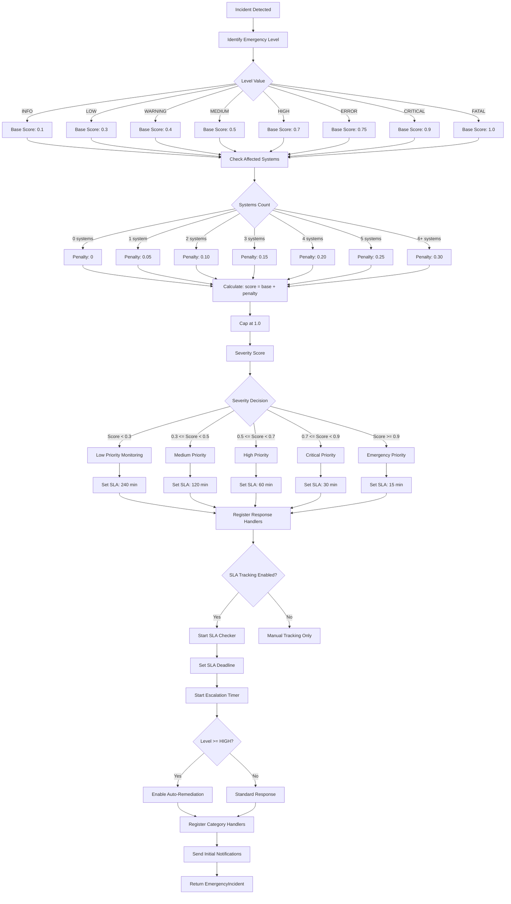

# Advanced Logic & Decision Making

## Intent Classification Flow

The IntentAnalyzer uses a multi-stage classification process combining keyword matching, regex pattern detection, and context-aware confidence scoring to determine the primary intent of user content.

```mermaid
flowchart TD
    A[Content Input] --> B[Tokenize & Normalize]
    B --> C[Lowercase Conversion]
    C --> D[Keyword Pattern Matching]

    D --> E{Match Found?}
    E -->|Yes| F[Increment Intent Scores]
    E -->|No| G[Continue Scanning]

    F --> H[All 15 Intent Categories Checked?]
    G --> H
    H -->|No| D
    H -->|Yes| I[Apply Regex Scores]

    I --> J[question_words -> information_seeking]
    I --> K[imperatives -> command]
    I --> L[urgency -> problem_solving]
    I --> M[code_blocks -> problem_solving]
    I --> N[negation + question -> clarification]

    J --> O[Normalize Scores]
    K --> O
    L --> O
    M --> O
    N --> O

    O --> P{Total Score > 0?}
    P -->|No| Q[Unknown Intent]
    P -->|Yes| R[Score Normalization: v / total]

    R --> S[Sort by Score]
    S --> T{Primary Intent = highest?}

    T --> U[Detect Harmful Intent]
    U --> V{harmful_intents match?}
    V -->|Yes| W[is_harmful = True]
    V -->|No| X{harmful category score > threshold?}
    X -->|Yes| W
    X -->|No| Y[is_harmful = False]

    W --> Z[Detect Language]
    Y --> Z

    Z --> AA{Multi-language Enabled?}
    AA -->|Yes| AB[Pattern match per language]
    AA -->|No| AC[Default: English]

    AB --> AD{language indicators >= 3 matches?}
    AD -->|Yes| AE[Add to detected languages]
    AD -->|No| AF[Unknown Language]
    AE --> AG[Identify Secondary Intents]

    AG --> AH[Filter top 5 secondary]
    AH --> AI[Apply Confidence Decay]

    AI --> AJ{Context History Available?}
    AJ -->|Yes| AK[Compute Decay Factor]
    AK --> AL[decayed = base * exp(-rate * elapsed / 3600)]
    AJ -->|No| AM[No Decay Applied]

    AL --> AN[Analyze Sentiment]
    AM --> AN

    AN --> AO[Compute positive/negative/neutral scores]
    AO --> AP[Build IntentAnalysis Object]

    AP --> AQ[Add to History]
    AQ --> AR[Return Comprehensive Analysis]

    subgraph IntentPatterns["Intent Pattern Categories"]
        I1[information_seeking]
        I2[creative]
        I3[harmful]
        I4[educational]
        I5[support_seeking]
        I6[casual_conversation]
        I7[opinion_seeking]
        I8[problem_solving]
        I9[planning]
        I10[analysis]
        I11[collaboration]
        I12[feedback]
        I13[emotional_expression]
        I14[command]
        I15[clarification]
    end
```

## Age Verification Logic

The age verification system combines keyword-based restriction lists, regex patterns, and context-aware exemption logic to determine content appropriateness for different age groups.

```mermaid
flowchart TD
    A[Content + Target Age Group] --> B[Cache Lookup]
    B --> C{Cache Hit?}
    C -->|Yes| D[Return Cached ContentRating]
    C -->|No| E[Get Content Rating]

    E --> F[Check ADULT keywords]
    F --> G{Adult Content?}
    G -->|Yes| H[Rating: R]
    G -->|No| I[Check TEEN keywords]

    I --> J{Teen Content?}
    J -->|Yes| K[Rating: PG-13]
    J -->|No| L[Check OLDER_CHILD keywords]

    L --> M{Older Child Content?}
    M -->|Yes| N[Rating: PG-13]
    M -->|No| O[Check CHILD keywords]

    O --> P{Child Content?}
    P -->|Yes| Q[Rating: PG]
    P -->|No| R[Check PRESCHOOL keywords]

    R --> S{Preschool Content?}
    S -->|Yes| T[Rating: PG]
    S -->|No| U[Check Regex Patterns]

    U --> V[sexual_content match?]
    V -->|Yes| H
    V -->|No| W[violence_descriptive match?]
    W -->|Yes| K
    W -->|No| X[profanity match?]
    X -->|Yes| K
    X -->|No| Y[self_harm match?]
    Y -->|Yes| K
    Y -->|No| Z[Rating: G]

    H --> AA[Categorize Flagged Content]
    K --> AA
    N --> AA
    Q --> AA
    T --> AA
    Z --> AA

    AA --> AB[Violence Detection]
    AA --> AC[Substance Abuse Detection]
    AA --> AD[Sexual Content Detection]
    AA --> AE[Hate Speech Detection]
    AA --> AF[Self-Harm Detection]
    AA --> AG[Bullying Detection]
    AA --> AH[Weapons Detection]
    AA --> AI[Alcohol Detection]
    AA --> AJ[Tobacco Detection]
    AA --> AK[Gambling Detection]

    AB --> AL{Context Exemption Check}
    AC --> AL
    AD --> AL
    AE --> AL
    AF --> AL
    AG --> AL
    AH --> AL
    AI --> AL
    AJ --> AL
    AK --> AL

    AL --> AM{Educational Context?}
    AM -->|Yes| AN[Exempt Warnings]
    AM -->|No| AO{Scientific Context?}
    AO -->|Yes| AN
    AO -->|No| AP[No Exemption]

    AN --> AQ[Verify Age Appropriateness]
    AP --> AQ

    AQ --> AR[Check Keywords for Age Group]
    AR --> AS{Keyword Match?}
    AS -->|Yes| AT[Not Appropriate]
    AS -->|No| AU[Check Regex for Age Group]

    AU --> AV{Regex Match for minors?}
    AV -->|Yes| AT
    AV -->|No| AW[Is Appropriate]

    AT --> AX{Exempted?}
    AX -->|Yes| AW
    AX -->|No| AY[Not Appropriate]

    AW --> AZ[Calculate Confidence Score]
    AY --> AZ

    AZ --> BA[confidence = 1.0 - (warnings * 0.1)]
    BA --> BB{Exempted?}
    BB -->|Yes| BC[confidence += 0.3]
    BB -->|No| BD[confidence unchanged]

    BC --> BE{3+ categories AND young age group?}
    BD --> BE
    BE -->|Yes| BF[confidence -= 0.2]
    BE -->|No| BG[confidence unchanged]

    BF --> BH[Set Cache]
    BG --> BH
    BH --> BI[Update Statistics]
    BI --> BJ[Return ContentRating]
```

## Emergency Severity Assessment

The emergency response system evaluates incidents based on a multi-factor severity scoring model that considers the incident level, number of affected systems, and category-specific risk factors.



## Sandbox Isolation Decision

The code sandbox uses a risk-scoring model to determine whether untrusted code should be executed, restricted, or blocked entirely.

```mermaid
flowchart TD
    A[Code Input + Language] --> B{Language in allowed_languages?}
    B -->|No| C[Block: Unsupported Language]
    B -->|Yes| D[Static Security Analysis]

    D --> E[Load Risk Patterns for Language]
    E --> F[Python: 45+ patterns]
    E --> G[Bash: 22+ patterns]
    E --> H[JavaScript: 25+ patterns]
    E --> I[Ruby: 22+ patterns]
    E --> J[Go: 20+ patterns]

    F --> K[Regex Pattern Scanning]
    G --> K
    H --> K
    I --> K
    J --> K

    K --> L{Pattern Match Found?}
    L -->|Yes| M[Record Risk Details]
    L -->|No| N[No Pattern Risks]

    M --> O[Check Blocked Modules]
    N --> O

    O --> P{Blocked Module Reference?}
    P -->|Yes| Q[Add Blocked Module Risk +10]
    P -->|No| R[No Module Violations]

    Q --> S[Check Restricted Paths]
    R --> S

    S --> T{Restricted Path Reference?}
    T -->|Yes| U[Add Path Risk +8]
    T -->|No| V[No Path Violations]

    U --> W[Total Risk = sum(severity)]
    V --> W

    W --> X{execute_code_safe called?}
    X -->|Yes| Y[Apply blocking rules]
    X -->|No| Z[Execute always]

    Y --> AA{Risk Level}
    AA -->|LOW: 0-20| AB[Execute Normally]
    AA -->|MEDIUM: 21-50| AC[Execute with Restrictions]
    AA -->|HIGH: 51-100| AD[BLOCK Execution]
    AA -->|CRITICAL: 100+| AD

    AB --> AE[Create Isolated Environment]
    AC --> AE

    AE --> AF[Acquire Sandbox from Pool]
    AF --> AG{Pool Entry Available?}
    AG -->|Yes| AH[Reuse Existing]
    AG -->|No| AI[Create New Temp Dir]

    AH --> AJ[Write Code to File]
    AI --> AJ

    AJ --> AK[Select Interpreter]
    AK --> AL[Execute with Subprocess]

    AL --> AM[Set Timeout]
    AM --> AN[Capture stdout/stderr]

    AN --> AO{Execution Success?}
    AO -->|Yes| AP[Parse Output]
    AO -->|Timeout| AQ[Timeout Error]
    AO -->|Error| AR[Execution Error]

    AP --> AS[Add Execution Record]
    AQ --> AS
    AR --> AS

    AS --> AT[Release Pool Entry]
    AT --> AU[Return SandboxResult]

    AD --> AV[Return Blocked Result]
    AV --> AW[success=False, errors: Blocked]
    AW --> AX[Log Blocked Attempt]
```

## Reporting Priority Logic

The ViolationReporter prioritizes violations and report generation based on severity, recency, and compliance requirements.

```mermaid
flowchart LR
    subgraph ViolationIngestion["Violation Ingestion"]
        A[Violation Event]
        B[Check Memory Limit]
        C[Auto-Prune Oldest]
        D[Store ViolationReport]
    end

    subgraph SeverityClassification["Severity Classification"]
        E[Severity: LOW]
        F[Severity: MEDIUM]
        G[Severity: HIGH]
        H[Severity: CRITICAL]
    end

    subgraph Aggregation["Aggregation Pipeline"]
        I[Update aggregated_stats]
        J[Track by rule_id]
        K[Track by source]
        L[Track by tags]
    end

    subgraph ReportGeneration["Report Generation"]
        M[Select Template]
        N[Apply Filters]
        O[Format Output]
        P[Schedule Delivery]
    end

    subgraph Scheduling["Scheduling Rules"]
        Q[Hourly]
        R[Daily]
        S[Weekly]
        T[Monthly]
        U[Quarterly]
    end

    A --> B
    B -->|At Capacity| C
    B -->|Capacity OK| D
    C --> D
    D --> E
    D --> F
    D --> G
    D --> H

    E --> I
    F --> I
    G --> I
    H --> I
    I --> J
    J --> K
    K --> L
    L --> M

    M --> N
    N --> O
    O --> P
    P --> Q
    P --> R
    P --> S
    P --> T
    P --> U

    Q --> V[Compute Next Send]
    R --> V
    S --> V
    T --> V
    U --> V

    V --> W{Scheduler Loop}
    W --> X[Sleep 60s]
    X --> Y{Report Due?}
    Y -->|Yes| Z[Generate & Send]
    Y -->|No| X
    Z --> W
