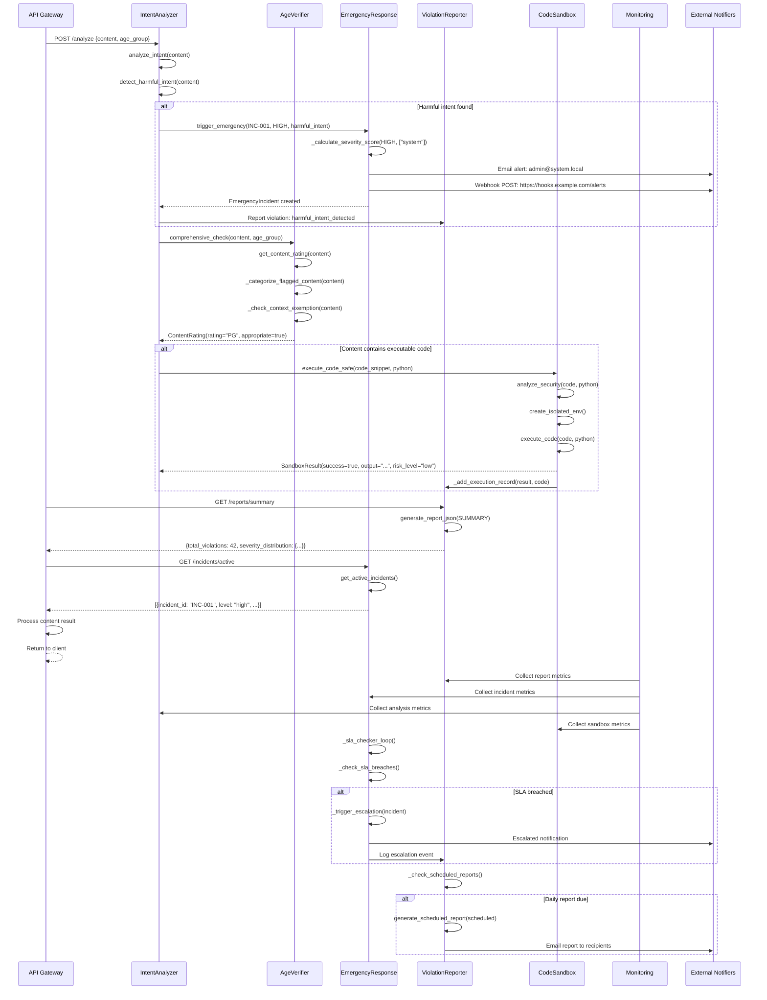
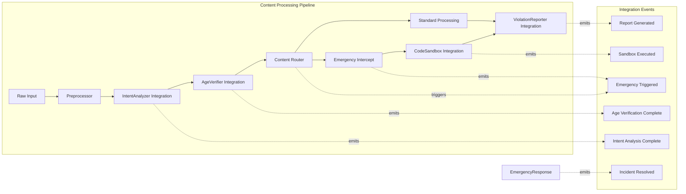
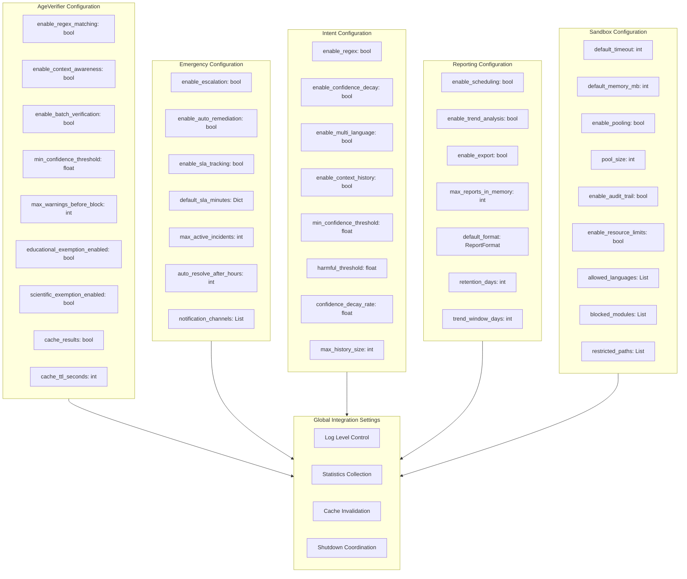

# Advanced Features Integration

## Cross-Module Component Diagram

The advanced features module integrates with core system components, API layer, monitoring infrastructure, and external compliance systems.

```mermaid
componentDiagram
    package "Core System" {
        component "Rules Engine" as RE
        component "Content Pipeline" as CP
        component "Event Bus" as EB
    }

    package "Advanced Module" {
        component "IntentAnalyzer" as IA
        component "AgeVerifier" as AV
        component "EmergencyResponse" as ER
        component "ViolationReporter" as VR
        component "CodeSandbox" as CS
    }

    package "API Layer" {
        component "REST API" as API
        component "WebSocket" as WS
        component "GraphQL" as GQL
    }

    package "Monitoring" {
        component "Metrics Collector" as MC
        component "Alert Manager" as AM
        component "Dashboard" as DB
    }

    package "External Systems" {
        component "Email Service" as ES
        component "SMS Gateway" as SMS
        component "Webhook Endpoint" as WE
        component "Compliance DB" as CDB
    }

    RE --> IA : Content for intent analysis
    RE --> AV : Content for age verification
    CP --> IA : Streaming content
    CP --> AV : Batch content
    IA --> ER : Harmful intent detected
    AV --> ER : Age violation detected
    ER --> VR : Incident report
    CS --> VR : Execution audit record
    VR --> EB : Report events
    IA --> EB : Analysis events
    AV --> EB : Verification events

    API --> VR : Report query
    API --> CS : Code execution request
    API --> ER : Incident management
    WS --> ER : Real-time incident updates
    GQL --> VR : Aggregated queries

    MC --> VR : Report metrics
    MC --> ER : Incident metrics
    MC --> IA : Analysis metrics
    AM --> ER : Escalation alerts
    DB --> VR : Dashboard data
    DB --> ER : Incident dashboard

    ER --> ES : Email notifications
    ER --> SMS : SMS alerts
    ER --> WE : Webhook payloads
    VR --> CDB : Compliance records
    VR --> ES : Scheduled report emails
```

## Cross-Module Advanced Feature Usage

The following sequence diagram shows how multiple advanced components work together to handle a complex content safety scenario.



## Integration with Core Pipeline

The advanced module integrates into the core content processing pipeline at multiple interception points.



## Configuration Management

Each component exposes its configuration through dedicated config dataclasses, supporting runtime updates and reset capabilities.



## Integration API Reference

| Method | Component | Description | Parameters |
|--------|-----------|-------------|------------|
| `comprehensive_check()` | AgeVerifier | Full content age analysis | content, target_age |
| `trigger_emergency()` | EmergencyResponse | Create incident | incident_id, level, description, category |
| `comprehensive_analysis()` | IntentAnalyzer | Full intent analysis | content |
| `report_violation()` | ViolationReporter | Log a violation | violation_id, rule_id, severity, details |
| `execute_code_safe()` | CodeSandbox | Secure code execution | code, language |
| `resolve_emergency()` | EmergencyResponse | Close incident | incident_id, notes, resolved_by |
| `get_dashboard_data()` | ViolationReporter | Real-time stats | none |
| `get_incident_stats()` | EmergencyResponse | Incident metrics | none |
| `get_execution_statistics()` | CodeSandbox | Sandbox metrics | none |
| `get_analysis_statistics()` | IntentAnalyzer | Analysis metrics | none |

## Error Handling Strategy

The advanced module implements a layered error handling strategy that ensures failures in one component do not cascade to others.

```mermaid
flowchart TD
    A[Component Error] --> B{Error Type}
    B -->|Configuration| C[Fallback to Defaults]
    B -->|Timeout| D[Retry with Backoff]
    B -->|Data Validation| E[Return Error Result]
    B -->|Resource Exhaustion| F[Graceful Degradation]
    B -->|Critical Failure| G[Emergency Trigger]

    C --> H[Log Warning]
    D --> I[Max 3 Retries]
    I --> J{Retry Success?}
    J -->|Yes| K[Continue Processing]
    J -->|No| L[Return Fallback Result]
    E --> M[Return Error to Caller]
    F --> N[Disable Non-Essential Features]
    G --> O[EmergencyResponse Handler]

    H --> P[Continue with Defaults]
    K --> Q[Normal Flow]
    L --> M
    M --> R[Caller Handles Error]
    N --> S[Resource-Frugal Mode]
    O --> T[Full Incident Response]
