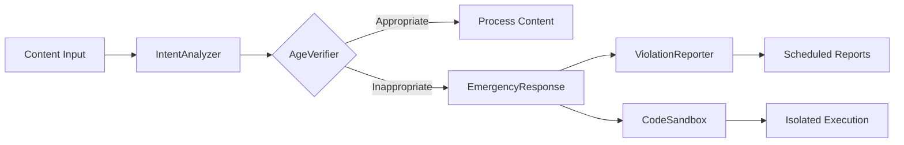

# Advanced Features Module

## Overview

The **Advanced Features Module** provides intelligent content safety capabilities including age verification, emergency response coordination, intent recognition, violation reporting, and secure code sandboxing. These components form the safety boundary for the rules engine.

### Components

| Component | Class | Responsibility |
|-----------|-------|----------------|
| Age Verification | `AgeVerifier` | Classifies content by age-group appropriateness, detects restricted keywords, applies regex-based pattern matching, and provides educational/scientific context exemptions |
| Emergency Response | `EmergencyResponse` | Coordinates incident response for critical violations, manages escalation chains, SLA tracking, multi-channel notifications (log, email, SMS, webhook), and auto-remediation |
| Intent Analysis | `IntentAnalyzer` | Analyzes user intent across 15+ categories (harmful, information-seeking, creative, educational), detects harmful intent patterns, applies confidence decay, and supports multi-language detection |
| Violation Reporting | `ViolationReporter` | Aggregates rule violations, generates templated reports (summary, detailed, executive, compliance, dashboard, audit), supports scheduled report delivery, and computes trend analysis |
| Code Sandbox | `CodeSandbox` | Executes untrusted code in isolated environments with resource limits, risk pattern analysis across 5+ languages, pool management, and full audit trail |

## Class Diagram

```mermaid
classDiagram
    class AgeVerifier {
        +AgeVerificationConfig config
        +Dict age_restricted_keywords
        +Dict regex_patterns
        +Dict statistics
        +comprehensive_check(content, target_age) ContentRating
        +verify_content_age_appropriateness(content, age_group) bool
        +get_content_rating(content) str
        +batch_verify(contents) List[ContentRating]
    }
    class AgeVerificationConfig {
        +bool enable_regex_matching
        +bool enable_context_awareness
        +float min_confidence_threshold
        +int max_warnings_before_block
        +bool educational_exemption_enabled
    }
    class ContentRating {
        +string rating
        +string age_group
        +List[string] warnings
        +bool is_appropriate
        +float confidence_score
        +Dict categories_flagged
    }
    class AgeGroup {
        +CHILD
        +TEEN
        +ADULT
        +ALL_AGES
        +PRESCHOOL
    }
    class EmergencyResponse {
        +EmergencyConfig config
        +Dict active_incidents
        +Dict response_handlers
        +List emergency_contacts
        +trigger_emergency(incident_id, level, description) EmergencyIncident
        +resolve_emergency(incident_id, notes) bool
        +register_handler(level, handler) void
        +get_incident_stats() Dict
    }
    class EmergencyIncident {
        +string incident_id
        +EmergencyLevel level
        +string description
        +datetime timestamp
        +bool resolved
        +IncidentCategory category
        +float severity_score
    }
    class EmergencyConfig {
        +bool enable_escalation
        +bool enable_auto_remediation
        +bool enable_sla_tracking
        +Dict default_sla_minutes
        +int max_active_incidents
    }
    class IntentAnalyzer {
        +IntentConfig config
        +List harmful_intents
        +Dict intent_patterns
        +Dict regex_intent_patterns
        +List context_history
        +comprehensive_analysis(content) IntentAnalysis
        +detect_harmful_intent(content) bool
        +analyze_intent(content) Dict
        +batch_analyze(contents) List[IntentAnalysis]
    }
    class IntentAnalysis {
        +string primary_intent
        +float confidence
        +Dict secondary_intents
        +bool is_harmful
        +List matched_patterns
        +List language_hints
    }
    class ViolationReporter {
        +ReportingConfig config
        +Dict reports
        +Dict scheduled_reports
        +List trend_history
        +report_violation(violation_id, rule_id, severity) ViolationReport
        +generate_report_json(template) Dict
        +compute_trend_analysis() Dict
        +get_dashboard_data() Dict
    }
    class ViolationReport {
        +string violation_id
        +string rule_id
        +string severity
        +datetime timestamp
        +Dict details
        +bool resolved
    }
    class CodeSandbox {
        +SandboxConfig config
        +Dict risk_patterns
        +Dict pool
        +List execution_history
        +execute_code(code, language) SandboxResult
        +analyze_security(code, language) Dict
        +create_isolated_env() string
        +execute_code_safe(code, language) SandboxResult
    }
    class SandboxResult {
        +bool success
        +string output
        +List errors
        +float execution_time
        +int exit_code
        +string risk_level
    }
    AgeVerifier --> AgeVerificationConfig
    AgeVerifier --> ContentRating
    AgeVerifier --> AgeGroup
    EmergencyResponse --> EmergencyConfig
    EmergencyResponse --> EmergencyIncident
    IntentAnalyzer --> IntentAnalysis
    ViolationReporter --> ViolationReport
    CodeSandbox --> SandboxResult
```



## Quick Start Examples

```python
from src.advanced.age_verification import AgeVerifier
from src.advanced.emergency_response import EmergencyResponse
from src.advanced.intent_recognition import IntentAnalyzer
from src.advanced.reporting_system import ViolationReporter
from src.advanced.sandbox import CodeSandbox

# Age Verification
verifier = AgeVerifier()
rating = verifier.comprehensive_check("Educational content about biology", "child")
print(f"Safe: {rating.is_appropriate}, Rating: {rating.rating}")

# Intent Analysis
analyzer = IntentAnalyzer()
analysis = analyzer.comprehensive_analysis("How do I build a web application?")
print(f"Intent: {analysis.primary_intent}, Harmful: {analysis.is_harmful}")

# Emergency Response
responder = EmergencyResponse()
incident = responder.trigger_emergency(
    incident_id="INC-001",
    level=EmergencyLevel.HIGH,
    description="Critical rule violation detected",
    category=IncidentCategory.SECURITY
)
print(f"Incident: {incident.incident_id}, Score: {incident.severity_score}")

# Violation Reporting
reporter = ViolationReporter()
reporter.report_violation("V-001", "rule_age_check", "high", {"content": "bad"})
dashboard = reporter.get_dashboard_data()
print(f"Total: {dashboard['total_all_time']}")

# Code Sandbox
sandbox = CodeSandbox()
result = sandbox.execute_code_safe("print('hello safe world')", "python")
print(f"Safe: {result.success}, Output: {result.output}")
```

## Use Case Table

| Scenario | Component | Method | Outcome |
|----------|-----------|--------|---------|
| User uploads content with PII | AgeVerifier | `comprehensive_check()` | Content flagged with warnings |
| Intent matches harmful pattern | IntentAnalyzer | `detect_harmful_intent()` | `is_harmful=True` returned |
| Critical security violation | EmergencyResponse | `trigger_emergency()` | Incident created, handlers notified |
| Daily compliance report | ViolationReporter | `generate_report_json()` | Structured JSON report generated |
| Untrusted code execution | CodeSandbox | `execute_code_safe()` | Code analyzed and executed in sandbox |
| Batch content verification | AgeVerifier | `batch_verify()` | List of ContentRating results |
| SLA breach detected | EmergencyResponse | `_check_sla_breaches()` | Escalation triggered automatically |
| Trend analysis for violations | ViolationReporter | `compute_trend_analysis()` | Period-over-period violation trends |

## Architecture Flow



## Configuration

All components support YAML/JSON configuration loading. Default configurations provide sensible defaults for production use. Component-specific configuration objects (`AgeVerificationConfig`, `EmergencyConfig`, `IntentConfig`, `ReportingConfig`, `SandboxConfig`) allow fine-grained control over behavior such as timeouts, thresholds, caching, and feature toggles.
