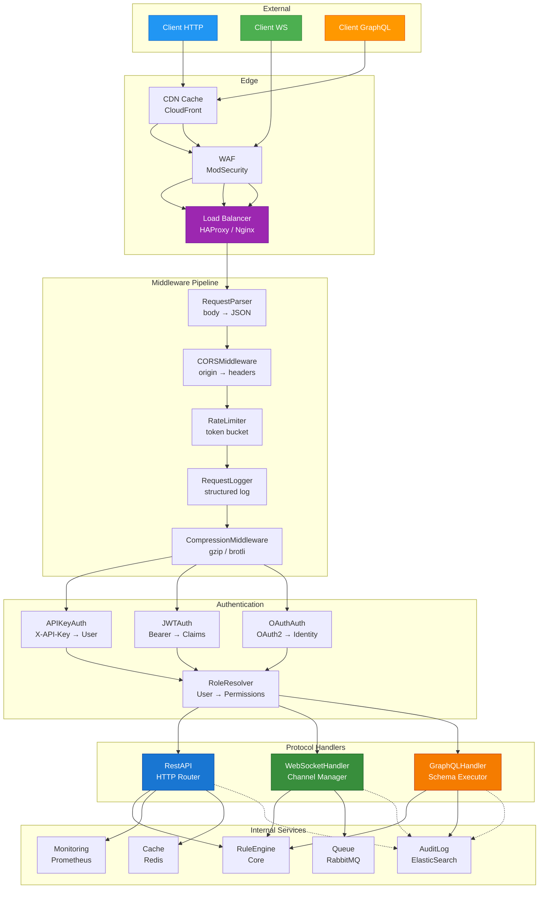
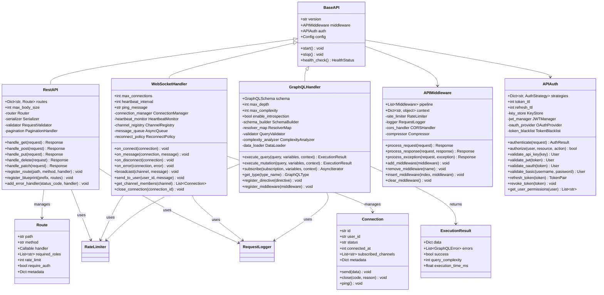
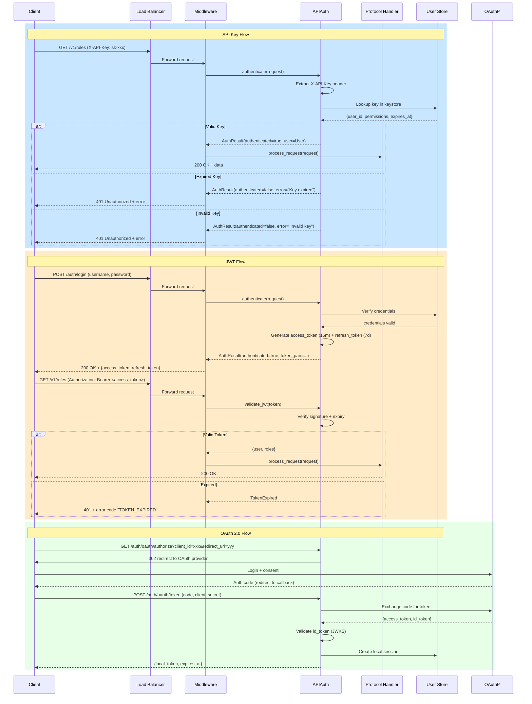
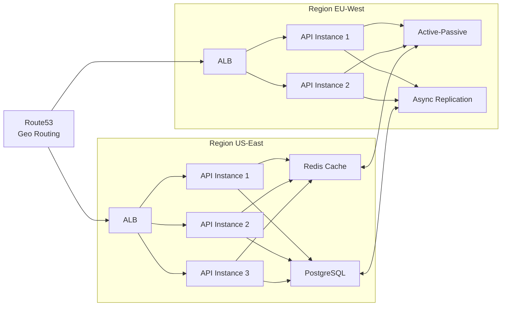

# API Architecture

## System Component Diagram

The API layer sits between external clients and the Core rule engine. All traffic flows through a load balancer, then through the middleware pipeline, authentication, and finally to the appropriate protocol handler.



## Class Diagram



## Authentication Flow



## Deployment Topology



## Middleware Pipeline Order

| Position | Middleware | Purpose | Skip Condition |
|---|---|---|---|
| 1 | RequestIDInjector | Adds unique trace ID to every request | None |
| 2 | CORSMiddleware | Validates origin, sets CORS headers | OPTIONS requests short-circuit |
| 3 | BodyParser | Parses JSON, form, multipart bodies | GET/HEAD/DELETE without body |
| 4 | RateLimiter | Token bucket rate limiting | Internal service calls |
| 5 | Authenticator | Routes to APIAuth strategy | Public endpoints only |
| 6 | RequestLogger | Structured logging with timing | Health check endpoints |
| 7 | Compressor | gzip/brotli response compression | Small responses (< 1KB) |
| 8 | ResponseFormatter | Standardizes response envelope | Stream/SSE responses |

## Error Handling Strategy

All errors follow a consistent envelope format:

```json
{
  "error": {
    "code": "VALIDATION_ERROR",
    "message": "Request body validation failed",
    "details": [
      {"field": "age", "reason": "must be positive integer", "value": -5}
    ],
    "trace_id": "req-abc123",
    "timestamp": "2026-07-24T12:00:00Z"
  }
}
```

Errors propagate through the middleware in reverse order — innermost handler wraps the exception, outermost formats the response. Unhandled exceptions are caught by a global `ExceptionMiddleware` that logs the full stack trace and returns a sanitized 500 response.

## Security Considerations

- All traffic must use TLS 1.3 with HSTS preload
- API keys are stored as bcrypt hashes, never in plaintext
- JWT tokens use RS256 with a rotating signing key pair
- Rate limiting is applied per-user and per-IP simultaneously
- SQL injection prevention via parameterized queries in all resolvers
- GraphQL depth limiting prevents recursive query bombs
- WebSocket origins are validated against an allowlist