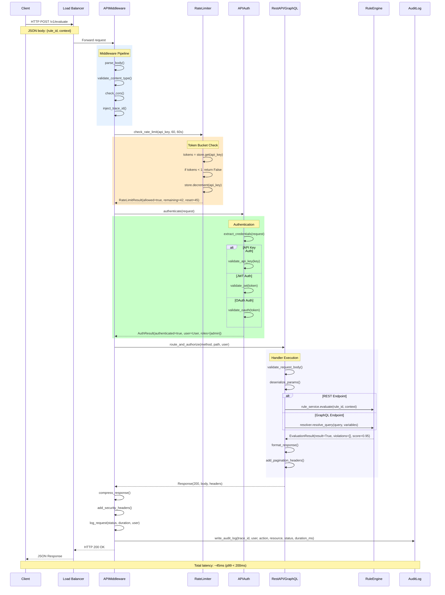
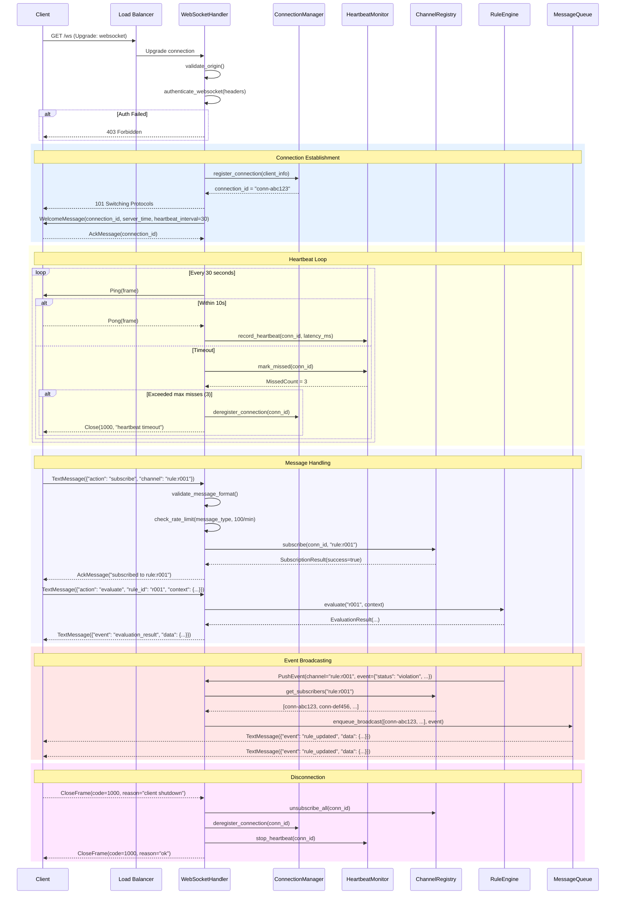
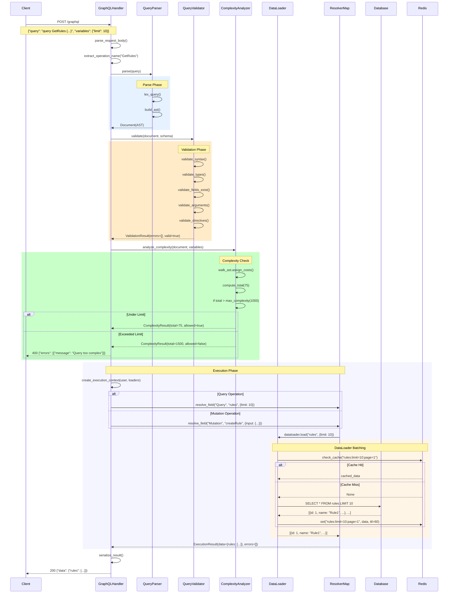
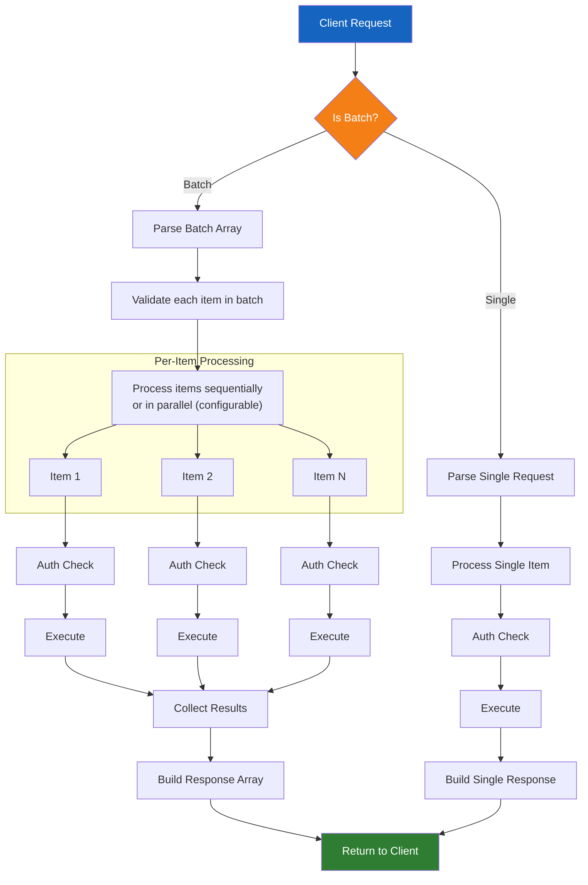
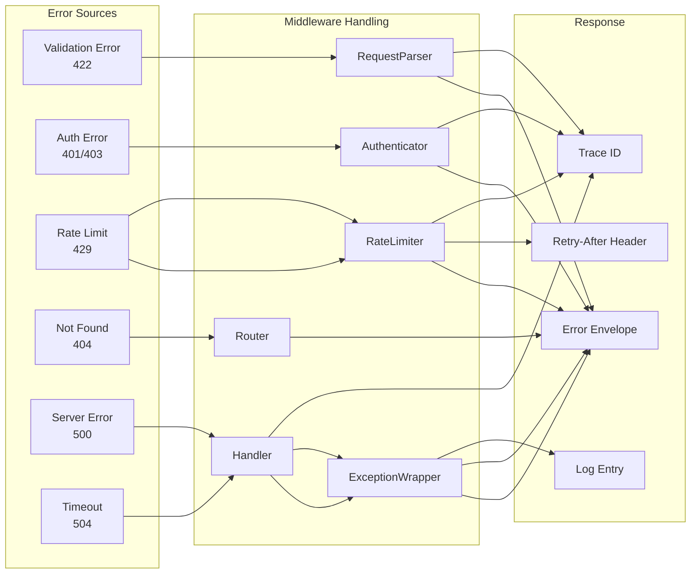

# API Data Flow

## HTTP Request Lifecycle

The following sequence diagram traces a complete HTTP request from the moment it reaches the server until the response is returned to the client. Every request passes through the middleware pipeline, authentication, rate limiting, and finally the handler.

## WebSocket Connection Lifecycle

## GraphQL Query Resolution

## Request Batching Flow

## Error Propagation

