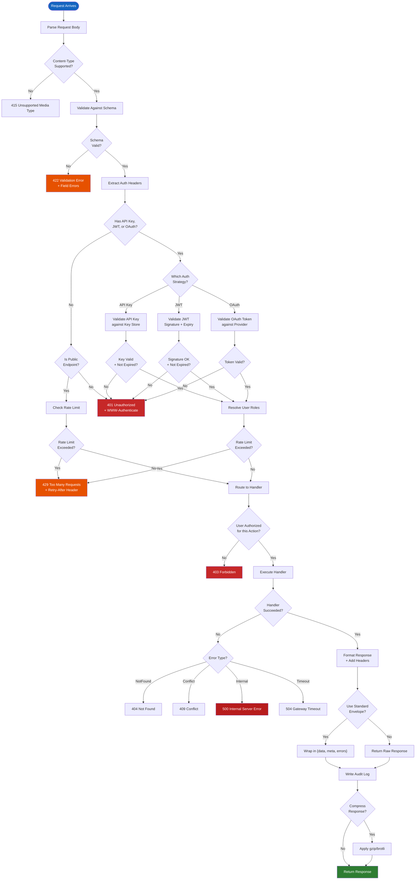
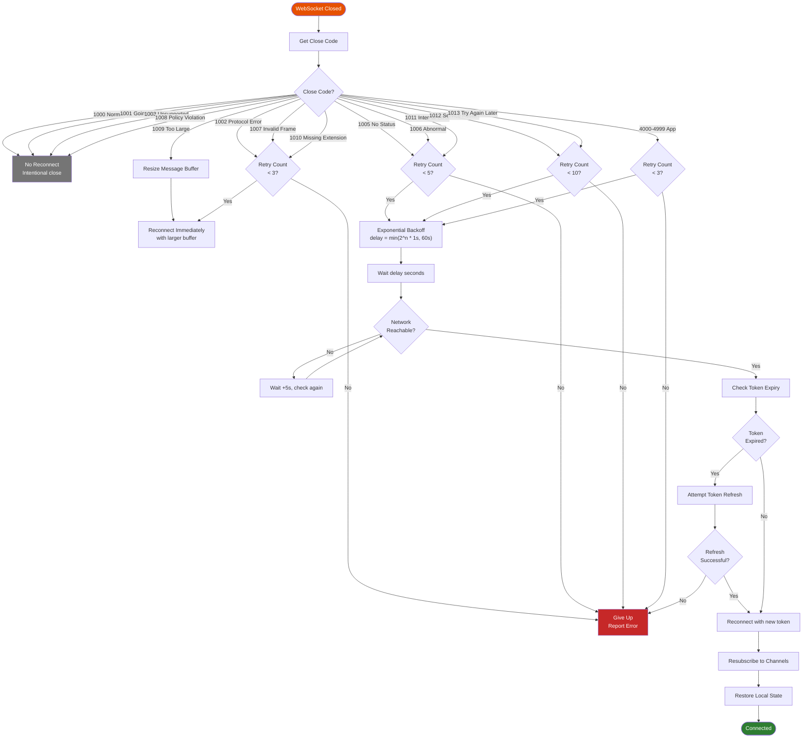
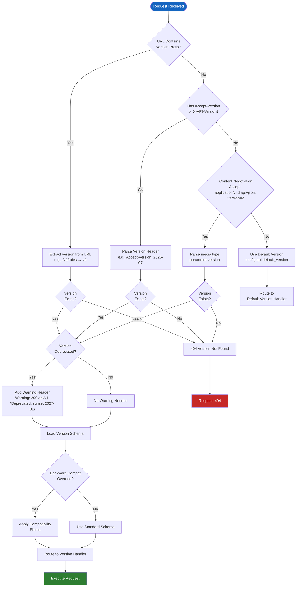
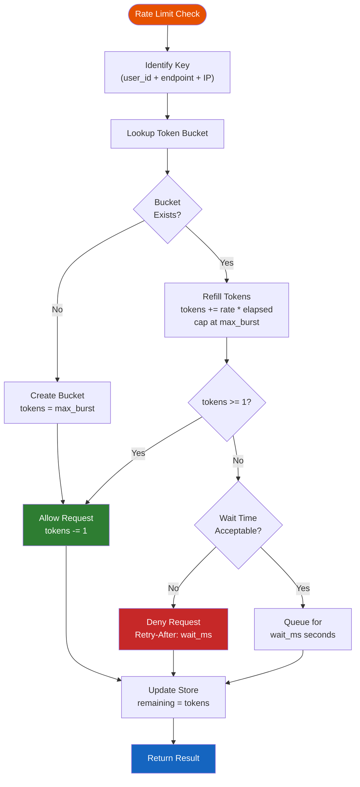
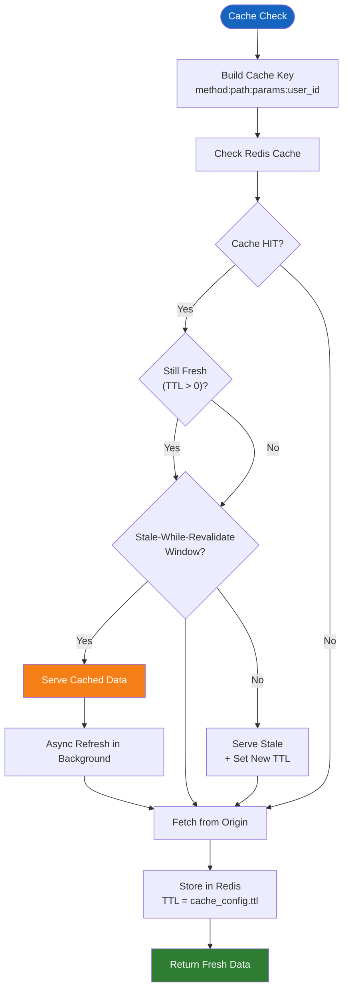

# API Logic & Decision Making

## Request Processing Flowchart

Every incoming request follows a deterministic path through validation, authentication, rate limiting, routing, response formatting, and audit logging. The flowchart below captures branching decisions at each stage.

## WebSocket Reconnection Strategy

When a WebSocket connection drops, the client-side handler follows a decision tree to determine the reconnection approach based on the close code, the number of previous attempts, and the current network state.

## API Version Resolution Logic

The API supports multiple concurrent versions. When a request arrives, the system determines which version to use based on URL prefix, custom headers, or content negotiation.

## Rate Limiting Decision Logic

## Caching Strategy

## Content Negotiation

When a client sends an HTTP request, the API determines the response format through a multi-step negotiation process:

1. **Parse Accept header**: Extract weighted media types (`application/json; q=0.9`, `text/html; q=0.5`)
2. **Filter supported types**: Remove types the API cannot produce
3. **Weight comparison**: Select the type with the highest quality factor
4. **Fallback chain**: If no match, try `application/json`; if JSON fails, use `text/plain`

The negotiated format affects serialization (JSON, XML, YAML, MsgPack), compression (none, gzip, brotli), and schema validation (strict vs lenient mode for requested version).

## Timeout Handling

| Stage | Timeout | Action on Timeout |
|---|---|---|
| Request parsing | 5s | 400 Bad Request |
| Authentication | 3s | 503, circuit breaker |
| Rate limit check | 1s | Bypass, log warning |
| Handler execution | 30s | 504, kill goroutine/coroutine |
| Response serialization | 5s | 500, log error |
| Audit log write | 2s | Async fire-and-forget |

Configurable via the `API_TIMEOUTS` environment variable as a JSON map of stage-to-seconds pairs. Separate read and write timeouts for database-accessing handlers.