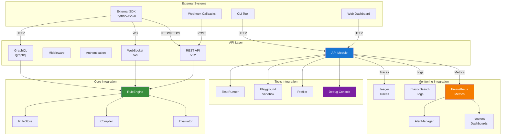
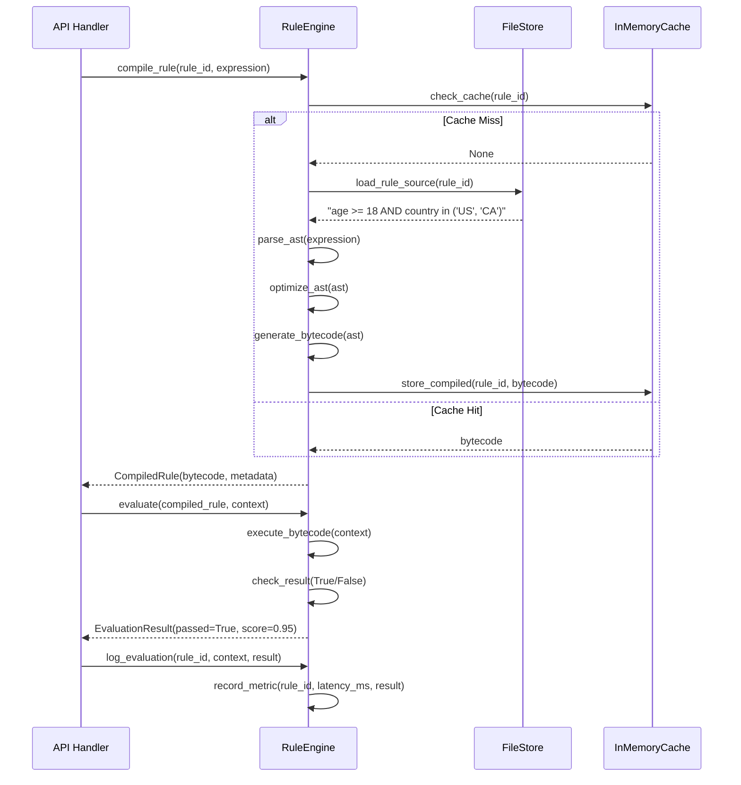
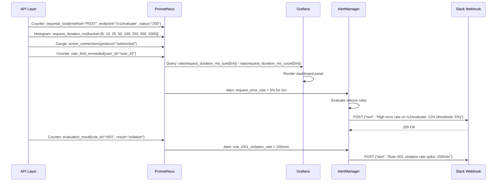
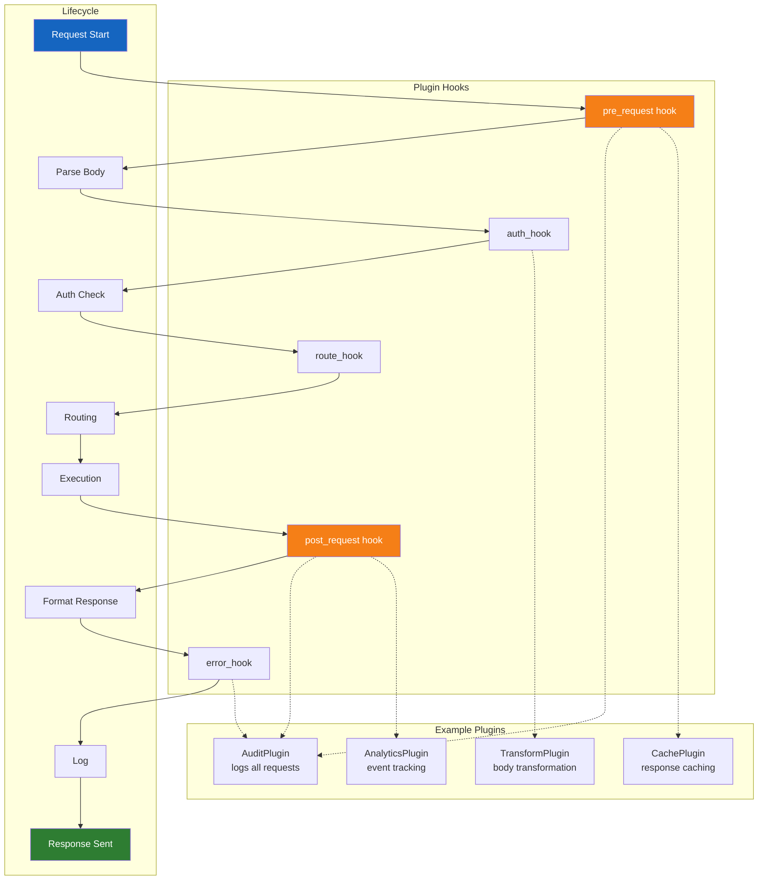
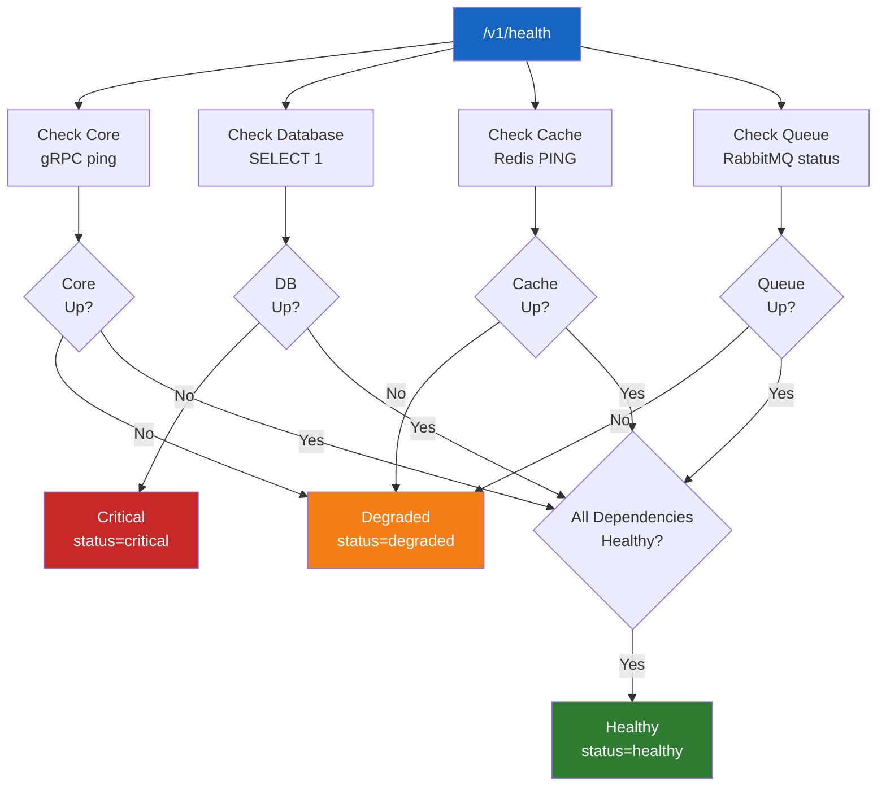

# API Integration

## System Integration Overview

The API module integrates with Core (rule evaluation engine), Monitoring (metrics and observability), and Tools (debugging and diagnostics). Each integration follows an adapter pattern to maintain loose coupling.



## External SDK Integration Sequence

The following sequence diagram traces a call from an external SDK through the API to internal services and back. It shows how middleware, authentication, and handlers collaborate to produce a response.

```mermaid
sequenceDiagram
    participant SDK as External SDK
    participant LB as Load Balancer
    parserWorker as Middleware
    actor Auth as APIAuth
    participant Rest as RestAPI
    participant RuleSvc as RuleService
    participant Cache as Redis Cache
    participant DB as PostgreSQL
    participant Mon as Monitoring

    SDK->>LB: POST /v1/evaluate
    Note over SDK,LB: {"rule_id": "r001", "context": {"age": 25, "country": "US"}}

    LB->>parserWorker: Forward request

    rect rgb(230, 242, 255)
        Note over parserWorker,parserWorker: Middleware Pipeline
        parserWorker->>parserWorker: parse_body() → JSON
        parserWorker->>parserWorker: validate_content_type() → application/json
        parserWorker->>parserWorker: inject_trace_id() → req_trace_001
        parserWorker->>parserWorker: check_cors() → origin allowed
    end

    parserWorker->>Auth: authenticate(request)
    Note over parserWorker,Auth: Extract: Authorization: Bearer <jwt>

    rect rgb(200, 255, 200)
        Note over Auth,Auth: JWT Validation
        Auth->>Auth: decode_jwt(token)
        Auth->>Auth: verify_rs256_signature(jwks)
        Auth->>Auth: check_expiry(iat, exp)
        Auth->>Auth: extract_claims(sub=user_42, roles=[admin])
        Auth-->>parserWorker: AuthResult(authenticated=true, user=user_42)
    end

    parserWorker->>parserWorker: check_rate_limit(user_42, 60, 60s)
    Note over parserWorker,parserWorker: Remaining: 42, Reset: 45s

    parserWorker->>Rest: route("POST", "/v1/evaluate")
    Note over parserWorker,Rest: Authorize: user_42 has "evaluate" permission

    Rest->>RuleSvc: evaluate("r001", {"age": 25, "country": "US"})

    rect rgb(245, 245, 255)
        Note over RuleSvc,DB: Rule Evaluation
        RuleSvc->>Cache: check_rule_cache("r001")
        Cache-->>RuleSvc: miss
        RuleSvc->>DB: SELECT * FROM rules WHERE id = 'r001'
        DB-->>RuleSvc: {id: "r001", expression: "age >= 18", ...}
        RuleSvc->>RuleSvc: compile_expression("age >= 18")
        RuleSvc->>RuleSvc: evaluate_expression({"age": 25})
        RuleSvc->>RuleSvc: result = True
        RuleSvc->>Cache: set_rule_cache("r001", rule_data, ttl=300)
    end

    RuleSvc-->>Rest: EvaluationResult(passed=true, violations=[], score=0.95)

    Rest->>Rest: format_response()
    Note over Rest,Rest: {"data": {"passed": true, "score": 0.95, "rule_id": "r001"}}

    Rest-->>parserWorker: Response(200, body, headers)
    parserWorker->>parserWorker: compress_response(gzip)
    parserWorker->>parserWorker: add_security_headers(HSTS, CSP, X-Frame-Options)
    parserWorker-->>LB: HTTP 200 OK

    parsersWorker->>Mon: record_metrics()
    Note over parsersWorker,Mon: +1 request, 45ms latency, 200 status

    LB-->>SDK: 200 OK + JSON body

    Note over SDK,Mon: Total round-trip: 45ms
```

## Direct Core Integration



## Monitoring Integration



## Debugging Tools Integration

```mermaid
sequenceDiagram
    participant Dev as Developer
    participant Debug as DebugConsole
    participant API as API
    participant Core as RuleEngine
    participant Trace as Jaeger

    Dev->>Debug: Open debug console
    Debug->>Debug: List active endpoints

    Dev->>Debug: request POST /v1/evaluate {"rule_id": "r001", "context": {"age": 25}}
    Debug->>API: Forward request with debug=true flag
    API->>API: Add X-Debug: true header

    API->>Core: evaluate("r001", context)

    rect rgb(255, 245, 230)
        Note over Core,Core: Debug Mode
        Core->>Core: step_through_evaluation()
        Core->>Core: show_intermediate_values()
        Core-->>Debug: {steps: [
            {line: "age >= 18", input: {age: 25}, output: true},
            {line: "country in list", input: {country: "US"}, output: true}
        ]}
    end

    API-->>Debug: {result: true, debug: {steps: [...], timing_ms: {parse: 2, optimize: 1, execute: 0.5}}}

    Dev->>Dev: Analyze debug output

    Trace->>Trace: Record trace
    Note over Trace,Trace: Trace ID: trace_001, Span: evaluate_rule, Duration: 3.5ms

    Dev->>Trace: Query trace_001
    Trace-->>Dev: Full span tree
```

## Plugin / Extension API

The API module exposes a plugin system that allows external extensions to hook into the request lifecycle:



## Integration Configuration

```python
INTEGRATION_CONFIG = {
    "core": {
        "host": "localhost",
        "port": 50051,
        "protocol": "grpc",
        "timeout_ms": 5000,
        "retry_policy": {"max_retries": 3, "backoff_ms": [100, 500, 1000]}
    },
    "monitoring": {
        "metrics_port": 9090,
        "push_interval_s": 15,
        "exporters": ["prometheus", "datadog"],
        "labels": {"service": "api", "version": "v2", "env": "production"}
    },
    "tools": {
        "debug_console": {"enabled": True, "allowed_roles": ["admin", "developer"]},
        "profiling": {"enabled": True, "sample_rate": 0.1},
        "playground": {"enabled": True, "sandbox": True, "max_execution_ms": 5000}
    },
    "cache": {
        "backend": "redis",
        "host": "redis-cluster.example.com",
        "port": 6379,
        "default_ttl_s": 300,
        "max_memory_mb": 512
    }
}
```

## Health Check Dependencies

