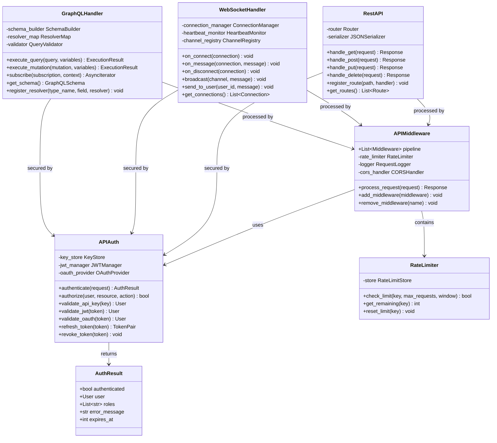

# API Module

## Overview

The API module provides three protocol endpoints — REST, WebSocket, and GraphQL — secured by APIAuth and processed through APIMiddleware. Each component is independently deployable and integrates with the Core rule engine for real-time evaluation.

### Components

- **RestAPI** — HTTP/1.1 RESTful endpoints with JSON serialization, content negotiation, and pagination
- **WebSocketHandler** — Bidirectional real-time communication with reconnection, heartbeats, and channel management
- **GraphQLHandler** — Schema-first GraphQL endpoint supporting queries, mutations, and subscriptions
- **APIAuth** — Multi-strategy authentication (API key, JWT, OAuth 2.0) with role-based access control
- **APIMiddleware** — Request preprocessing pipeline: rate limiting, request logging, CORS, body parsing, compression

## Class Diagram



## Quick Start Examples

### REST API

```python
import requests

# API key authentication
response = requests.get(
    "https://api.example.com/v1/rules",
    headers={"X-API-Key": "your-api-key"},
    params={"page": 1, "limit": 50}
)
assert response.status_code == 200
data = response.json()

# JWT authentication
login_resp = requests.post(
    "https://api.example.com/auth/login",
    json={"username": "admin", "password": "secret"}
)
token = login_resp.json()["access_token"]
response = requests.post(
    "https://api.example.com/v1/evaluate",
    headers={"Authorization": f"Bearer {token}"},
    json={"rule_id": "r001", "context": {"age": 25}}
)
```

### WebSocket

```python
import websockets
import asyncio

async def listen():
    async with websockets.connect(
        "wss://api.example.com/ws",
        extra_headers={"Authorization": "Bearer token"}
    ) as ws:
        await ws.send(json.dumps({
            "action": "subscribe",
            "channel": "rule-events"
        }))
        async for message in ws:
            event = json.loads(message)
            print(f"Rule {event['rule_id']}: {event['status']}")

asyncio.run(listen())
```

### GraphQL

```graphql
# Query
query GetRule($id: ID!) {
  rule(id: $id) {
    id
    name
    expression
    priority
    createdAt
    metrics {
      evaluations
      violations
    }
  }
}

# Mutation
mutation CreateRule($input: RuleInput!) {
  createRule(input: $input) {
    id
    name
    status
  }
}

# Subscription
subscription OnRuleEvaluated {
  ruleEvaluated {
    ruleId
    result
    timestamp
  }
}
```

## API Reference Table

| Endpoint | Method | Auth | Description |
|---|---|---|---|
| `/v1/rules` | GET | API Key, JWT | List all rules with pagination |
| `/v1/rules/:id` | GET | API Key, JWT | Get rule by ID |
| `/v1/rules` | POST | JWT (admin) | Create new rule |
| `/v1/rules/:id` | PUT | JWT (admin) | Update existing rule |
| `/v1/rules/:id` | DELETE | JWT (admin) | Delete rule |
| `/v1/evaluate` | POST | API Key, JWT | Evaluate a rule against context |
| `/v1/evaluate/batch` | POST | JWT | Batch evaluate rules |
| `/v1/metrics` | GET | API Key | Get API usage metrics |
| `/v1/health` | GET | None | Health check |
| `/ws` | WS | JWT | WebSocket connection |
| `/graphql` | POST | API Key, JWT | GraphQL endpoint |
| `/auth/login` | POST | None | Get JWT token |
| `/auth/refresh` | POST | JWT | Refresh JWT token |

## Rate Limits

| Tier | Requests/min | Burst | Cost/mo |
|---|---|---|---|
| Free | 60 | 10 | $0 |
| Pro | 600 | 100 | $29 |
| Enterprise | 6000 | 1000 | Custom |

## Error Codes

| Code | HTTP Status | Description |
|---|---|---|
| `AUTH_EXPIRED` | 401 | Token expired |
| `AUTH_INVALID` | 401 | Invalid credentials |
| `RATE_LIMITED` | 429 | Too many requests |
| `VALIDATION_ERROR` | 422 | Request body invalid |
| `NOT_FOUND` | 404 | Resource not found |
| `INTERNAL_ERROR` | 500 | Server error |
| `WS_CLOSED` | 1000 | Normal WebSocket close |

## Versioning

The API uses URL-based versioning (`/v1/`, `/v2/`). Deprecated versions receive a `Warning: deprecation` header and a 6-month sunset notice in the response body. Backward-incompatible changes trigger a minor version bump; additive changes do not.

## Configuration

```python
API_CONFIG = {
    "rate_limit": {"default": 60, "burst": 10},
    "auth": {"jwt_ttl": 3600, "refresh_ttl": 86400},
    "cors": {"origins": ["*"], "methods": ["GET", "POST"]},
    "websocket": {"max_connections": 10000, "heartbeat": 30},
    "graphql": {"max_depth": 7, "max_complexity": 1000}
}
```

## Testing

```bash
# Run API tests
pytest tests/api/ -v

# Load test with locust
locust -f tests/load/locustfile.py --host https://api.example.com

# WebSocket test
python tests/test_ws.py --url wss://api.example.com/ws --connections 50
```

## Dependencies

- FastAPI (REST routing)
- Starlette (middleware)
- GraphQL-core (schema execution)
- websockets (WS server)
- PyJWT (token handling)
- httpx (async HTTP client)