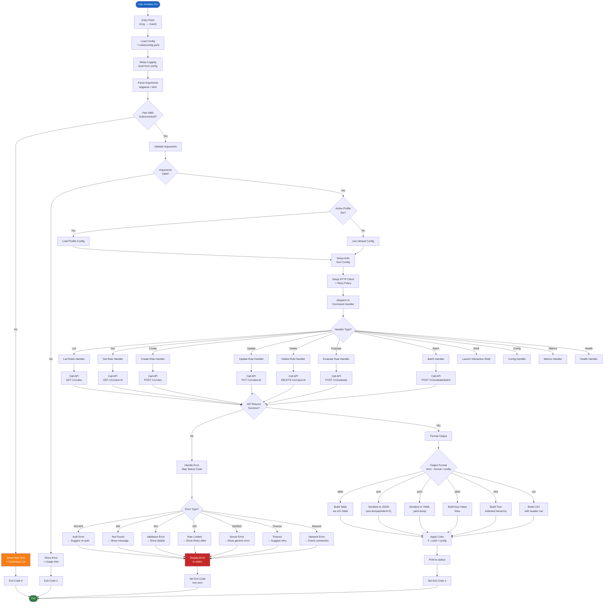
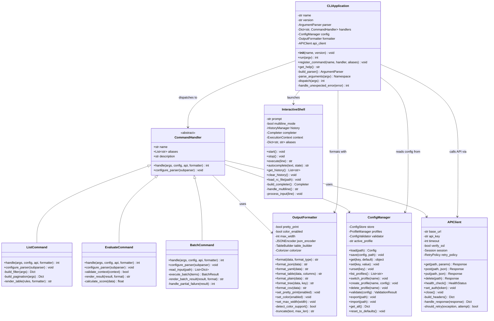
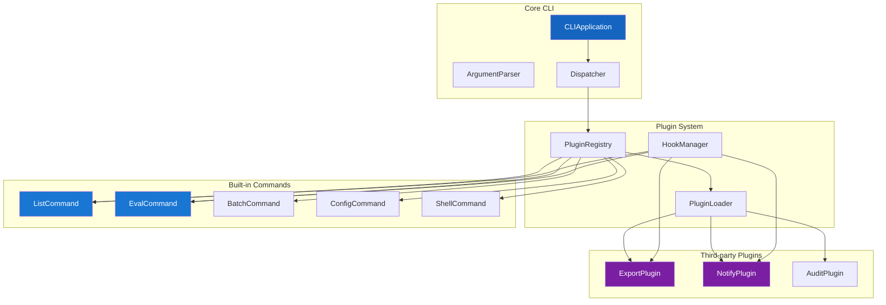

# CLI Architecture

## Command Flow

All CLI commands follow a consistent path from user input to displayed output. The flowchart below shows the complete lifecycle of a command: parsing, dispatch, execution, and display.



## Class Diagram



## Interactive Shell State Machine

```mermaid
stateDiagram-v2
    [*] --> Idle : start shell
    Idle --> ReadingInput : user types text
    ReadingInput --> CheckingPrefix : enter pressed
    CheckingPrefix --> MultilineMode : line ends with \
    CheckingPrefix --> SingleLineMode : line does not end with \
    MultilineMode --> ReadingInput : continue reading
    SingleLineMode --> ParsingCommand : parse line
    ParsingCommand --> Validating : command recognized
    ParsingCommand --> ShowHelp : "help" or "?"
    ParsingCommand --> UnknownCommand : command not recognized
    UnknownCommand --> Idle : show error, return to prompt
    Validating --> Executing : arguments valid
    Validating --> ValidationError : arguments invalid
    ValidationError --> Idle : show error, return to prompt
    Executing --> Formatting : execution complete
    Executing --> ExecutionError : execution failed
    ExecutionError --> Idle : show error, return to prompt
    Formatting --> Displaying : format prepared
    Displaying --> Idle : output displayed
    ShowHelp --> Idle : help text displayed

    Idle --> Completion : tab pressed
    Completion --> Idle : cycle suggestions
    Idle --> HistorySearch : up/down arrows
    HistorySearch --> Idle : select from history

    Idle --> Exiting : "exit", "quit", or Ctrl+D
    Exiting --> [*] : clean shutdown

    note right of Idle : Prompt: "rules> "
    note right of MultilineMode : Prompt becomes "... "
    note right of Completion : Autocomplete commands,<br/>rule IDs, file paths
```

## Plugin Architecture



## Directory Structure

```
src/cli/
├── __init__.py
├── cli.py                  # CLIApplication entry point
├── output_formatter.py     # OutputFormatter class
├── interactive_shell.py    # InteractiveShell class
├── config_commands.py      # ConfigCommands class
├── batch_processor.py      # BatchProcessor class
├── commands/
│   ├── __init__.py
│   ├── base.py             # CommandHandler base class
│   ├── list.py
│   ├── get.py
│   ├── create.py
│   ├── update.py
│   ├── delete.py
│   ├── evaluate.py
│   ├── batch.py
│   ├── config.py
│   └── shell.py
├── utils/
│   ├── __init__.py
│   ├── api_client.py       # APIClient HTTP wrapper
│   ├── config_manager.py   # ConfigManager
│   ├── colorizer.py        # Terminal color support
│   └── table_builder.py    # ASCII table construction
└── plugins/
    └── __init__.py          # Plugin discovery hooks
```

## Configuration Schema

```yaml
# ~/.rules/config.yaml
version: "2.0"
profiles:
  default:
    api_endpoint: "http://localhost:8000/v1"
    api_key: ""
    output_format: "table"
    color: true
    timeout: 30
    verify_ssl: true
  production:
    api_endpoint: "https://api.example.com/v1"
    output_format: "json"
    color: false
    timeout: 10
    verify_ssl: true
active_profile: "default"
history_size: 1000
batch:
  concurrency: 5
  continue_on_error: false
  progress_bar: true
```