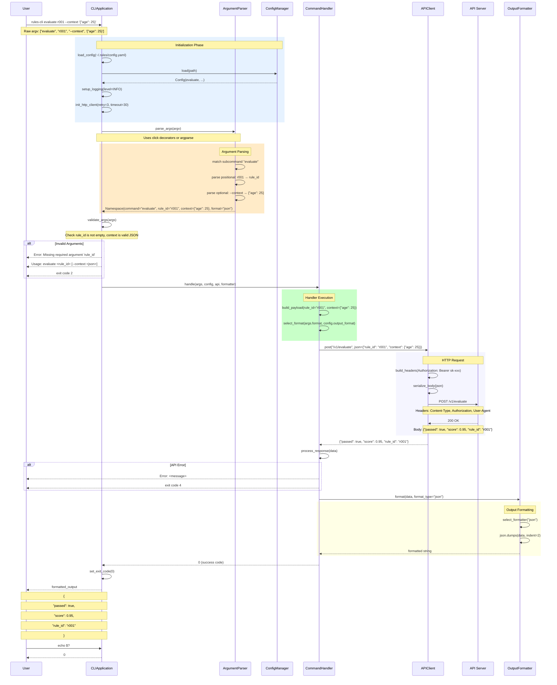
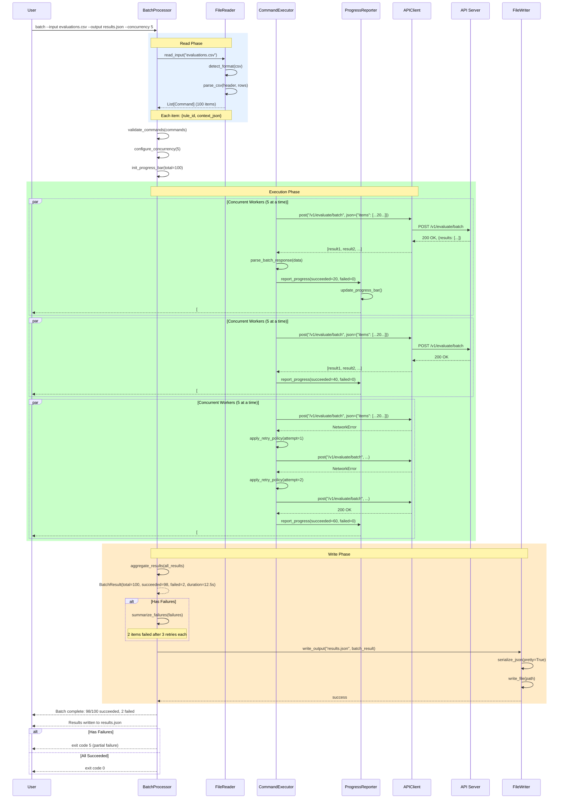
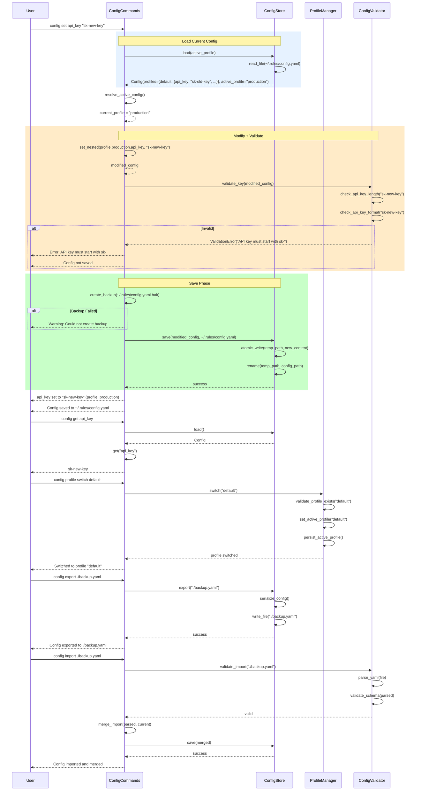
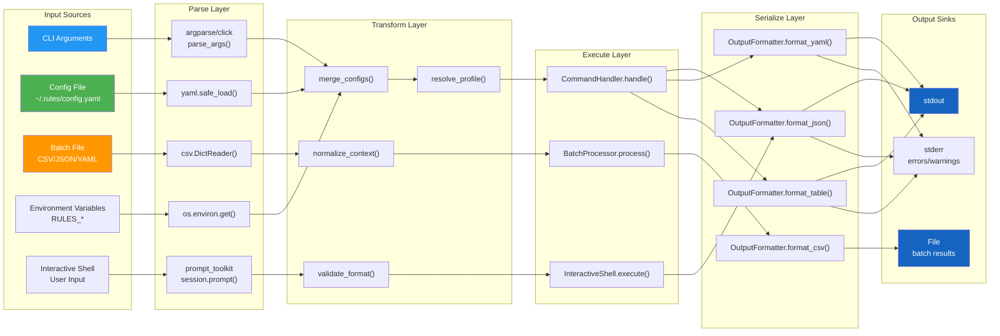
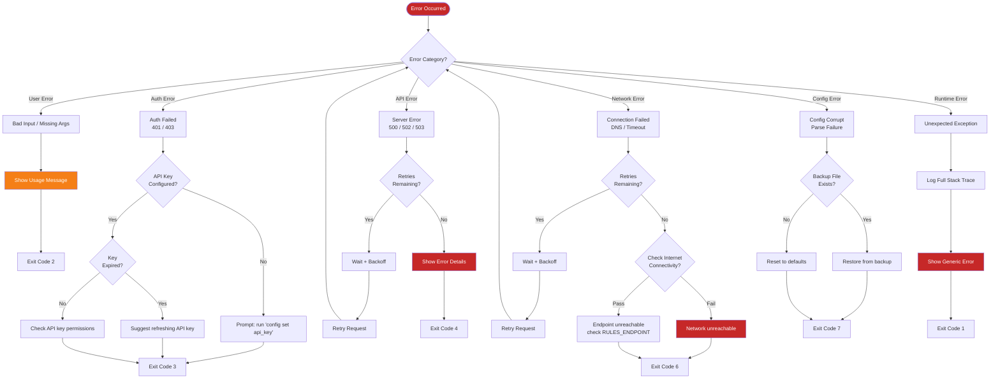

# CLI Data Flow

## Command Execution Flow

The sequence diagram below traces a single CLI command from user input through parsing, handler execution, and output rendering. Every command follows this same lifecycle.

## Batch Processing Flow

The batch processor reads commands from a file, executes them with configurable concurrency, and writes results to an output file. Progress is reported in real-time.

## Config Command Flow

Configuration commands manage local settings through a load-modify-validate-save cycle. All mutations are transactional.

## Data Transformation Pipeline

## Error Handling Flow

