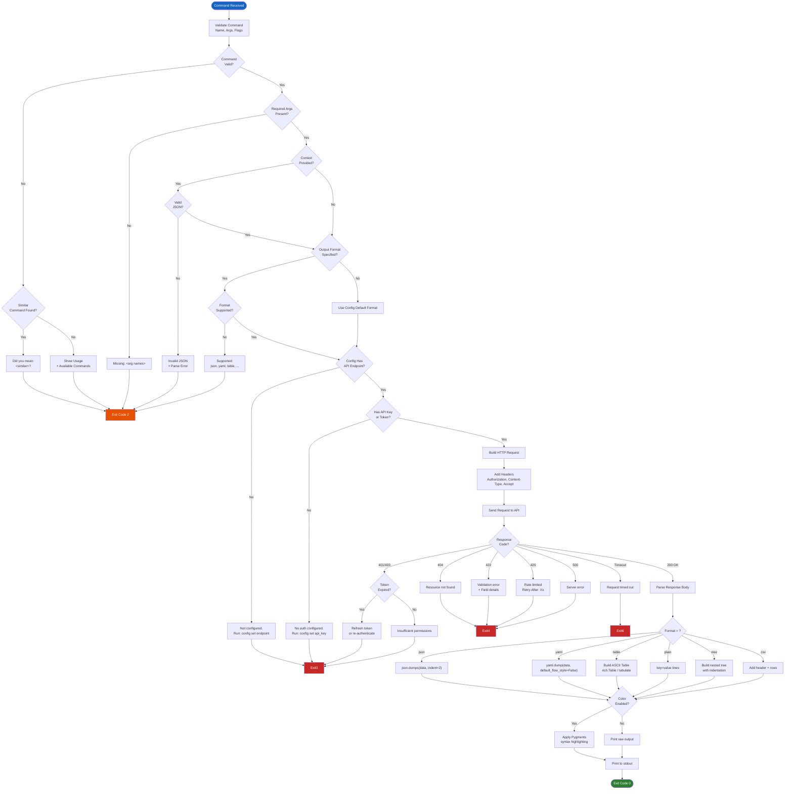
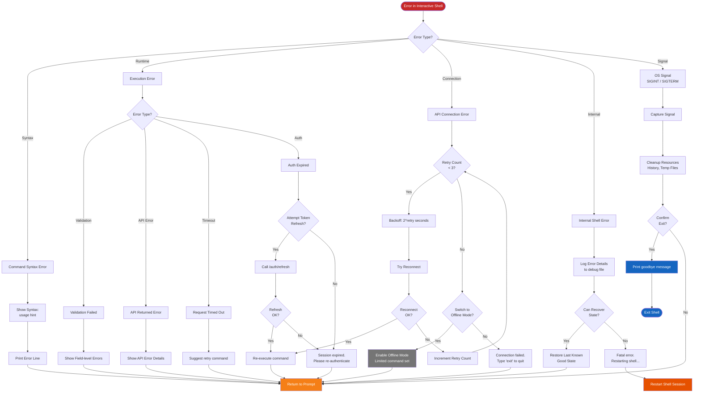
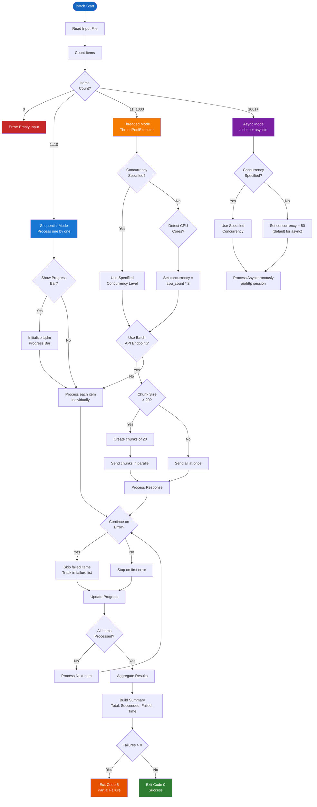
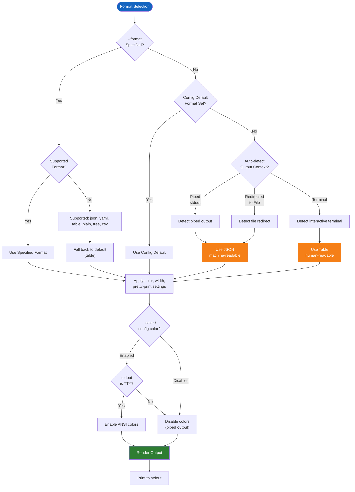

# CLI Logic & Decision Making

## Command Processing Flowchart

Every CLI command passes through a decision pipeline: validation, permission checking, execution, and output format selection. The flowchart below captures branching logic at each stage.



## Interactive Shell Error Handling Decision Tree

The interactive shell uses a multi-layered error handling strategy. The decision tree below determines whether the shell should retry, recover, degrade, or terminate based on the error type and severity.



## Batch Processing Strategy Selection

The batch processor selects an execution strategy based on input size, concurrency setting, error tolerance, and available system resources.



## Output Format Selection Logic



## Retry and Backoff Strategy

The CLI uses an exponential backoff strategy with jitter for retryable errors:

```python
RETRY_CONFIG = {
    "max_retries": 3,
    "base_delay_ms": 500,
    "max_delay_ms": 10000,
    "jitter": True,
    "retryable_statuses": [429, 500, 502, 503, 504],
    "retryable_exceptions": [
        "ConnectionError",
        "TimeoutError",
        "SSLError",
        "ChunkedEncodingError"
    ]
}
```

| Attempt | Base Delay | With Jitter | Trigger |
|---|---|---|---|
| 1 | 500ms | 375-625ms | First retryable failure |
| 2 | 1000ms | 750-1250ms | Second consecutive failure |
| 3 | 2000ms | 1500-2500ms | Third consecutive failure |
| 4+ | 4000ms | 3000-5000ms | Subsequent (capped at 10s) |

After exhausting retries, the CLI enters degraded mode where further commands are attempted once without retry (fail-fast). The user is notified that the API appears unavailable.

## Cache Invalidation Rules

The CLI caches rule list data for 30 seconds. Cache is invalidated when:
- A `create`, `update`, or `delete` command succeeds
- The `--no-cache` flag is passed
- The config file timestamp changes (detected via mtime)
- The `RULES_CACHE_BUST` env var is set to a new value