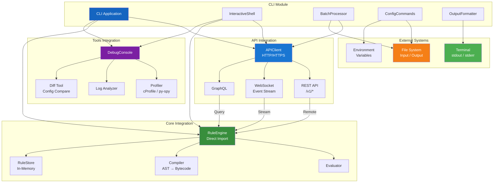
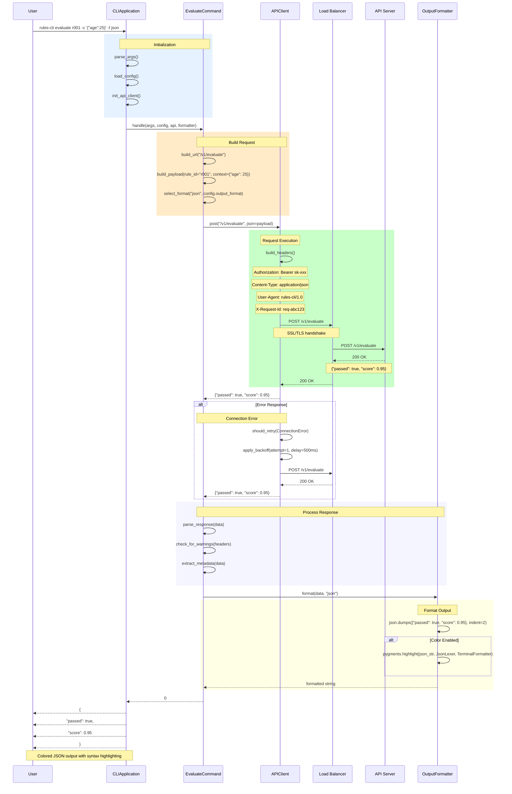
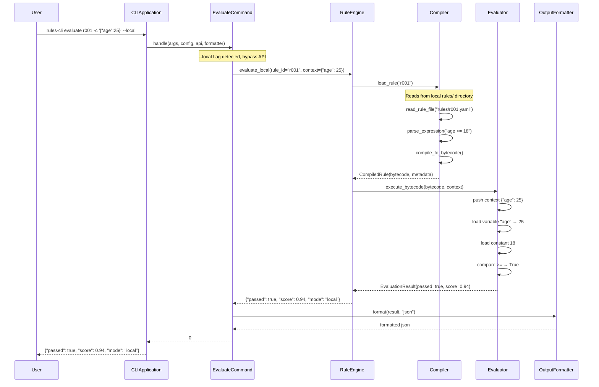
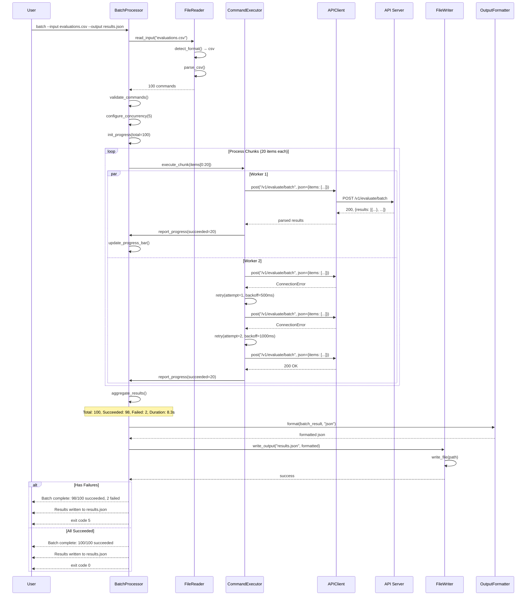
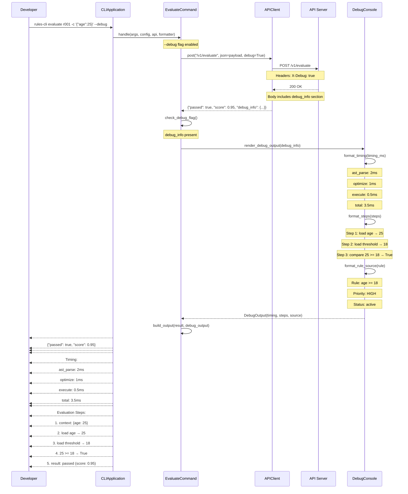

# CLI Integration

## System Integration Diagram

The CLI module integrates with the API (HTTP calls for data operations), Core (direct import for local evaluations), and Tools (debugging and diagnostics). Each integration path uses a different communication pattern.



## CLI-to-API Integration Sequence

The most common integration path is the CLI making HTTP calls to the API server. The sequence below shows a complete command lifecycle including request building, retry logic, response parsing, and output formatting.



## Direct Core Integration

For local development and testing, the CLI can bypass the API and import Core modules directly. This path is faster and works offline.



## Batch Integration with API



## Debugging Tools Integration



## Configuration Integration Points

```mermaid
graph TB
    subgraph "Config Sources"
        S1["Default Config<br/>hardcoded defaults"]
        S2["Config File<br/>~/.rules/config.yaml"]
        S3["Profile Config<br/>~/.rules/profiles/"]
        S4["Environment Vars<br/>RULES_*"]
        S5["CLI Flags<br/>--format, --endpoint"]
    end

    subgraph "Merge Priority<br/>(highest wins)"
        M1["1. CLI Flags"]
        M2["2. Environment Vars"]
        M3["3. Active Profile"]
        M4["4. Config File"]
        M5["5. Defaults"]
    end

    subgraph "Consumers"
        C1["APIClient<br/>base_url, api_key, timeout"]
        C2["OutputFormatter<br/>format, color, width"]
        C3["BatchProcessor<br/>concurrency, continue_on_error"]
        C4["InteractiveShell<br/>history_size, prompt"]
        C5["ConfigCommands<br/>config_path, profile"]
    end

    S1 --> M5
    S2 --> M4
    S3 --> M3
    S4 --> M2
    S5 --> M1

    M5 --> Merge["Config Merge"]
    M4 --> Merge
    M3 --> Merge
    M2 --> Merge
    M1 --> Merge

    Merge --> C1
    Merge --> C2
    Merge --> C3
    Merge --> C4
    Merge --> C5

    style S1 fill:#BDBDBD,color:#000
    style S2 fill:#4CAF50,color:#fff
    style S3 fill:#2196F3,color:#fff