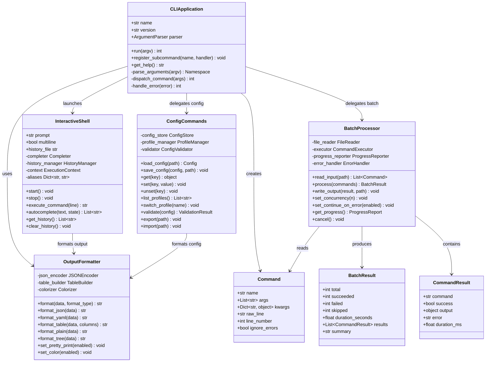

# CLI Module

## Overview

The CLI module provides a command-line interface for interacting with the Rules Engine. It supports single commands, an interactive shell, batch processing, and configurable output formatting. All commands authenticate against the API and support structured output for scripting.

### Components

- **CLI Application** — Entry point with argument parsing, subcommand routing, and exit code handling
- **OutputFormatter** — Structured output rendering supporting JSON, YAML, table, and plain-text formats
- **InteractiveShell** — REPL-style interface with autocomplete, history, and multi-line input
- **ConfigCommands** — Local configuration management (profiles, credentials, preferences)
- **BatchProcessor** — File-based batch execution with progress reporting and error recovery

## Class Diagram



## Quick Start

### Installation

```bash
# Install from source
pip install -e .

# Verify installation
rules-cli --version

# Set up authentication
rules-cli config set api_key "sk-your-api-key"
rules-cli config set endpoint "https://api.example.com/v1"
```

### Basic Commands

```bash
# List rules
rules-cli list --format table

# Evaluate a single rule
rules-cli evaluate --rule-id r001 --context '{"age": 25}' --format json

# Batch evaluate from file
rules-cli batch --input evaluations.csv --output results.json

# Start interactive shell
rules-cli shell

# Manage profiles
rules-cli config profile list
rules-cli config profile switch production

# Export/import configuration
rules-cli config export ./backup.yaml
rules-cli config import ./backup.yaml
```

### Interactive Shell

```
$ rules-cli shell
rules> list
  ID      Name              Priority  Status
  r001    Age Check         HIGH      active
  r002    Country Filter    MEDIUM    active
  r003    Admin Override    LOW       disabled

rules> evaluate r001 --context '{"age": 25}'
Result: PASSED
Score: 0.95
Details: age=25 >= 18 threshold

rules> help evaluate
Evaluate a rule against a context payload.
Usage: evaluate <rule-id> [--context <json>] [--format <format>]

rules> exit
```

## Command Reference Table

| Command | Description | Aliases |
|---|---|---|
| `list` | List all rules with pagination and filtering | `ls`, `rules` |
| `get <id>` | Get rule details by ID | `show`, `describe` |
| `create` | Create a new rule from JSON/YAML input | `add`, `new` |
| `update <id>` | Update an existing rule | `edit`, `modify` |
| `delete <id>` | Delete a rule | `rm`, `remove` |
| `evaluate <id>` | Evaluate a rule against a context | `eval`, `run`, `test` |
| `batch` | Run batch evaluations from a file | `bulk` |
| `shell` | Launch interactive REPL | `repl`, `interactive` |
| `config` | Manage local configuration | `cfg`, `settings` |
| `config get <key>` | Get a config value | — |
| `config set <key> <value>` | Set a config value | — |
| `config profile` | Manage configuration profiles | — |
| `config export` | Export configuration to file | — |
| `config import` | Import configuration from file | — |
| `metrics` | Show API usage metrics | `stats`, `usage` |
| `health` | Check API health status | `ping`, `status` |
| `version` | Show CLI version | `--version`, `-V` |
| `help [command]` | Show help for a command | `?`, `-h`, `--help` |

## Output Formats

| Format | Description | Use Case |
|---|---|---|
| `table` | ASCII-aligned columns with headers | Human reading |
| `json` | Pretty-printed JSON | Scripting, piping |
| `yaml` | YAML serialization | Config files |
| `plain` | Minimal key=value lines | Grep-friendly |
| `tree` | Hierarchical indented tree | Nested data |
| `csv` | Comma-separated values | Spreadsheets |

## Exit Codes

| Code | Meaning |
|---|---|
| 0 | Success |
| 1 | General error |
| 2 | Invalid arguments |
| 3 | Authentication failure |
| 4 | API error (non-2xx) |
| 5 | Batch partial failure |
| 6 | Network error |
| 7 | Config corruption |

## Environment Variables

| Variable | Default | Description |
|---|---|---|
| `RULES_API_KEY` | — | API key for authentication |
| `RULES_ENDPOINT` | `http://localhost:8000` | API endpoint URL |
| `RULES_OUTPUT_FORMAT` | `table` | Default output format |
| `RULES_CONFIG_PATH` | `~/.rules/config.yaml` | Config file location |
| `RULES_TIMEOUT` | `30` | Request timeout in seconds |
| `RULES_VERIFY_SSL` | `true` | SSL certificate verification |

## Dependencies

- `click` — Argument parsing and command routing
- `pyyaml` — YAML output and config files
- `rich` — Colored output and tables
- `prompt_toolkit` — Interactive shell
- `requests` — HTTP client for API calls
- `aiohttp` — Async HTTP for batch processing