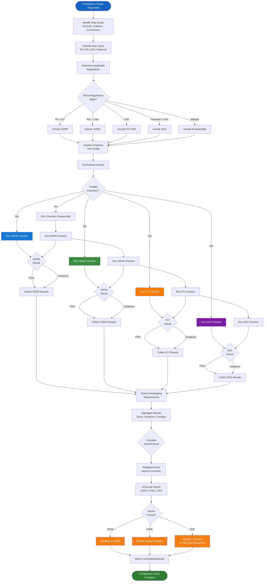
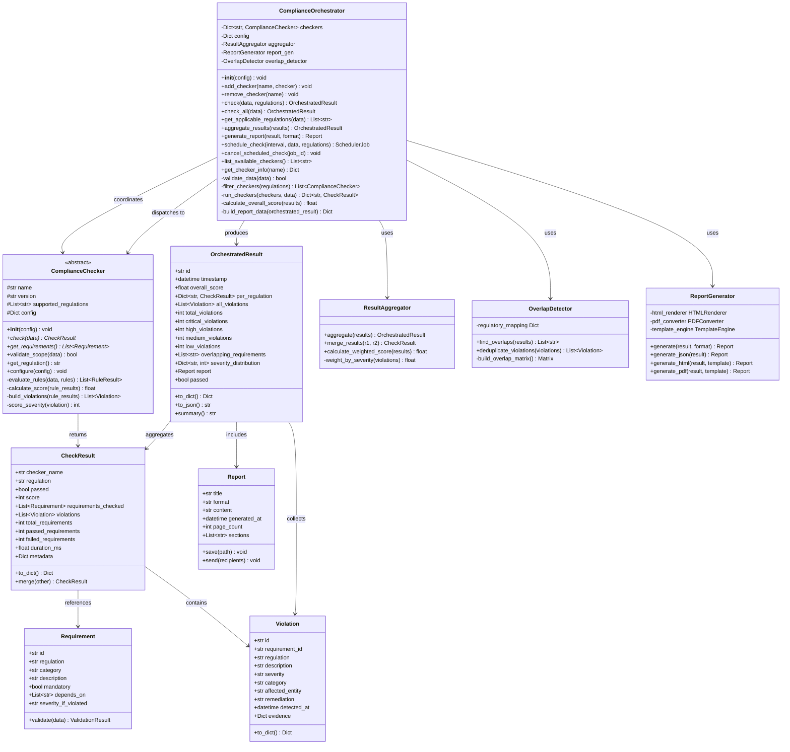
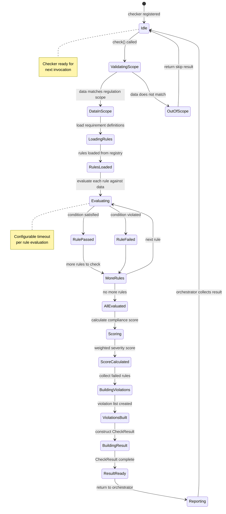
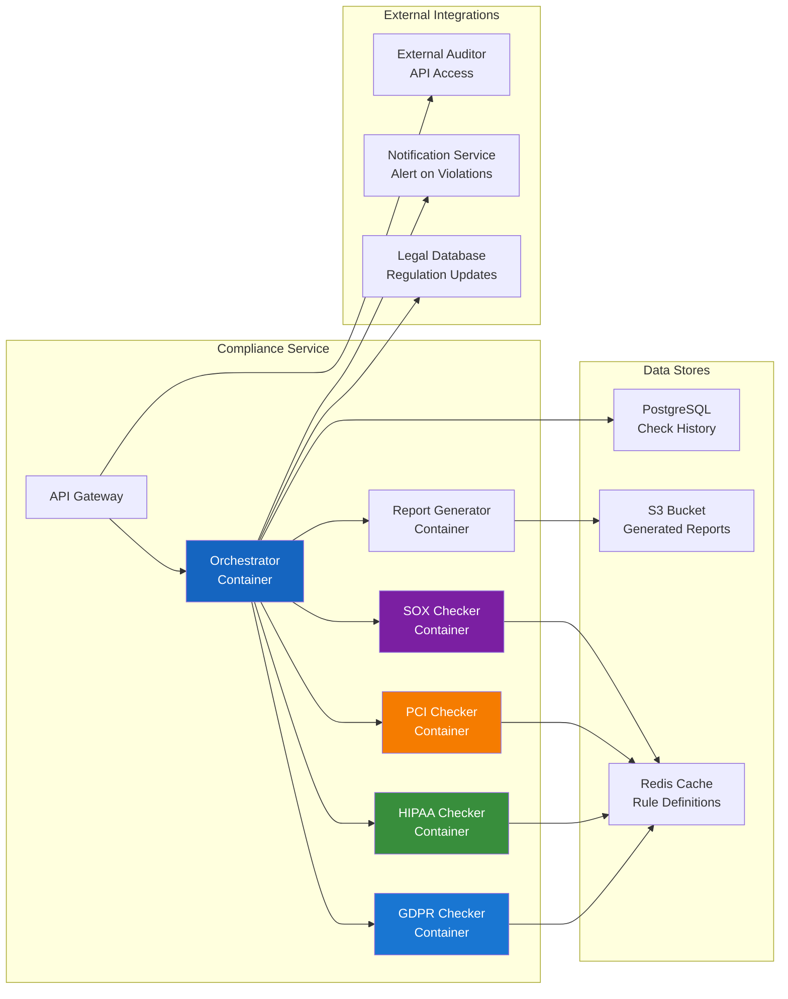

# Compliance Architecture

## System Architecture Flowchart

Every compliance check flows through the ComplianceOrchestrator, which dispatches to individual regulation checkers, aggregates results, and generates reports. The flowchart below shows the complete lifecycle.

## Class Diagram

## Multi-Regulatory Orchestration

```mermaid
graph TB
    subgraph "Input Data"
        D1["System Configuration"]
        D2["Data Flow Map"]
        D3["User Records"]
        D4["Access Logs"]
        D5["Encryption Keys"]
        D6["Third-party Contracts"]
    end

    subgraph "Orchestrator"
        ORCH["ComplianceOrchestrator"]
        FILTER["Regulation Filter"]
        DISPATCH["Dispatch to Checkers"]
        COLLECT["Collect Results"]
        OVERLAP["Overlap Detection"]
        SCORE["Score Calculation"]
        REPORT["Report Generation"]
    end

    subgraph "Checker Layer"
        G["GDPR<br/>ComplianceChecker"]
        H["HIPAA<br/>ComplianceChecker"]
        P["PCI<br/>ComplianceChecker"]
        S["SOX<br/>ComplianceChecker"]
    end

    subgraph "Checker Internals"
        G1["Consent Check"]
        G2["Data Minimization"]
        G3["Right to Erasure"]
        G4["Breach Notification"]
        G5["Data Transfer"]

        H1["PHI Access Control"]
        H2["Encryption Validation"]
        H3["BAA Verification"]
        H4["Audit Controls"]
        H5["Security Policies"]

        P1["Network Security"]
        P2["CHD Protection"]
        P3["Access Control"]
        P4["Encryption Keys"]
        P5["Logging/Monitoring"]
        P6["Vulnerability Mgmt"]
        P7["ASM Testing"]

        S1["Access Controls"]
        S2["Audit Trail"]
        S3["Segregation of Duties"]
        S4["Financial Reporting"]
        S5["Change Management"]
    end

    D1 --> ORCH
    D2 --> ORCH
    D3 --> ORCH
    D4 --> ORCH
    D5 --> ORCH
    D6 --> ORCH

    ORCH --> FILTER
    FILTER --> DISPATCH

    DISPATCH --> G
    DISPATCH --> H
    DISPATCH --> P
    DISPATCH --> S

    G --> G1
    G --> G2
    G --> G3
    G --> G4
    G --> G5

    H --> H1
    H --> H2
    H --> H3
    H --> H4
    H --> H5

    P --> P1
    P --> P2
    P --> P3
    P --> P4
    P --> P5
    P --> P6
    P --> P7

    S --> S1
    S --> S2
    S --> S3
    S --> S4
    S --> S5

    G1 --> COLLECT
    G2 --> COLLECT
    G3 --> COLLECT
    G4 --> COLLECT
    G5 --> COLLECT

    H1 --> COLLECT
    H2 --> COLLECT
    H3 --> COLLECT
    H4 --> COLLECT
    H5 --> COLLECT

    P1 --> COLLECT
    P2 --> COLLECT
    P3 --> COLLECT
    P4 --> COLLECT
    P5 --> COLLECT
    P6 --> COLLECT
    P7 --> COLLECT

    S1 --> COLLECT
    S2 --> COLLECT
    S3 --> COLLECT
    S4 --> COLLECT
    S5 --> COLLECT

    COLLECT --> OVERLAP
    OVERLAP --> SCORE
    SCORE --> REPORT

    style ORCH fill:#1565C0,color:#fff
    style G fill:#1976D2,color:#fff
    style H fill:#388E3C,color:#fff
    style P fill:#F57C00,color:#fff
    style S fill:#7B1FA2,color:#fff
    style REPORT fill:#2E7D32,color:#fff
```

## Checker Lifecycle

## Deployment Topology

