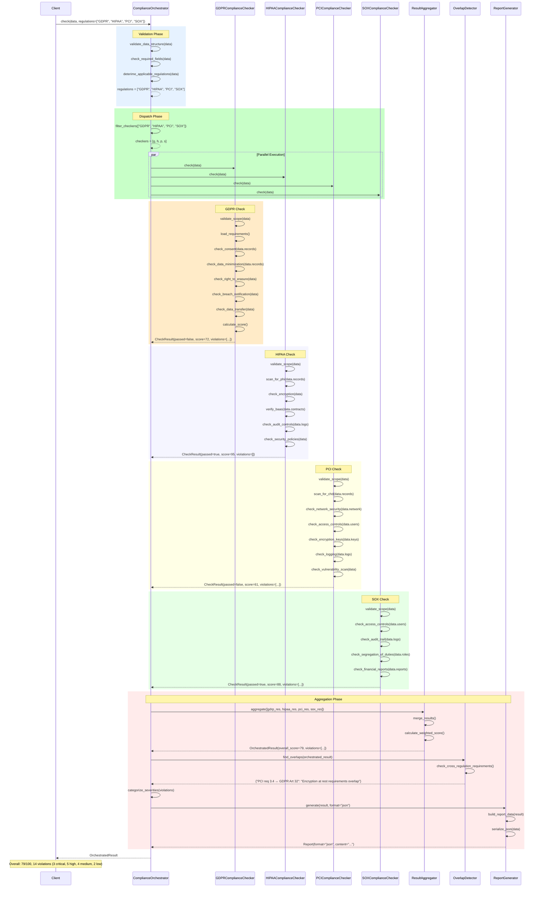
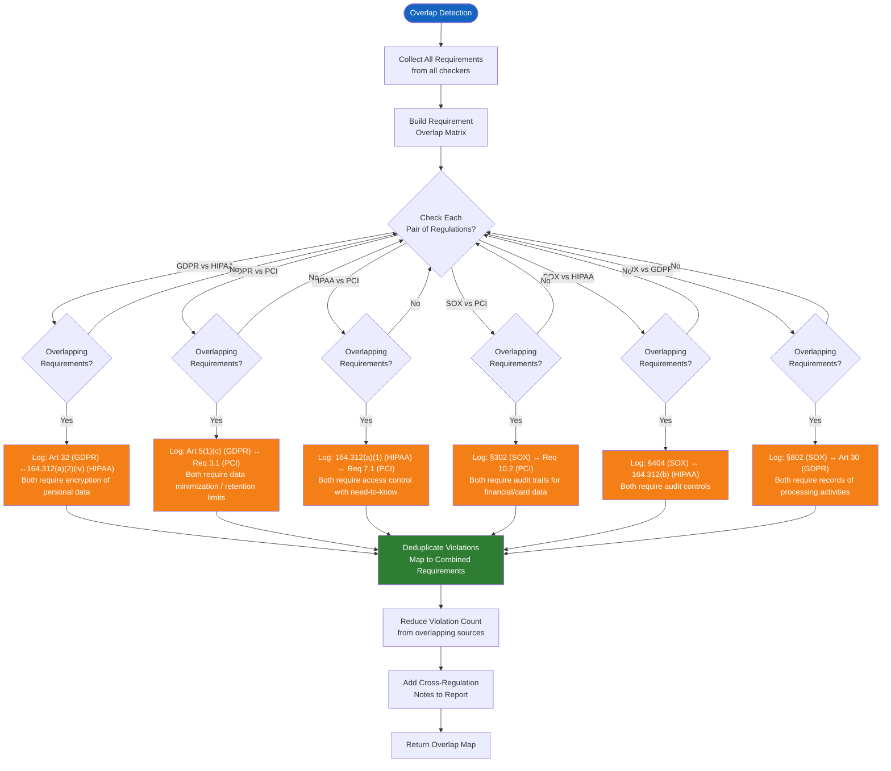
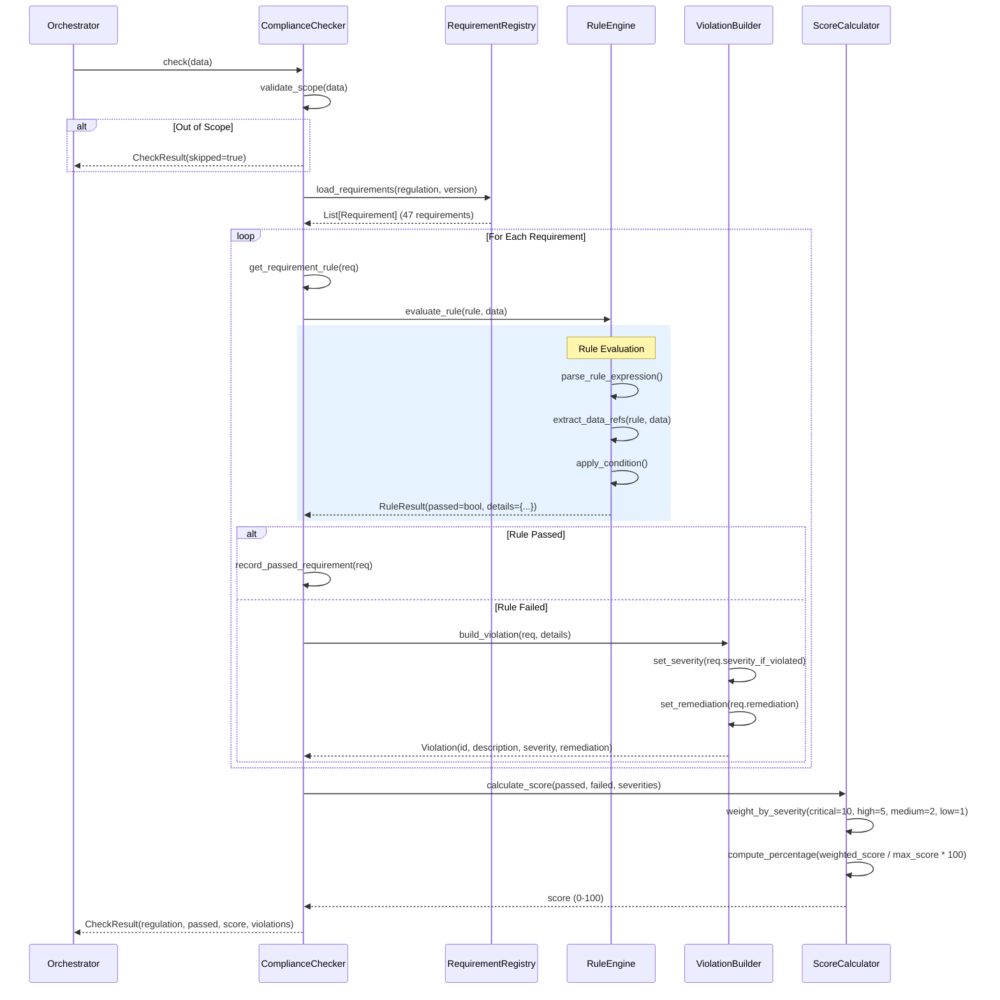
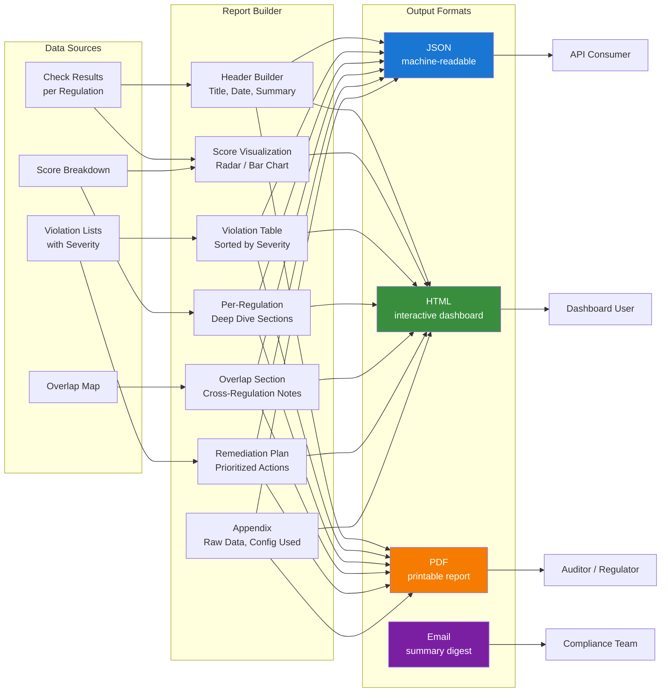
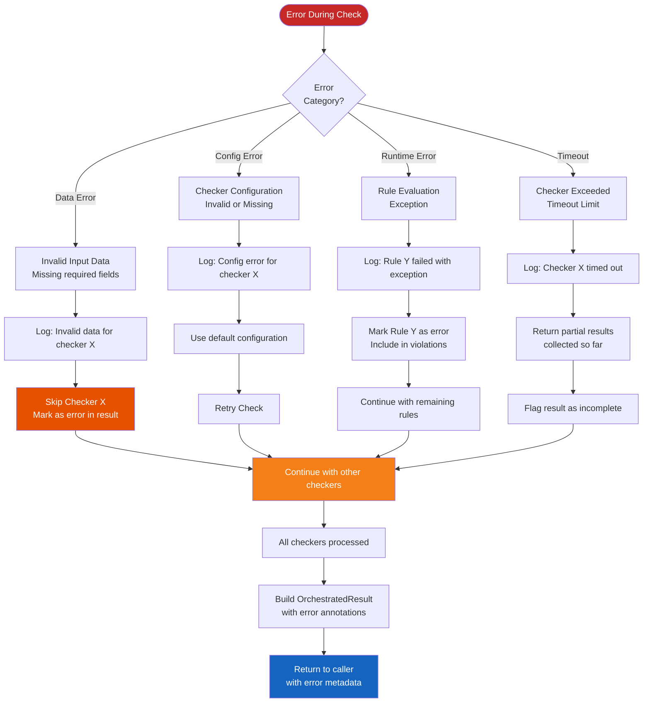

# Compliance Data Flow

## Multi-Regulation Compliance Check Sequence

The ComplianceOrchestrator coordinates all regulation checkers in a structured pipeline. Each checker runs independently (in parallel when configured) and the orchestrator aggregates results.

## Cross-Regulation Overlap Detection

## Individual Checker Internal Flow

## Report Data Flow

## Error Handling Flow

