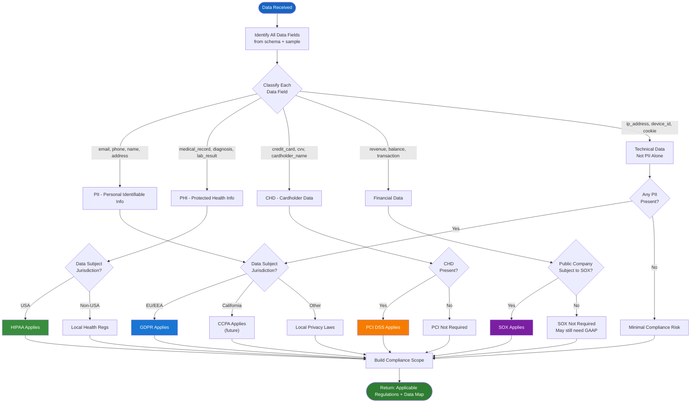
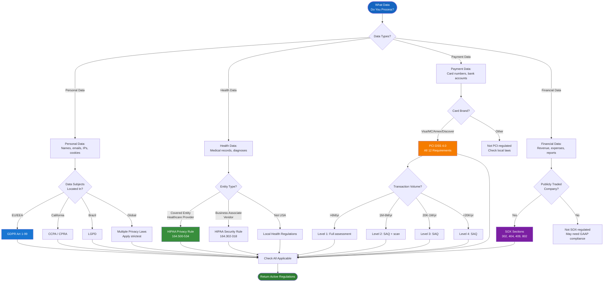
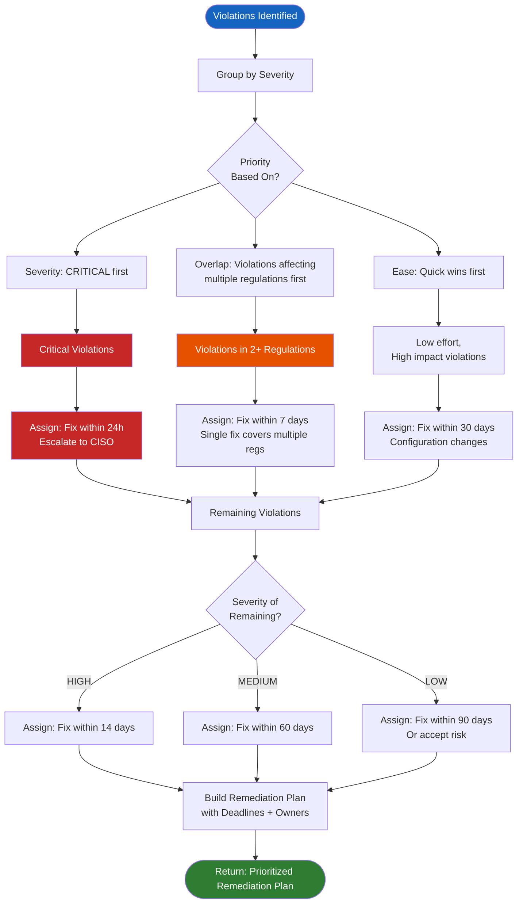
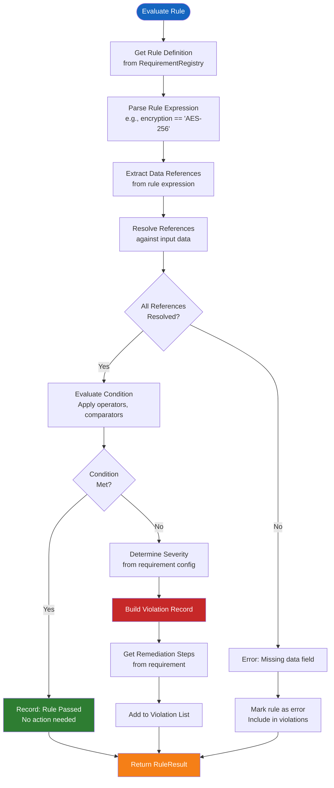

# Compliance Decision Logic

## Data Classification Flowchart

The first step in any compliance check is classifying the incoming data. The classification determines which regulations apply and which rules to evaluate.



## Regulation Applicability Decision Tree

Not all regulations apply to all data. The decision tree below determines which regulations to activate based on data type, jurisdiction, and entity type.



## Compliance Severity Scoring Logic

```mermaid
flowchart TD
    Start(["Violation Detected"]) --> ClassifyType{"Violation<br/>Category?"}

    ClassifyType -->|Data Breach| Breach["Potential Data Breach"]
    ClassifyType -->|Missing Consent| Consent["Missing/Lapsed Consent"]
    ClassifyType -->|Unencrypted Data| Encrypt["Unencrypted Sensitive Data"]
    ClassifyType -->|Access Control| Access["Improper Access Control"]
    ClassifyType -->|Retention| Retention["Data Retained Beyond Policy"]
    ClassifyType -->|Audit Trail| Audit["Missing Audit Trail"]
    ClassifyType -->|BAA/Contract| BAA["Missing BAA/DPA"]
    ClassifyType -->|Transfer| Transfer["Unauthorized Data Transfer"]

    Breach --> BreachReg{"Affected<br/>Regulation?"}
    BreachReg -->|GDPR| G_Breach["Art 33/34<br/>Notify within 72h"]
    BreachReg -->|HIPAA| H_Breach["164.400-414<br/>Notify within 60 days"]
    BreachReg -->|PCI| P_Breach["Req 12.10<br/>Incident response"]

    G_Breach --> CriticalScore["Severity: CRITICAL<br/>Score Penalty: -40"]
    H_Breach --> CriticalScore
    P_Breach --> CriticalScore

    Consent --> ConsentReg{"Affected<br/>Regulation?"}
    ConsentReg -->|GDPR| G_Consent["Art 6/7<br/>Lawful basis required"]
    G_Consent --> HighScore["Severity: HIGH<br/>Score Penalty: -20"]

    Encrypt --> EncryptReg{"Affected<br/>Regulation?"}
    EncryptReg -->|GDPR| G_Encrypt["Art 32<br/>Security of processing"]
    EncryptReg -->|HIPAA| H_Encrypt["164.312(a)(2)(iv)<br/>Encryption required"]
    EncryptReg -->|PCI| P_Encrypt["Req 3.4/4.1<br/>CHD must be encrypted"]

    G_Encrypt --> HighScore
    H_Encrypt --> CriticalScore
    P_Encrypt --> CriticalScore

    Access --> AccessReg{"Affected<br/>Regulation?"}
    AccessReg -->|HIPAA| H_Access["164.312(a)(1)<br/>Unique user IDs"]
    AccessReg -->|PCI| P_Access["Req 7.1/7.2<br/>Need-to-know access"]
    AccessReg -->|SOX| S_Access["§302<br/>Access controls over financial data"]

    H_Access --> MediumScore["Severity: MEDIUM<br/>Score Penalty: -10"]
    P_Access --> MediumScore
    S_Access --> MediumScore

    Retention --> RetentionReg{"Affected<br/>Regulation?"}
    RetentionReg -->|GDPR| G_Retention["Art 5(1)(e)<br/>Storage limitation"]
    RetentionReg -->|PCI| P_Retention["Req 3.1<br/>Dispose when not needed"]

    G_Retention --> MediumScore
    P_Retention --> MediumScore

    Audit --> AuditReg{"Affected<br/>Regulation?"}
    AuditReg -->|HIPAA| H_Audit["164.312(b)<br/>Audit controls"]
    AuditReg -->|PCI| P_Audit["Req 10.2/10.3<br/>Audit trails"]
    AuditReg -->|SOX| S_Audit["§404<br/>Internal controls"]
    H_Audit --> LowScore["Severity: LOW<br/>Score Penalty: -5"]
    P_Audit --> LowScore
    S_Audit --> LowScore

    BAA --> BAA_Reg{"Affected<br/>Regulation?"}
    BAA_Reg -->|HIPAA| H_BAA["164.314(a)(1)<br/>BAA required"]
    H_BAA --> HighScore

    Transfer --> TransferReg{"Affected<br/>Regulation?"}
    TransferReg -->|GDPR| G_Transfer["Art 44-49<br/>International transfers"]
    G_Transfer --> HighScore

    CriticalScore --> FinalScore["Final Score = Max(0, 100 - total_penalty)"]
    HighScore --> FinalScore
    MediumScore --> FinalScore
    LowScore --> FinalScore

    FinalScore --> ReturnScore(["Return Score + Severity Map"])

    style Start fill:#C62828,color:#fff
    style CriticalScore fill:#C62828,color:#fff
    style HighScore fill:#E65100,color:#fff
    style MediumScore fill:#F57F17,color:#fff
    style LowScore fill:#F9A825,color:#fff
    style ReturnScore fill:#2E7D32,color:#fff
```



## Remediation Priority Logic



## Rule Evaluation Engine Logic



## Sample Rule Definitions

```python
GDPR_RULES = [
    {
        "id": "GDPR-ART5-1C",
        "regulation": "GDPR",
        "article": "Art 5(1)(c)",
        "description": "Data minimization - only collect data necessary for purpose",
        "expression": "len(data.fields) <= data.stated_purpose.required_fields_count",
        "severity": "HIGH",
        "remediation": "Remove unnecessary data fields from collection forms"
    },
    {
        "id": "GDPR-ART17",
        "regulation": "GDPR",
        "article": "Art 17",
        "description": "Right to erasure ('right to be forgotten')",
        "expression": "data.erasure_requests.all(r.processed_within_30_days for r in requests)",
        "severity": "HIGH",
        "remediation": "Implement automated erasure workflow with 30-day SLA"
    },
    {
        "id": "GDPR-ART32",
        "regulation": "GDPR",
        "article": "Art 32",
        "description": "Security of processing - encryption at rest and in transit",
        "expression": "data.encryption.at_rest == 'AES-256' AND data.encryption.in_transit == 'TLS-1.3'",
        "severity": "CRITICAL",
        "remediation": "Upgrade encryption to AES-256 and TLS 1.3"
    }
]

HIPAA_RULES = [
    {
        "id": "HIPAA-164312A1",
        "regulation": "HIPAA",
        "article": "164.312(a)(1)",
        "description": "Unique user identification for PHI systems",
        "expression": "all(u.unique_id for u in data.users_with_phi_access)",
        "severity": "MEDIUM",
        "remediation": "Implement unique user IDs for all PHI system accounts"
    },
    {
        "id": "HIPAA-164312A2IV",
        "regulation": "HIPAA",
        "article": "164.312(a)(2)(iv)",
        "description": "Encryption and decryption of PHI at rest",
        "expression": "data.encryption.at_rest in ['AES-256', 'AES-128']",
        "severity": "CRITICAL",
        "remediation": "Encrypt all PHI at rest using AES-256"
    }
]
```

## Score Calculation Algorithm

The overall compliance score is calculated as:

```
base_score = 100
for each violation:
    severity_weight = {"CRITICAL": 10, "HIGH": 5, "MEDIUM": 2, "LOW": 1}[violation.severity]
    penalty = severity_weight * 2
    base_score -= penalty

final_score = max(0, base_score)
```

| Violations | Severity Mix | Score |
|---|---|---|
| 0 | — | 100 (Perfect) |
| 2 | 1 CRITICAL, 1 LOW | 79 |
| 5 | 2 HIGH, 3 MEDIUM | 64 |
| 10 | 3 CRITICAL, 3 HIGH, 2 MEDIUM, 2 LOW | 20 |
| 12+ | Various | 0 (Non-compliant) |