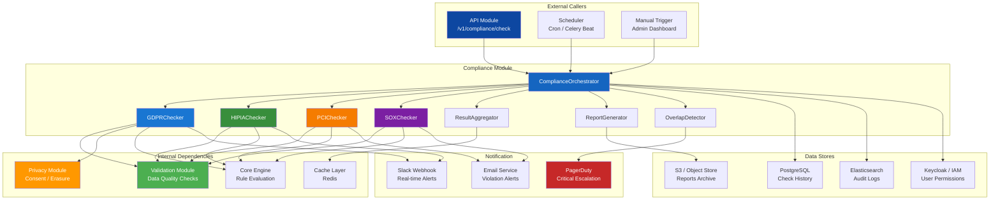
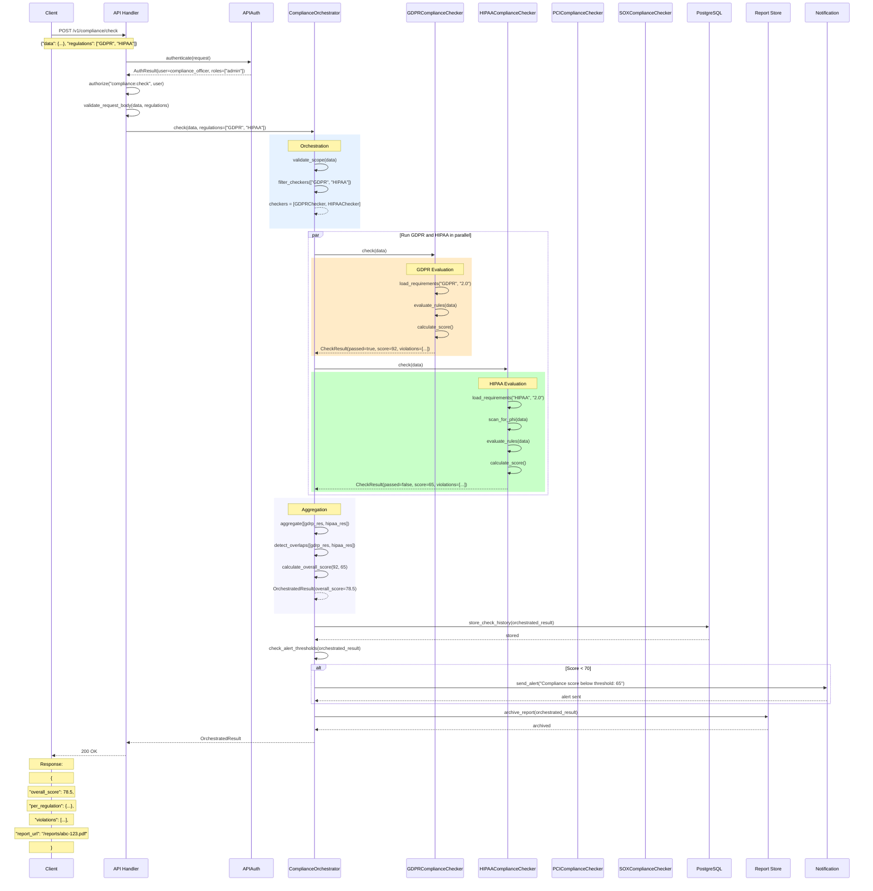
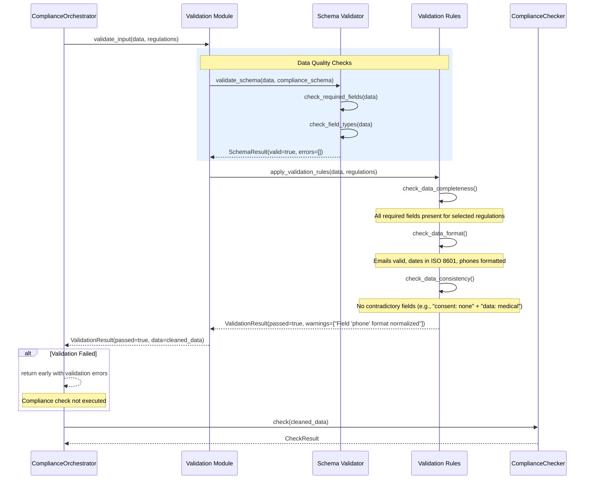
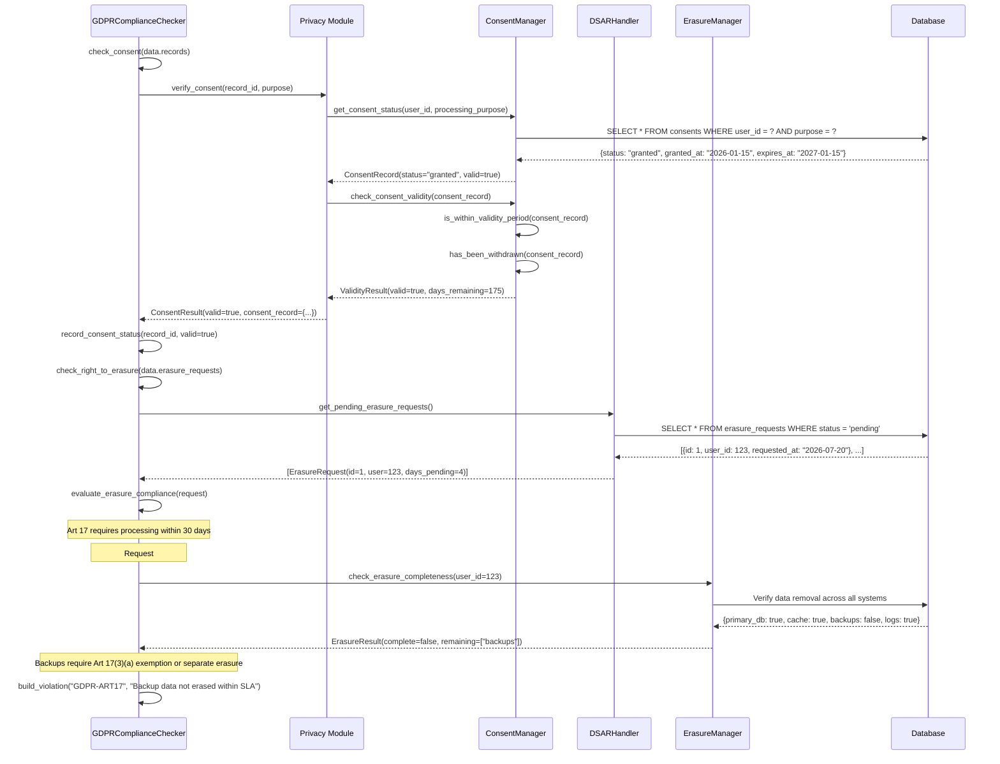
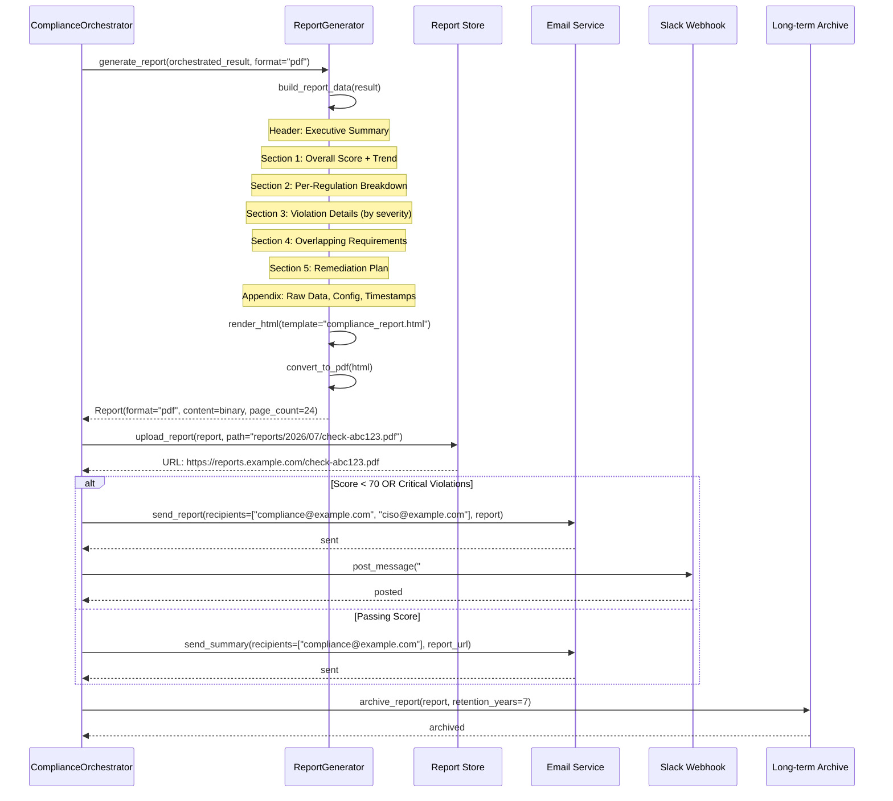
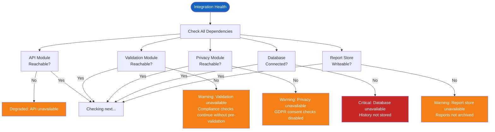

# Compliance Integration

## System Integration Overview

The Compliance module integrates with the API layer (incoming check requests), Validation module (data quality checks), and Privacy module (consent and data subject rights). Each integration follows a defined contract.



## API to Compliance Integration Sequence

When a compliance check is triggered via the API, the request flows through the ComplianceOrchestrator, which coordinates all checkers and returns a structured result.



## Validation to Compliance Integration

The Validation module pre-processes data before compliance checks, ensuring data quality and completeness. This prevents false positives from malformed input.



## Privacy to GDPR Integration

The Privacy module handles consent management, data subject requests (DSARs), and right to erasure. The GDPR checker queries the privacy module for consent records and erasure status.



## Report Distribution Flow



## Configuration Integration

```python
COMPLIANCE_INTEGRATION_CONFIG = {
    "api": {
        "endpoint": "/v1/compliance",
        "auth_required": True,
        "rate_limit": 10,
        "timeout_ms": 60000
    },
    "validation": {
        "enabled": True,
        "strict_mode": False,
        "pre_checks": ["schema", "format", "consistency"]
    },
    "privacy": {
        "consent_api_url": "http://privacy-service:8000/v1/consent",
        "dsar_api_url": "http://privacy-service:8000/v1/dsar",
        "erasure_api_url": "http://privacy-service:8000/v1/erasure",
        "timeout_ms": 5000
    },
    "notifications": {
        "email": {
            "enabled": True,
            "recipients": ["compliance-team@example.com"],
            "critical_recipients": ["ciso@example.com", "legal@example.com"],
            "threshold_score": 70
        },
        "slack": {
            "enabled": True,
            "webhook_url": "https://hooks.slack.com/services/xxx",
            "channel": "#compliance-alerts",
            "notify_on": ["critical_violation", "score_below_70"]
        },
        "pagerduty": {
            "enabled": True,
            "integration_key": "pd-key-xxx",
            "severity_threshold": "CRITICAL"
        }
    },
    "storage": {
        "history": {
            "backend": "postgresql",
            "retention_days": 1825
        },
        "reports": {
            "backend": "s3",
            "bucket": "compliance-reports",
            "prefix": "reports/",
            "retention_years": 7
        },
        "audit_log": {
            "backend": "elasticsearch",
            "index_pattern": "compliance-audit-*"
        }
    }
}
```

## Integration Health Check

