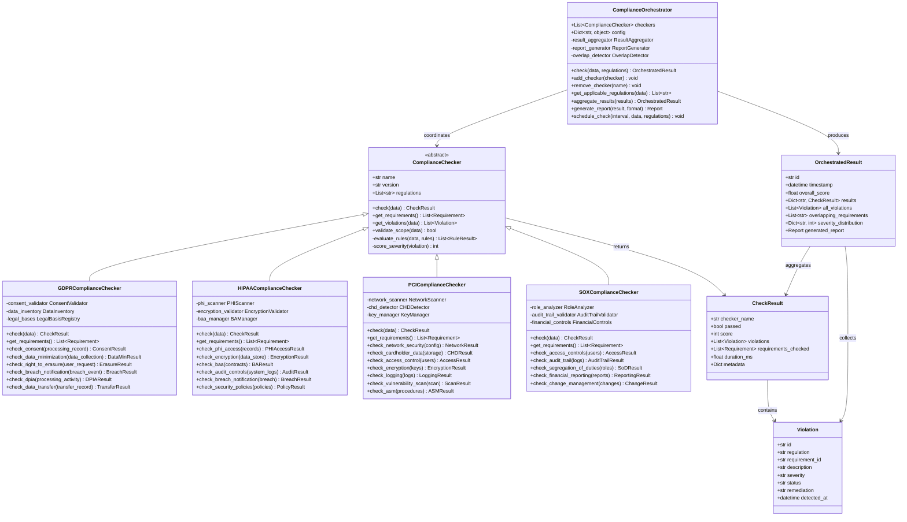

# Compliance Module

## Overview

The Compliance module provides multi-regulatory compliance checking across four major frameworks: GDPR, HIPAA, PCI DSS, and SOX. The ComplianceOrchestrator coordinates all checkers, aggregates results, and produces consolidated compliance reports.

### Components

- **GDPRComplianceChecker** — Evaluates data processing against General Data Protection Regulation requirements (consent management, data minimization, right to erasure, breach notification)
- **HIPAAComplianceChecker** — Validates protected health information (PHI) handling per HIPAA Privacy, Security, and Breach Notification Rules
- **PCIComplianceChecker** — Assesses cardholder data environment against PCI DSS 4.0 requirements (encryption, access control, logging)
- **SOXComplianceChecker** — Checks financial reporting controls per Sarbanes-Oxley Act requirements (audit trails, segregation of duties)
- **ComplianceOrchestrator** — Coordinates multi-regulatory checks, manages check lifecycle, deduplicates overlapping requirements, and generates unified reports

## Class Diagram



## Quick Start

```python
from src.compliance.compliance_orchestrator import ComplianceOrchestrator
from src.compliance.gdpr_compliance import GDPRComplianceChecker
from src.compliance.hipaa_compliance import HIPAAComplianceChecker

# Initialize orchestrator
orchestrator = ComplianceOrchestrator()
orchestrator.add_checker(GDPRComplianceChecker())
orchestrator.add_checker(HIPAAComplianceChecker())

# Run compliance check
data = {
    "records": [
        {
            "type": "user_profile",
            "fields": ["name", "email", "phone", "medical_history"],
            "consent_status": "granted",
            "processing_purpose": "service_delivery"
        }
    ],
    "data_subjects": ["EU", "US"],
    "data_retention_days": 365
}

result = orchestrator.check(data, regulations=["GDPR", "HIPAA"])

# Generate report
report = orchestrator.generate_report(result, format="json")
print(report)

# Check specific requirements
if not result.passed:
    for violation in result.all_violations:
        print(f"[{violation.severity}] {violation.regulation}: {violation.description}")
        print(f"  Remediation: {violation.remediation}")
```

## Regulation Support Table

| Regulation | Domain | Jurisdiction | Requirements | Severity Tiers |
|---|---|---|---|---|
| GDPR | Data Privacy | EU/EEA | 99 articles across 11 chapters | Critical (Art 5), High (Art 17), Medium (Art 30), Low (Art 32) |
| HIPAA | Healthcare | USA | Privacy Rule, Security Rule, Breach Notification Rule | Critical (Breach), High (Encryption), Medium (BAAs), Low (Policies) |
| PCI DSS | Payment Cards | Global | 12 requirements, 6 goals, 4.0 standard | Critical (CHD), High (Network), Medium (Access), Low (Logging) |
| SOX | Financial | USA | 11 titles, Sections 302, 404, 409, 802 | Critical (Fraud), High (Controls), Medium (Audit Trail), Low (Disclosure) |

## Architecture Principles

- **Pluggable**: Add new regulation checkers without modifying existing code
- **Stateless**: Each check is independent; state is managed by the caller
- **Idempotent**: Running the same check twice produces the same result
- **Overlap-aware**: The orchestrator detects when multiple regulations require the same control and reports it
- **Severity-weighted**: Overall score is weighted by violation severity, not a simple pass/fail count

## Configuration

```python
COMPLIANCE_CONFIG = {
    "gdpr": {
        "consent_required": True,
        "data_minimization_enabled": True,
        "max_retention_days": 365,
        "breach_notification_hours": 72
    },
    "hipaa": {
        "phi_detection_strict": True,
        "encryption_required": "AES-256",
        "baa_required": True,
        "audit_log_retention_days": 1825
    },
    "pci": {
        "version": "4.0",
        "chd_scan_enabled": True,
        "vulnerability_scan_frequency_days": 90,
        "asm_frequency_days": 365
    },
    "sox": {
        "audit_trail_required": True,
        "segregation_of_duties": True,
        "review_frequency_days": 90
    },
    "orchestrator": {
        "parallel_execution": True,
        "max_concurrent_checkers": 4,
        "timeout_per_checker_ms": 30000,
        "report_formats": ["json", "html", "pdf"]
    }
}
```

## Dependencies

- `pydantic` — Data validation and schema enforcement
- `cryptography` — Encryption validation
- `phoner` — Phone/email regex for PII detection
- `jinja2` — HTML report templates
- `weasyprint` — PDF report generation