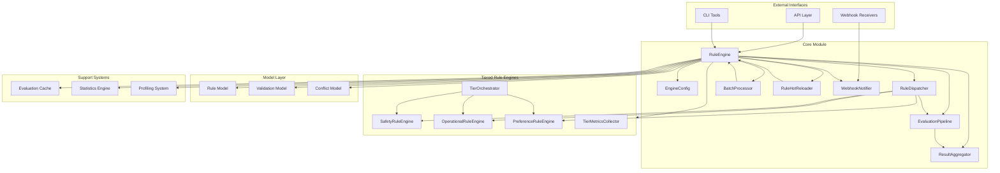

# Core Architecture

## Rule Evaluation Flow

The following flowchart illustrates the end-to-end rule evaluation pipeline, from input ingestion to final output delivery.

```mermaid
flowchart LR
    A["Input Content"] --> B["RuleEngine.evaluate()"]
    B --> C["Pre-Evaluate Hooks"]
    C --> D{"Cache Hit?"}
    D -->|Yes| E["Return Cached Result"]
    D -->|No| F["Get Applicable Rules"]
    F --> G["RuleManager.get_applicable_rules()"]
    G --> H{"Pre-Filter Enabled?"}
    H -->|Yes| I["Pre-Filter Rules"]
    H -->|No| J["Evaluate by Tiers"]
    I --> J
    J --> K["Safety Tier Engine"]
    K --> L{"Safety Violation?"}
    L -->|Yes| M["Early Termination"]
    L -->|No| N["Operational Tier Engine"]
    M --> O["Post-Process Result"]
    N --> O
    N --> P["Preference Tier Engine"]
    P --> O
    O --> Q{"Post-Process Enabled?"}
    Q -->|Yes| R["Deduplicate Violations"]
    Q -->|No| S["Post-Process Hooks"]
    R --> S
    S --> T{"Critical Violations?"}
    T -->|Yes| U["Webhook Notifier"]
    T -->|No| V["Cache Result"]
    U --> V
    V --> W["Update Statistics"]
    W --> X["Return ValidationResult"]
```

## Core Class Diagram

```mermaid
classDiagram
    class RuleEngine {
        -EngineConfig engine_config
        -Dict evaluation_stats
        -ThreadPoolExecutor executor
        -OrderedDict evaluation_cache
        -Dict tier_engines
        -List profiling_records
        -BatchProcessor batch_processor
        -RuleHotReloader hot_reloader
        -WebhookNotifier webhook_notifier
        -List _pre_evaluate_hooks
        -List _post_process_hooks
        -Event _shutdown_event
        -Lock _stats_lock
        -Lock _cache_lock
        +__init__(rule_manager, config)
        +evaluate(request) ValidationResult
        +evaluate_batch(requests) List[ValidationResult]
        +evaluate_tiered(request) ValidationResult
        +start() void
        +get_statistics() Dict
        +export_statistics_json(filepath) Dict
        +export_statistics_prometheus() str
        +export_statistics_all(directory) Dict
        +clear_cache() void
        +clear_cache_by_pattern(pattern) int
        +get_cache_info() Dict
        +add_pre_evaluate_hook(hook) void
        +add_post_process_hook(hook) void
        -_initialize_tier_engines() void
        -_get_applicable_rules(request) List[Rule]
        -_pre_filter_rules(rules, request) List[Rule]
        -_post_process_result(result, request) ValidationResult
        -_evaluate_by_tiers(request, rules) ValidationResult
        -_evaluate_rules_directly(result, rules, request) void
        -_evaluate_single_rule(rule, content, context) Violation
        -_merge_tier_result(main, tier) void
        -_update_statistics(result, start_time) void
        -_get_content_hash(content) str
        -_get_cached_result(hash, context) ValidationResult
        -_cache_result(hash, context, result) void
        -_create_empty_result(request, start) ValidationResult
        -_create_error_result(request, error, start) ValidationResult
        -_generate_request_id() str
    }

    class EngineConfig {
        -ConfigSchema _schema
        -Dict _config
        -Dict _raw_configs
        -Dict _overrides
        -ConfigEnvironment _environment
        -str _file_path
        -List _audit_log
        -List _change_callbacks
        -ConfigChangeDetector _change_detector
        -ConfigProfileManager _profile_manager
        -Dict _metrics
        -bool _lock
        +__init__(initial_config)
        +load_yaml(filepath, env) EngineConfig
        +load_json(filepath, env) EngineConfig
        +load_env(prefix) EngineConfig
        +get(key, default) Any
        +get_int(key, default) int
        +get_float(key, default) float
        +get_bool(key, default) bool
        +get_list(key, default) List
        +get_dict(key, default) Dict
        +get_section(section) Dict
        +set(key, value, reason, user) EngineConfig
        +update(config, source) EngineConfig
        +validate() List[str]
        +validate_strict() void
        +lock(owner) EngineConfig
        +unlock(owner) EngineConfig
        +enable_hot_reload(interval) EngineConfig
        +hot_reload(filepath) bool
        +export(fmt) str
        +snapshot() Dict
        +restore_snapshot(snapshot) EngineConfig
        +diff(other) Dict
        +get_audit_log(limit, offset) List
        +get_audit_summary() Dict
        +to_prometheus() str
        +get_metrics() Dict
    }

    class RuleDispatcher {
        -PriorityQueue _queue
        -DispatchStrategy _strategy
        -Dict _engine_instances
        -DispatchMetrics _metrics
        -int _rr_index
        -bool _running
        -Set _dispatch_tasks
        -deque _dispatch_history
        -List _pre_dispatch_hooks
        -List _post_dispatch_hooks
        +__init__(config, engines)
        +register_engine(id, engine, weight, max_concurrent, tags) EngineInstance
        +unregister_engine(id) bool
        +set_engine_state(id, state) bool
        +set_strategy(strategy) void
        +dispatch(request, priority, timeout) ValidationResult
        +dispatch_async(request, priority, callback) str
        +dispatch_batch(requests, priority) List[ValidationResult]
        +dispatch_to_engine(id, request, timeout) ValidationResult
        +start() void
        +stop() void
        +cancel_request(request_id) bool
        +get_engine_stats(engine_id) Dict
        +get_metrics() Dict
        +get_dispatch_history(limit) List
        +health_check() Dict
        +to_prometheus() str
    }

    class EvaluationPipeline {
        -Dict _stages
        -List _stage_order
        -Dict _templates
        -PipelineMetrics _metrics
        -Semaphore _semaphore
        -List _global_pre_hooks
        -List _global_post_hooks
        +__init__(config)
        +add_stage(name, type, handler, timeout, required, order, description) PipelineStage
        +remove_stage(name) bool
        +get_stage(name) PipelineStage
        +enable_stage(name) bool
        +disable_stage(name) bool
        +register_template(template) void
        +apply_template(template_id) bool
        +execute(request, pipeline_id) PipelineContext
        +execute_batch(requests, prefix) List[PipelineContext]
        +execute_with_template(request, template_id) PipelineContext
        +get_metrics() Dict
        +get_stage_summary() Dict
        +health_check() Dict
        +to_prometheus() str
    }

    class ResultAggregator {
        -AggregationConfig _aggregation_config
        -WeightedScorer _scorer
        -ConflictAwareMerger _merger
        -ResultCache _cache
        -AggregationMetrics _metrics
        -List _aggregation_hooks
        -Dict _strategy_handlers
        +__init__(config)
        +aggregate(results) AggregatedResult
        +aggregate_async(results) AggregatedResult
        +aggregate_by_tier(results) Dict
        +aggregate_by_severity(results) Dict
        +merge_aggregated(results) AggregatedResult
        +generate_summary(results) Dict
        +set_strategy(strategy) void
        +set_confidence_threshold(threshold) void
        +set_tier_weight(tier, weight) void
        +set_severity_penalty(severity, penalty) void
        +clear_cache() void
        +get_metrics() Dict
        +get_cache_info() Dict
        +get_config() Dict
        +health_check() Dict
        +to_prometheus() str
    }

    class CacheEntry {
        +str key
        +ValidationResult result
        +int ttl
        +int access_count
        +is_expired() bool
        +access() void
        +age_seconds() float
        +to_dict() Dict
    }

    class ProfilingRecord {
        +str request_id
        +Dict stages
        +float total_time_ms
        +int rules_evaluated
        +int rules_triggered
        +Dict tier_times
        +bool cache_hit
        +str error
        +record_stage(name, duration) void
        +record_tier(tier, duration) void
        +to_dict() Dict
    }

    class BatchProcessor {
        -RuleEngine engine
        -Semaphore _semaphore
        +process(requests, progress_callback, return_exceptions) List[ValidationResult]
        +get_stats() Dict
    }

    class RuleHotReloader {
        -List watch_paths
        -Dict file_hashes
        -List reload_callbacks
        -Set _file_extensions
        +add_watch_path(path) void
        +add_reload_callback(callback) void
        +start(interval) void
        +stop() void
        +force_check() List[str]
        +snapshot() void
        +get_stats() Dict
    }

    class WebhookNotifier {
        -List webhook_urls
        -str secret
        -int max_retries
        -aiohttp.ClientSession _session
        +notify_violation(violation, context) void
        +notify_batch(violations, context) void
        +get_stats() Dict
        +close() void
    }

    class EngineInstance {
        +str engine_id
        +object engine
        +float weight
        +int max_concurrent
        +EngineState state
        +CircuitBreaker circuit_breaker
        +load() float
        +can_accept() bool
        +dispatch(request, timeout) ValidationResult
        +health_check() bool
        +get_stats() Dict
    }

    class CircuitBreaker {
        -int threshold
        -int recovery_timeout_ms
        -int half_open_max_requests
        -CircuitBreakerState _state
        +allow_request() bool
        +record_success() void
        +record_failure(error) void
        +reset() void
        +get_stats() Dict
    }

    class PriorityQueue {
        -int max_size
        -List _heap
        +push(request) bool
        +pop() DispatchRequest
        +peek() DispatchRequest
        +size() int
        +get_stats() Dict
    }

    RuleEngine *-- CacheEntry : contains
    RuleEngine *-- ProfilingRecord : contains
    RuleEngine --> EngineConfig
    RuleEngine --> BatchProcessor
    RuleEngine --> RuleHotReloader
    RuleEngine --> WebhookNotifier
    RuleDispatcher *-- EngineInstance : manages
    RuleDispatcher *-- PriorityQueue : contains
    RuleDispatcher --> DispatchMetrics
    EngineInstance --> CircuitBreaker
```

## Component Interaction Diagram

## Tiered Architecture

The rule engine implements a three-tier architecture where rules are evaluated in strict order:

1. **Safety Tier** - Highest priority rules that enforce security, compliance, and safety constraints. If any safety rule is violated, evaluation terminates early.
2. **Operational Tier** - Rules governing operational behavior, quality standards, and system constraints.
3. **Preference Tier** - Lowest priority rules handling user preferences, suggestions, and non-critical guidance.

Each tier has its own dedicated engine (`SafetyRuleEngine`, `OperationalRuleEngine`, `PreferenceEngine`) managed by the `TierOrchestrator`.
