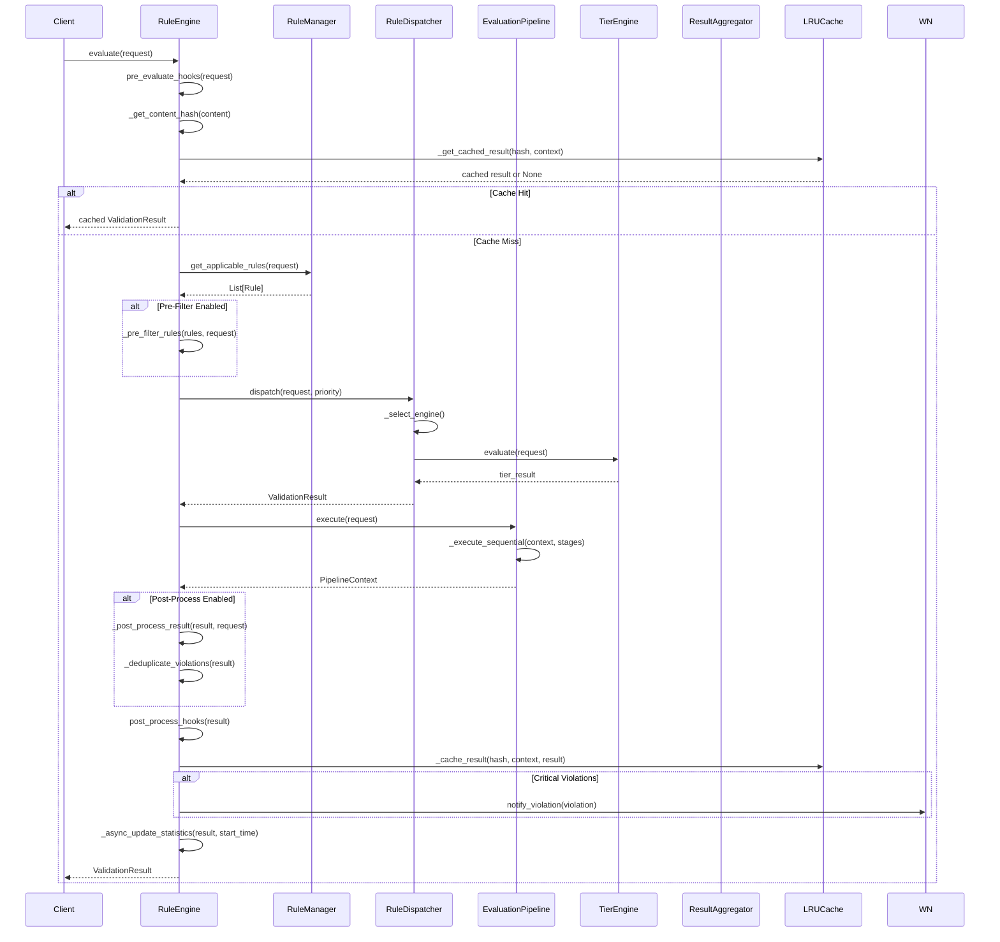
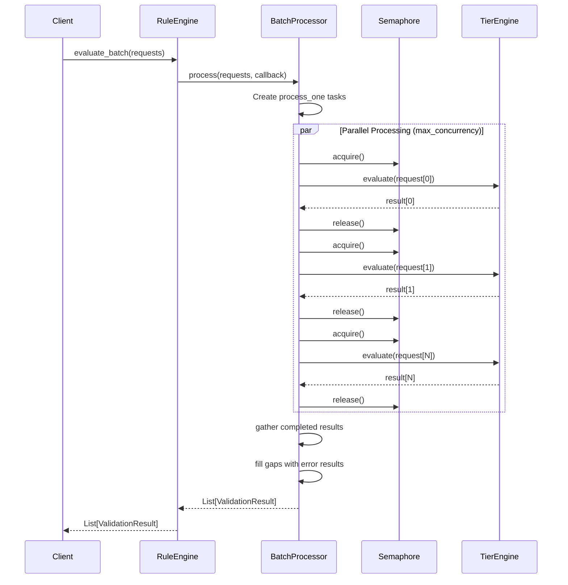
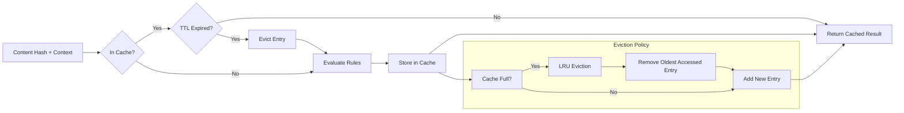
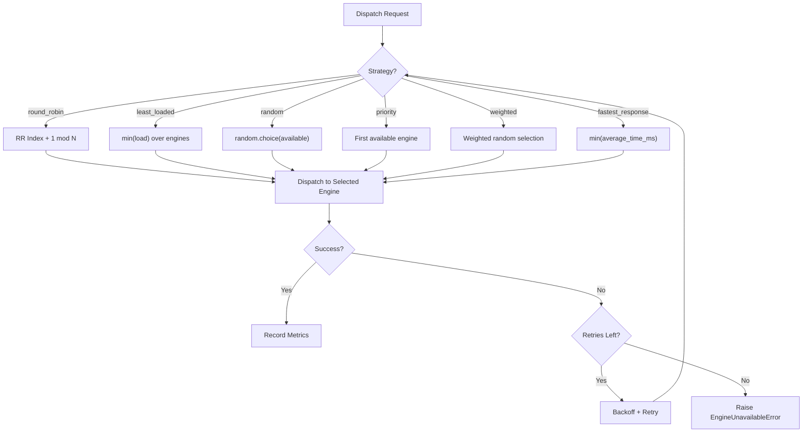

# Data Flow

## Primary Evaluation Sequence

The following sequence diagram illustrates the complete flow of a single evaluation request through the core engine components.



## Error Handling Flow

The following flowchart describes the error handling paths within the evaluation pipeline, covering timeouts, engine failures, and pipeline stage errors.

```mermaid
flowchart TD
    A["Evaluation Request"] --> B{"Engine Available?"}
    B -->|No| C["Circuit Breaker Open?"]
    C -->|Yes - Open| D["Check Recovery Timeout"]
    D -->{"Recovery Elapsed?"}
    D -->|No| E["Return EngineUnavailableError"]
    D -->|Yes| F["Transition to Half-Open"]
    F --> G["Allow Probe Request"]
    G --> H{"Probe Succeeds?"}
    H -->|Yes| I["Close Circuit Breaker"]
    H -->|No| J["Reopen Circuit Breaker"]
    I --> K["Dispatch Request"]
    J --> E
    B -->|Yes| K
    K --> L{"Dispatch Timeout?"}
    L -->|Yes| M{"Retries Remaining?"}
    M -->|Yes| N["Increment Retry Count"]
    N --> O["Backoff Sleep"]
    O --> B
    M -->|No| P["Raise DispatchTimeoutError"]
    L -->|No| Q{"Stage Timeout?"}
    Q -->|Yes| R{"Stage Required?"}
    R -->|Yes| S["Raise StageExecutionError"]
    R -->|No| T{"Timeout Behavior?"}
    T -->|"skip"| U["Mark Stage Skipped"]
    T -->|"fail"| V["Abort Pipeline"]
    T -->|"retry"| W["Retry Stage"]
    W --> Q
    U --> X["Continue Next Stage"]
    V --> Y["Return Partial Result"]
    Q -->|No| Z{"Stage Failed?"}
    Z -->|Yes| AA{"Fail on Stage Error?"}
    AA -->|Yes| AB["Raise Pipeline Error"]
    AA -->|No| AC["Log Warning, Continue"]
    AC --> X
    Z -->|No| AD{"All Stages Complete?"}
    AD -->|No| X
    AD -->|Yes| AE["Aggregate Results"]
    AE --> AF["Return ValidationResult"]

    B --> AG{"Engine Health Check Failed?"}
    AG -->|Yes| AH["Mark Engine DEGRADED"]
    AH --> AI["Try Next Available Engine"]
    AI --> B
```

## Data Transformation Pipeline

The following diagram shows how data is transformed as it flows through each stage of the evaluation process.

```mermaid
flowchart LR
    subgraph Input["Input Layer"]
        A["Raw Content (str)"] --> B["RuleEvaluationRequest"]
        B --> C["Content Hash (sha256)"]
    end

    subgraph PreProcessing["Pre-Processing"]
        C --> D["Rule Selection"]
        D --> E["Rule List"]
        E --> F["Pre-Filtering"]
        F --> G["Filtered Rule List"]
    end

    subgraph Evaluation["Evaluation Layer"]
        G --> H["Tiered Evaluation"]
        H --> I["Safety Check"]
        I --> J["Operational Check"]
        J --> K["Preference Check"]
        K --> L["Violation List"]
    end

    subgraph PostProcessing["Post-Processing"]
        L --> M["Deduplication"]
        M --> N["Deduplicated Violations"]
        N --> O["Post-Process Hooks"]
        O --> P["Processed Violations"]
    end

    subgraph Aggregation["Aggregation Layer"]
        P --> Q["Weighted Scoring"]
        Q --> R["Confidence Calculation"]
        R --> S["Score + Confidence"]
        S --> T["AggregatedResult"]
    end

    subgraph Output["Output Layer"]
        T --> U["Cache Storage"]
        T --> V["Statistics Update"]
        T --> W["JSON Response"]
        T --> X["Prometheus Export"]
        T --> Y["Webhook Notification"]
    end

    subgraph Serialization["Serialization"]
        W --> Z["to_dict()"]
        Z --> AA["JSON Serialization"]
        Y --> AB["_build_payload()"]
        AB --> AC["HTTP POST"]
    end

    style A fill:#e1f5fe
    style W fill:#c8e6c9
    style X fill:#c8e6c9
    style Y fill:#c8e6c9
    style AA fill:#fff3e0
    style AC fill:#fff3e0
```



## Batch Processing Flow



## Cache Lifecycle



## Dispatch Strategy Selection


