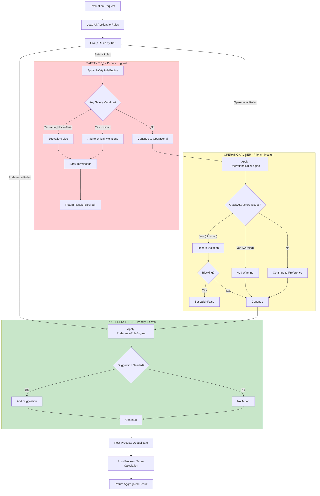
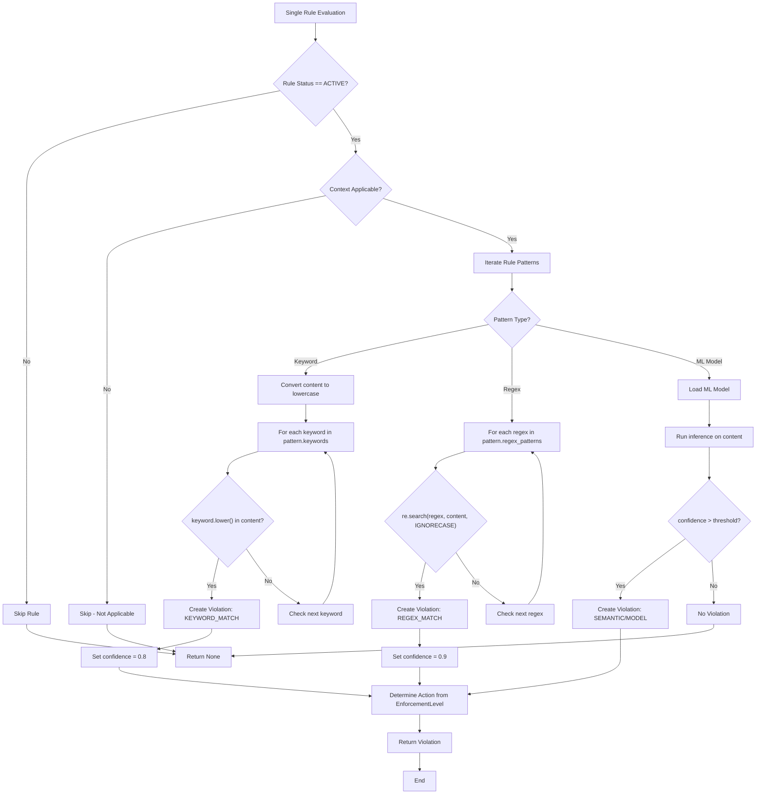
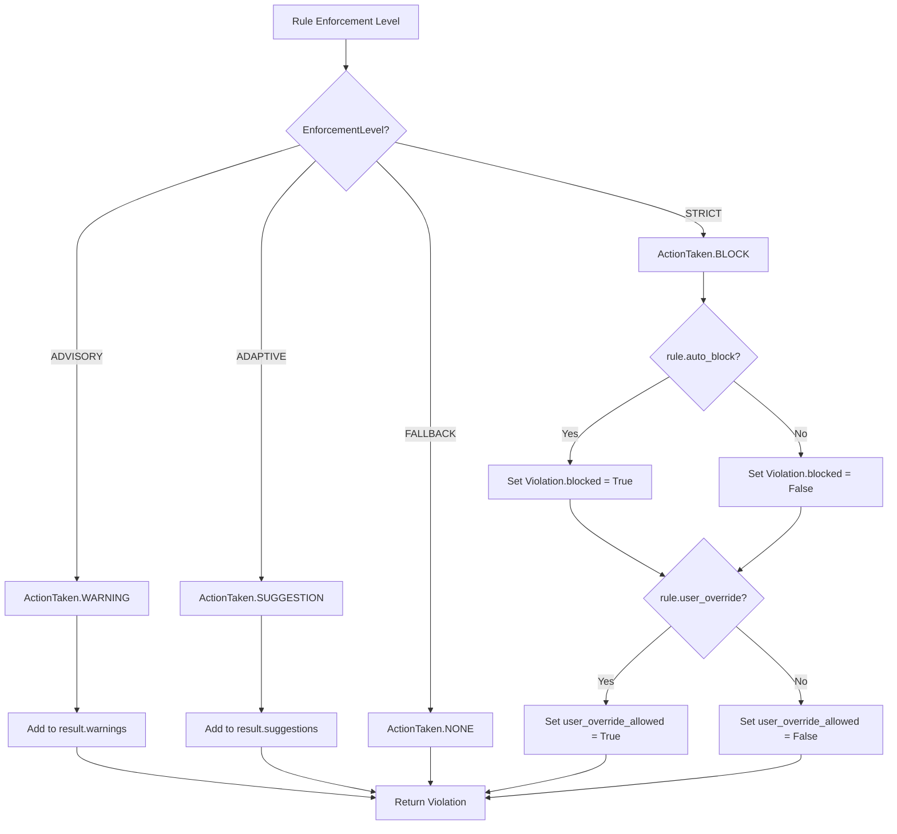
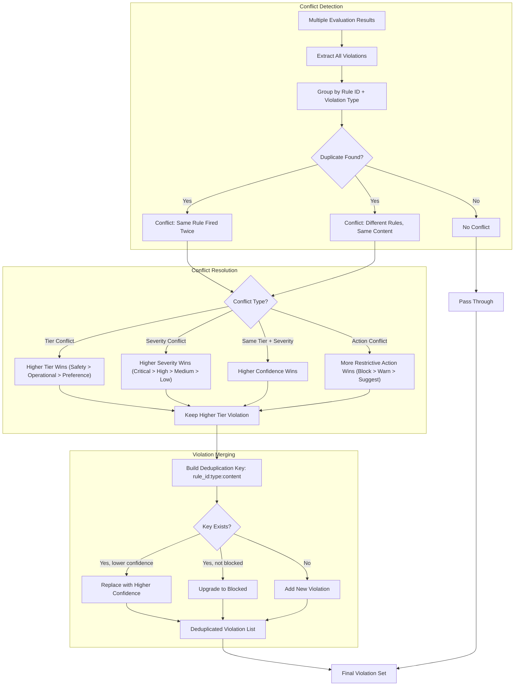
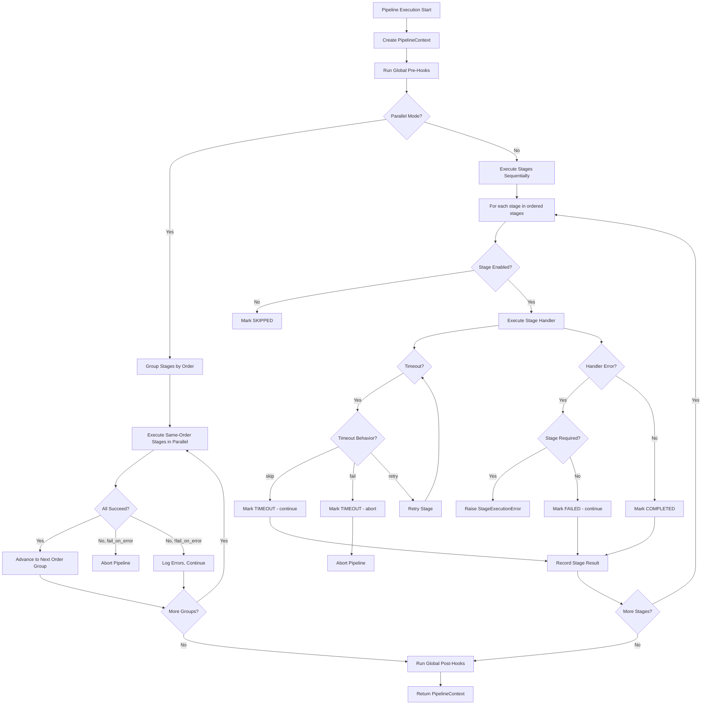
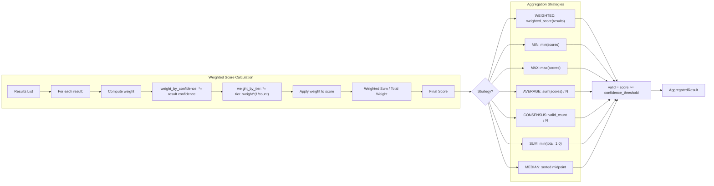
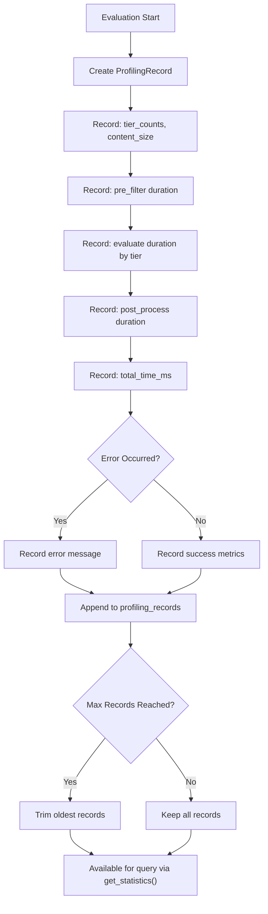

# Reasoning & Decision Logic

## Tiered Rule Selection Logic

The core engine evaluates rules in a strict three-tier hierarchy. Each tier has distinct evaluation semantics and early-termination conditions.

## Rule Evaluation Decision Tree

The following decision tree shows the branching logic for evaluating a single rule against input content.

## Action Determination Logic

## Conflict Detection & Resolution Reasoning

The `RuleDispatcher` and `ResultAggregator` contain logic for detecting and resolving conflicts between rules and evaluation results.

## Pipeline Stage Decision Logic

## Scoring & Aggregation Reasoning

## Profiling & Decision Tracing

