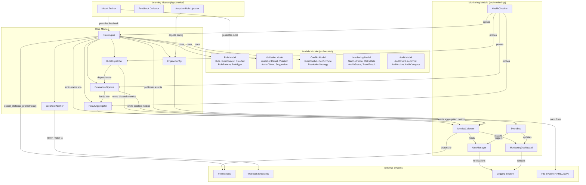
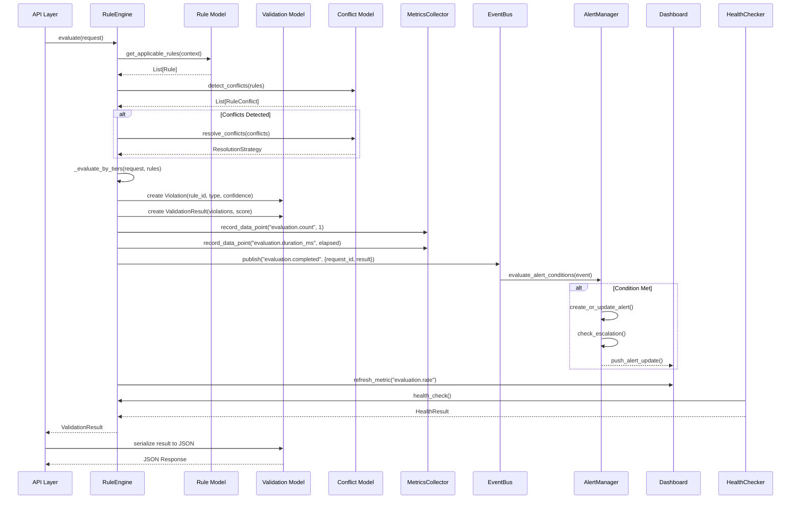
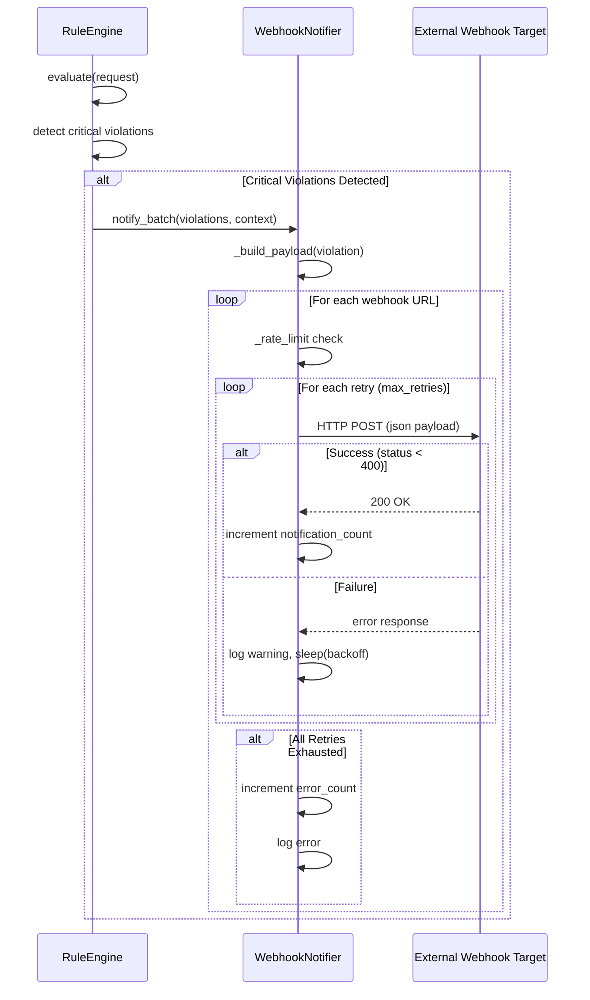

# Integration with Other Modules

## Component Diagram

The following diagram shows how the Core Rule Engine module integrates with Models, Monitoring, and external systems.



## Cross-Module Integration Sequence

The following sequence diagram shows how the core module integrates with models and monitoring during a complete evaluation lifecycle.



## API Surface Diagram

```mermaid
flowchart LR
    subgraph PublicAPI["Public API Surface"]
        IN["evaluate(request) -> ValidationResult"]
        IB["evaluate_batch(requests) -> List[ValidationResult]"]
        IT["evaluate_tiered(request) -> ValidationResult"]
        STAT["get_statistics() -> Dict"]
        CACHE["clear_cache() -> void"]
        EXPORT["export_statistics_json(path) -> Dict"]
        PROM["export_statistics_prometheus() -> str"]
        START["start() -> void"]
    end

    subgraph InternalAPI["Internal API Surface"]
        GF["_get_applicable_rules(request) -> List[Rule]"]
        PF["_pre_filter_rules(rules, request) -> List[Rule]"]
        PP["_post_process_result(result, request) -> ValidationResult"]
        EB["_evaluate_by_tiers(request, rules) -> ValidationResult"]
        ES["_evaluate_single_rule(rule, content, context) -> Violation"]
        MERGE["_merge_tier_result(main, tier) -> void"]
        STATS["_update_statistics(result, start_time) -> void"]
    end

    subgraph HookAPI["Hook System"]
        PRE["add_pre_evaluate_hook(hook) -> void"]
        POST["add_post_process_hook(hook) -> void"]
    end

    PublicAPI --> InternalAPI
    PublicAPI --> HookAPI
```



## Integration Configuration

The `EngineConfig` provides a unified configuration interface shared across all modules:

```python
# Core module uses these config sections:
engine_config.get("engine.max_workers", 10)
engine_config.get("dispatcher.strategy", "round_robin")
engine_config.get("pipeline.timeout_per_stage_ms", 3000)
engine_config.get("aggregator.strategy", "weighted")
engine_config.get("monitoring.prometheus_enabled", False)

# Models module uses:
engine_config.get("cache.backend", "memory")
engine_config.get("logging.level", "INFO")

# Monitoring module uses:
engine_config.get("monitoring.export_interval", 300)
engine_config.get("monitoring.prometheus_port", 8000)
```

## Webhook Integration Flow



## Prometheus Export Integration

The core module exports metrics in Prometheus text format, which is consumed by the monitoring module and external Prometheus servers:

```
# HELP rule_engine_total_evaluations Total number of evaluations
# TYPE rule_engine_total_evaluations counter
rule_engine_total_evaluations 1234
# HELP rule_engine_average_time_ms Average processing time
# TYPE rule_engine_average_time_ms gauge
rule_engine_average_time_ms 45.2
# HELP rule_engine_cache_hits Cache hit count
# TYPE rule_engine_cache_hits counter
rule_engine_cache_hits 567
```
