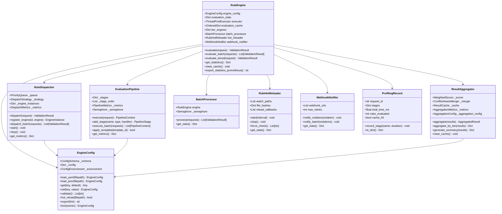

# Core Rule Engine Module

## Overview

The Core Rule Engine module is the central evaluation system that processes content against a three-tier rule architecture. It handles rule selection, dispatch, pipeline execution, result aggregation, caching, profiling, and hot-reloading of rule definitions.

## Files

| File | Purpose |
|------|---------|
| `rule_engine.py` | Main `RuleEngine` with `CacheEntry`, `ProfilingRecord`, `RuleHotReloader`, `WebhookNotifier`, `BatchProcessor` |
| `engine_config.py` | `EngineConfig`, `ConfigSchema`, `ConfigProfile`, `ConfigProfileManager`, `ConfigBuilder`, `ConfigTemplate`, `ConfigChangeDetector` |
| `rule_dispatcher.py` | `RuleDispatcher`, `EngineInstance`, `CircuitBreaker`, `PriorityQueue`, `DispatchRequest`, `DispatchResult`, `DispatchMetrics` |
| `evaluation_pipeline.py` | `EvaluationPipeline`, `PipelineStage`, `PipelineContext`, `PipelineMetrics`, `PipelineTemplate`, `StageResult` |
| `result_aggregator.py` | `ResultAggregator`, `WeightedScorer`, `ConflictAwareMerger`, `ResultCache`, `AggregatedResult`, `AggregationConfig`, `AggregationMetrics` |
| `tiered_rules/` | Sub-directory with `safety_engine.py`, `operational_engine.py`, `preference_engine.py`, `tier_orchestrator.py`, `tier_metrics_collector.py` |

## Class Diagram



## Quick Start

```python
from rules_emerging_pattern.core import RuleEngine
from rules_emerging_pattern.models.rule import RuleEvaluationRequest, RuleContext

engine = RuleEngine()

request = RuleEvaluationRequest(
    content="User input content to evaluate",
    context=RuleContext(user_id="user_123", session_id="sess_456")
)

result = await engine.evaluate(request)

if result.valid:
    print("Content passed all rules")
else:
    for violation in result.violations:
        print(f"Violation: {violation.rule_name} - {violation.explanation}")
```

## API Reference

| Method | Return Type | Description |
|--------|-------------|-------------|
| `evaluate(request)` | `ValidationResult` | Evaluate a single request against all applicable rules |
| `evaluate_batch(requests)` | `List[ValidationResult]` | Evaluate multiple requests with concurrency control |
| `evaluate_tiered(request)` | `ValidationResult` | Evaluate through safety/operational/preference tiers sequentially |
| `get_statistics()` | `Dict` | Get comprehensive engine statistics |
| `clear_cache()` | `void` | Clear the evaluation result cache |
| `export_statistics_prometheus()` | `str` | Export stats in Prometheus text format |
| `export_statistics_json(filepath)` | `Dict` | Export stats to JSON file |
| `start()` | `void` | Start background services (hot-reload watcher) |

## Configuration

Configuration is managed through `EngineConfig` which supports loading from YAML, JSON, environment variables, and programmatic overrides. Key configuration sections include:

- `engine.*` - Engine behavior (workers, cache, profiling, webhooks, hot-reload)
- `dispatcher.*` - Dispatch strategy, queue sizing, circuit breaker thresholds
- `pipeline.*` - Pipeline stage configuration, timeouts, parallel execution
- `aggregator.*` - Aggregation strategy, deduplication, caching
- `cache.*` - Cache backend (memory, redis, memcached)
- `monitoring.*` - Metrics export and Prometheus integration
- `logging.*` - Log level, format, and rotation settings
