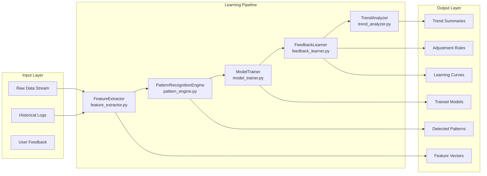
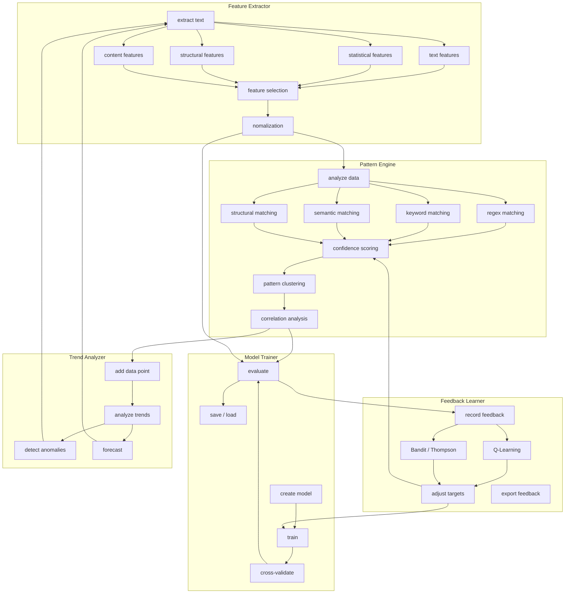
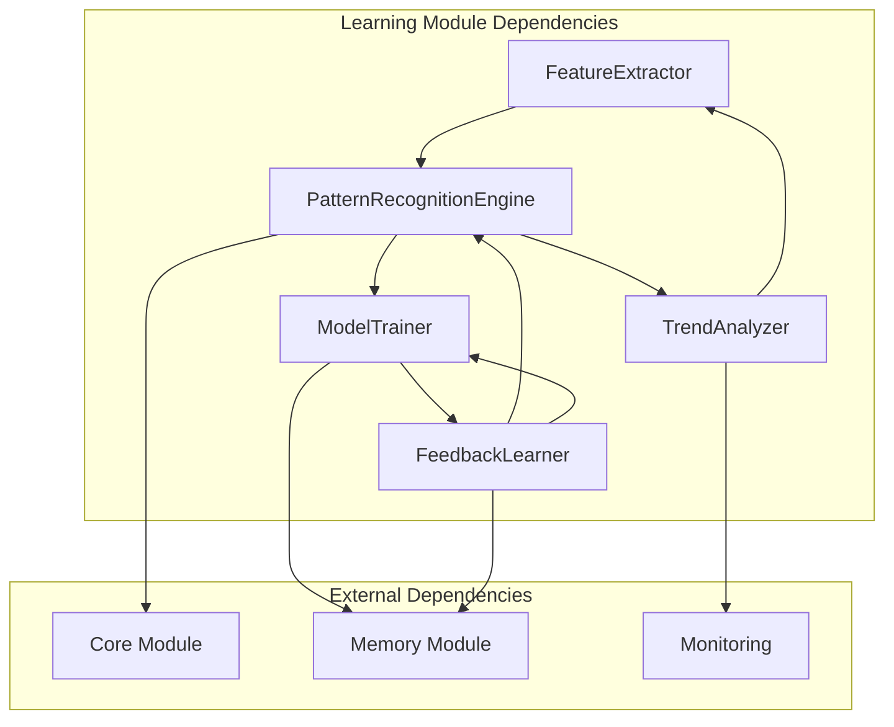
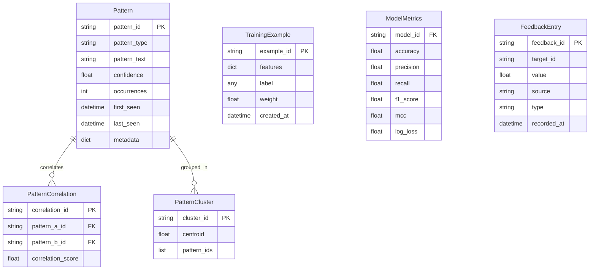

# Learning Module Architecture

## Overview

The Learning Module provides pattern discovery, trend analysis, feature engineering, model training, and adaptive feedback learning for the Rules-Emerging-Pattern system. It consists of five core components that form a sequential processing pipeline.

## Architecture Pipeline



## Component Architecture

### FeatureExtractor

The FeatureExtractor is the entry point of the learning pipeline. It extracts over 40 features from text data across four categories:

- **Text-level features**: word count, character count, ratios, sentence metrics
- **Statistical features**: entropy, vocabulary richness, hapax legomena, type-token ratio
- **Structural features**: paragraph count, code block ratio, header count, list items
- **Content features**: sentiment, readability, formality, subjectivity

It supports multiple normalization methods (min-max, z-score, robust, log, unit length) and feature selection (variance threshold, mutual information, chi-squared, correlation-based).

### PatternRecognitionEngine

The PatternRecognitionEngine detects and tracks recurring patterns using four matching strategies:

- **Regex matching**: structural signatures in log lines, IP addresses, API paths
- **Keyword matching**: exact and partial matches against tokenized fields
- **Semantic matching**: TF-IDF vectorization with cosine similarity
- **Structural matching**: data shape and schema fingerprinting

Patterns are clustered by similarity, correlated for dependency analysis, scored with confidence, and can automatically generate rules when confidence exceeds thresholds.

### ModelTrainer

The ModelTrainer trains supervised models for classification tasks. It supports three model types:

- **ThresholdModel**: simple weighted-sum with sigmoid confidence
- **WeightedModel**: logistic regression with learned feature weights
- **EnsembleModel**: voting, averaging, stacking, and boosting

Training includes dataset splitting (train/val/test), k-fold cross-validation, model versioning, persistence (save/load), and comprehensive evaluation metrics.

### FeedbackLearner

The FeedbackLearner implements reinforcement learning strategies for adaptive improvement:

- **Q-Learning**: state-action-reward updates with Q-table
- **Bandit**: epsilon-greedy action selection
- **Thompson Sampling**: beta-distribution based exploration

Feedback is recorded from multiple sources (user explicit, user implicit, system, cross-validation), aggregated by target, and used to adjust model parameters.

### TrendAnalyzer

The TrendAnalyzer analyzes time-series metric data to detect:

- **Trends**: direction detection (up/down/stable) with slope computation
- **Anomalies**: z-score and IQR-based outlier detection
- **Seasonal components**: periodic pattern detection
- **Forecasts**: linear, moving average, exponential smoothing, ARIMA-like, ensemble

## Class Diagram

```mermaid
classDiagram
    class PatternRecognitionEngine {
        +PatternConfig config
        +Dict~str, Pattern~ patterns
        +Dict~str, str~ pattern_templates
        +Dict~str, List~str~~ keyword_patterns
        +Dict~str, PatternCluster~ clusters
        +Dict~str, Dict~str, PatternCorrelation~~ correlations
        +analyze_data(data, context) List~Pattern~
        +get_patterns_by_type(type) List~Pattern~
        +get_top_patterns(limit) List~Pattern~
        +generate_rules_from_patterns() List~Dict~
        +export_patterns() Dict
        +import_patterns(data) Tuple~int, int~
        +validate_pattern(pattern) Dict
        +archive_stale_patterns() int
    }

    class TrendAnalyzer {
        +TrendConfig config
        +Dict~str, List~DataPoint~~ time_series_data
        +Dict~str, Trend~ detected_trends
        +Dict~str, List~Anomaly~~ detected_anomalies
        +Dict~str, SeasonalComponent~ seasonal_components
        +Dict~str, Dict~str, MetricCorrelation~~ metric_correlations
        +add_data_point(metric, value, timestamp, weight, metadata)
        +analyze_trends(metric_name) List~Trend~
        +detect_anomalies(metric_name, threshold) List~Anomaly~
        +forecast(metric_name, periods, method) List~float~
        +get_trend_summary() Dict
        +export_trend_data() Dict
    }

    class FeatureExtractor {
        +FeatureConfig config
        +Dict~str, FeatureDefinition~ feature_definitions
        +Dict~str, FeatureStatistics~ feature_stats
        +extract(text, context) FeatureVector
        +fit_normalization(vectors) void
        +select_features(vectors, method, top_k) List~str~
        +normalize(vector) FeatureVector
        +export_config() Dict
        +compute_feature_statistics() Dict~str, FeatureStatistics~
    }

    class ModelTrainer {
        +TrainerConfig config
        +List~TrainingExample~ examples
        +Dict~str, BaseModel~ models
        +Dict~str, ModelMetrics~ model_metrics
        +Dict~str, List~ModelVersion~~ model_versions
        +add_example(features, label, weight) TrainingExample
        +create_model(model_id, model_type) BaseModel
        +train(model_id, dataset) ModelMetrics
        +evaluate(model_id, dataset) ModelMetrics
        +cross_validate(model_id, dataset, folds) Dict
        +predict(model_id, features) Tuple~Any, float~
        +save_model(model_id, filepath) str
        +load_model(filepath) str
    }

    class FeedbackLearner {
        +FeedbackConfig config
        +List~FeedbackEntry~ feedback_history
        +Dict~str, FeedbackAggregate~ feedback_aggregates
        +Dict~str, float~ target_adjustments
        +Dict~str, float~ target_confidence
        +List~LearningProgress~ learning_progress
        +Dict~str, Dict~str, float~~ q_table
        +record_feedback(target_id, value, source, type, confidence) FeedbackEntry
        +record_user_feedback(target_id, rating, explicit) FeedbackEntry
        +run_episode(feedback_batch) LearningProgress
        +get_adjustment(target_id) float
        +get_confidence(target_id) float
        +get_learning_curve() List~Dict~
        +export_feedback() Dict
    }

    PatternRecognitionEngine --> PatternConfig
    PatternRecognitionEngine --> Pattern
    PatternRecognitionEngine --> PatternCluster
    PatternRecognitionEngine --> PatternCorrelation
    TrendAnalyzer --> TrendConfig
    TrendAnalyzer --> DataPoint
    TrendAnalyzer --> Trend
    TrendAnalyzer --> Anomaly
    TrendAnalyzer --> SeasonalComponent
    TrendAnalyzer --> MetricCorrelation
    FeatureExtractor --> FeatureConfig
    FeatureExtractor --> FeatureDefinition
    FeatureExtractor --> FeatureVector
    FeatureExtractor --> ExtractedFeature
    FeatureExtractor --> FeatureStatistics
    ModelTrainer --> TrainerConfig
    ModelTrainer --> TrainingExample
    ModelTrainer --> Dataset
    ModelTrainer --> BaseModel
    ModelTrainer --> ThresholdModel
    ModelTrainer --> WeightedModel
    ModelTrainer --> EnsembleModel
    ModelTrainer --> ModelMetrics
    ModelTrainer --> ModelVersion
    FeedbackLearner --> FeedbackConfig
    FeedbackLearner --> FeedbackEntry
    FeedbackLearner --> FeedbackAggregate
    FeedbackLearner --> LearningProgress
```



## Pipeline Architecture Detail



## Configuration Architecture

Each component uses a dataclass-based configuration pattern with sensible defaults:

```python
@dataclass
class PatternConfig:
    min_confidence: float = 0.3
    decay_rate: float = 0.1
    cluster_similarity_threshold: float = 0.7
    rule_generation_threshold: float = 0.8
    base_occurrences: int = 5
    min_keyword_matches: int = 2
    semantic_threshold: float = 0.6
    structural_threshold: float = 0.7
    max_patterns: int = 10000

@dataclass
class TrendConfig:
    trend_window: int = 10
    anomaly_threshold: float = 2.0
    seasonal_period: int = 24
    min_data_points: int = 5
    forecast_horizon: int = 10

@dataclass
class FeatureConfig:
    enable_text_features: bool = True
    enable_statistical_features: bool = True
    enable_structural_features: bool = True
    enable_content_features: bool = True
    default_normalization: str = "min_max"
    max_features: int = 50

@dataclass
class TrainerConfig:
    test_ratio: float = 0.2
    val_ratio: float = 0.1
    cross_validation_folds: int = 5
    learning_rate: float = 0.01
    max_iterations: int = 1000
    regularization: float = 0.01

@dataclass
class FeedbackConfig:
    learning_rate: float = 0.1
    discount_factor: float = 0.9
    exploration_rate: float = 0.3
    exploration_decay: float = 0.995
    min_exploration_rate: float = 0.01
    episode_size: int = 100
    feedback_ttl_days: int = 30
```

## Component Dependencies



## Storage Architecture

The learning module uses five storage backends:

| Store | Purpose | Managed By |
|-------|---------|------------|
| Pattern Store | Discovered patterns with metadata | PatternRecognitionEngine |
| Metric Store | Time-series data points | TrendAnalyzer |
| Model Registry | Trained model versions | ModelTrainer |
| Feedback Store | Feedback history and aggregates | FeedbackLearner |
| Feature Store | Feature definitions and statistics | FeatureExtractor |

