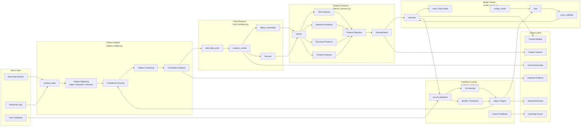
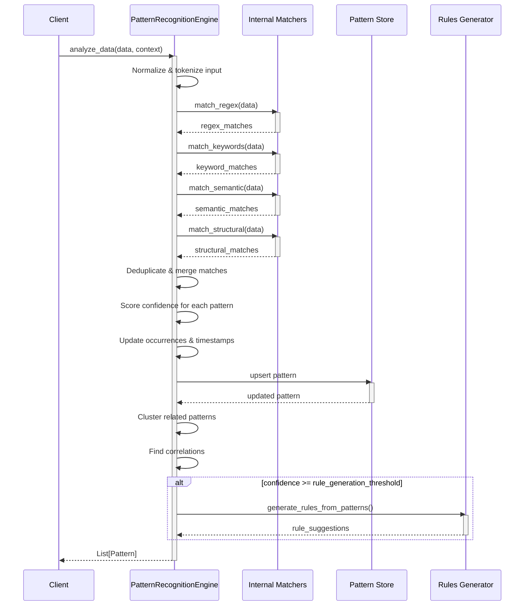
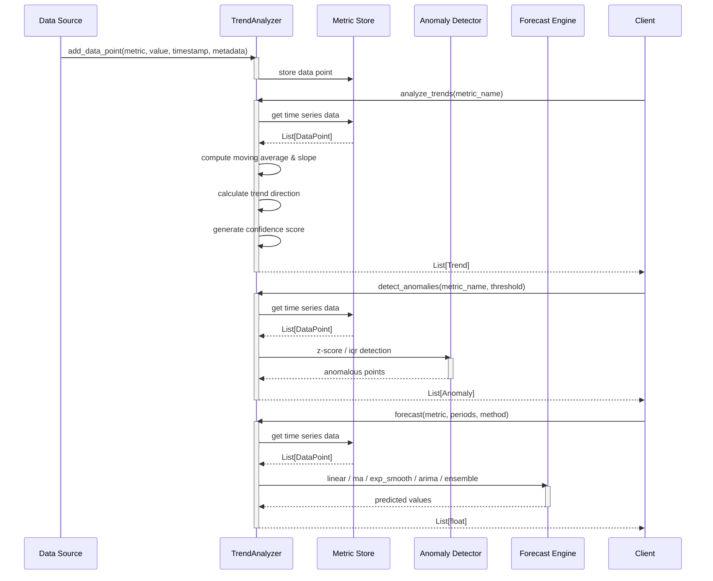
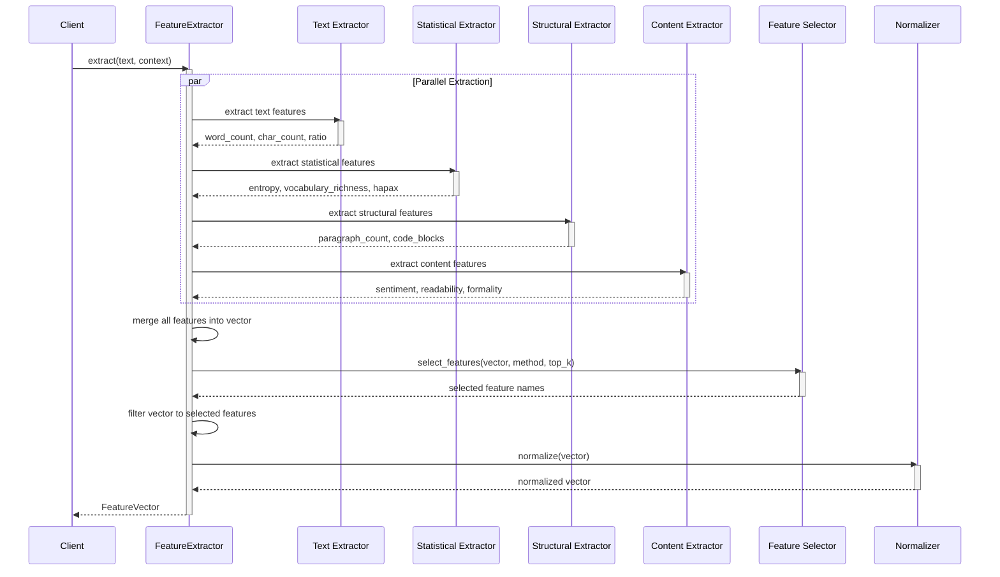
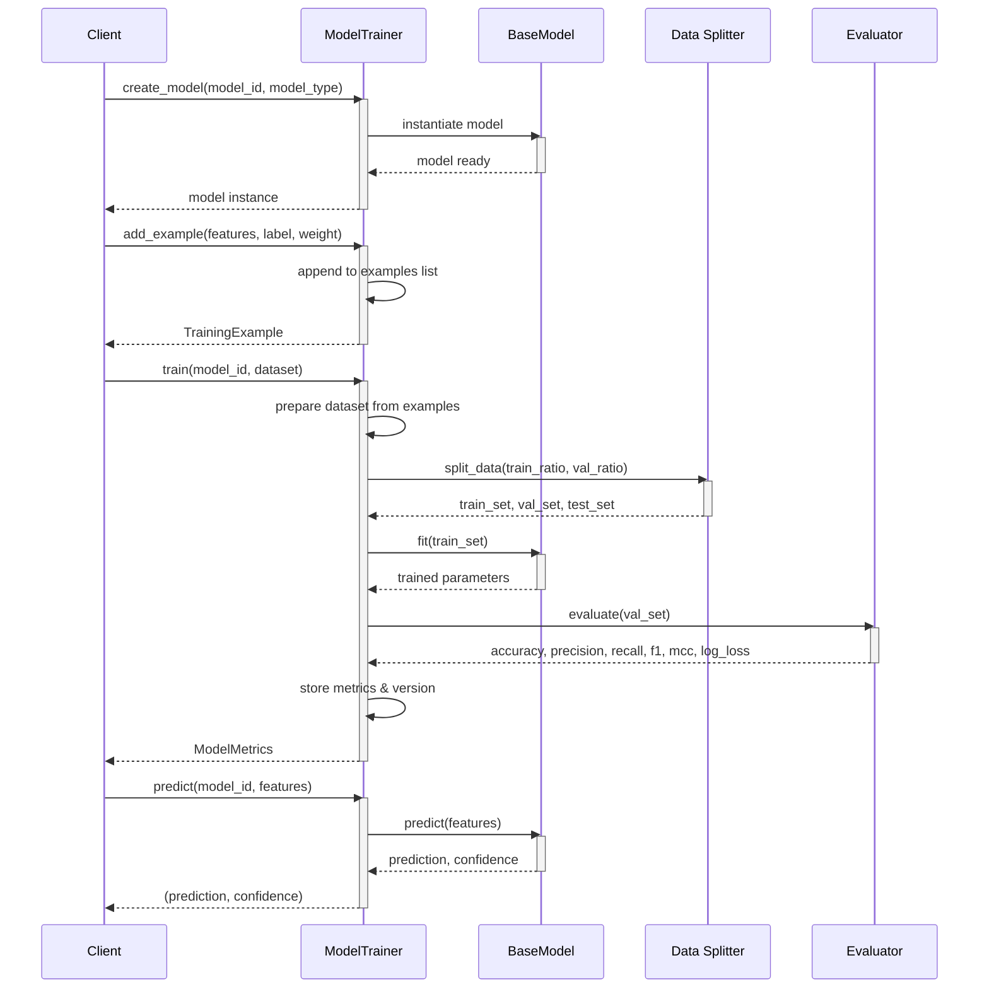
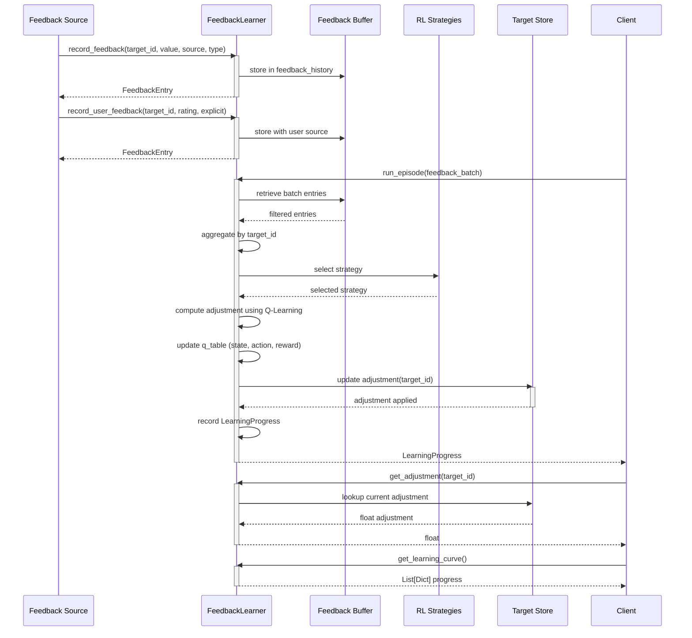
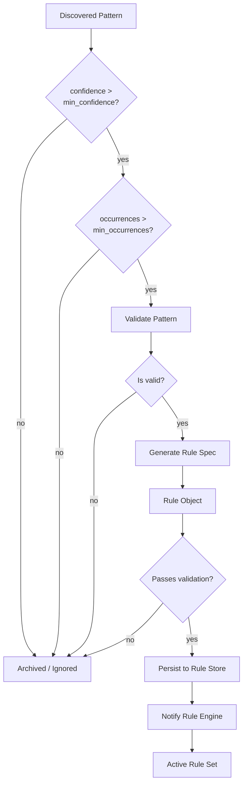
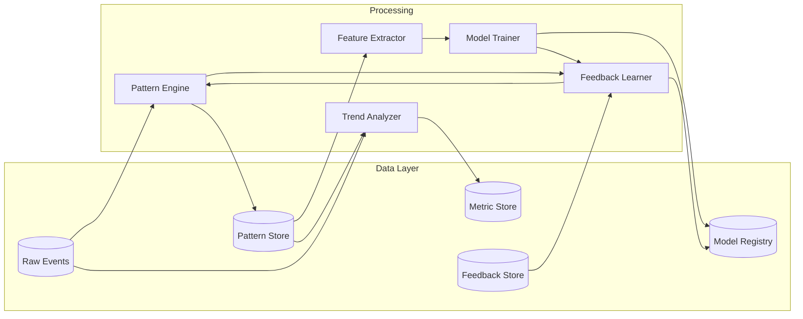

# Learning Module Data Flow

## End-to-End Pipeline

The learning pipeline processes data through five stages: raw input, feature extraction, pattern detection, model training, and feedback learning. Each stage passes structured data to the next, with loops for continuous improvement.



## Pattern Detection Sequence

This sequence shows how the `PatternRecognitionEngine.analyze_data()` method invokes internal matchers, updates pattern metadata, and triggers rule generation.



## Trend Analysis Sequence

The `TrendAnalyzer` pipeline: data points are added incrementally, trends are computed on demand, and anomalies are flagged when deviations exceed configurable thresholds.



## Feature Extraction Sequence

The `FeatureExtractor` runs four parallel extraction pathways — text, statistical, structural, and content — then merges, filters, and normalizes results into a single `FeatureVector`.



## Training & Evaluation Sequence

The `ModelTrainer` pipeline showing model creation, example collection, training with dataset splitting, evaluation, and persistence.



## Feedback Learning Sequence

The `FeedbackLearner` runs episodic reinforcement learning: feedback is recorded via multiple sources, aggregated, then used to update target adjustments via Q-learning or bandit strategies.



## Pattern-to-Rule Flow

High-confidence patterns automatically trigger rule generation. This diagram shows how patterns pass the threshold gate, convert to rule specifications, and are validated before integration.



## Anomaly Decision Flow

How the `TrendAnalyzer.detect_anomalies()` method decides whether a data point is anomalous.

```mermaid
flowchart TD
    DP[Data Point] --> ZSCORE[Compute z-score<br/>from rolling mean/std]
    ZSCORE --> ZC{abs(z) > threshold?}
    ZC -->|no| IQR[Compute IQR bounds]
    IQR --> IQC{outside Q1-1.5IQR<br/>or Q3+1.5IQR?}
    IQC -->|no| Normal[Mark Normal]
    IQC -->|yes| Anomaly[Mark Anomaly]
    ZC -->|yes| Anomaly
    Anomaly --> Ctx{Check contextual<br/>metadata filter?}
    Ctx -->|passes| Flag[Flag as Anomaly]
    Ctx -->|filtered| Normal
```

## Data Flow Diagram

