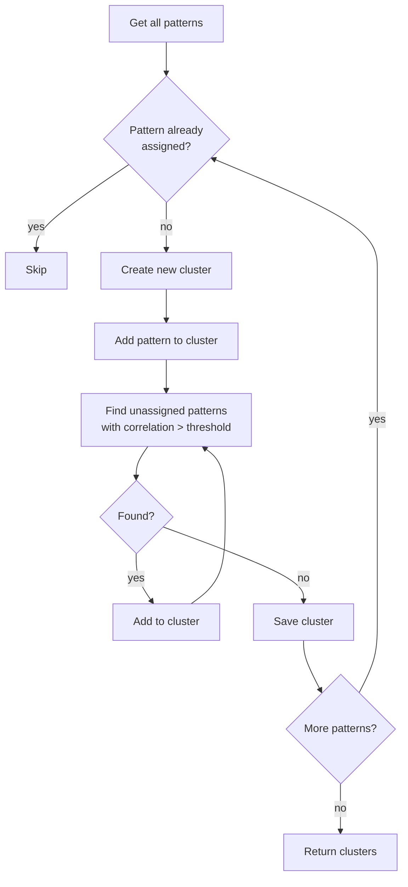
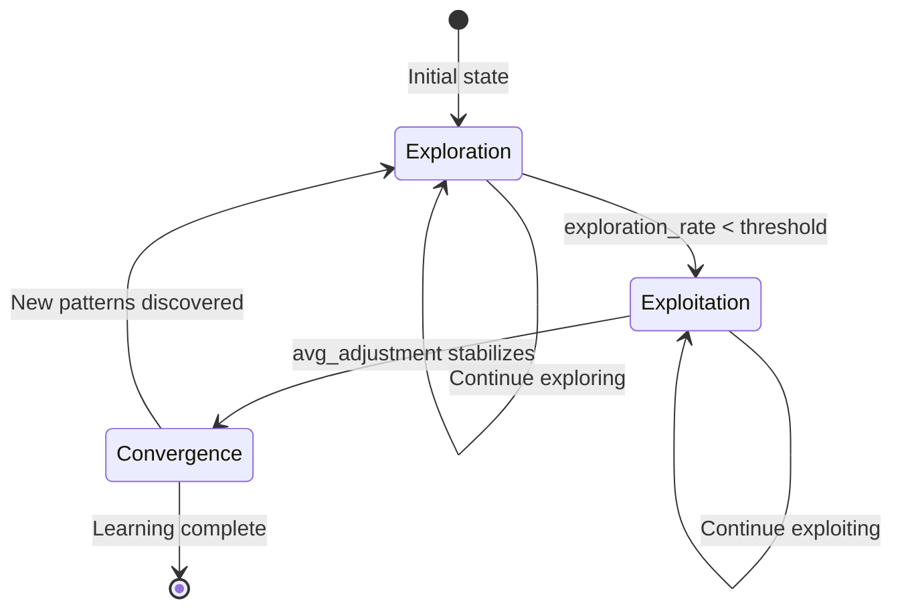

# Learning Module Reasoning & Logic

## Detection Methods

### Regex Matching

The `PatternRecognitionEngine` compiles and applies regex patterns against input data to identify structural signatures.

```python
def match_regex(self, data: Dict[str, Any]) -> List[PatternMatch]:
    for template_id, template in self.pattern_templates.items():
        compiled = re.compile(template.get("regex", ""))
        for field, value in data.items():
            match = compiled.search(str(value))
            if match:
                yield PatternMatch(template_id, field, match.groups())
```

Used for: log line formats, IP address patterns, API path conventions, error code patterns.

### Keyword Matching

Keyword-based detection supports exact and partial matches against tokenized fields.

```python
def match_keywords(self, data: Dict[str, Any]) -> List[PatternMatch]:
    for pattern_id, keywords in self.keyword_patterns.items():
        for field, value in data.items():
            tokens = str(value).lower().split()
            matched_kw = [kw for kw in keywords if kw.lower() in tokens]
            if len(matched_kw) >= self.config.min_keyword_matches:
                yield PatternMatch(pattern_id, field, matched_kw)
```

Used for: event type classification, action detection, severity tagging.

### Semantic Matching

Uses embedding-based similarity to detect patterns that are lexically different but semantically equivalent. The current implementation uses TF-IDF vectorization with cosine similarity.

```python
def match_semantic(self, data: Dict[str, Any]) -> List[PatternMatch]:
    text = " ".join(str(v) for v in data.values())
    query_vec = self._vectorizer.transform([text])
    for pid, profile in self.semantic_profiles.items():
        profile_vec = self._vectorizer.transform([profile["text"]])
        similarity = cosine_similarity(query_vec, profile_vec)[0][0]
        if similarity >= self.config.semantic_threshold:
            yield PatternMatch(pid, "semantic", similarity)
```

Used for: intent detection, paraphrased commands, functionally equivalent operations.

### Structural Matching

Compares the data structure (key presence, types, nesting levels, array lengths) against known structural signatures.

```python
def match_structural(self, data: Dict[str, Any]) -> List[PatternMatch]:
    sig = self._extract_structure_signature(data)
    for pid, profile in self.structural_profiles.items():
        sim = self._structure_similarity(sig, profile["signature"])
        if sim >= self.config.structural_threshold:
            yield PatternMatch(pid, "structure", sim)
```

Used for: API schema fingerprinting, event format identification, data shape detection.

## Confidence Scoring Decision Logic

Confidence combines match strength, frequency, and recency into a composite score.

```python
def calculate_confidence(self, pattern: Pattern) -> float:
    match_score = pattern.match_similarity
    freq = pattern.occurrences / max(self.config.base_occurrences, 1)
    recency = exp(-self.config.decay_rate * hours_since(pattern.last_seen))
    confidence = (0.3 * match_score + 0.4 * freq + 0.3 * recency)
    return min(confidence, 1.0)
```

```mermaid
flowchart TD
    subgraph Input["Confidence Inputs"]
        MS[Match Similarity]
        OC[Occurrence Count]
        LS[Last Seen Timestamp]
    end

    subgraph Compute["Computation"]
        W1[Weight: 0.3]
        W2[Weight: 0.4]
        W3[Weight: 0.3]
        C1[MS * 0.3]
        C2[FR * 0.4]
        C3[RC * 0.3]
    end

    subgraph Output["Output"]
        SUM[C1 + C2 + C3]
        CLIP[min(confidence, 1.0)]
    end

    MS --> W1
    OC --> W2
    LS --> W3
    W1 --> C1
    W2 --> C2
    W3 --> C3
    C1 --> SUM
    C2 --> SUM
    C3 --> SUM
    SUM --> CLIP
```

| Weight | Component | Description |
|--------|-----------|-------------|
| 0.3 | Match similarity | How closely the input matches the pattern profile |
| 0.4 | Frequency ratio | Occurrences relative to base occurrence threshold |
| 0.3 | Recency factor | Exponential decay from last seen timestamp |

## Clustering Logic

Pattern clustering groups related patterns using a similarity threshold. The `cluster_patterns()` method builds clusters from pairwise correlations.

```python
def cluster_patterns(self) -> Dict[str, PatternCluster]:
    patterns = list(self.patterns.values())
    clusters = {}
    assigned = set()

    for p in patterns:
        if p.pattern_id in assigned:
            continue
        cluster = PatternCluster(cluster_id=f"PC{len(clusters)+1:04d}")
        cluster.add_pattern(p)
        assigned.add(p.pattern_id)

        for other in patterns:
            if other.pattern_id in assigned:
                continue
            corr = self.correlations.get(p.pattern_id, {}).get(other.pattern_id, 0)
            if corr >= self.config.cluster_similarity_threshold:
                cluster.add_pattern(other)
                assigned.add(other.pattern_id)

        clusters[cluster.cluster_id] = cluster

    return clusters
```



## Trend Analysis Reasoning

### Trend Direction Detection

```python
def _detect_direction(data: List[DataPoint]) -> TrendDirection:
    x = list(range(len(data)))
    y = [dp.value for dp in data]
    slope, _ = np.polyfit(x, y, 1)
    if slope > 0.01:
        return TrendDirection.UP
    elif slope < -0.01:
        return TrendDirection.DOWN
    return TrendDirection.STABLE
```

### Forecast Methods

| Method | Class | Formula | Use Case |
|--------|-------|---------|----------|
| Linear | `LinearForecast` | `y = mx + b` | Steady trends |
| Moving Average | `MovingAverageForecast` | `y_t = (1/k) * sum(y_{t-i})` | Smoothing noise |
| Exponential Smoothing | `ExponentialSmoothingForecast` | `y_t = alpha*x_t + (1-alpha)*y_{t-1}` | Short-term |
| ARIMA-like | `ArimaForecast` | `ARIMA(p,d,q)` | Seasonal data |
| Ensemble | `EnsembleForecast` | Weighted average of methods | Robust prediction |

### Anomaly Detection Logic

Uses two complementary methods:

1. **Z-Score**: `z = (x - mu) / sigma` — points with `|z| > threshold` are anomalies
2. **IQR**: `Q1 - 1.5*IQR` and `Q3 + 1.5*IQR` — points outside these bounds are anomalies

An anomaly is flagged if it exceeds either threshold, unless a contextual filter explicitly excludes it.

```mermaid
flowchart TD
    DP[Data Point] --> ZSCORE[Compute z-score<br/>from rolling mean/std]
    ZSCORE --> ZC{abs(z) > threshold?}
    ZC -->|no| IQR[Compute IQR bounds]
    IQR --> IQC{outside Q1-1.5IQR<br/>or Q3+1.5IQR?}
    IQC -->|no| Normal[Mark Normal]
    IQC -->|yes| Anomaly[Mark Anomaly]
    ZC -->|yes| Anomaly
    Anomaly --> Ctx{Check contextual<br/>metadata filter?}
    Ctx -->|passes| Flag[Flag as Anomaly]
    Ctx -->|filtered| Normal
```

## Feature Extraction Reasoning

### Text Features

| Feature ID | Description | Formula |
|------------|-------------|---------|
| `word_count` | Total words | `len(tokens)` |
| `char_count` | Total characters | `len(text)` |
| `char_per_word` | Average chars per word | `char_count / max(word_count, 1)` |
| `avg_word_length` | Mean word length | `mean(len(t) for t in tokens)` |
| `max_word_length` | Longest word | `max(len(t) for t in tokens)` |
| `min_word_length` | Shortest word | `min(len(t) for t in tokens)` |
| `uppercase_ratio` | Uppercase chars / total chars | `sum(c.isupper()) / max(char_count, 1)` |
| `digit_ratio` | Digit chars / total chars | `sum(c.isdigit()) / max(char_count, 1)` |
| `space_ratio` | Space chars / total chars | `sum(c.isspace()) / max(char_count, 1)` |
| `punctuation_ratio` | Punctuation chars / total chars | `sum(c in string.punctuation) / max(char_count, 1)` |
| `special_char_ratio` | Non-alphanumeric / total chars | `sum(not c.isalnum()) / max(char_count, 1)` |
| `avg_sentence_length` | Mean sentence length in words | `mean(len(s.split()) for s in sentences)` |
| `sentence_count` | Number of sentences | `len(sentences)` |

### Statistical Features

| Feature ID | Description | Formula |
|------------|-------------|---------|
| `entropy` | Shannon entropy of character distribution | `-sum(p_i * log2(p_i))` |
| `vocabulary_richness` | Unique words / total words | `len(set(tokens)) / max(len(tokens), 1)` |
| `hapax_legomena_ratio` | Words appearing once / total words | `single_occurrence_count / max(len(tokens), 1)` |
| `type_token_ratio` | Unique types vs total tokens | `len(types) / max(len(tokens), 1)` |
| `word_freq_std` | Std dev of word frequencies | `std(freq.values())` |
| `word_freq_skew` | Skewness of word frequencies | `skew(freq.values())` |

### Structural Features

| Feature ID | Description |
|------------|-------------|
| `paragraph_count` | Number of paragraphs (split by `\n\n`) |
| `line_count` | Number of lines |
| `code_block_count` | Number of fenced code blocks |
| `code_block_ratio` | Code lines / total lines |
| `bullet_point_count` | Number of bullet points |
| `numbered_list_count` | Number of numbered items |
| `header_count` | Number of markdown headers |
| `link_count` | Number of markdown links |
| `image_count` | Number of markdown images |
| `quote_count` | Number of block quotes |
| `table_count` | Number of markdown tables |

### Content Features

| Feature ID | Description | Method |
|------------|-------------|--------|
| `sentiment` | Polarity score (-1 to 1) | Pattern-based positive/negative word matching |
| `readability` | Flesch-like readability score | `206.835 - 1.015*(words/sentences) - 84.6*(syllables/words)` |
| `formality` | Formality score (0 to 1) | Ratio of formal markers (passive voice, nominalizations, long words) |
| `subjectivity` | Subjective vs objective (0 to 1) | Ratio of subjective markers (opinion words, modals, hedges) |

## Normalization Methods

```python
def normalize(self, vector: FeatureVector, method: str = "min_max") -> FeatureVector:
    if method == "min_max":
        v = (v - min_v) / (max_v - min_v)
    elif method == "z_score":
        v = (v - mean) / std
    elif method == "robust":
        v = (v - median) / iqr
    elif method == "log":
        v = log(1 + v)
    elif method == "unit_length":
        v = v / norm(vector)
```

## Model Training Logic

### Threshold Model

The simplest model: predicts positive class if the weighted sum exceeds a threshold.

```python
class ThresholdModel(BaseModel):
    def _predict(self, features: Dict[str, float]) -> Any:
        score = sum(features.get(f, 0) * w for f, w in self.weights.items())
        self.last_confidence = 1.0 / (1.0 + exp(-score))
        return self.last_confidence >= self.threshold
```

### Weighted Model

Assigns learned weights to each feature. Training adjusts weights to minimize logistic loss.

```python
class WeightedModel(BaseModel):
    def fit(self, dataset: Dataset):
        X = np.array([[ex.features.get(f, 0) for f in self.feature_names] for ex in dataset.examples])
        y = np.array([1 if ex.label else 0 for ex in dataset.examples])
        w = np.array([ex.weight for ex in dataset.examples])
        self.weights = self._optimize_logistic(X, y, w)
```

### Ensemble Model

Combines multiple sub-models via voting, averaging, stacking, or boosting.

```python
class EnsembleModel(BaseModel):
    def _predict(self, features: Dict[str, float]) -> Any:
        predictions = [m.predict(features) for m in self.models]
        if self.ensemble_method == "voting":
            return mode(predictions)
        elif self.ensemble_method == "averaging":
            scores = [m.predict_proba(features) for m in self.models]
            return mean(scores) >= 0.5
        elif self.ensemble_method == "stacking":
            meta_features = [m.predict_proba(features) for m in self.base_models]
            return self.meta_model.predict(meta_features)
```

## Evaluation Metrics

All metrics are computed by `ModelMetrics`:

| Metric | Formula | Range |
|--------|---------|-------|
| Accuracy | `(TP + TN) / (TP + TN + FP + FN)` | [0, 1] |
| Precision | `TP / (TP + FP)` | [0, 1] |
| Recall | `TP / (TP + FN)` | [0, 1] |
| F1 Score | `2 * P * R / (P + R)` | [0, 1] |
| Specificity | `TN / (TN + FP)` | [0, 1] |
| MCC | `(TP*TN - FP*FN) / sqrt((TP+FP)(TP+FN)(TN+FP)(TN+FN))` | [-1, 1] |
| ROC-AUC | Area under ROC curve | [0, 1] |
| Log Loss | `-sum(y*log(p) + (1-y)*log(1-p)) / n` | [0, inf) |

## Feedback Learning Strategies

### Q-Learning

```python
class QLearningStrategy(ReinforcementStrategy):
    def update(self, state, action, reward, next_state, alpha, gamma):
        old_q = self.q_table.get(state, {}).get(action, 0.0)
        max_next = max(self.q_table.get(next_state, {}).values(), default=0.0)
        new_q = old_q + alpha * (reward + gamma * max_next - old_q)
        self.q_table.setdefault(state, {})[action] = new_q
```

### Bandit Strategy

```python
class BanditStrategy(ReinforcementStrategy):
    def select_action(self, actions, epsilon):
        if random() < epsilon:
            return random.choice(actions)
        return max(actions, key=lambda a: self.action_values.get(a, 0.0))

    def update(self, action, reward, alpha):
        old_v = self.action_values.get(action, 0.0)
        self.action_values[action] = old_v + alpha * (reward - old_v)
```

### Thompson Sampling

```python
class ThompsonSamplingStrategy(ReinforcementStrategy):
    def select_action(self, actions):
        samples = {a: beta.rvs(self.alphas[a], self.betas[a]) for a in actions}
        return max(samples, key=samples.get)

    def update(self, action, reward):
        if reward > 0: self.alphas[action] += 1
        else: self.betas[action] += 1
```

## Learning Progress Tracking

```python
@dataclass
class LearningProgress:
    episode: int
    phase: LearningPhase  # exploration / exploitation / convergence
    feedback_count: int
    avg_adjustment: float
    avg_confidence: float
    total_reward: float
    learning_rate: float
    exploration_rate: float
    timestamp: datetime
```

An episode processes a batch of feedback entries, updates the Q-table or bandit values, adjusts targets, and records the learning phase. The phase transitions from `EXPLORATION` (high exploration rate) to `EXPLOITATION` (low exploration rate) as patterns stabilize.

