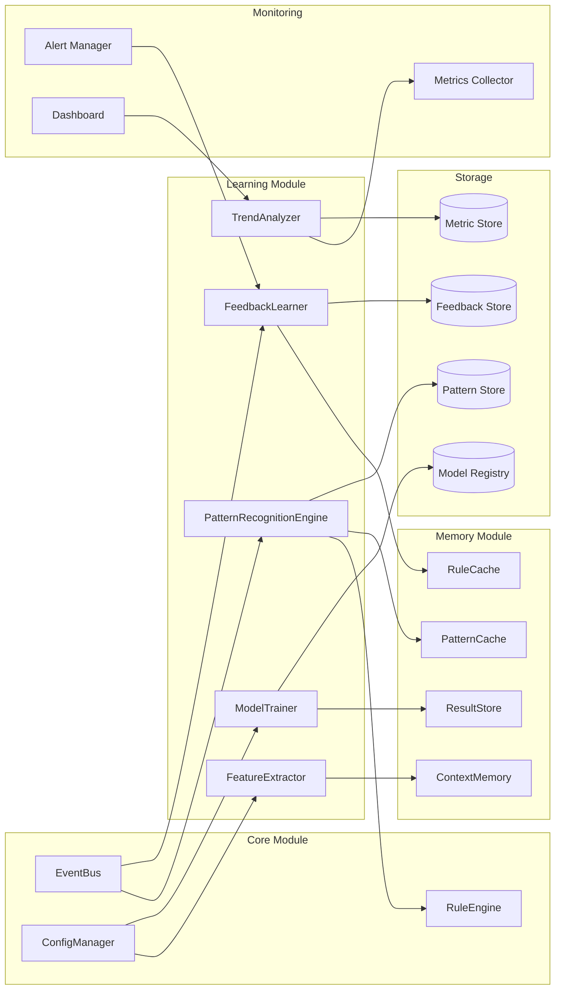
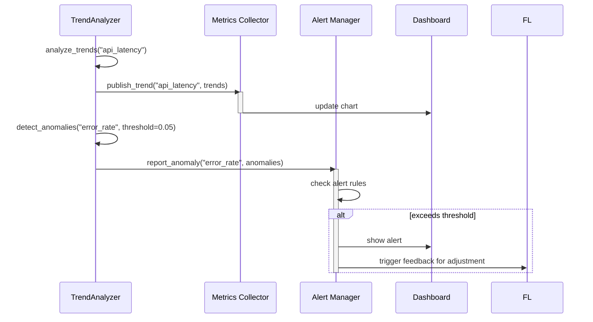
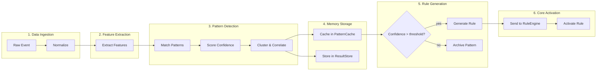
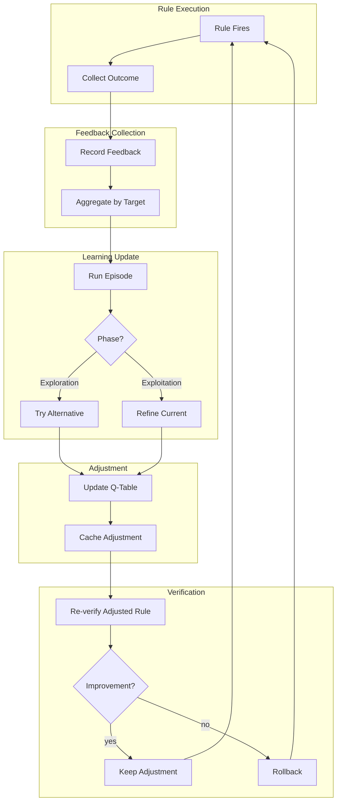
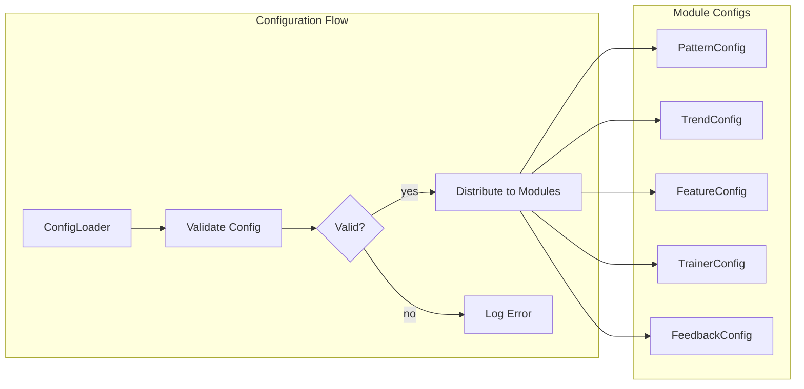

# Learning Module Integration

## Integration Overview

The Learning Module integrates with four core system modules: Core, Memory, Monitoring, and Rules Engine. Each integration follows specific data flow patterns and protocols.



## Core Module Integration

### PatternRecognitionEngine ↔ RuleEngine

The Pattern Recognition Engine generates rule suggestions from high-confidence patterns and sends them to the Core Rule Engine for activation.

```python
# Integration: Pattern Engine → Rule Engine
class PatternRecognitionEngine:
    def generate_rules_from_patterns(self) -> List[Dict]:
        rules = []
        for pattern in self.patterns.values():
            if pattern.confidence >= self.config.rule_generation_threshold:
                rule_spec = {
                    "name": f"auto_rule_{pattern.pattern_id}",
                    "description": f"Auto-generated from pattern: {pattern.pattern_text}",
                    "conditions": self._pattern_to_conditions(pattern),
                    "actions": self._pattern_to_actions(pattern),
                    "confidence": pattern.confidence,
                    "source": "pattern_engine",
                    "metadata": {
                        "pattern_id": pattern.pattern_id,
                        "occurrences": pattern.occurrences,
                        "pattern_type": pattern.pattern_type
                    }
                }
                rules.append(rule_spec)
        return rules
```

### EventBus Integration

The learning module subscribes to system events and publishes learning outcomes.

```python
class LearningEventBusIntegration:
    SUBSCRIBED_EVENTS = [
        "data.ingested",
        "rule.activated",
        "rule.deactivated",
        "feedback.submitted",
        "system.metrics.updated"
    ]

    PUBLISHED_EVENTS = [
        "pattern.discovered",
        "pattern.confidence_changed",
        "model.trained",
        "model.evaluated",
        "trend.detected",
        "anomaly.detected",
        "feedback.episode_completed",
        "learning.milestone_reached"
    ]

    def handle_event(self, event: Event):
        if event.type == "data.ingested":
            self.pattern_engine.analyze_data(event.data, event.context)
        elif event.type == "feedback.submitted":
            self.feedback_learner.record_feedback(
                event.data["target_id"],
                event.data["value"],
                source="system",
                feedback_type="implicit"
            )
        elif event.type == "system.metrics.updated":
            self.trend_analyzer.add_data_point(
                metric=event.data["metric"],
                value=event.data["value"],
                timestamp=event.timestamp
            )
```

## Memory Module Integration

### RuleCache Integration

The Feedback Learner stores adjustment values in the RuleCache for fast retrieval.

```mermaid
sequenceDiagram
    participant FL as FeedbackLearner
    participant RC as RuleCache
    participant RE as RuleEngine

    FL->>FL: run_episode(feedback_batch)
    FL->>FL: compute adjustments
    FL->>RC: cache_adjustment(rule_id, adjustment)
    activate RC
    RC-->>FL: stored
    deactivate RC

    RE->>RC: get_adjustment(rule_id)
    activate RC
    RC-->>RE: float adjustment
    deactivate RE
    RE->>RE: apply adjustment to rule score
```

### PatternCache Integration

The Pattern Recognition Engine caches discovered patterns in the PatternCache for sharing with other modules.

```python
class PatternCacheIntegration:
    def cache_discovered_patterns(self, engine, pattern_cache):
        top_patterns = engine.get_top_patterns(limit=100)
        for pattern in top_patterns:
            pattern_cache.set(
                key=f"pattern:{pattern.pattern_id}",
                value=pattern.to_dict(),
                ttl=3600  # 1 hour cache
            )
```

### ResultStore Integration

The Model Trainer stores evaluation results in the ResultStore for persistence and retrieval.

```python
class ResultStoreIntegration:
    def store_training_results(self, model_id, metrics, result_store):
        result_store.store(
            namespace="model_training",
            key=model_id,
            value={
                "metrics": {
                    "accuracy": metrics.accuracy,
                    "precision": metrics.precision,
                    "recall": metrics.recall,
                    "f1_score": metrics.f1_score,
                    "mcc": metrics.matthews_cc
                },
                "timestamp": datetime.now(timezone.utc).isoformat(),
                "version": metrics.version
            }
        )
```

## Monitoring Integration

### TrendAnalyzer ↔ Metrics Collector

The TrendAnalyzer feeds trend data to the monitoring system for dashboard display.



### Feedback Learner ↔ Monitoring

Monitoring data triggers feedback learning cycles.

```python
class MonitoringFeedbackIntegration:
    def handle_monitoring_alert(self, alert, feedback_learner):
        # Convert monitoring alerts to feedback signals
        feedback_learner.record_feedback(
            target_id=alert.entity_id,
            value=1.0 - min(alert.actual_value / alert.threshold, 1.0),
            source="monitoring",
            feedback_type="system"
        )
```

## Cross-Module Usage Patterns

### Pattern Detection Pipeline

Full flow from data ingestion through pattern detection to rule generation.



### Feedback Loop Integration

End-to-end feedback loop from rule execution through learning to improvement.



### Training Pipeline Integration

From feature extraction through model training to deployment.

```python
class TrainingPipeline:
    def __init__(self, extractor, trainer, verifier, result_store):
        self.extractor = extractor
        self.trainer = trainer
        self.verifier = verifier
        self.result_store = result_store

    def run_pipeline(self, training_data, model_id, model_type):
        # Step 1: Extract features
        vectors = []
        for text, context in training_data:
            vector = self.extractor.extract(text, context)
            vectors.append(vector)

        # Step 2: Select & normalize features
        selected = self.extractor.select_features(vectors, method="mutual_info", top_k=20)
        self.extractor.fit_normalization(vectors)

        # Step 3: Create and train model
        model = self.trainer.create_model(model_id, model_type)
        for vector, label in zip(vectors, [d[2] for d in training_data]):
            self.trainer.add_example(vector.to_dict(), label)

        metrics = self.trainer.train(model_id)

        # Step 4: Evaluate
        eval_metrics = self.trainer.evaluate(model_id)

        # Step 5: Store results
        self.result_store.store(
            namespace="training_pipeline",
            key=model_id,
            value={
                "model_type": model_type,
                "metrics": eval_metrics.to_dict(),
                "feature_count": len(selected),
                "normalization_method": self.extractor.config.default_normalization,
                "timestamp": datetime.now(timezone.utc).isoformat()
            }
        )

        return model, eval_metrics
```

## External API Integration

The Learning Module exposes integration points for external systems.

```python
# REST API endpoints for external integration
INTEGRATION_ENDPOINTS = {
    "POST /api/v1/learning/analyze": "PatternRecognitionEngine.analyze_data",
    "GET /api/v1/learning/patterns": "PatternRecognitionEngine.get_top_patterns",
    "POST /api/v1/learning/features/extract": "FeatureExtractor.extract",
    "POST /api/v1/learning/models": "ModelTrainer.create_model",
    "POST /api/v1/learning/models/{id}/train": "ModelTrainer.train",
    "GET /api/v1/learning/models/{id}": "ModelTrainer.evaluate",
    "POST /api/v1/learning/feedback": "FeedbackLearner.record_feedback",
    "GET /api/v1/learning/feedback/curve": "FeedbackLearner.get_learning_curve",
    "POST /api/v1/learning/trends/data": "TrendAnalyzer.add_data_point",
    "GET /api/v1/learning/trends/{metric}": "TrendAnalyzer.analyze_trends",
    "GET /api/v1/learning/trends/{metric}/forecast": "TrendAnalyzer.forecast"
}
```

## Configuration Integration Pattern

All learning module components follow a consistent configuration pattern shared across the system.

```python
@dataclass
class BaseConfig:
    enabled: bool = True
    log_level: str = "INFO"
    version: str = "1.0.0"

@dataclass
class ModuleConfig:
    name: str = "default"
    max_results: int = 100
    timeout_seconds: float = 30.0
    retry_count: int = 3
    cache_enabled: bool = True
    cache_ttl_seconds: float = 300.0
```

