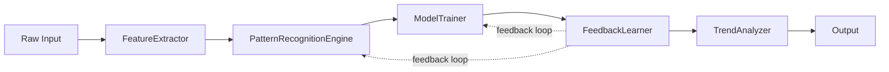

# Learning Module

## Overview

The Learning Module provides pattern discovery, trend analysis, feature engineering, model training, and adaptive feedback learning for the Rules-Emerging-Pattern system. It consists of five core components:

- **PatternRecognitionEngine** (`pattern_engine.py`): Detects and tracks recurring patterns using regex, keyword, semantic, and structural matching strategies. Supports pattern clustering, correlation analysis, confidence scoring with decay, and automatic rule generation from discovered patterns.

- **TrendAnalyzer** (`trend_analyzer.py`): Analyzes time-series metric data to detect trends, anomalies, seasonal components, and change points. Provides multi-horizon forecasting using linear, moving average, exponential smoothing, ARIMA-like, and ensemble methods.

- **FeatureExtractor** (`feature_extractor.py`): Extracts over 40 features from text data across four categories: text-level (word count, character count, ratios), statistical (entropy, vocabulary richness, hapax legomena), structural (paragraph count, code block ratio), and content (sentiment, readability, formality). Supports multiple normalization methods and feature selection.

- **ModelTrainer** (`model_trainer.py`): Trains supervised models (ThresholdModel, WeightedModel, EnsembleModel) for classification tasks. Provides dataset splitting, cross-validation, model versioning, persistence, and comprehensive evaluation metrics (accuracy, precision, recall, F1, MCC, log loss).

- **FeedbackLearner** (`feedback_learner.py`): Implements reinforcement learning (Q-learning, bandit, Thompson sampling) for adaptive improvement. Records feedback from multiple sources (user explicit/implicit, system, cross-validation), aggregates results, adjusts model parameters, and tracks learning progress across episodes.

## Class Diagram

```mermaid
classDiagram
    class PatternRecognitionEngine {
        +PatternConfig config
        +Dict~str, Pattern~ patterns
        +Dict~str, str~ pattern_templates
        +Dict~str, List~str~~ keyword_patterns
        +Dict~str, PatternCluster~ clusters
        +Dict~str, Dict~str, PatternCorrelation~~ correlations
        +analyze_data(data, context) List~Pattern~
        +get_patterns_by_type(type) List~Pattern~
        +get_top_patterns(limit) List~Pattern~
        +generate_rules_from_patterns() List~Dict~
        +export_patterns() Dict
        +import_patterns(data) Tuple~int, int~
        +validate_pattern(pattern) Dict
        +archive_stale_patterns() int
    }

    class TrendAnalyzer {
        +TrendConfig config
        +Dict~str, List~DataPoint~~ time_series_data
        +Dict~str, Trend~ detected_trends
        +Dict~str, List~Anomaly~~ detected_anomalies
        +Dict~str, SeasonalComponent~ seasonal_components
        +Dict~str, Dict~str, MetricCorrelation~~ metric_correlations
        +add_data_point(metric, value, timestamp, weight, metadata)
        +analyze_trends(metric_name) List~Trend~
        +detect_anomalies(metric_name, threshold) List~Anomaly~
        +forecast(metric_name, periods, method) List~float~
        +get_trend_summary() Dict
        +export_trend_data() Dict
    }

    class FeatureExtractor {
        +FeatureConfig config
        +Dict~str, FeatureDefinition~ feature_definitions
        +Dict~str, FeatureStatistics~ feature_stats
        +extract(text, context) FeatureVector
        +fit_normalization(vectors) void
        +select_features(vectors, method, top_k) List~str~
        +normalize(vector) FeatureVector
        +export_config() Dict
        +compute_feature_statistics() Dict~str, FeatureStatistics~
    }

    class ModelTrainer {
        +TrainerConfig config
        +List~TrainingExample~ examples
        +Dict~str, BaseModel~ models
        +Dict~str, ModelMetrics~ model_metrics
        +Dict~str, List~ModelVersion~~ model_versions
        +add_example(features, label, weight) TrainingExample
        +create_model(model_id, model_type) BaseModel
        +train(model_id, dataset) ModelMetrics
        +evaluate(model_id, dataset) ModelMetrics
        +cross_validate(model_id, dataset, folds) Dict
        +predict(model_id, features) Tuple~Any, float~
        +save_model(model_id, filepath) str
        +load_model(filepath) str
    }

    class FeedbackLearner {
        +FeedbackConfig config
        +List~FeedbackEntry~ feedback_history
        +Dict~str, FeedbackAggregate~ feedback_aggregates
        +Dict~str, float~ target_adjustments
        +Dict~str, float~ target_confidence
        +List~LearningProgress~ learning_progress
        +Dict~str, Dict~str, float~~ q_table
        +record_feedback(target_id, value, source, type, confidence) FeedbackEntry
        +record_user_feedback(target_id, rating, explicit) FeedbackEntry
        +run_episode(feedback_batch) LearningProgress
        +get_adjustment(target_id) float
        +get_confidence(target_id) float
        +get_learning_curve() List~Dict~
        +export_feedback() Dict
    }

    PatternRecognitionEngine --> PatternConfig
    PatternRecognitionEngine --> Pattern
    PatternRecognitionEngine --> PatternCluster
    PatternRecognitionEngine --> PatternCorrelation
    TrendAnalyzer --> TrendConfig
    TrendAnalyzer --> DataPoint
    TrendAnalyzer --> Trend
    TrendAnalyzer --> Anomaly
    TrendAnalyzer --> SeasonalComponent
    TrendAnalyzer --> MetricCorrelation
    FeatureExtractor --> FeatureConfig
    FeatureExtractor --> FeatureDefinition
    FeatureExtractor --> FeatureVector
    FeatureExtractor --> ExtractedFeature
    FeatureExtractor --> FeatureStatistics
    ModelTrainer --> TrainerConfig
    ModelTrainer --> TrainingExample
    ModelTrainer --> Dataset
    ModelTrainer --> BaseModel
    ModelTrainer --> ThresholdModel
    ModelTrainer --> WeightedModel
    ModelTrainer --> EnsembleModel
    ModelTrainer --> ModelMetrics
    ModelTrainer --> ModelVersion
    FeedbackLearner --> FeedbackConfig
    FeedbackLearner --> FeedbackEntry
    FeedbackLearner --> FeedbackAggregate
    FeedbackLearner --> LearningProgress
```



## Quick Start

```python
from rules_emerging_pattern.learning.pattern_engine import PatternRecognitionEngine
from rules_emerging_pattern.learning.trend_analyzer import TrendAnalyzer
from rules_emerging_pattern.learning.feature_extractor import FeatureExtractor
from rules_emerging_pattern.learning.model_trainer import ModelTrainer
from rules_emerging_pattern.learning.feedback_learner import FeedbackLearner

engine = PatternRecognitionEngine()
results = engine.analyze_data({"user": "admin", "action": "login", "ip": "192.168.1.1"})
print(f"Found {len(results)} patterns")

analyzer = TrendAnalyzer()
analyzer.add_data_point("api_latency", 45.2)
analyzer.add_data_point("api_latency", 52.1)
trends = analyzer.analyze_trends()
print(f"Detected {len(trends)} trends")

extractor = FeatureExtractor()
vector = extractor.extract("The system processed 42 requests with 3 errors")
print(f"Extracted {vector.get_feature_count()} features")

trainer = ModelTrainer()
model = trainer.create_model("classifier_v1", "weighted")
trainer.add_example({"latency": 0.3, "error_rate": 0.1}, True)
trainer.add_example({"latency": 0.9, "error_rate": 0.7}, False)
metrics = trainer.train("classifier_v1")
print(f"F1: {metrics.f1_score:.4f}")

learner = FeedbackLearner()
entry = learner.record_feedback("rule_001", 0.8, source="user_explicit",
                                feedback_type="rating")
progress = learner.run_episode([("rule_001", 0.9, "user_explicit", "rating")])
print(f"Episode {progress.episode}: phase={progress.phase.value}")
```

## Data Flow Overview

The learning pipeline processes data through five stages:



## Component Interactions

Each component in the learning module interacts according to defined interfaces:

| Source | Target | Method | Data Passed |
|--------|--------|--------|-------------|
| FeatureExtractor | PatternRecognitionEngine | `analyze_data(features, context)` | FeatureVector, Context |
| PatternRecognitionEngine | ModelTrainer | `add_example(features, label, weight)` | Pattern metadata |
| ModelTrainer | FeedbackLearner | `record_feedback(target, value, ...)` | Evaluation metrics |
| FeedbackLearner | PatternRecognitionEngine | Confidence adjustment factor | Adjustment values |
| FeedbackLearner | ModelTrainer | Hyperparameter tuning | Adjustment values |
| PatternRecognitionEngine | TrendAnalyzer | `add_data_point(metric, value, ...)` | Pattern metrics |
| TrendAnalyzer | FeatureExtractor | Feature relevance feedback | Anomaly/trend data |

## Storage Backends

| Store | Data | Retention | Capacity |
|-------|------|-----------|----------|
| Pattern Store | Pattern objects with metadata | 90 days | 10,000 patterns |
| Metric Store | Time-series data points | 30 days | 100,000 points |
| Model Registry | Trained model versions | Indefinite | 1,000 models |
| Feedback Store | Feedback entries | 30 days | 50,000 entries |
| Feature Store | Feature definitions | Indefinite | 500 features |

## API Reference

| Class | Method | Description |
|-------|--------|-------------|
| `PatternRecognitionEngine` | `analyze_data(data, context)` | Analyze input data for recurring patterns |
| `PatternRecognitionEngine` | `generate_rules_from_patterns()` | Generate rule suggestions from high-confidence patterns |
| `PatternRecognitionEngine` | `export_patterns()` | Export all patterns with metadata |
| `PatternRecognitionEngine` | `validate_pattern(pattern)` | Validate a single pattern's integrity |
| `TrendAnalyzer` | `add_data_point(metric, value, ...)` | Record a time-series data point |
| `TrendAnalyzer` | `analyze_trends(metric)` | Detect trends across all or specific metrics |
| `TrendAnalyzer` | `detect_anomalies(metric, threshold)` | Identify anomalous data points |
| `TrendAnalyzer` | `forecast(metric, periods, method)` | Generate future predictions |
| `FeatureExtractor` | `extract(text, context)` | Extract feature vector from text |
| `FeatureExtractor` | `fit_normalization(vectors)` | Learn normalization parameters |
| `FeatureExtractor` | `select_features(vectors, method)` | Select most informative features |
| `ModelTrainer` | `create_model(model_id, type)` | Create a new model instance |
| `ModelTrainer` | `train(model_id, dataset)` | Train the model on provided dataset |
| `ModelTrainer` | `cross_validate(model_id, dataset)` | Perform k-fold cross-validation |
| `ModelTrainer` | `save_model(model_id, path)` | Persist trained model to disk |
| `FeedbackLearner` | `record_feedback(target, value, ...)` | Record feedback from any source |
| `FeedbackLearner` | `run_episode(feedback_batch)` | Execute one learning episode |
| `FeedbackLearner` | `get_adjustment(target_id)` | Get current adjustment for a target |
| `FeedbackLearner` | `get_learning_curve()` | Retrieve complete learning progress |
