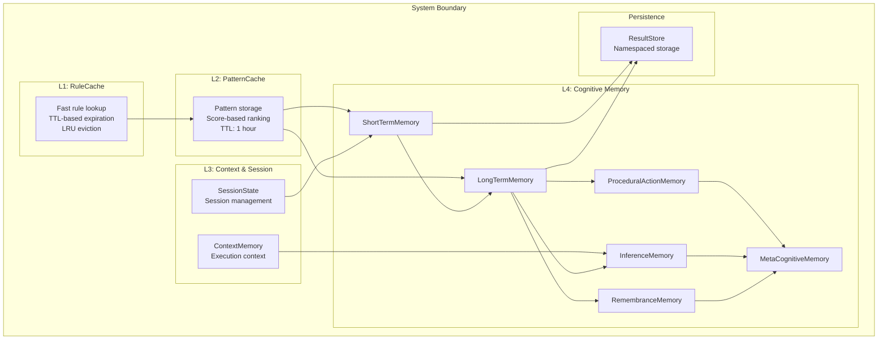
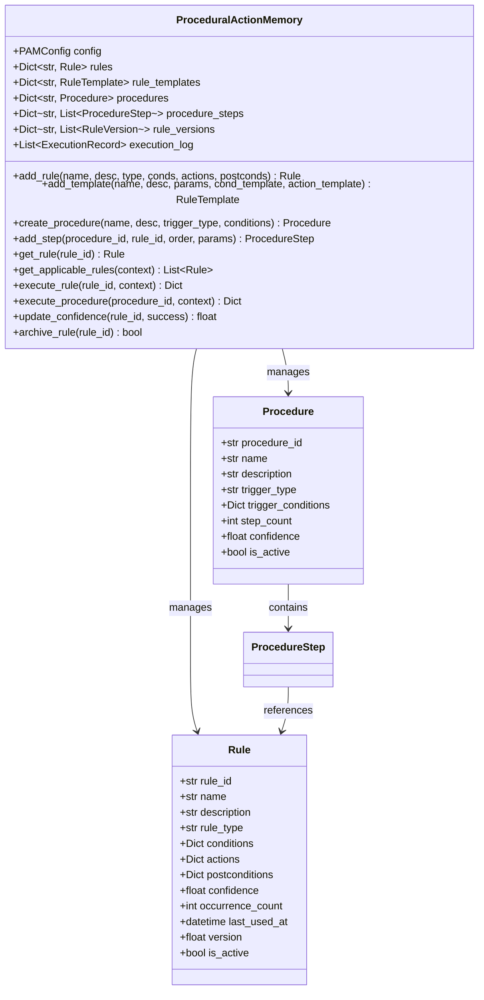
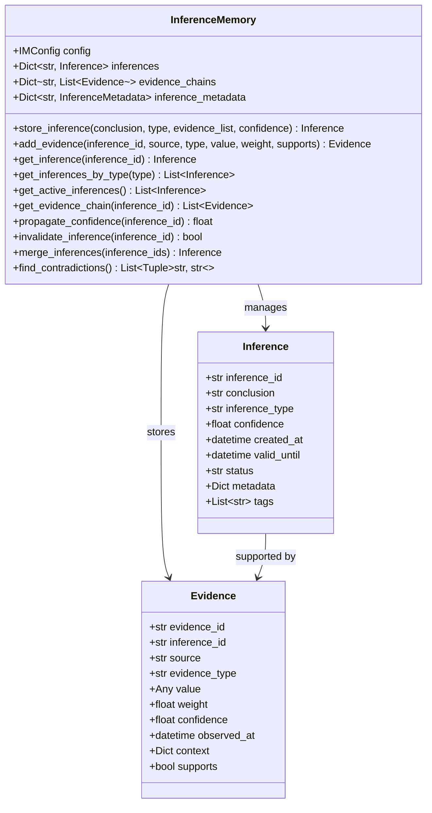
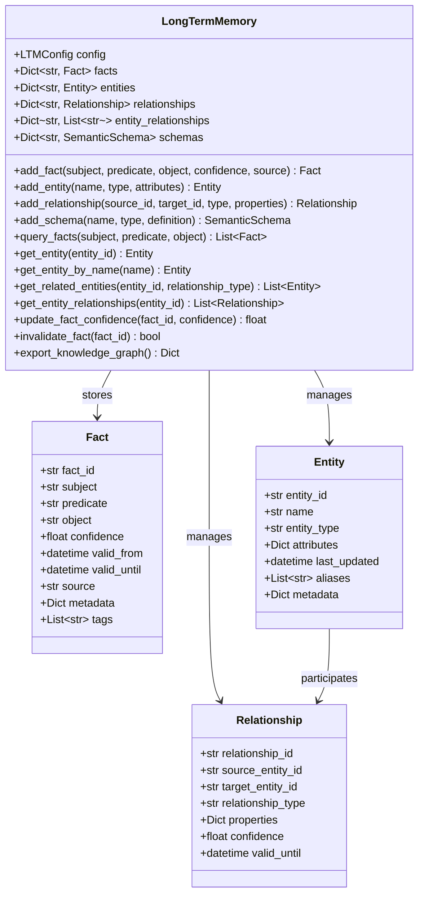
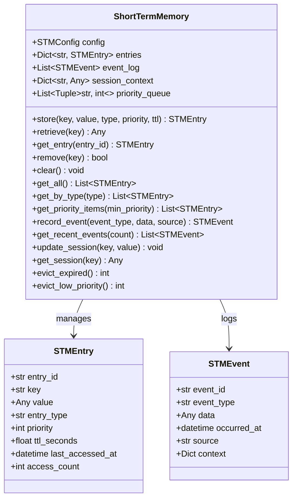
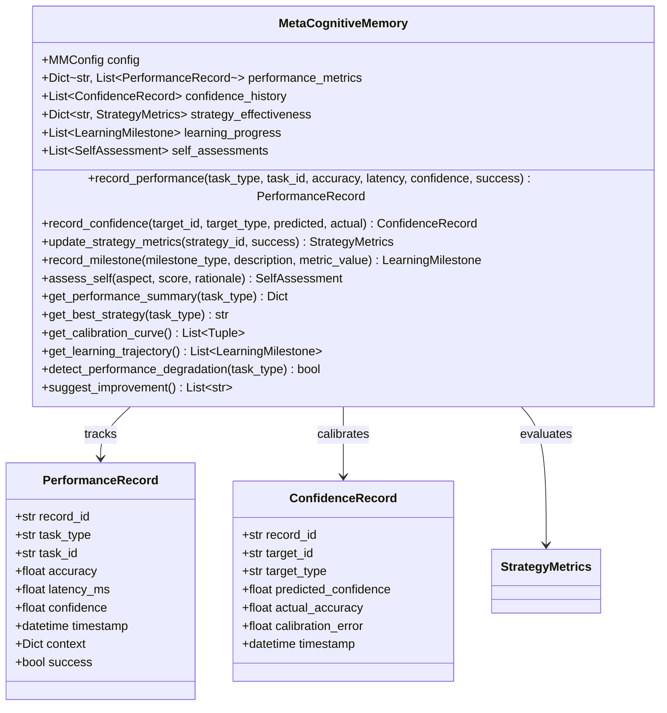
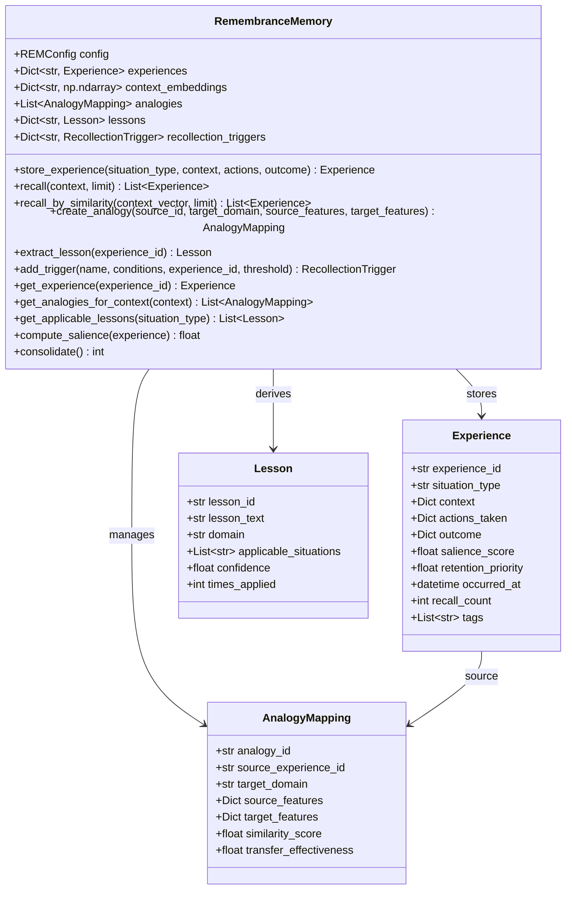
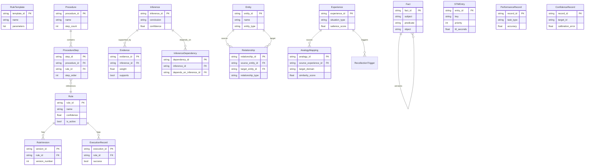

# Memory Module Architecture

## Overview

The Memory Module implements a four-tier memory hierarchy inspired by cognitive architecture. The system provides specialized memory types for procedural, inference, long-term, short-term, metacognitive, and remembrance functions, along with operational caches and state management.

## Memory Architecture



## Component Architecture

### RuleCache

The RuleCache provides fast-access caching for active rules. It uses LRU eviction with configurable TTL for each entry.

```python
class RuleCache:
    def __init__(self, config: CacheConfig = None):
        self.config = config or CacheConfig()
        self.entries: Dict[str, CacheEntry] = {}
        self.lru_list: List[str] = []
        self.hits = 0
        self.misses = 0
```

### ContextMemory

The ContextMemory tracks execution context across the system, storing variables and event logs per context ID.

```python
class ContextMemory:
    def __init__(self, config: ContextConfig = None):
        self.config = config or ContextConfig()
        self.context_variables: Dict[str, Any] = {}
        self.event_log: Dict[str, List[ContextEvent]] = {}
```

### PatternCache

The PatternCache stores discovered patterns with score-based ranking, enabling quick retrieval of top patterns.

```python
class PatternCache:
    def __init__(self, config: CacheConfig = None):
        self.config = config or CacheConfig()
        self.patterns: Dict[str, CachedPattern] = {}
        self.score_queue: List[Tuple[float, str]] = []
```

### ResultStore

The ResultStore provides namespaced persistent storage for computation results with versioning and metadata.

```python
class ResultStore:
    def __init__(self, config: StoreConfig = None):
        self.config = config or StoreConfig()
        self.store: Dict[str, Dict[str, StoredResult]] = {}
```

### SessionState

The SessionState manages ephemeral session data with automatic cleanup of expired sessions.

```python
class SessionState:
    def __init__(self, config: SessionConfig = None):
        self.config = config or SessionConfig()
        self.sessions: Dict[str, Session] = {}
```

## Cognitive Memory Architecture

### Procedural-Action Memory (PAM)

PAM stores learned procedures, rules, and action sequences — the "how-to" memory.



### Inference Memory (IM)

IM stores inference results — conclusions, predictions, and relationships derived from raw data with evidence chain tracking.



### Long-Term Memory (LTM)

LTM provides durable persistent storage for declarative knowledge — facts, entities, and relationships.



### Short-Term Memory (STM)

STM provides ephemeral session-scoped storage for transient data with TTL-based eviction.



### Metacognitive Memory (MM)

MM provides self-awareness and introspection — performance metrics, confidence calibration, and strategy tracking.



### Remembrance Memory (REM)

REM provides recollection and association — episodic experience records with contextual embeddings.



## Data Model Relationships



## Configuration Architecture

```python
@dataclass
class CacheConfig:
    max_capacity: int = 1000
    default_ttl_seconds: float = 300.0
    enable_lru_eviction: bool = True
    eviction_batch_size: int = 50

@dataclass
class ContextConfig:
    max_contexts: int = 100
    max_events_per_context: int = 1000
    enable_event_logging: bool = True

@dataclass
class StoreConfig:
    max_namespaces: int = 50
    max_results_per_namespace: int = 10000
    enable_versioning: bool = True

@dataclass
class SessionConfig:
    session_timeout_minutes: int = 30
    max_sessions: int = 1000
    cleanup_interval_seconds: int = 300
```