# Memory Module Data Flow

## Cache Lookup Flow

The RuleCache implements a standard cache lookup pattern: check cache → hit/miss → return or fallback to persistent storage.

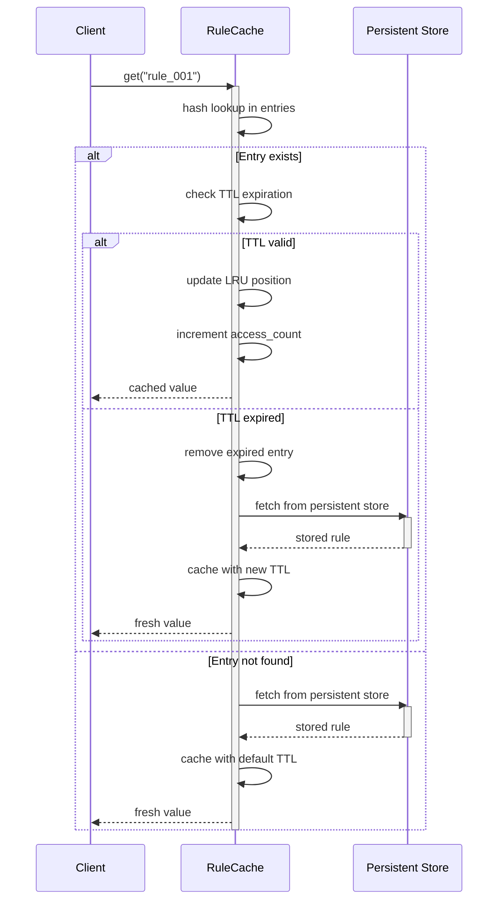

## Cache Miss → Fallback → Store Flow

When a cache miss occurs, the system falls back to the ResultStore, and then re-caches the result.

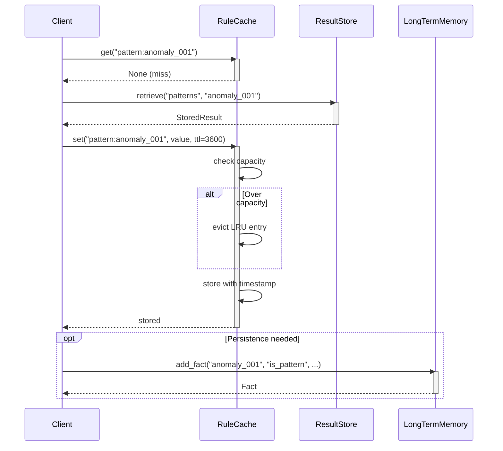

## Context Memory Data Flow

The ContextMemory tracks execution context across the system.

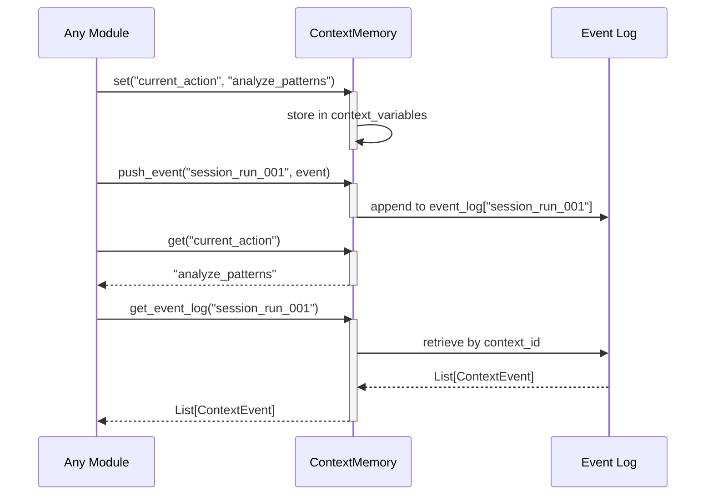

## PatternCache Score-Based Retrieval

The PatternCache maintains a score-ordered queue for efficient top-N retrieval.

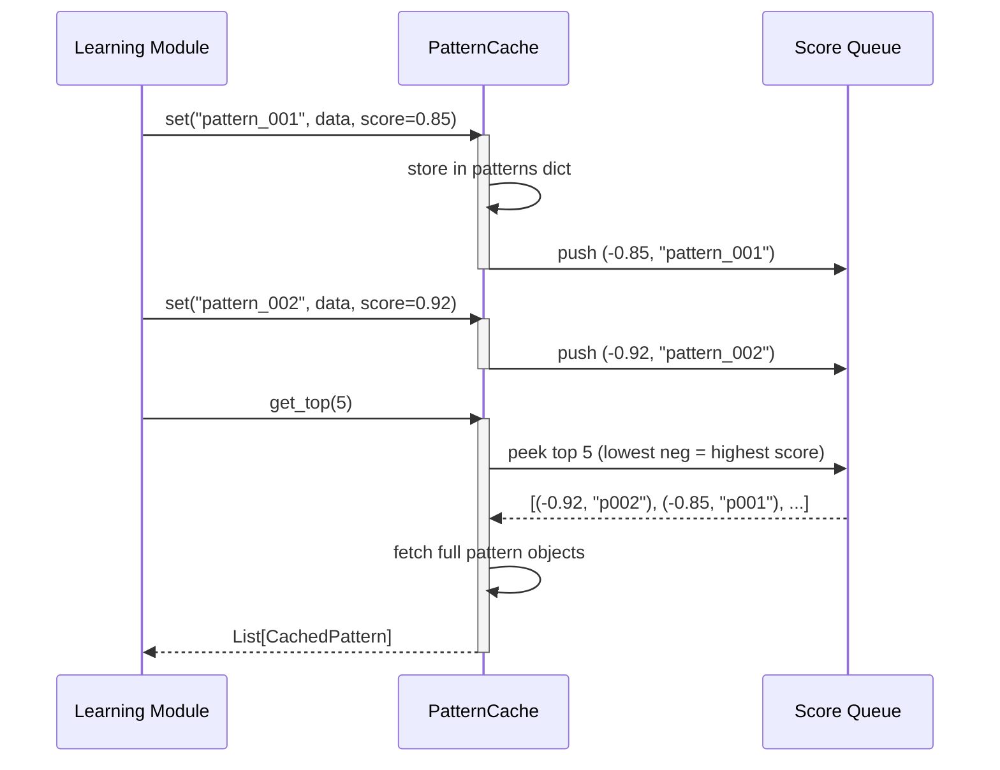

## SessionState Lifecycle

Sessions are created, used, and automatically cleaned up.

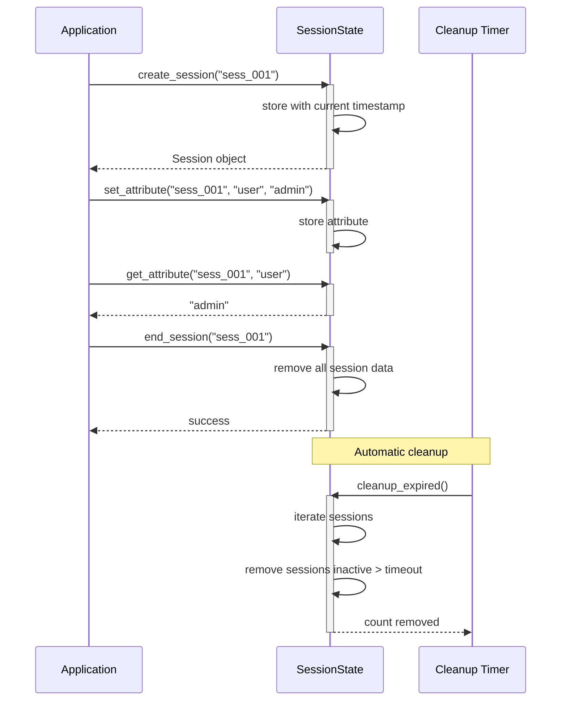

## ResultStore Namespaced Storage

Results are stored and retrieved by namespace and key.

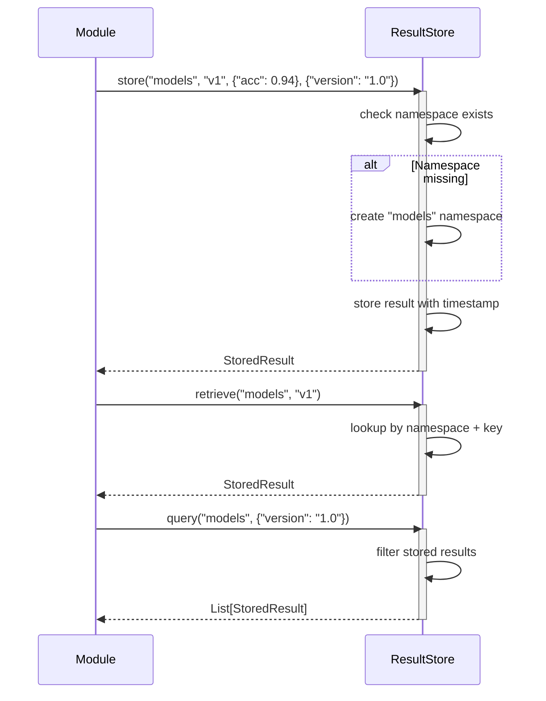

## Cognitive Memory Data Flows

### STM Store & Eviction

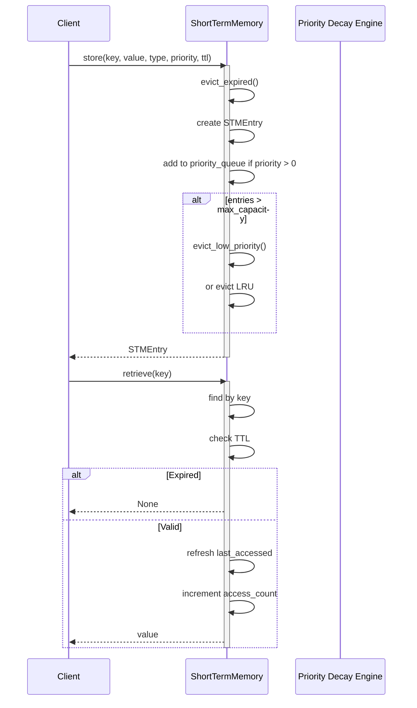

### LTM Fact Query Flow

```mermaid
sequenceDiagram
    participant Client
    participant LTM as LongTermMemory
    participant Index as Fact Index
    participant EntityStore as Entity Store

    Client->>LTM: query_facts(subject="server-01", predicate="hosts")
    activate LTM
    LTM->>Index: lookup by subject + predicate
    activate Index
    Index-->>LTM: fact_id list
    deactivate Index
    LTM->>LTM: filter by active status & validity window
    LTM-->>Client: List[Fact]
    deactivate LTM

    Client->>LTM: get_entity_by_name("api-gateway")
    activate LTM
    LTM->>EntityStore: search by name + aliases
    activate EntityStore
    EntityStore-->>LTM: matching entity
    deactivate EntityStore
    LTM-->>Client: Entity
    deactivate LTM

    Client->>LTM: get_related_entities("E002", "depends_on")
    activate LTM
    LTM->>EntityStore: filter relationships by type
    activate EntityStore
    EntityStore-->>LTM: target entity IDs
    deactivate EntityStore
    LTM->>EntityStore: fetch each entity
    EntityStore-->>LTM: List[Entity]
    deactivate EntityStore
    LTM-->>Client: List[Entity]
    deactivate LTM
```

### PAM Procedure Execution Flow

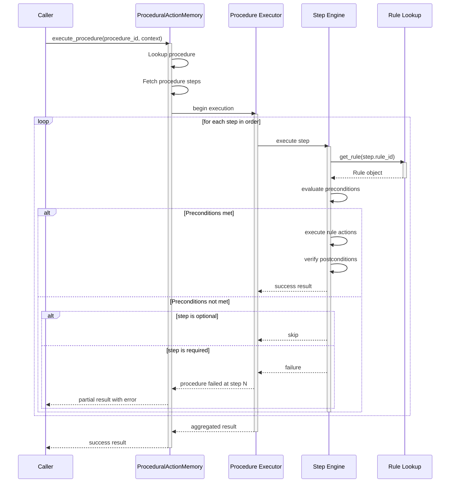

### IM Evidence Flow

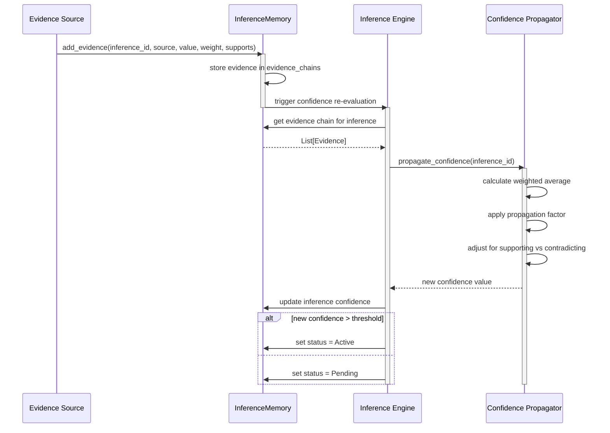

### REM Recall Pipeline

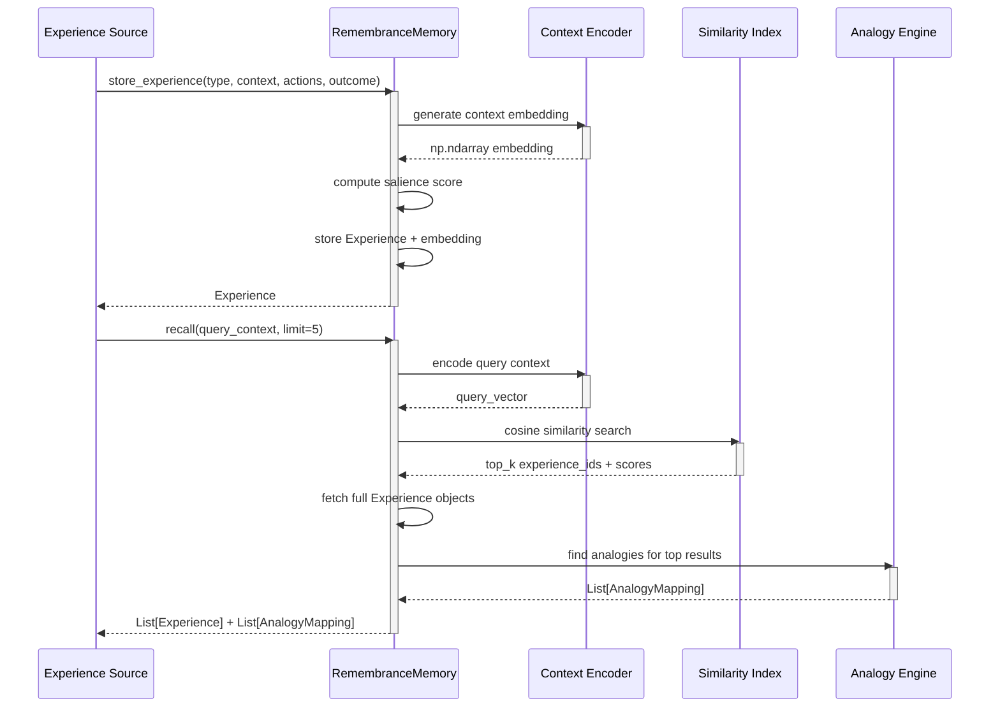

### MM Performance Monitoring Flow

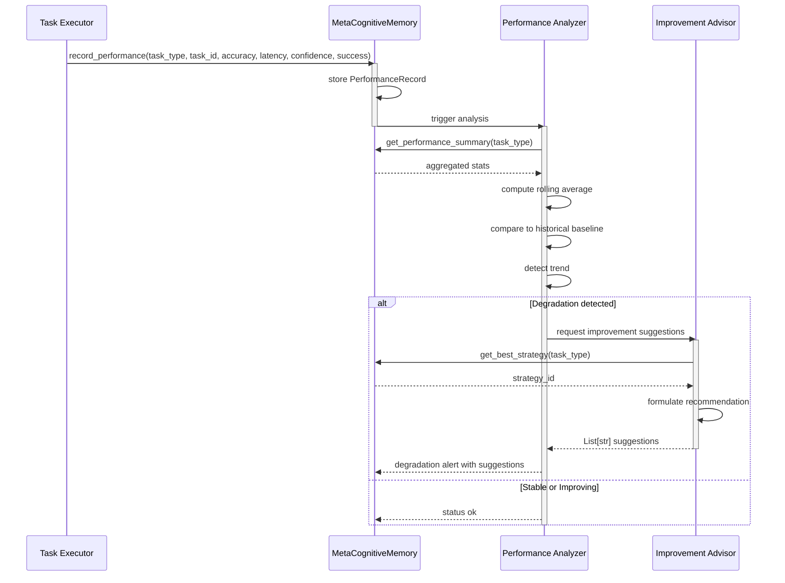

## Cross-Memory Migration Flow

Data can be promoted between memory tiers (STM → LTM → PAM).

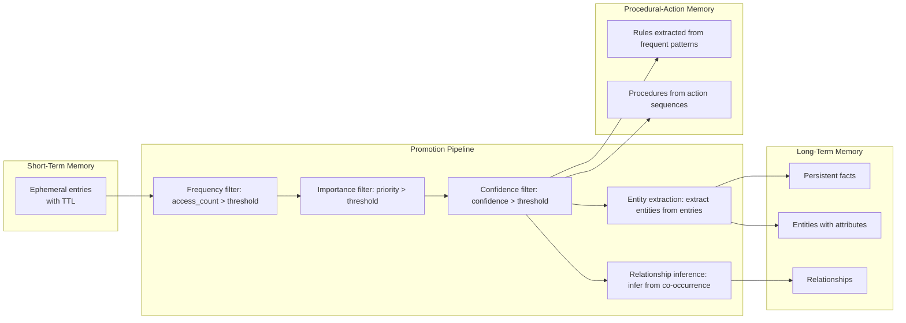