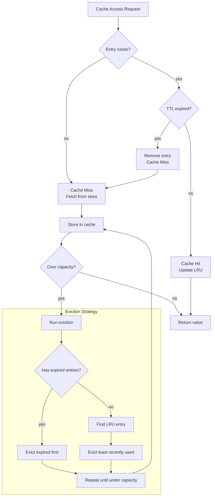
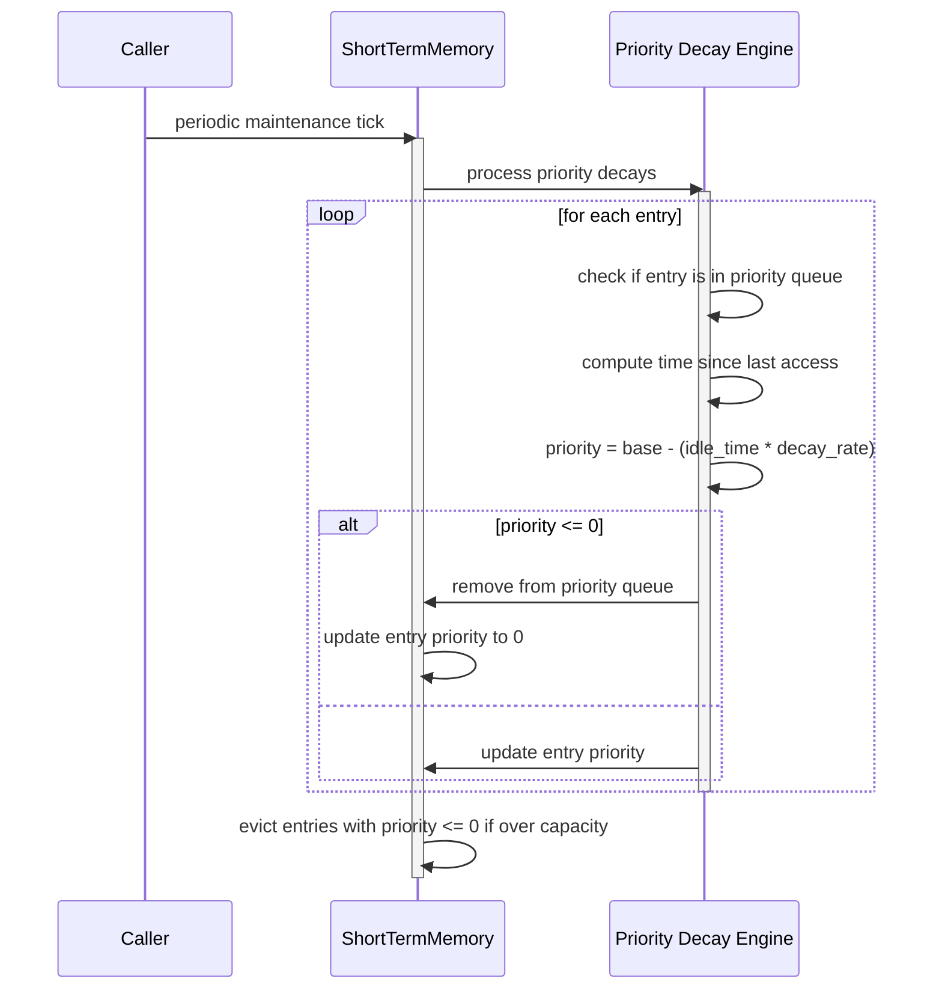

# Memory Module Reasoning & Logic

## Cache Invalidation Logic

The RuleCache uses a multi-strategy invalidation approach combining TTL expiration and LRU eviction.



### TTL Expiration Logic

```python
def is_expired(self, entry: CacheEntry) -> bool:
    if entry.ttl <= 0:
        return False  # No expiration
    elapsed = (datetime.now(timezone.utc) - entry.created_at).total_seconds()
    return elapsed > entry.ttl

def clear_expired(self) -> int:
    expired_keys = [k for k, v in self.entries.items() if self.is_expired(v)]
    for key in expired_keys:
        del self.entries[key]
        if key in self.lru_list:
            self.lru_list.remove(key)
    return len(expired_keys)
```

### LRU Eviction Logic

```python
def evict_lru(self, count: int = 1) -> int:
    evicted = 0
    while evicted < count and self.lru_list:
        key = self.lru_list.pop(0)
        if key in self.entries:
            del self.entries[key]
            evicted += 1
    return evicted

def _update_lru(self, key: str):
    if key in self.lru_list:
        self.lru_list.remove(key)
    self.lru_list.append(key)
```

## Cache Invalidation Triggers

```mermaid
flowchart LR
    subgraph Triggers["Invalidation Triggers"]
        T1[TTL Expiration<br/>Automatic]
        T2[Manual Invalidation<br/>cache.invalidate(key)]
        T3[Capacity Overflow<br/>LRU eviction]
        T4[Data Update Event<br/>Rule modified]
    end

    subgraph Actions["Actions"]
        A1[Remove entry]
        A2[Update LRU list]
        A3[Log invalidation]
        A4[Notify subscribers]
    end

    T1 --> A1
    T2 --> A1
    T3 --> A1
    T4 --> A1
    A1 --> A2
    A2 --> A3
    A3 --> A4
```

## Eviction Policy Decision Logic

```python
def _select_eviction_target(self) -> str:
    # Priority 1: Expired entries
    for key, entry in self.entries.items():
        if self.is_expired(entry):
            return key

    # Priority 2: Lowest priority entries (PatternCache)
    if hasattr(self, 'score_queue') and self.score_queue:
        _, key = heapq.heappop(self.score_queue)
        return key

    # Priority 3: LRU entry
    if self.lru_list:
        return self.lru_list[0]

    return None
```

## Context Retrieval Strategy

The ContextMemory uses a hierarchical retrieval strategy.

```mermaid
flowchart TD
    A[Context Request: get(key)] --> B{key in context_variables?}
    B -->|yes| C[Return value]
    B -->|no| D{key in session context?}
    D -->|yes| E[Return session value]
    D -->|no| F{Has fallback provider?}
    F -->|yes| G[Query fallback]
    G --> H{Found?}
    H -->|yes| I[Return and cache]
    H -->|no| J[Return default]
    F -->|no| J
```

## Context Resolution Priority

```python
def resolve_context(self, key: str, session_id: str = None) -> Any:
    # Priority 1: Local context variables
    if key in self.context_variables:
        return self.context_variables[key]

    # Priority 2: Session-scoped variables
    if session_id and session_id in self.sessions:
        session = self.sessions[session_id]
        if key in session.attributes:
            return session.attributes[key]

    # Priority 3: Default value
    return None
```

## PatternCache Score Ranking

The PatternCache maintains patterns ordered by score for top-N retrieval.

```python
def set(self, pattern_id: str, pattern: Any, score: float):
    self.patterns[pattern_id] = CachedPattern(pattern_id, pattern, score)
    heapq.heappush(self.score_queue, (-score, pattern_id))

def get_top(self, n: int) -> List[CachedPattern]:
    if n <= 0:
        return []
    candidates = []
    seen = set()
    temp_queue = list(self.score_queue)

    while len(candidates) < n and temp_queue:
        neg_score, pid = heapq.heappop(temp_queue)
        if pid in seen:
            continue
        seen.add(pid)
        if pid in self.patterns:
            candidates.append(self.patterns[pid])

    return candidates[:n]
```

```mermaid
flowchart TD
    A[set(pattern_id, score)] --> B[Store in patterns dict]
    B --> C[Push (-score, pid) to heap]
    C --> D[Score queue maintained]

    E[get_top(n)] --> F[Peek heap top]
    F --> G[Pop candidates]
    G --> H{Deduplicate?}
    H -->|yes| I[Skip seen IDs]
    H -->|no| J[Collect pattern]
    J --> K{Collected n?}
    K -->|no| G
    K -->|yes| L[Return top N]
```

## SessionState Auto-Cleanup Logic

```python
def cleanup_expired(self) -> int:
    now = datetime.now(timezone.utc)
    expired = []
    for session_id, session in self.sessions.items():
        elapsed = (now - session.last_active).total_seconds()
        if elapsed > self.config.session_timeout_minutes * 60:
            expired.append(session_id)
    for sid in expired:
        del self.sessions[sid]
    return len(expired)
```

## STM Eviction Strategy

```mermaid
flowchart TD
    Add[store() called] --> Cap{entries > max_capacity?}
    Cap -->|no| Store[Add entry]
    Cap -->|yes| CheckExp[Run evict_expired]
    CheckExp --> Freed{space freed?}
    Freed -->|yes| Store
    Freed -->|no| CheckPrio[Find lowest priority items]
    CheckPrio --> Tie{Multiple at same<br/>priority level?}
    Tie -->|yes| LRU[Evict least recently accessed]
    Tie -->|no| EvictLow[Evict lowest priority]
    LRU --> Store
    EvictLow --> Store
    Store --> Done[Entry stored]
```

### STM Eviction Implementation

```python
def evict_expired(self) -> int:
    now = datetime.now(timezone.utc)
    expired_ids = [
        eid for eid, entry in self.entries.items()
        if now > entry.created_at + timedelta(seconds=entry.ttl_seconds)
    ]
    for eid in expired_ids:
        del self.entries[eid]
    return len(expired_ids)

def evict_low_priority(self) -> int:
    if not self.priority_queue:
        sorted_entries = sorted(
            [(e.last_accessed_at, eid) for eid, e in self.entries.items() if e.priority == 0],
            key=lambda x: x[0]
        )
        count = len(self.entries) - self.config.max_capacity + 1
        for _, eid in sorted_entries[:count]:
            del self.entries[eid]
        return count
    else:
        neg_prio, eid = heapq.heappop(self.priority_queue)
        if eid in self.entries:
            del self.entries[eid]
            return 1
    return 0
```

## PAM Confidence Update Logic

```python
def update_confidence(self, rule_id: str, success: bool) -> float:
    rule = self.rules[rule_id]
    if success:
        rule.confidence = min(1.0, rule.confidence + (1.0 - rule.confidence) * self.config.learning_rate)
    else:
        rule.confidence = max(0.0, rule.confidence - rule.confidence * self.config.penalty_rate)
    return rule.confidence
```

## IM Confidence Propagation Logic

```python
def propagate_confidence(self, inference_id: str) -> float:
    evidence_list = self.evidence_chains.get(inference_id, [])
    if not evidence_list:
        return 0.0

    supporting = [e for e in evidence_list if e.supports]
    contradicting = [e for e in evidence_list if not e.supports]

    sup_conf = sum(e.weight * e.confidence for e in supporting)
    sup_weight = sum(e.weight for e in supporting) or 1.0
    con_conf = sum(e.weight * e.confidence for e in contradicting)
    con_weight = sum(e.weight for e in contradicting) or 1.0

    raw_confidence = (sup_conf / sup_weight) - (con_conf / con_weight)
    normalized = max(0.0, min(1.0, (raw_confidence + 1.0) / 2.0))

    metadata = self.inference_metadata.get(inference_id)
    if metadata:
        decay = metadata.propagation_factor ** len(evidence_list)
        normalized *= decay

    inference = self.inferences.get(inference_id)
    if inference:
        inference.confidence = normalized
        inference.status = "active" if normalized > self.config.confidence_threshold else "pending"

    return normalized
```

## IM Contradiction Detection Logic

```python
def find_contradictions(self) -> List[Tuple[str, str]]:
    contradictions = []
    inference_list = list(self.inferences.values())
    for i, inf1 in enumerate(inference_list):
        for inf2 in inference_list[i + 1:]:
            if inf1.conclusion != inf2.conclusion:
                continue
            if inf1.status == "active" and inf2.status == "active":
                if abs(inf1.confidence - inf2.confidence) > 0.5:
                    contradictions.append((inf1.inference_id, inf2.inference_id))
    return contradictions
```

## REM Salience Computation

```python
def compute_salience(self, experience: Experience) -> float:
    if experience.recall_count == 0:
        base = self.config.base_salience
    else:
        base = min(1.0, self.config.base_salience + self.config.recall_boost * experience.recall_count)
    recency = exp(-self.config.recency_decay * hours_since(experience.last_recalled_at))
    return base * recency
```

## MM Performance Degradation Detection

```python
def detect_performance_degradation(self, task_type: str) -> bool:
    records = self.performance_metrics.get(task_type, [])
    if len(records) < self.config.min_records_for_detection:
        return False

    recent = records[-self.config.degradation_window:]
    historical = records[:-self.config.degradation_window]

    if not historical:
        return False

    recent_avg = sum(r.accuracy for r in recent) / len(recent)
    historical_avg = sum(r.accuracy for r in historical) / len(historical)

    return (historical_avg - recent_avg) > self.config.degradation_threshold
```

## STM Priority Decay

```python
def _apply_priority_decay(self):
    now = datetime.now(timezone.utc)
    for entry in self.entries.values():
        if entry.priority <= 0:
            continue
        idle_minutes = (now - entry.last_accessed_at).total_seconds() / 60.0
        decay = self.config.priority_decay_rate * idle_minutes
        entry.priority = max(0, entry.priority - decay)
```

