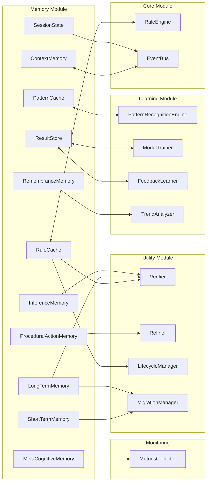
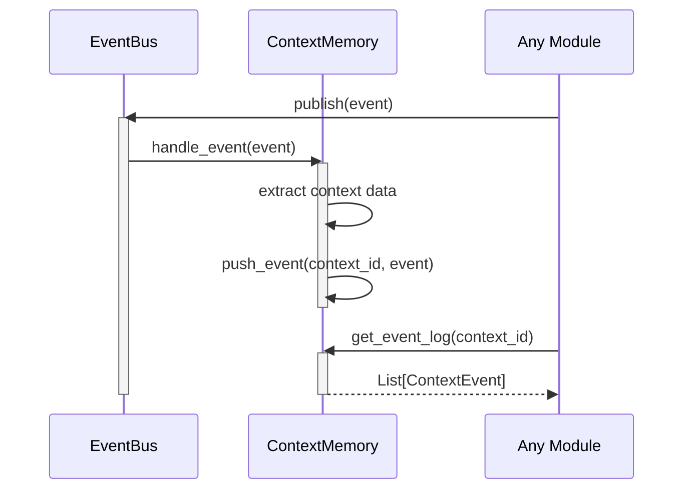
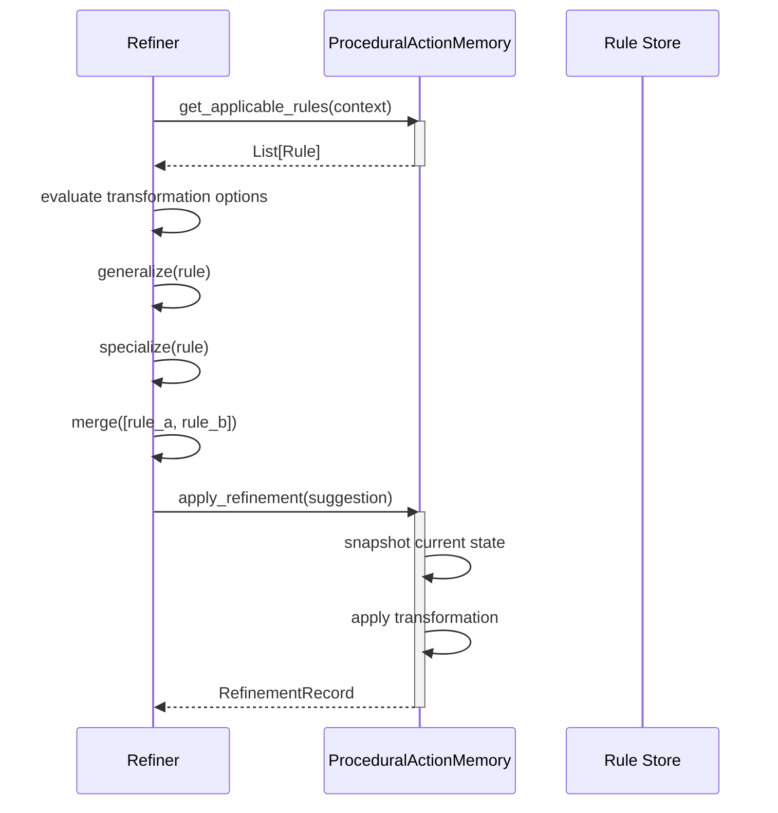
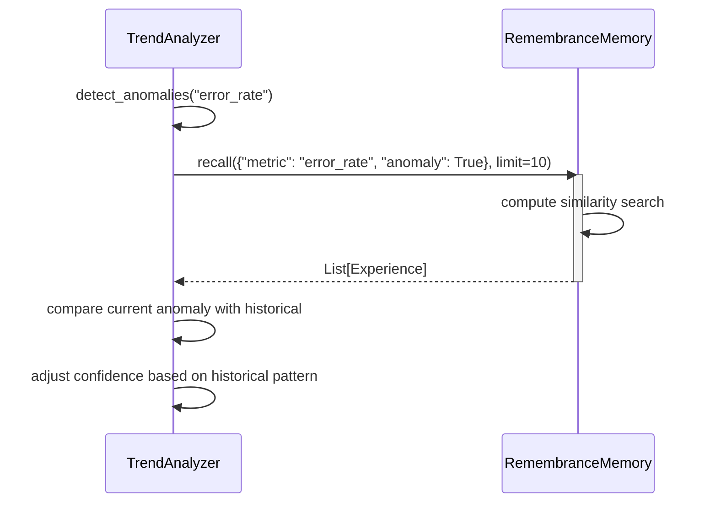
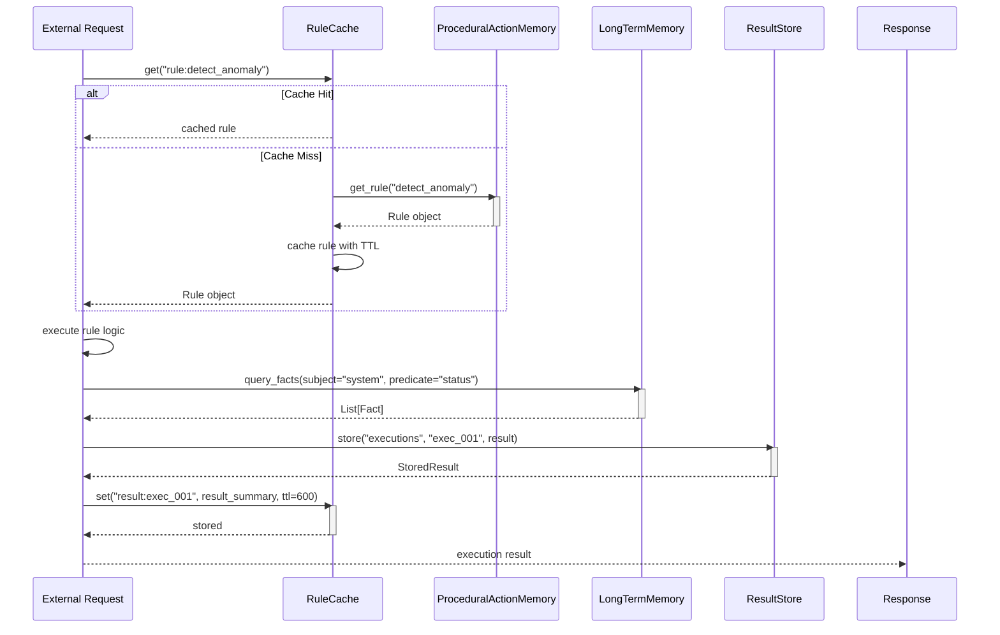

# Memory Module Integration

## Integration Overview

The Memory Module integrates with all major system modules. Each memory type serves specific integration points.



## Core Module Integration

### RuleCache ↔ RuleEngine

The RuleCache stores active rules for fast lookup by the RuleEngine.

```python
class RuleEngineIntegration:
    def __init__(self, rule_cache: RuleCache, rule_engine: 'RuleEngine'):
        self.cache = rule_cache
        self.engine = rule_engine

    def get_rule(self, rule_id: str) -> Optional[Rule]:
        cached = self.cache.get(f"rule:{rule_id}")
        if cached:
            return Rule.from_dict(cached)

        rule = self.engine.fetch_rule(rule_id)
        if rule:
            self.cache.set(f"rule:{rule_id}", rule.to_dict(), ttl=300)
        return rule

    def activate_rule(self, rule: Rule):
        self.engine.activate(rule)
        self.cache.set(f"rule:{rule.rule_id}", rule.to_dict(), ttl=300)

    def invalidate_rule(self, rule_id: str):
        self.cache.invalidate(f"rule:{rule_id}")
```

### ContextMemory ↔ EventBus

The ContextMemory subscribes to EventBus events for context tracking.



## Learning Module Integration

### PatternCache ↔ PatternRecognitionEngine

The PatternCache stores discovered patterns for quick retrieval.

```python
class LearningMemoryIntegration:
    def __init__(self, pattern_engine, pattern_cache, result_store):
        self.engine = pattern_engine
        self.pattern_cache = pattern_cache
        self.result_store = result_store

    def on_pattern_discovered(self, pattern):
        # Cache for fast access
        self.pattern_cache.set(
            pattern.pattern_id,
            pattern.to_dict(),
            score=pattern.confidence
        )

        # Persist for long-term storage
        self.result_store.store(
            "patterns",
            pattern.pattern_id,
            pattern.to_dict(),
            {"confidence": pattern.confidence, "type": pattern.pattern_type}
        )

    def get_top_patterns(self, n: int):
        return self.pattern_cache.get_top(n)
```

### ResultStore ↔ ModelTrainer

The ResultStore persists model training results.

```python
class ModelTrainingIntegration:
    def store_training_results(self, model_id, metrics, result_store):
        result_store.store(
            namespace="model_training",
            key=model_id,
            value={
                "metrics": {
                    "accuracy": metrics.accuracy,
                    "precision": metrics.precision,
                    "recall": metrics.recall,
                    "f1_score": metrics.f1_score,
                    "mcc": metrics.matthews_cc
                },
                "timestamp": datetime.now(timezone.utc).isoformat(),
                "version": metrics.version
            }
        )
```

## Utility Module Integration

### RuleCache ↔ Verifier

The Verifier uses the RuleCache to access rules for verification.

```python
class VerificationIntegration:
    def verify_with_cache(self, rule_id, verifier, rule_cache):
        cached = rule_cache.get(f"rule:{rule_id}")
        if cached:
            rule = Rule.from_dict(cached)
            result = verifier.verify(rule, "rule")
            if not result.passed:
                rule_cache.invalidate(f"rule:{rule_id}")
            return result
        return None
```

### PAM ↔ Refiner

The Refiner operates on PAM rules to improve them.



### LifecycleManager ↔ RuleCache

The LifecycleManager manages rule states and notifies the cache on transitions.

```python
class LifecycleCacheIntegration:
    def on_state_transition(self, rule_id, new_state, lifecycle_manager, rule_cache):
        if new_state in (LifecycleState.ACTIVE, LifecycleState.UPDATED):
            # Ensure rule is cached
            rule = lifecycle_manager.get_rule(rule_id)
            if rule:
                rule_cache.set(f"rule:{rule_id}", rule.to_dict(), ttl=300)
        elif new_state in (LifecycleState.ARCHIVED, LifecycleState.DEPRECATED, LifecycleState.PURGED):
            # Remove from cache
            rule_cache.invalidate(f"rule:{rule_id}")
```

### MigrationManager ↔ Memory Types

The MigrationManager handles cross-memory promotions.

```python
class MigrationMemoryIntegration:
    def promote_stm_to_ltm(self, stm, ltm):
        promoted = 0
        for entry in stm.get_all():
            if entry.priority >= self.config.promotion_priority_threshold:
                entity_name = entry.key
                existing = ltm.get_entity_by_name(entity_name)
                if not existing:
                    ltm.add_entity(
                        name=entity_name,
                        entity_type=entry.entry_type,
                        attributes={
                            "promoted_from": "stm",
                            "original_value": entry.value,
                            "stm_access_count": entry.access_count,
                            "stm_priority": entry.priority
                        }
                    )
                    ltm.add_fact(
                        subject=entity_name,
                        predicate="promoted_at",
                        object=datetime.now(timezone.utc).isoformat(),
                        confidence=0.8,
                        source="migration_manager"
                    )
                    promoted += 1
        return promoted

    def convert_ltm_to_pam(self, ltm, pam):
        converted = 0
        for fact in ltm.query_facts(predicate="is_rule"):
            rule = pam.add_rule(
                name=fact.subject,
                description=fact.object,
                rule_type=fact.metadata.get("rule_type", "threshold"),
                conditions=fact.metadata.get("conditions", {}),
                actions=fact.metadata.get("actions", {}),
                postconditions=fact.metadata.get("postconditions", {})
            )
            rule.confidence = fact.confidence
            converted += 1
        return converted
```

## Monitoring Integration

### MetaCognitiveMemory ↔ MetricsCollector

MM feeds performance data to the monitoring system.

```python
class MonitoringMemoryIntegration:
    def report_performance(self, mm: MetaCognitiveMemory, collector):
        for task_type in mm.performance_metrics:
            summary = mm.get_performance_summary(task_type)
            collector.record_metric(
                f"mm.performance.{task_type}.accuracy",
                summary.get("avg_accuracy", 0.0),
                unit="percent",
                labels={"task_type": task_type}
            )
            collector.record_metric(
                f"mm.performance.{task_type}.latency",
                summary.get("avg_latency", 0.0),
                unit="ms",
                labels={"task_type": task_type}
            )
```

### RemembranceMemory ↔ TrendAnalyzer

REM provides historical context for trend analysis.



## Cross-Integration Patterns

### Full Rule Lifecycle with Memory Integration

```mermaid
flowchart LR
    subgraph Create["Creation"]
        A[Rule Created] --> B[LifecycleManager: Draft]
    end

    subgraph Cache["Caching"]
        B --> C[RuleCache: store rule]
    end

    subgraph Verify["Verification"]
        C --> D[Verifier: verify rule]
        D --> E{Passed?}
    end

    subgraph Activate["Activation"]
        E -->|yes| F[LifecycleManager: Active]
        F --> G[RuleCache: update TTL]
    end

    subgraph Execute["Execution"]
        G --> H[RuleEngine: execute]
        H --> I[PAM: log execution]
        I --> J[ResultStore: store outcome]
    end

    subgraph Learn["Learning"]
        J --> K[FeedbackLearner: record feedback]
        K --> L[PatternCache: update scores]
    end

    subgraph Refine["Refinement"]
        L --> M[Refiner: optimize rule]
        M --> N[PAM: update rule]
        N --> G
    end

    subgraph Retire["Retirement"]
        E -->|no| O[LifecycleManager: Draft]
        O --> P[RuleCache: invalidate]
        P --> Q[Archive]
    end
```



### Data Flow: Request → Cache → Memory → Response



## Configuration Integration

All memory components follow a consistent configuration pattern.

```python
@dataclass
class BaseMemoryConfig:
    enabled: bool = True
    log_level: str = "INFO"
    version: str = "1.0.0"

@dataclass
class MemoryModuleConfig:
    default_ttl_seconds: float = 300.0
    max_capacity: int = 1000
    enable_persistence: bool = True
    enable_metrics: bool = True
    cleanup_interval_seconds: int = 300
```

## Integration Points Summary

| Integration | Source | Target | Protocol | Data |
|-------------|--------|--------|----------|------|
| Rule lookup | RuleEngine | RuleCache | get/set/invalidate | Rule objects |
| Context tracking | EventBus | ContextMemory | push_event/get_log | ContextEvent |
| Pattern storage | PatternEngine | PatternCache | get/set/get_top | CachedPattern |
| Result persistence | ModelTrainer | ResultStore | store/retrieve | StoredResult |
| Session management | All modules | SessionState | create/get/set | Session data |
| Memory promotion | MigrationManager | STM→LTM→PAM | promote/convert | Entities, Rules |
| Verification | Verifier | LTM/PAM | query_facts/get_rule | Facts, Rules |
| Refinement | Refiner | PAM | get_applicable_rules | Rules |
| Lifecycle | LifecycleManager | RuleCache | on_state_transition | State |
| Performance | MM | MetricsCollector | record_metric | PerformanceRecord |
| Recollection | REM | TrendAnalyzer | recall | Experience |