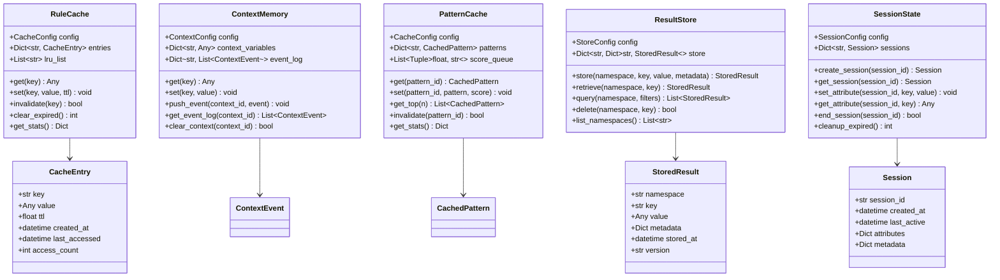
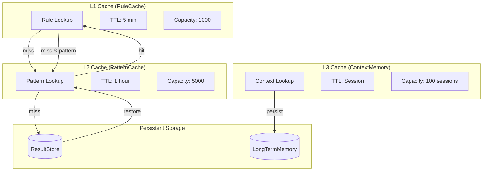
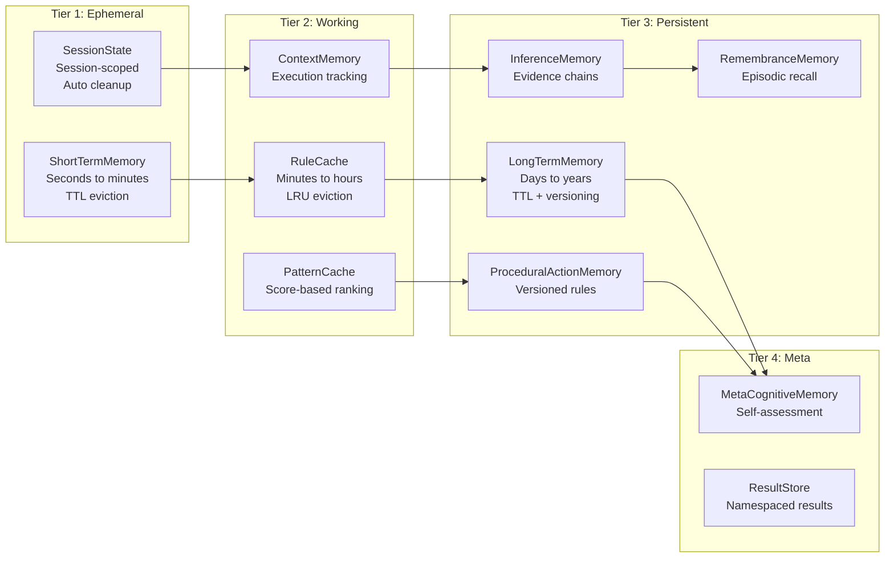

# Memory Module

## Overview

The Memory Module provides a hierarchical memory system for the Rules-Emerging-Pattern platform. It implements six specialized memory types that work together to provide short-term working memory, long-term declarative knowledge, procedural action rules, inference storage, metacognitive self-awareness, and episodic recollection.

### Memory Types

- **RuleCache** (`rule_cache.py`): Fast-access cache for active rule lookup with TTL-based expiration and LRU eviction. Provides sub-millisecond lookups for rules that are frequently executed.

- **ContextMemory** (`context_memory.py`): Stores and manages execution context across the system. Tracks session variables, environment state, and execution paths for debugging and replay.

- **PatternCache** (`pattern_cache.py`): High-speed cache for discovered patterns with score-based ranking. Enables near-instant retrieval of top patterns across all modules.

- **ResultStore** (`result_store.py`): Persistent storage for computation results with namespaced organization. Supports versioned results with metadata, queryable by namespace and key.

- **SessionState** (`session_state.py`): Manages ephemeral session data with automatic cleanup. Provides session-scoped storage with configurable TTL and priority-based retention.

### Supporting Memory Systems

- **Procedural-Action Memory (PAM)**: Stores learned procedures, rules, and action sequences. Encodes both atomic rules and composite workflows with confidence-weighted execution paths.

- **Inference Memory (IM)**: Stores inference results — conclusions, predictions, and relationships derived from raw data. Supports evidence chains and confidence propagation.

- **Long-Term Memory (LTM)**: Durable persistent storage for declarative knowledge — facts, entities, relationships, and semantic knowledge retained across sessions.

- **Short-Term Memory (STM)**: Ephemeral session-scoped storage for transient data — recent events, temporary context, working state with sliding window and TTL-based eviction.

- **Metacognitive Memory (MM)**: Self-awareness and introspection — performance metrics, confidence calibration, strategy effectiveness tracking, and learning progress.

- **Remembrance Memory (REM)**: Recollection and association — episodic experience records with contextual embeddings for similarity-based retrieval and analogy mapping.

## Class Diagram



## Cache Hierarchy



## Memory Tier Diagram



## Quick Start

```python
from rules_emerging_pattern.memory.rule_cache import RuleCache
from rules_emerging_pattern.memory.context_memory import ContextMemory
from rules_emerging_pattern.memory.pattern_cache import PatternCache
from rules_emerging_pattern.memory.result_store import ResultStore
from rules_emerging_pattern.memory.session_state import SessionState

# RuleCache
cache = RuleCache()
cache.set("rule_001", {"action": "alert", "severity": "high"}, ttl=300)
rule = cache.get("rule_001")

# ContextMemory
ctx = ContextMemory()
ctx.set("current_user", "admin")
ctx.push_event("session_001", {"type": "login", "timestamp": "2026-01-15T10:00:00Z"})

# PatternCache
pc = PatternCache()
pc.set("pattern_abc", {"type": "anomaly", "score": 0.85}, score=0.85)
top = pc.get_top(5)

# ResultStore
rs = ResultStore()
rs.store("model_training", "model_v1", {"accuracy": 0.94}, {"version": "1.0"})
result = rs.retrieve("model_training", "model_v1")

# SessionState
ss = SessionState()
ss.create_session("sess_001")
ss.set_attribute("sess_001", "view_mode", "detailed")
mode = ss.get_attribute("sess_001", "view_mode")
```

## API Reference

| Class | Method | Description |
|-------|--------|-------------|
| `RuleCache` | `get(key)` | Retrieve cached rule by key |
| `RuleCache` | `set(key, value, ttl)` | Store rule with optional TTL |
| `RuleCache` | `invalidate(key)` | Remove cached entry |
| `RuleCache` | `clear_expired()` | Evict all expired entries |
| `RuleCache` | `get_stats()` | Get hit/miss ratio and size |
| `ContextMemory` | `get(key)` | Get context variable by key |
| `ContextMemory` | `set(key, value)` | Set context variable |
| `ContextMemory` | `push_event(context_id, event)` | Log a context event |
| `ContextMemory` | `get_event_log(context_id)` | Retrieve event history |
| `ContextMemory` | `clear_context(context_id)` | Clear all context data |
| `PatternCache` | `get(pattern_id)` | Retrieve cached pattern |
| `PatternCache` | `set(pattern_id, pattern, score)` | Cache pattern with score |
| `PatternCache` | `get_top(n)` | Get top N highest-scored patterns |
| `PatternCache` | `invalidate(pattern_id)` | Remove cached pattern |
| `PatternCache` | `get_stats()` | Get cache statistics |
| `ResultStore` | `store(namespace, key, value, metadata)` | Store a result |
| `ResultStore` | `retrieve(namespace, key)` | Retrieve stored result |
| `ResultStore` | `query(namespace, filters)` | Query results by namespace |
| `ResultStore` | `delete(namespace, key)` | Delete a stored result |
| `ResultStore` | `list_namespaces()` | List all namespaces |
| `SessionState` | `create_session(session_id)` | Create a new session |
| `SessionState` | `get_session(session_id)` | Get session object |
| `SessionState` | `set_attribute(session_id, key, value)` | Set session attribute |
| `SessionState` | `get_attribute(session_id, key)` | Get session attribute |
| `SessionState` | `end_session(session_id)` | End and cleanup session |
| `SessionState` | `cleanup_expired()` | Remove expired sessions |