# Middleware Module Architecture

## Layered Pipeline Model

The middleware follows a sequential pipeline architecture where each component processes the request/response in order:

1. **Validation Layer** — `ValidationMiddleware` sanitizes input, blocks XSS, validates content type, enforces size limits
2. **Logging Layer** — `LoggingMiddleware` creates structured log entries with correlation IDs, masks sensitive data
3. **Auth Layer** — `AuthMiddleware` authenticates via multiple providers, enforces RBAC permissions
4. **Rate Limit Layer** — `RateLimitMiddleware` enforces per-IP/per-user/per-route limits with multiple algorithms
5. **Audit Layer** — `AuditMiddleware` records all events with query, export, and archive capabilities

## Detailed Class Diagram

```mermaid
classDiagram
    class ValidationMiddleware {
        -config: ValidationConfig
        -sanitizer: ContentSanitizer
        -coercer: TypeCoercer
        -enricher: RequestEnricher
        -formatter: ResponseFormatter
        -_rules: Dict~str, List~ValidationRule~~
        -_chain: List~Dict~
        +__init__(config)
        +add_rule(route, rule) void
        +add_rules(route, rules) void
        +add_middleware(name, handler, order, enabled) void
        +remove_middleware(name) bool
        +get_chain() List
        +validate_request(request) ValidatedRequest
        +process_request(request) ValidatedRequest
        +process_response(response) ValidatedResponse
        +sanitize_request(request) Dict
        +sanitize_string(text) str
        +validate_json_schema(data, schema) Tuple
        +deep_validate(request, depth) List~str~
        +validate_content_type(content_type) bool
        +validate_utf8(data) bool
        +validate_method(method) bool
        +validate_size(data) bool
        +check_blocked_patterns(text) List~str~
        +strip_sensitive_fields(data, sensitive_keys) Dict
        +extract_metadata(request) Dict
        +parse_body(body) Dict
        +normalize_request(request) Dict
        +get_config() ValidationConfig
        +update_config(**kwargs) void
        +reset_config() void
        +validate_batch(requests) List
        +get_stats() Dict
        +format_as_json(data, pretty) str
    }

    class LoggingMiddleware {
        -config: LoggingConfig
        -masker: SensitiveDataMasker
        -sampler: LogSampler
        -rotator: LogRotator
        -formatter: StructuredLogFormatter
        -_correlation_id: str
        -_request_count: int
        -_error_count: int
        -_component_loggers: Dict
        +__init__(config)
        +log_request(request, component) str
        +log_response(response, request, duration_ms, component) void
        +log_error(error, component, metadata) void
        +log_security_event(event, component, severity, metadata) void
        +log_performance(operation, duration_ms, component, metadata) void
        +log_audit(action, user_id, resource, component, metadata) void
        +log_metric(metric_name, value, component, tags) void
        +log_system_event(event, component, level, metadata) void
        +log_raw(level, message, component, **kwargs) void
        +get_component_logger(component) Logger
        +mask_sensitive(data) Dict
        +mask_string(value) str
        +configure_component(component, level, sampling_rate, enabled) void
        +get_component_config(component) ComponentLogConfig
        +get_stats() Dict
        +get_request_count() int
        +get_error_count() int
        +get_uptime() float
        +set_correlation_id(correlation_id) void
        +get_correlation_id() str
        +add_mask_field(field) void
        +remove_mask_field(field) void
        +enable_component_logging(component) void
        +disable_component_logging(component) void
        +set_sampling_rate(component, rate) void
        +reset_sampling() void
        +flush() void
        +close() void
    }

    class AuthMiddleware {
        -config: AuthConfig
        -token_handler: TokenHandler
        -api_key_handler: APIKeyHandler
        -session_handler: SessionHandler
        -role_manager: RoleManager
        -_custom_providers: Dict
        -_auth_failures: Dict
        -_auth_cache: Dict
        +__init__(config)
        +authenticate(request) AuthResultData
        +check_permission(user, required_permission) bool
        +check_any_permission(user, required_permissions) bool
        +check_all_permissions(user, required_permissions) bool
        +generate_token(user_id, roles, metadata) str
        +generate_api_key(user_id, metadata) str
        +create_session(user_id, ip_address, user_agent) str
        +invalidate_session(session_id) bool
        +revoke_token(token) bool
        +revoke_api_key(api_key) bool
        +get_user_from_token(token) UserContext
        +get_user_context(request) UserContext
        +extract_user_context(request) UserContext
        +register_custom_provider(name, handler) void
        +unregister_custom_provider(name) bool
        +add_role(role, permissions, inherits) void
        +remove_role(role) bool
        +list_roles() Dict
        +get_user_permissions(user) Set
        +is_public_route(route) bool
        +clear_auth_cache() void
        +get_stats() Dict
        +update_config(**kwargs) void
        +reset_config() void
    }

    class RateLimitMiddleware {
        -config: RateLimitConfig
        -_sliding_windows: Dict
        -_token_buckets: Dict
        -_fixed_windows: Dict
        -_leaky_buckets: Dict
        -_gcras: Dict
        -_backoff: BackoffController
        -_stats: RateLimitStats
        +__init__(config)
        +add_rule(rule) void
        +remove_rule(name) bool
        +update_rule(name, **kwargs) bool
        +check_rate_limit(request) RateLimitResult
        +check_rate_limit_batch(requests) List
        +can_proceed(request) Tuple
        +get_remaining(request) int
        +get_retry_after(request) float
        +reset_key(key) bool
        +reset_all() int
        +add_to_whitelist(ip, user, route) void
        +remove_from_whitelist(ip, user, route) bool
        +add_to_blacklist(ip, user) void
        +remove_from_blacklist(ip, user) bool
        +get_stats() Dict
        +get_rule_stats(rule_name) Dict
        +get_backoff_status(ip) Dict
        +reset_ip_backoff(ip) void
        +estimated_limit_for(scope, identifier) int
        +update_config(**kwargs) void
        +reset_config() void
    }

    class AuditMiddleware {
        -config: AuditConfig
        -storage: AuditStorage
        -archiver: AuditArchiver
        -exporter: AuditExporter
        -_stats: AuditStats
        -_batched_records: List
        +__init__(config)
        +record(event_type, actor_id, actor_name, action, ...) str
        +record_rule_evaluation(rule_name, actor_id, result, duration_ms, ...) str
        +record_auth_attempt(actor_id, success, ip_address, failure_reason) str
        +record_permission_denied(actor_id, resource_type, resource_id, ...) str
        +record_error(actor_id, error_type, error_message, ...) str
        +record_config_change(actor_id, config_section, changes, ...) str
        +record_request(request, actor_id, actor_name) str
        +query(event_types, actor_ids, resource_types, ...) List~AuditRecord~
        +query_by_user(actor_id, limit) List
        +query_by_time_range(start, end) List
        +query_by_event_type(event_type, limit) List
        +query_by_resource(resource_type, resource_id, limit) List
        +get_record(record_id) AuditRecord
        +get_recent(count) List
        +export_json(filter_obj) str
        +export_csv(filter_obj) str
        +export_to_file(filepath, format, filter_obj) bool
        +archive_old_records() int
        +restore_from_archive(archive_file) int
        +list_archives() List~str~
        +cleanup() int
        +get_stats() Dict
        +count_records(filter_obj) int
        +clear_records() int
        +flush() int
        +update_config(**kwargs) void
        +reset_config() void
    }

    ValidationMiddleware ..> LoggingMiddleware : passes sanitized request
    LoggingMiddleware ..> AuthMiddleware : provides correlation_id
    AuthMiddleware ..> RateLimitMiddleware : provides user context
    RateLimitMiddleware ..> AuditMiddleware : records rate limit hits
    AuditMiddleware ..> LoggingMiddleware : audit events trigger logs
```



## Internal Sub-Systems

Each middleware component contains internal helper classes:

### ValidationMiddleware Internals
```
ValidationMiddleware
 ├── HTMLSanitizer — strip tags, remove scripts, sanitize attributes, escape HTML
 ├── WhitespaceNormalizer — normalize line endings, collapse spaces, strip control chars
 ├── ContentSanitizer — recursive sanitize_value, sanitize_string, sanitize_headers
 ├── TypeCoercer — int/float/bool/str/list/dict coercion
 ├── RequestEnricher — add request_id, timestamp, client_ip, metadata
 └── ResponseFormatter — format_success, format_error, format_validation_error, format_paginated
```

### LoggingMiddleware Internals
```
LoggingMiddleware
 ├── SensitiveDataMasker — mask_field_value, mask_dict, mask_headers, mask_body
 ├── LogSampler — should_log with per-component sampling rates and thread-safe counters
 ├── LogRotator — setup_rotation with TimedRotatingFileHandler / RotatingFileHandler
 ├── JSONLogFormatter — format as JSON with thread/process/hostname
 └── StructuredLogFormatter — format_entry, format_json, format_text
```

### AuthMiddleware Internals
```
AuthMiddleware
 ├── TokenHandler — generate_token, validate_token (HMAC-SHA256/384/512), refresh_access_token
 ├── APIKeyHandler — generate_key, validate_key (SHA-256/512 hashed), revoke_key
 ├── SessionHandler — create_session, validate_session with IP/UA validation, rotation
 └── RoleManager — get_permissions_for_role with inheritance hierarchy
```

### RateLimitMiddleware Internals
```
RateLimitMiddleware
 ├── SlidingWindowCounter — deque-based with configurable maxlen and cutoff pruning
 ├── TokenBucket — token accumulation with refill_rate, burst capacity
 ├── FixedWindowCounter — time-window aligned counter with reset on boundary
 ├── LeakyBucket — constant leak rate with burst overflow protection
 ├── GCRACounter — generic cell rate algorithm with virtual scheduling
 └── BackoffController — exponential backoff based on violation history
```

### AuditMiddleware Internals
```
AuditMiddleware
 ├── AuditStorage — in-memory dict with 5 indexes (event_type, actor_id, resource_type, severity, timestamp)
 ├── AuditArchiver — archive_old_records to JSON files, restore_from_archive, list_archives
 └── AuditExporter — export_json, export_csv, export_to_file
```

## Architectural Decisions

### 1. Sequential Pipeline with Side Effects
Each middleware component processes the request independently and may enrich it with metadata (e.g., `_metadata` field added by ValidationMiddleware, `_user` field added by AuthMiddleware). This avoids tight coupling while allowing later middleware to benefit from earlier processing.

### 2. Provider Chain for Auth
AuthMiddleware tries providers in `order` sequence. If a provider returns `MISSING`, the next provider is tried. If any returns `GRANTED` or `REQUIRES_MFA`, the chain stops. This allows graceful fallback from bearer token → API key → session.

### 3. Thread-Safe Rate Limiting
All rate limiter algorithms use `threading.Lock()` for their state mutations. The SlidingWindowCounter uses a `deque` with `maxlen=10000` to bound memory.

### 4. Config-Driven Everything
All five middleware components accept an optional `config_path` parameter for loading YAML/JSON configuration. Each has sensible defaults (see `ValidationConfig`, `LoggingConfig`, `AuthConfig`, `RateLimitConfig`, `AuditConfig`).

### 5. Sensitive Data Masking
Both `LoggingMiddleware` and `AuditMiddleware` implement masking of sensitive fields (passwords, tokens, secrets, API keys) before logging or storing. `ValidationMiddleware` provides `strip_sensitive_fields()` as well.

### 6. Auth Failure Rate Limiting
AuthMiddleware tracks IP-based failure counts within a sliding window. After `max_auth_failures` (default 5) in `auth_failure_window` (default 300s), the IP is temporarily blocked.

### 7. Audit Export & Archive
AuditMiddleware supports exporting to JSON/CSV, archiving old records to files, and restoring from archives. The storage is in-memory with a configurable `max_records` (default 100,000) using LRU-like eviction.
