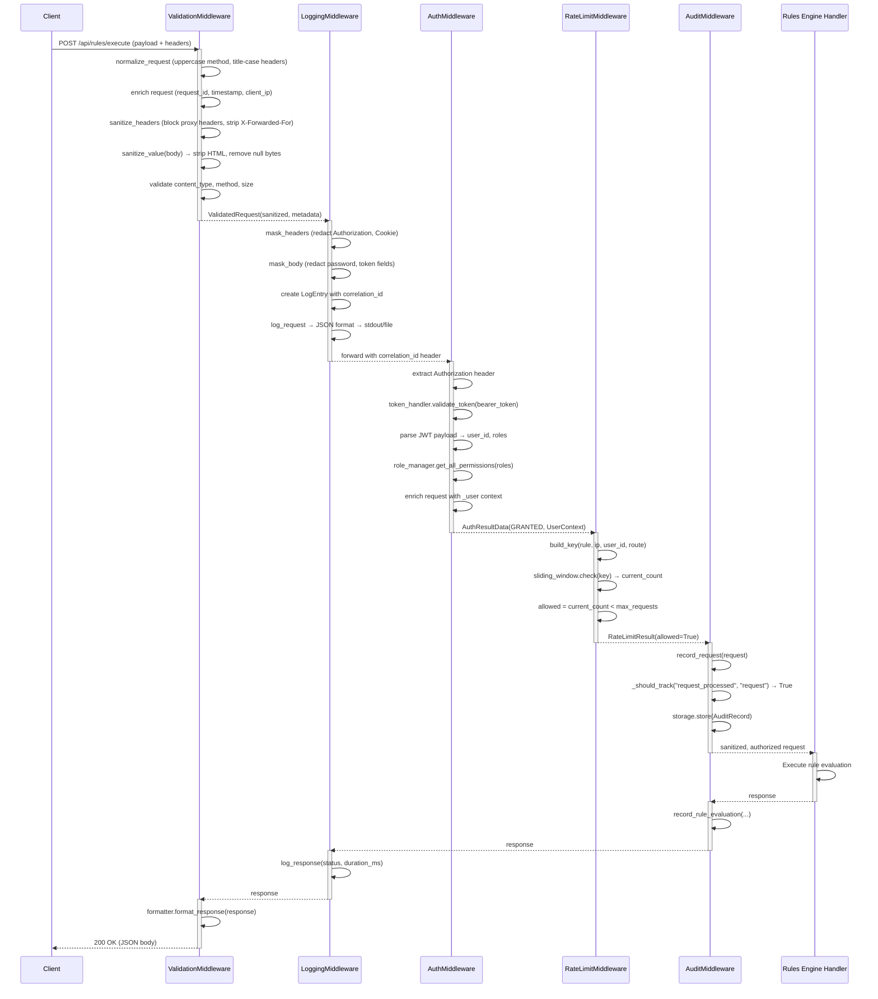
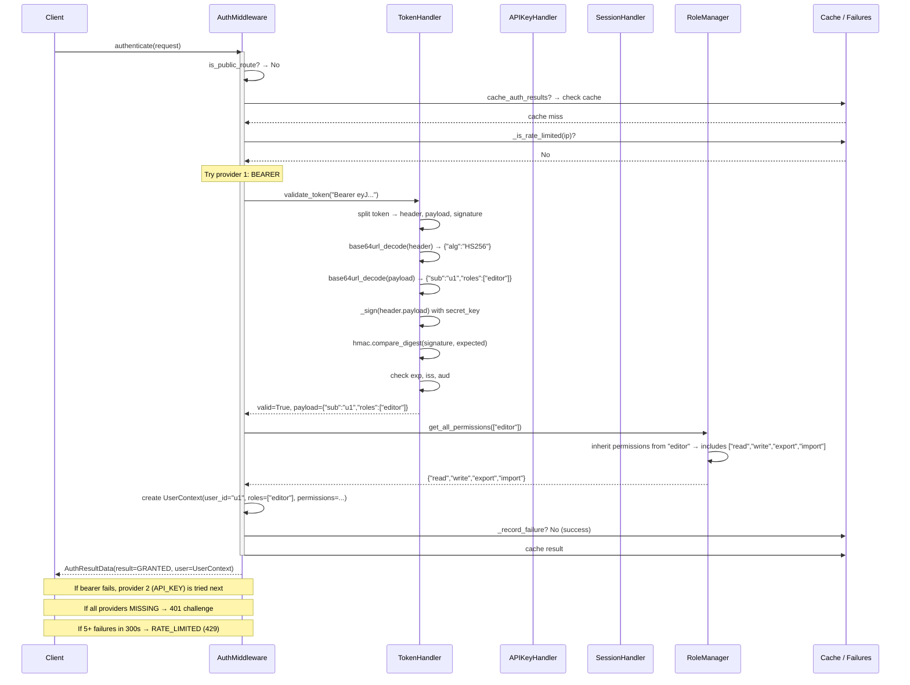
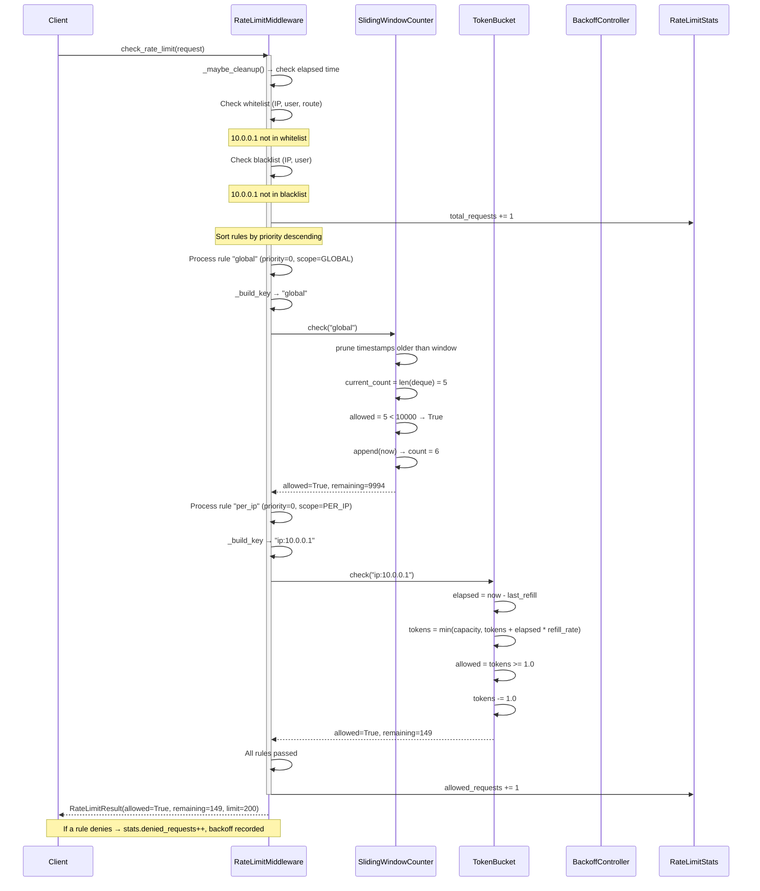
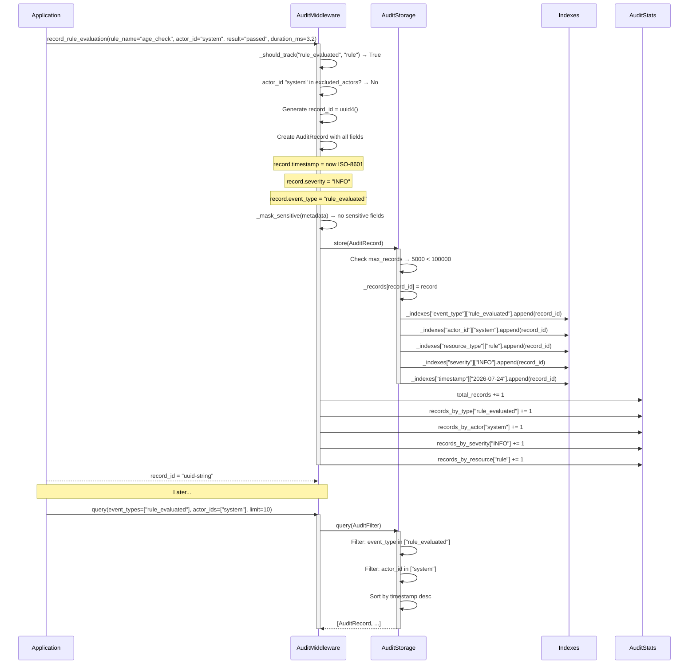
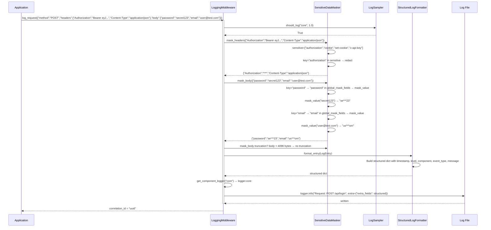
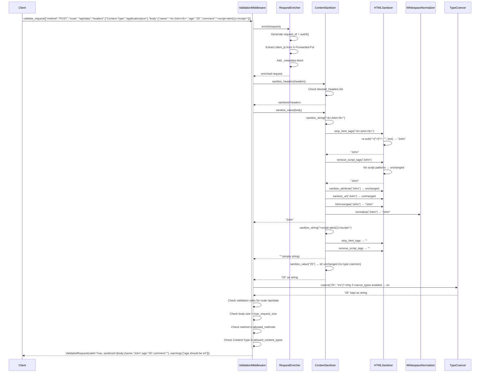

# Middleware Module Data Flow

## 1. Full Request Processing Pipeline

End-to-end flow showing how all five middleware components process a single request.

## 2. Authentication Flow with Multiple Providers

The `AuthMiddleware` tries providers in order until one succeeds.

## 3. Rate Limit Decision Flow

The `RateLimitMiddleware` checks multiple rules and returns the first denied result.

## 4. Audit Record Creation and Storage Flow

The `AuditMiddleware` records events with multi-indexed storage.

## 5. Logging with Sensitive Data Masking

The `LoggingMiddleware` masks sensitive fields before writing log entries.

## 6. Validation and Sanitization Flow

The `ValidationMiddleware` transforms a raw request into a sanitized, enriched `ValidatedRequest`.

