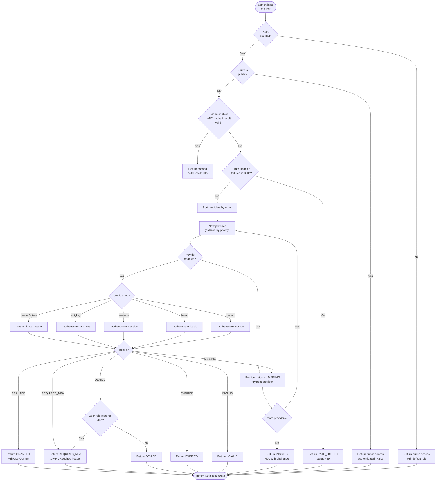

# Middleware Module Reasoning & Decision Logic

## 1. Authentication Provider Chain Logic

The `AuthMiddleware` tries multiple providers in order with fallback.



## 2. Rate Limit Strategy Selection and Check

Each rate limiting algorithm has a different decision mechanism.

```mermaid
flowchart TD
    START([check_rate_limit<br>request]) --> ENABLED{"Rate limit<br>enabled?"}
    ENABLED -->|No| ALWAYS_ALLOW[Return allowed=True<br>infinite limit]

    ENABLED -->|Yes| WHITELIST{"IP/User/Route<br>in whitelist?"}
    WHITELIST -->|Yes| ALLOW_WL[Return allowed=True<br>999999 remaining]

    WHITELIST -->|No| BLACKLIST{"IP/User<br>in blacklist?"}
    BLACKLIST -->|Yes| DENY_BL[Return denied<br>retry_after=86400]

    BLACKLIST -->|No| SORT_RULES[Sort rules by priority]
    SORT_RULES --> NEXT_RULE["Next active rule"]

    NEXT_RULE --> METHOD_OK{"Rule method matches<br>request method?"}
    METHOD_OK -->|No| SKIP_RULE[Skip → next rule]

    METHOD_OK -->|Yes| ROUTE_OK{"Rule route matches<br>request route?"}
    ROUTE_OK -->|No| SKIP_RULE

    ROUTE_OK -->|Yes| BUILD_KEY[Build key from scope<br>IP / User / Route / combo]

    BUILD_KEY --> BACKOFF{"Backoff active<br>for this key?"}
    BACKOFF -->|Yes| RETURN_BACKOFF[Return denied<br>with backoff seconds]

    BACKOFF -->|No| STRATEGY{rule.strategy}

    STRATEGY -->|SLIDING_WINDOW| SW_CHECK
    STRATEGY -->|TOKEN_BUCKET| TB_CHECK
    STRATEGY -->|FIXED_WINDOW| FW_CHECK
    STRATEGY -->|LEAKY_BUCKET| LB_CHECK
    STRATEGY -->|GCRA| GCRA_CHECK

    subgraph SW_CHECK[Sliding Window Check]
        SW1[Get state for key] --> SW2[Prune timestamps<br>older than window]
        SW2 --> SW3[count = len(timestamps)]
        SW3 --> SW4{"count < max?"}
        SW4 -->|Yes| SW5[Append now<br>Return allowed]
        SW4 -->|No| SW6[Return denied<br>retry_after = oldest + window - now]
    end

    subgraph TB_CHECK[Token Bucket Check]
        TB1[Get state for key] --> TB2{last_refill == 0?}
        TB2 -->|Yes| TB3[Set tokens = capacity]
        TB2 -->|No| TB4[Compute elapsed time]
        TB4 --> TB5[refill = elapsed * refill_rate]
        TB5 --> TB6[tokens = min(capacity, tokens + refill)]
        TB6 --> TB7{"tokens >= 1.0?"}
        TB7 -->|Yes| TB8[tokens -= 1<br>Return allowed]
        TB7 -->|No| TB9[Return denied<br>retry_after = needed / rate]
    end

    subgraph GCRA_CHECK[GCRA Check]
        G1[Get TAT for key] --> G2{TAT == 0?}
        G2 -->|Yes| G3[Set TAT = now]
        G2 -->|No| G4[new_TAT = max(TAT, now) + tau]
        G4 --> G5{"new_TAT <= now + t_max?"}
        G5 -->|Yes| G6[TAT = new_TAT<br>Return allowed]
        G5 -->|No| G7[Return denied<br>delay = new_TAT - now]
    end

    SW_CHECK --> ALLOWED{"Allowed?"}
    TB_CHECK --> ALLOWED
    FW_CHECK --> ALLOWED
    LB_CHECK --> ALLOWED
    GCRA_CHECK --> ALLOWED

    ALLOWED -->|No| RECORD_VIOLATION[Record backoff violation<br>if enabled]
    RECORD_VIOLATION --> RETURN_DENIED([Return denied result<br>with headers])
    ALLOWED -->|Yes, more rules| NEXT_RULE
    ALLOWED -->|Yes, all passed| RETURN_ALLOWED([Return allowed result])

    SKIP_RULE --> MORE_RULES{"More rules?"}
    MORE_RULES -->|Yes| NEXT_RULE
    MORE_RULES -->|No| RETURN_ALLOWED
```

## 3. Request Content Sanitization Logic

The `ValidationMiddleware` applies recursive sanitization to prevent injection attacks.

```mermaid
flowchart TD
    START([sanitize_value<br>value, depth]) --> MAX_DEPTH{"depth ><br>max_depth?"}
    MAX_DEPTH -->|Yes| RET_NONE[Return None]

    MAX_DEPTH -->|No| TYPE{type of value}

    TYPE -->|str| SANITIZE_STR
    TYPE -->|dict| SANITIZE_DICT
    TYPE -->|list| SANITIZE_LIST
    TYPE -->|int/float/bool| RET_ASIS[Return unchanged]
    TYPE -->|None| RET_NONE
    TYPE -->|other| TRY_STR[Try str(value)]

    SANITIZE_STR --> STRIP_NULL{"strip_null_bytes?"}
    STRIP_NULL -->|Yes| NULL_FREE[Remove \\x00 chars]
    NULL_FREE --> NORM_UNICODE{"normalize_unicode?"}
    STRIP_NULL -->|No| NORM_UNICODE

    NORM_UNICODE -->|Yes| UNI_SAFE[Encode/decode UTF-8<br>with replacement]
    UNI_SAFE --> STRIP_HTML{"strip_html?"}
    NORM_UNICODE -->|No| STRIP_HTML

    subgraph HTML Sanitizer
        STRIP_HTML -->|Yes| REMOVE_TAGS[re.sub <[^>]*> → ""]
        REMOVE_TAGS --> REMOVE_SCRIPT[Remove blocked patterns<br><script>, on\\w+=, javascript:]
        REMOVE_SCRIPT --> SANITIZE_ATTR[Remove on\\w+ attributes]
        SANITIZE_ATTR --> SANITIZE_URL[Remove javascript:/vbscript:/data:]
        SANITIZE_URL --> ESCAPE[html.escape]
    END_HTML --> NORM_WS
    end

    STRIP_HTML -->|No| NORM_WS
    END_HTML --> NORM_WS

    NORM_WS{"normalize_whitespace?"}
    NORM_WS -->|Yes| NORM[Normalize line endings<br>collapse spaces<br>strip control chars]
    NORM --> TRUNCATE
    NORM_WS -->|No| TRUNCATE

    TRUNCATE{"len > max_string_length?"}
    TRUNCATE -->|Yes| CUT[Truncate to max_string_length]
    TRUNCATE -->|No| RET_STR[Return sanitized string]

    SANITIZE_DICT --> LOOP_DICT["For each key: value<br>sanitize_value(value, depth+1)"]
    LOOP_DICT --> FILTER_KEYS[Keep only string keys]
    FILTER_KEYS --> RET_DICT[Return new dict]

    SANITIZE_LIST --> LOOP_LIST["For each item[:max_array_elements]<br>sanitize_value(item, depth+1)"]
    LOOP_LIST --> RET_LIST[Return new list]

    TRY_STR --> RET_STR
```

## 4. Validation Rule Application Logic

Per-route field validation rules are applied after sanitization.

```mermaid
flowchart TD
    START([validate_request<br>request]) --> ENRICH[Enrich request with metadata]
    ENRICH --> CHECK_METHOD{"Method in<br>allowed_methods?"}
    CHECK_METHOD -->|No| ADD_METHOD_ERR[Add error: method not allowed]

    CHECK_METHOD -->|Yes| SANITIZE[Sanitize headers, body, query, params]
    SANITIZE --> ROUTE_RULES{"Route has<br>validation rules?"}
    ROUTE_RULES -->|No| CHECK_SIZE

    ROUTE_RULES -->|Yes| NEXT_RULE["Next ValidationRule<br>for this route"]

    NEXT_RULE --> FIELD_VAL{"Field value<br>exists?"}
    FIELD_VAL -->|No| CHECK_REQUIRED{"rule.required?"}
    CHECK_REQUIRED -->|Yes| ADD_MISSING[Add error: required field missing]
    CHECK_REQUIRED -->|No| MORE_RULES

    FIELD_VAL -->|Yes| CHECK_MIN{"min_length set AND<br>len(value) < min?"}
    CHECK_MIN -->|Yes| ADD_SHORT[Add error: too short]
    CHECK_MIN -->|No| CHECK_MAX{"max_length set AND<br>len(value) > max?"}

    CHECK_MAX -->|Yes| ADD_LONG[Add error: too long]
    CHECK_MAX -->|No| CHECK_PATTERN{"pattern set AND<br>field_value is str?"}

    CHECK_PATTERN -->|Yes| MATCH{"re.match(pattern, value)?"}
    MATCH -->|No| ADD_PATTERN_ERR[Add error: pattern mismatch]
    MATCH -->|Yes| CHECK_ALLOWED

    CHECK_PATTERN -->|No| CHECK_ALLOWED

    CHECK_ALLOWED{"allowed_values set AND<br>value not in list?"}
    CHECK_ALLOWED -->|Yes| ADD_VALUE_ERR[Add error: invalid value]

    CHECK_ALLOWED -->|No| CHECK_TYPE{"type_check set?"}
    CHECK_TYPE -->|Yes| COERCE[coerce(value, target_type)]
    COERCE --> MORE_RULES

    CHECK_TYPE -->|No| MORE_RULES

    ADD_MISSING --> MORE_RULES
    ADD_SHORT --> MORE_RULES
    ADD_LONG --> MORE_RULES
    ADD_PATTERN_ERR --> MORE_RULES
    ADD_VALUE_ERR --> MORE_RULES

    MORE_RULES{"More rules?"}
    MORE_RULES -->|Yes| NEXT_RULE
    MORE_RULES -->|No| CHECK_SIZE

    CHECK_SIZE{"Body size <=<br>max_request_size?"}
    CHECK_SIZE -->|No| ADD_SIZE_ERR[Add error: body too large]

    CHECK_SIZE -->|Yes| CHECK_CT{"Content-Type<br>allowed?"}
    CHECK_CT -->|No| ADD_CT_ERR[Add error: content type not allowed]

    CHECK_CT -->|Yes| BUILD_RESULT
    ADD_SIZE_ERR --> BUILD_RESULT
    ADD_CT_ERR --> BUILD_RESULT
    ADD_METHOD_ERR --> BUILD_RESULT

    BUILD_RESULT["Build ValidatedRequest<br>with errors, warnings, duration"]
    BUILD_RESULT --> ANY_ERR{"Errors<br>empty?"}
    ANY_ERR -->|Yes| RUN_CHAIN["Run middleware chain<br>(if any)"]
    RUN_CHAIN --> RETURN([Return ValidatedRequest])
    ANY_ERR -->|No| RETURN
```

## 5. Audit Record Tracking Decision

The `AuditMiddleware` decides whether to record each event based on configuration.

```mermaid
flowchart TD
    START([record<br>event]) --> ENABLED{"Audit<br>enabled?"}
    ENABLED -->|No| SKIP[Return empty string<br>no record]

    ENABLED -->|Yes| EXCLUDED{"Actor in<br>excluded_actors?"}
    EXCLUDED -->|Yes| SKIP

    EXCLUDED -->|No| SHOULD_TRACK{"track_all_events<br>OR (event_type tracked<br>AND resource_type tracked)?"}
    SHOULD_TRACK -->|No| SKIP

    SHOULD_TRACK -->|Yes| BUILD[Create AuditRecord with all fields]
    BUILD --> TRUNCATE_DESC{"description length ><br>max_description_length?"}
    TRUNCATE_DESC -->|Yes| CUT_DESC[Truncate + "..."]

    TRUNCATE_DESC -->|No| MASK{"mask_sensitive_data<br>AND (metadata OR<br>changes exist)?"}
    MASK -->|Yes| MASK_DATA[_mask_sensitive on metadata/changes]

    MASK -->|No| ASYNC{"async_writes?"}
    MASK_DATA --> ASYNC

    ASYNC -->|Yes| BATCH[Append to _batched_records]
    BATCH --> BATCH_FULL{"batch_size<br>reached?"}
    BATCH_FULL -->|Yes| FLUSH[_flush_batch → storage.store_batch]
    BATCH_FULL -->|No| WAIT

    ASYNC -->|No| STORE[storage.store(record)]

    STORE --> UPDATE_STATS[_update_stats]
    FLUSH --> UPDATE_STATS

    UPDATE_STATS --> RETURN_ID([Return record_id])
    SKIP --> DONE([Return empty string])
    WAIT --> DONE
```

## 6. Sensitive Data Masking Logic

The `LoggingMiddleware` applies field-level masking to prevent credential leakage.

```mermaid
flowchart TD
    START([mask_dict<br>data]) --> NEXT_KEY["For each key: value"]
    NEXT_KEY --> VALUE_TYPE{type of value}
    VALUE_TYPE -->|dict| RECURSE[Recurse: mask_dict(value)]
    VALUE_TYPE -->|list| MAP_LIST["For each item<br>if dict → mask_dict<br>else → unchanged"]
    VALUE_TYPE -->|other| CHECK_SENSITIVE{key.lower()<br>contains any<br>sensitive field?}

    CHECK_SENSITIVE -->|Yes| IS_STR{"value is<br>string?"}
    IS_STR -->|Yes| MASK_VALUE[Apply mask_value]
    IS_STR -->|No| IS_NUM{"value is<br>int or float?"}
    IS_NUM -->|Yes| REPLACE_MARKER[Replace with "***"]
    IS_NUM -->|No| KEEP_OTHER[Keep unchanged]

    CHECK_SENSITIVE -->|No| KEEP[Keep value unchanged]

    RECURSE --> MORE{"More keys?"}
    MAP_LIST --> MORE
    MASK_VALUE --> MORE
    REPLACE_MARKER --> MORE
    KEEP_OTHER --> MORE
    KEEP --> MORE

    MORE -->|Yes| NEXT_KEY
    MORE -->|No| RETURN([Return masked dict])

    subgraph mask_value[String Masking]
        M1{len(value) <= 4?}
        M1 -->|Yes| M2[Return "***"]
        M1 -->|No| M3[Return value[:2] + "***" + value[-2:]]
    end
```
