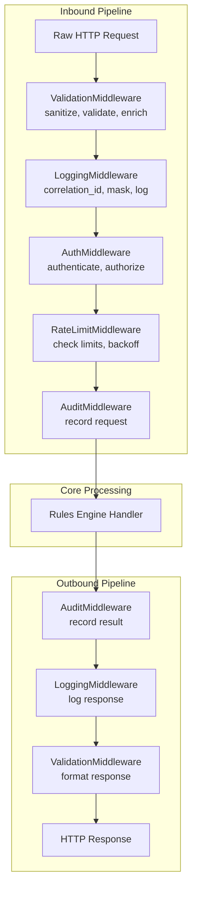
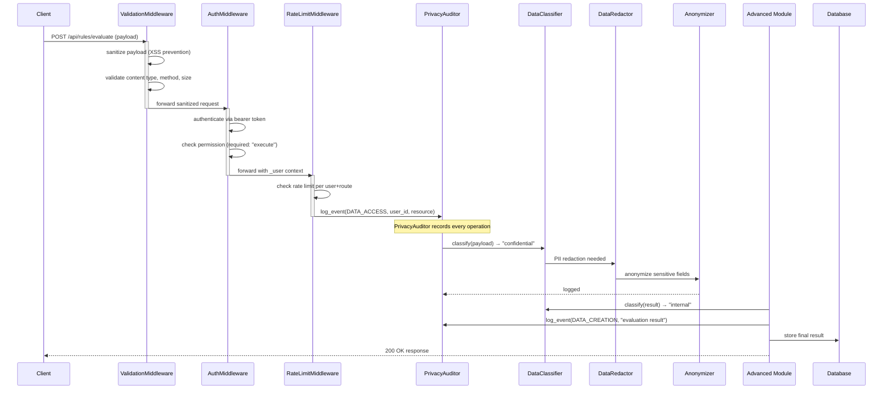
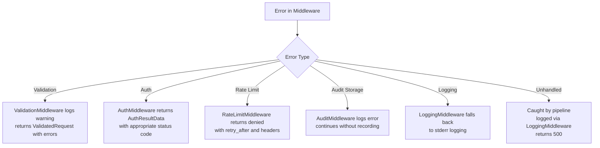

# Middleware Module Integration Guide

## Full Request Lifecycle with Middleware Pipeline

The middleware components are designed to execute in a specific order, processing requests before they reach the core handler and responses before they are sent back.



## Integration with Advanced and Privacy Modules

The middleware pipeline coordinates with both the privacy and advanced modules.



## Cross-Component Integration Patterns

### Pattern 1: Privacy-Aware Request Processing

```python
from src.middleware.validation_middleware import ValidationMiddleware
from src.middleware.auth_middleware import AuthMiddleware, AuthConfig
from src.middleware.rate_limit_middleware import RateLimitMiddleware, RateLimitRule, RateLimitScope
from src.middleware.audit_middleware import AuditMiddleware
from src.privacy.consent_manager import ConsentManager
from src.privacy.privacy_auditor import PrivacyAuditor, EventType

class PrivacyAwareMiddlewarePipeline:
    def __init__(self):
        self.validation = ValidationMiddleware()
        self.auth = AuthMiddleware()
        self.rate_limiter = RateLimitMiddleware()
        self.auditor = AuditMiddleware()
        self.consent = ConsentManager()
        self.privacy_auditor = PrivacyAuditor()

    def process_request(self, request: dict) -> dict:
        validated = self.validation.process_request(request)
        if not validated.valid:
            return {"status": 422, "error": validated.errors}

        auth_result = self.auth.authenticate(validated.sanitized)
        if auth_result.result.value != "granted":
            self.privacy_auditor.log_event(
                EventType.DATA_ACCESS, "anonymous",
                details="Auth failed", severity="warning",
            )
            return {"status": 401, "error": "Authentication required"}

        user = auth_result.user
        for category in ["processing", "analytics"]:
            if not self.consent.check_consent(user.user_id, category):
                self.privacy_auditor.log_event(
                    EventType.DATA_ACCESS, user.user_id,
                    details=f"Missing consent: {category}", severity="warning",
                )
                return {"status": 403, "error": f"Consent required for {category}"}

        rl_result = self.rate_limiter.check_rate_limit(validated.sanitized)
        if not rl_result.allowed:
            return {"status": 429, "error": "Rate limit exceeded", "retry_after": rl_result.retry_after}

        context = validated.sanitized.copy()
        context["_user"] = {
            "user_id": user.user_id,
            "roles": user.roles,
            "permissions": list(user.permissions),
        }
        return {"status": 200, "context": context}
```

### Pattern 2: Audit-Centric Rule Evaluation

```python
from src.middleware.audit_middleware import AuditMiddleware, AuditEventType, AuditSeverity
from src.middleware.logging_middleware import LoggingMiddleware

class AuditableRuleEngine:
    def __init__(self):
        self.audit = AuditMiddleware()
        self.logging = LoggingMiddleware()

    def evaluate_rule(self, rule_name: str, payload: dict, actor_id: str) -> dict:
        import time
        start = time.time()

        try:
            result = self._execute_rule(rule_name, payload)
            duration_ms = (time.time() - start) * 1000

            self.audit.record_rule_evaluation(
                rule_name=rule_name,
                actor_id=actor_id,
                result="passed" if result.get("matched") else "not_matched",
                duration_ms=duration_ms,
                metadata={"payload_keys": list(payload.keys())},
            )

            self.logging.log_performance(
                operation=f"rule:{rule_name}",
                duration_ms=duration_ms,
                metadata={"actor": actor_id},
            )

            return result

        except Exception as e:
            duration_ms = (time.time() - start) * 1000
            self.audit.record_error(
                actor_id=actor_id,
                error_type=type(e).__name__,
                error_message=str(e),
                resource_type="rule",
                resource_id=rule_name,
                metadata={"duration_ms": duration_ms},
            )
            raise

    def _execute_rule(self, rule_name: str, payload: dict) -> dict:
        pass
```

### Pattern 3: Multi-Layer Sensitive Data Protection

```python
from src.middleware.validation_middleware import ValidationMiddleware
from src.middleware.logging_middleware import LoggingMiddleware
from src.privacy.data_redaction import DataRedactor

class DataProtectionPipeline:
    def __init__(self):
        self.validation = ValidationMiddleware()
        self.logging = LoggingMiddleware()
        self.redactor = DataRedactor()

    def handle_sensitive_request(self, request: dict) -> dict:
        validated = self.validation.process_request(request)
        redacted_body = self.redactor.redact_dict(
            validated.sanitized.get("body", {}),
        )
        safe_for_logs = {
            "method": validated.sanitized.get("method"),
            "route": validated.sanitized.get("route"),
            "body": redacted_body,
        }
        self.logging.log_request(safe_for_logs, component="sensitive_data")
        return validated
```

## Configuration Sharing Across Middleware

All middleware components support configuration via shared YAML files.

```yaml
# config/middleware.yaml
pipeline:
  order: [validation, logging, auth, rate_limit, audit]

validation:
  mode: sanitize
  strip_html: true
  max_request_size: 2097152
  blocked_patterns:
    - "<script[^>]*>.*?</script>"
    - "on\\w+\\s*="
    - "javascript\\s*:"

logging:
  format: json
  default_level: INFO
  log_to_stdout: true
  log_to_file: true
  log_directory: logs
  global_mask_fields:
    - password
    - secret
    - token
    - authorization
    - api_key
    - ssn
    - credit_card

auth:
  enabled: true
  providers:
    - type: bearer
      name: jwt_provider
      order: 0
    - type: api_key
      name: api_key_provider
      order: 1
  token:
    algorithm: HS256
    access_token_expiry: 3600
    validate_expiry: true
  roles:
    roles:
      admin: [read, write, delete, admin, manage, configure]
      editor: [read, write, export]
      viewer: [read]
    allow_role_inheritance: true

rate_limit:
  enabled: true
  enable_headers: true
  enable_backoff: true
  rules:
    - name: global
      scope: global
      max_requests: 10000
      window_seconds: 3600
    - name: per_ip
      scope: per_ip
      max_requests: 100
      window_seconds: 60
      strategy: token_bucket
      burst_size: 20
      refill_rate: 2.0

audit:
  enabled: true
  max_records: 50000
  retention_days: 90
  track_all_events: true
  auto_cleanup: true
```

## Middleware Chain Customization

The `ValidationMiddleware` supports a custom middleware chain within itself.

```python
from src.middleware.validation_middleware import ValidationMiddleware, ValidatedRequest

def custom_logging_middleware(request: ValidatedRequest) -> ValidatedRequest:
    print(f"[CUSTOM] Processing request for route: {request.sanitized.get('route')}")
    return request

def custom_auth_check(request: ValidatedRequest) -> ValidatedRequest:
    user = request.sanitized.get("_metadata", {}).get("client_ip")
    if user and user.startswith("10."):
        request.warnings.append(f"Internal IP detected: {user}")
    return request

vm = ValidationMiddleware()
vm.add_middleware("custom_log", custom_logging_middleware, order=1)
vm.add_middleware("custom_auth", custom_auth_check, order=2)
```

## Error Handling Strategy



### Error Handling by Component

| Component | Error | Behavior |
|---|---|---|
| ValidationMiddleware | Invalid regex in blocked_patterns | `re.error` caught, skip pattern |
| ValidationMiddleware | Body sanitization fails | Log error, keep original body, add error |
| LoggingMiddleware | Component logger not found | Create new logger on demand |
| LoggingMiddleware | File rotation fails | Log error, fall back to stdout |
| AuthMiddleware | Token decode fails | Return INVALID with error message |
| AuthMiddleware | Custom provider raises exception | Log error, return DENIED |
| RateLimitMiddleware | Backoff calculation error | Clamp to max_backoff_seconds |
| RateLimitMiddleware | Storage backend not available | Fall back to in-memory only |
| AuditMiddleware | Storage at max_records | Evict oldest record |
| AuditMiddleware | Archive file write fails | Log error, return 0 |
